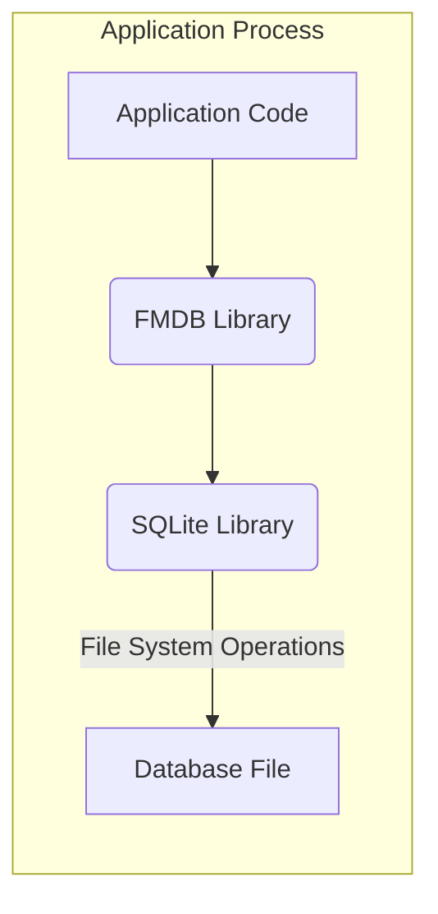
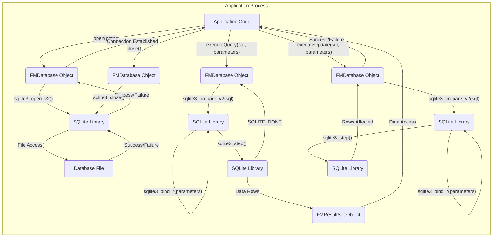

# Project Design Document: FMDB SQLite Wrapper

**Version:** 1.1
**Date:** October 26, 2023
**Author:** Gemini (AI Language Model)

## 1. Introduction

This document provides a detailed design overview of the FMDB project, a widely used Objective-C library that simplifies interactions with SQLite databases within iOS and macOS applications. This document is specifically crafted to serve as a foundation for subsequent threat modeling activities, providing a clear understanding of the library's architecture, components, and data flow.

## 2. Project Overview

FMDB acts as an Objective-C wrapper around the native SQLite C API. It is designed to be integrated directly into an application's process, providing a more object-oriented and developer-friendly interface for common database operations. Crucially, FMDB operates within the same memory space as the application and directly accesses the SQLite database file. It is not a separate service or daemon.

## 3. Goals

* To provide a precise and thorough description of the FMDB library's architecture and its operational characteristics.
* To clearly identify the key components of FMDB and detail their interactions with each other and the surrounding environment.
* To meticulously outline the flow of data within the system during typical database operations.
* To establish a robust and informative basis for identifying potential security vulnerabilities and attack vectors during the threat modeling process.

## 4. Target Audience

This document is intended for individuals and teams involved in the security and development lifecycle of applications utilizing FMDB, including:

* Security engineers responsible for performing threat modeling and security assessments.
* Software developers who are actively working with or integrating the FMDB library into their applications.
* Software architects involved in designing systems that incorporate FMDB for data persistence.

## 5. System Architecture

FMDB is a library that is statically or dynamically linked into the application's process. It directly interfaces with the SQLite library, which in turn interacts with the database file on the file system.

### 5.1. Key Components

* **Application Code:** This represents the portion of the iOS or macOS application that directly utilizes the FMDB library. It is responsible for:
    * Instantiating FMDB objects to manage database connections.
    * Constructing and executing SQL queries and updates.
    * Processing the results returned by FMDB.
    * Handling any errors reported by FMDB.
* **FMDB Library:** The core of the project, providing the Objective-C interface to SQLite. Key classes and their responsibilities include:
    * **`FMDatabase`:** Represents a single connection to a SQLite database. Its responsibilities include:
        * Opening and closing database connections using the SQLite C API.
        * Executing SQL statements (queries, updates, deletes).
        * Managing transactions (begin, commit, rollback).
        * Handling and reporting SQLite error codes.
        * Providing methods for escaping string literals to prevent SQL injection (though proper parameterized queries are the recommended approach).
    * **`FMResultSet`:** Represents the result set of a query executed via an `FMDatabase` object. Its responsibilities include:
        * Providing methods to iterate through the rows returned by the query.
        * Accessing the values of individual columns within each row, with type conversion.
        * Managing the underlying SQLite statement handle.
    * **`FMDatabaseQueue`:** Provides a mechanism for safely performing database operations concurrently from multiple threads. Its responsibilities include:
        * Serializing database access to prevent data corruption due to concurrent modifications.
        * Managing a queue of database operations.
        * Ensuring that only one database operation is active at any given time on a specific database connection.
* **SQLite Library:** The underlying C library that provides the core database engine functionality. FMDB acts as a thin wrapper around this library, delegating most of the actual database operations to it. Its responsibilities include:
    * Parsing and compiling SQL statements.
    * Managing the database file structure.
    * Executing queries and updates.
    * Enforcing database constraints and triggers.
    * Handling low-level file I/O operations for the database file.
* **Database File:** This is the file residing on the device's file system where the SQLite database is persistently stored. It contains:
    * The database schema (tables, columns, indexes).
    * The actual data stored in the database.
    * Potentially, WAL (Write-Ahead Logging) files and other auxiliary files used by SQLite.

## 6. Data Flow

The typical data flow within a system using FMDB for common database operations is detailed below:

Detailed explanation of the data flow:

* **Establishing a Database Connection:**
    * The application code initiates a connection by calling the `open(path)` method on an `FMDatabase` object, providing the file path to the SQLite database.
    * The `FMDatabase` object internally calls the `sqlite3_open_v2()` function from the SQLite C library.
    * The SQLite library interacts with the file system to open or create the database file at the specified path.
    * The result of the file operation (success or failure) is returned to the SQLite library, then back to the `FMDatabase` object, and finally to the application code.
* **Executing a Query:**
    * The application code calls a query method on the `FMDatabase` object (e.g., `executeQuery:withArgumentsInArray:`), providing the SQL query string and any parameters.
    * The `FMDatabase` object calls `sqlite3_prepare_v2()` in the SQLite library to compile the SQL query into a prepared statement.
    * If parameters are provided, `FMDatabase` uses `sqlite3_bind_*()` functions to securely bind the parameter values to the prepared statement, preventing SQL injection.
    * `sqlite3_step()` is called repeatedly to execute the prepared statement and retrieve individual rows of data.
    * For each row returned, the data is encapsulated within an `FMResultSet` object.
    * The application code can then iterate through the `FMResultSet` to access the data.
    * When all rows have been retrieved (`SQLITE_DONE` is returned by `sqlite3_step()`), the `FMResultSet` is typically closed.
* **Executing an Update, Insert, or Delete:**
    * The application code calls an update method (e.g., `executeUpdate:withArgumentsInArray:`) on the `FMDatabase` object, providing the SQL statement and parameters.
    * Similar to query execution, `FMDatabase` uses `sqlite3_prepare_v2()` and `sqlite3_bind_*()` for parameterized statements.
    * `sqlite3_step()` is called to execute the statement, which modifies the database.
    * The number of rows affected by the operation is typically returned to the `FMDatabase` object and then to the application code.
* **Closing the Database Connection:**
    * The application code calls the `close()` method on the `FMDatabase` object.
    * The `FMDatabase` object calls the `sqlite3_close()` function in the SQLite library to close the connection to the database file, releasing resources.

## 7. Security Considerations

This section details potential security considerations relevant to the use of FMDB and SQLite within an application. These points are crucial for identifying potential vulnerabilities during threat modeling.

* **SQL Injection Vulnerabilities:**
    * **Threat:** If user-provided data is directly concatenated into SQL query strings without proper sanitization or the use of parameterized queries, attackers can inject malicious SQL code.
    * **Impact:** This can lead to unauthorized data access, modification, or deletion, potentially compromising sensitive information or the integrity of the application's data.
    * **Mitigation:**  **Always use parameterized queries** provided by FMDB (e.g., `executeQuery:withArgumentsInArray:`, `executeUpdate:withArgumentsInArray:`) to ensure user input is treated as data, not executable code.
* **Database File Security and Access Control:**
    * **Threat:** If the database file is stored in a location with overly permissive file system permissions, unauthorized users or malicious applications on the device could access or modify the database.
    * **Impact:** Confidential data stored in the database could be exposed, and the integrity of the data could be compromised.
    * **Mitigation:**
        * Store the database file in the application's private data container, which is protected by the operating system.
        * Ensure appropriate file system permissions are set on the database file to restrict access to the application's user.
        * Consider using platform-specific secure storage mechanisms if highly sensitive data is involved.
* **Data Encryption at Rest:**
    * **Threat:** If the database file is not encrypted, sensitive data stored within it is vulnerable if the device is lost, stolen, or compromised.
    * **Impact:** Confidential information can be exposed to unauthorized parties.
    * **Mitigation:**
        * Implement database encryption using solutions like SQLCipher (an SQLite extension) or platform-provided encryption features.
        * Carefully manage encryption keys to prevent unauthorized access.
* **Data Integrity and Corruption:**
    * **Threat:** Concurrent access to the database without proper synchronization can lead to data corruption. Errors in application logic can also result in incorrect data being written to the database.
    * **Impact:** Loss of data integrity can lead to application malfunctions, incorrect information being presented to users, or even security vulnerabilities.
    * **Mitigation:**
        * Utilize `FMDatabaseQueue` to safely manage concurrent database access from multiple threads.
        * Implement robust error handling and validation in the application code to prevent writing invalid data.
        * Consider using database transactions to ensure atomicity of operations.
* **Information Disclosure through Error Messages:**
    * **Threat:** Verbose error messages returned by SQLite or FMDB, especially in production environments, could reveal sensitive information about the database schema or data.
    * **Impact:** Attackers could gain insights into the database structure, aiding in further attacks.
    * **Mitigation:** Implement proper error handling and logging. Avoid displaying detailed error messages to end-users in production. Log errors securely for debugging purposes.
* **Denial of Service (DoS):**
    * **Threat:** While less common with local databases, poorly constructed or excessively resource-intensive queries could potentially lead to performance degradation or application crashes.
    * **Impact:** The application might become unresponsive or unavailable.
    * **Mitigation:**
        * Optimize database queries for performance.
        * Implement safeguards to prevent the execution of excessively long-running queries.
        * Consider resource limits if the application handles a large volume of database operations.
* **Vulnerabilities in the Underlying SQLite Library:**
    * **Threat:** FMDB relies on the security of the underlying SQLite library. Any vulnerabilities discovered in SQLite could potentially affect applications using FMDB.
    * **Impact:** Depending on the nature of the SQLite vulnerability, it could lead to various security issues, including data breaches or arbitrary code execution.
    * **Mitigation:** Keep the SQLite library updated to the latest stable version to patch any known vulnerabilities.
* **Secure Coding Practices:**
    * **Threat:**  Developer errors in using the FMDB library can introduce security vulnerabilities.
    * **Impact:**  This can manifest in various ways, including SQL injection if parameterized queries are not used correctly, or data corruption if concurrency is not handled properly.
    * **Mitigation:**
        * Provide adequate training for developers on secure coding practices when using FMDB.
        * Conduct code reviews to identify potential security flaws.
        * Utilize static analysis tools to detect potential vulnerabilities.

## 8. Assumptions and Constraints

* It is assumed that developers integrating FMDB possess a fundamental understanding of SQL and relational database concepts.
* It is assumed that the underlying operating system and hardware infrastructure are functioning as intended and are not inherently compromised.
* This design document primarily focuses on the logical architecture and data flow within the context of FMDB. Implementation details within the SQLite library itself are considered outside the direct scope of this document.
* The security considerations outlined are not exhaustive but represent key areas of concern for applications utilizing FMDB. A comprehensive threat model will further expand upon these points.

## 9. Future Considerations

* **Enhanced Database Encryption Management:** Exploring more robust and flexible methods for managing database encryption keys, potentially leveraging platform-specific keychains or secure enclave technologies.
* **Improved Secure Data Handling Practices:** Investigating and documenting best practices for handling sensitive data retrieved from the database within the application's memory, such as in-memory encryption or secure data wiping techniques.
* **Integration with Application Security Frameworks:**  Considering how FMDB usage and database security can be seamlessly integrated with broader application security policies and frameworks, such as those for authentication and authorization.
* **Auditing and Logging of Database Access:** Exploring mechanisms for logging and auditing database access patterns for security monitoring and incident response purposes.

This improved design document provides a more detailed and nuanced understanding of the FMDB project, specifically tailored for threat modeling activities. The enhanced descriptions of components, data flow, and security considerations offer a stronger foundation for identifying and mitigating potential vulnerabilities.