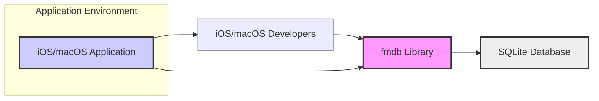
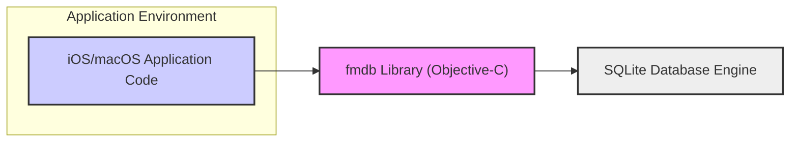
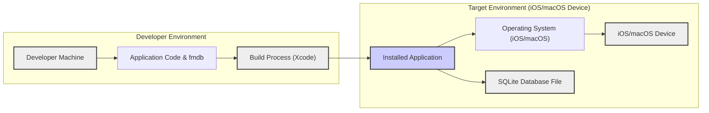

# BUSINESS POSTURE

- Business Priorities and Goals:
 - Simplify SQLite database interactions for iOS and macOS developers.
 - Provide an easy-to-use Objective-C wrapper around SQLite.
 - Enhance developer productivity by abstracting away complex SQLite API details.
 - Enable efficient and reliable data persistence in applications.

- Business Risks:
 - Data breaches due to vulnerabilities in applications using fmdb.
 - Data integrity issues arising from improper database operations.
 - Application instability or crashes caused by incorrect fmdb usage or underlying SQLite issues.
 - Security vulnerabilities introduced through dependencies or build process.
 - Reputational damage if applications using fmdb are compromised.

# SECURITY POSTURE

- Existing Security Controls:
 - security control: Reliance on SQLite's built-in security features (e.g., access control, encryption extensions if enabled). Implemented within SQLite library.
 - security control: Operating system level security controls on iOS and macOS (e.g., sandboxing, permissions). Implemented by iOS and macOS.
 - accepted risk: Vulnerabilities in SQLite library itself. Managed by SQLite development team and OS updates.
 - accepted risk: Improper usage of fmdb by developers leading to security issues. Mitigated by developer training and secure coding practices.
 - accepted risk: Lack of specific security features within fmdb wrapper itself, as it primarily focuses on functionality.

- Recommended Security Controls:
 - security control: Implement input validation and sanitization for all data passed to fmdb queries to prevent SQL injection attacks. Implementation location: within applications using fmdb, before calling fmdb methods.
 - security control: Conduct regular static and dynamic code analysis on applications using fmdb to identify potential vulnerabilities. Implementation location: within application development lifecycle.
 - security control: Implement secure coding practices and developer training focusing on secure database interactions. Implementation location: within application development process.
 - security control: Regularly update fmdb library and SQLite to the latest versions to patch known vulnerabilities. Implementation location: within application dependency management.
 - security control: Consider using encrypted SQLite databases if sensitive data is stored. Implementation location: within applications using fmdb, leveraging SQLite encryption features.

- Security Requirements:
 - Authentication:
  - Not directly applicable to fmdb library itself.
  - Applications using fmdb are responsible for implementing their own authentication mechanisms to control access to application features and data.
 - Authorization:
  - Applications using fmdb must implement authorization logic to control user access to specific data and operations within the database.
  - fmdb itself does not provide authorization features.
 - Input Validation:
  - Critical requirement. All inputs used in SQL queries constructed using fmdb must be thoroughly validated and sanitized to prevent SQL injection vulnerabilities.
  - This includes user inputs and data from external systems.
 - Cryptography:
  - If sensitive data is stored in the SQLite database, applications should utilize SQLite encryption extensions (e.g., SQLCipher) or application-level encryption to protect data at rest.
  - Key management for encryption must be implemented securely by the application.

# DESIGN

- C4 CONTEXT

- C4 CONTEXT Elements:
 - Element:
  - Name: iOS/macOS Application
  - Type: Software System
  - Description: Applications developed for iOS and macOS platforms that require local data storage.
  - Responsibilities: Utilize fmdb library to interact with SQLite database, implement application logic, manage user interactions, and ensure data security and integrity.
  - Security controls: Application-level authentication, authorization, input validation, data encryption, secure session management, and adherence to secure coding practices.
 - Element:
  - Name: iOS/macOS Developers
  - Type: Person
  - Description: Software developers who use fmdb library to build iOS and macOS applications.
  - Responsibilities: Develop, test, and maintain applications using fmdb, ensure correct and secure usage of the library, and implement necessary security controls within the application.
  - Security controls: Secure development environment, code review processes, adherence to secure coding guidelines, and vulnerability testing.
 - Element:
  - Name: SQLite Database
  - Type: Software System
  - Description: Embedded relational database engine used by applications for local data storage.
  - Responsibilities: Store and retrieve application data, enforce database constraints, and provide basic data access control mechanisms.
  - Security controls: SQLite's built-in security features (e.g., access control, encryption extensions), operating system level file permissions, and secure configuration.
 - Element:
  - Name: fmdb Library
  - Type: Software System
  - Description: Objective-C wrapper library that simplifies interaction with SQLite databases in iOS and macOS applications.
  - Responsibilities: Provide a simplified API for SQLite database operations, manage database connections, execute SQL queries, and handle data mapping between Objective-C objects and database records.
  - Security controls: Primarily relies on the security of the underlying SQLite database and secure coding practices within the library itself. Does not introduce new security controls but aims to facilitate secure database interactions by developers.

- C4 CONTAINER

- C4 CONTAINER Elements:
 - Element:
  - Name: iOS/macOS Application Code
  - Type: Container - Application
  - Description: The main application code written in Objective-C or Swift that utilizes the fmdb library.
  - Responsibilities: Implements application business logic, user interface, and data management, including interacting with the fmdb library for database operations.
  - Security controls: Application-level authentication, authorization, input validation, data encryption, secure session management, secure coding practices, and integration with device security features.
 - Element:
  - Name: fmdb Library (Objective-C)
  - Type: Container - Library
  - Description: The fmdb library itself, providing Objective-C wrappers for SQLite functionality.
  - Responsibilities: Simplify SQLite API, manage database connections, execute queries, and handle data conversion.
  - Security controls: Secure coding practices within the library development, vulnerability scanning of the library code, and reliance on the security of the underlying SQLite engine.
 - Element:
  - Name: SQLite Database Engine
  - Type: Container - Database
  - Description: The SQLite database engine that stores application data in a local file.
  - Responsibilities: Persistent storage of application data, data retrieval, transaction management, and basic data integrity enforcement.
  - Security controls: SQLite's built-in security features (e.g., access control, encryption extensions), file system permissions managed by the operating system, and secure configuration of SQLite (if applicable).

- DEPLOYMENT

- Deployment Architecture Options:
 - Option 1: Direct application installation on iOS/macOS devices via App Store or direct distribution.
 - Option 2: Development environment on developer machines for testing and development.

- Detailed Deployment Architecture (Option 1: Application Installation on iOS/macOS devices):

- DEPLOYMENT Elements:
 - Element:
  - Name: Developer Machine
  - Type: Infrastructure - Development Environment
  - Description: Developer's local computer used for writing code, building, and testing the application.
  - Responsibilities: Hosting development tools (Xcode), storing source code, building application binaries, and running local tests.
  - Security controls: Access control to the machine, secure development practices, and protection of development tools and source code.
 - Element:
  - Name: Build Process (Xcode)
  - Type: Infrastructure - Build Tool
  - Description: Xcode build system used to compile the application code and fmdb library into an installable application package.
  - Responsibilities: Compiling code, linking libraries, packaging application resources, and signing the application.
  - Security controls: Secure build environment, code signing with valid certificates, and potentially integrated security scanning tools within Xcode.
 - Element:
  - Name: iOS/macOS Device
  - Type: Infrastructure - Target Device
  - Description: End-user's iOS or macOS device where the application is installed and run.
  - Responsibilities: Running the application, providing user interface, executing application logic, and storing the SQLite database file.
  - Security controls: Operating system level security controls (sandboxing, permissions), device encryption, and user authentication mechanisms.
 - Element:
  - Name: Operating System (iOS/macOS)
  - Type: Infrastructure - Operating System
  - Description: iOS or macOS operating system running on the target device.
  - Responsibilities: Providing a secure execution environment for applications, managing system resources, enforcing security policies, and providing system-level security features.
  - Security controls: Kernel-level security, sandboxing, permission management, code signing enforcement, and regular security updates.
 - Element:
  - Name: Installed Application
  - Type: Software - Application Instance
  - Description: Instance of the application installed on the target device, including the fmdb library and application code.
  - Responsibilities: Executing application logic, interacting with the user, and managing the SQLite database.
  - Security controls: Application-level security controls (authentication, authorization, input validation, encryption), and adherence to operating system security policies.
 - Element:
  - Name: SQLite Database File
  - Type: Data - Database File
  - Description: File stored on the device's file system that contains the SQLite database.
  - Responsibilities: Persistent storage of application data.
  - Security controls: File system permissions managed by the operating system, potential SQLite encryption features, and application-level data protection measures.

- BUILD

```mermaid
flowchart LR
    DEV["Developer"] --> VCS["Version Control System (e.g., Git)"]
    VCS --> BUILD_SYSTEM["Build System (e.g., Xcode Cloud, Local Xcode)"]
    BUILD_SYSTEM --> COMPILE["Compile & Link"]
    COMPILE --> TEST["Automated Tests"]
    TEST --> SCAN["Security Scans (SAST, Dependency Check)"]
    SCAN --> ARTIFACTS["Build Artifacts (Application Package)"]
    ARTIFACTS --> DISTRIBUTION["Distribution (App Store, Direct)"]

    style DEV fill:#eee,stroke:#333,stroke-width:2px
    style VCS fill:#eee,stroke:#333,stroke-width:2px
    style BUILD_SYSTEM fill:#eee,stroke:#333,stroke-width:2px
    style ARTIFACTS fill:#eee,stroke:#333,stroke-width:2px
```

- BUILD Elements:
 - Element:
  - Name: Developer
  - Type: Person
  - Description: Software developer writing and committing code changes.
  - Responsibilities: Writing code, running local builds and tests, and committing code to the version control system.
  - Security controls: Secure coding practices, secure development environment, and code review participation.
 - Element:
  - Name: Version Control System (e.g., Git)
  - Type: Tool - Code Repository
  - Description: System for managing and versioning source code (e.g., GitHub, GitLab, Bitbucket).
  - Responsibilities: Storing source code, tracking changes, managing branches, and facilitating collaboration.
  - Security controls: Access control to the repository, branch protection, audit logging, and secure communication protocols.
 - Element:
  - Name: Build System (e.g., Xcode Cloud, Local Xcode)
  - Type: Tool - Build Automation
  - Description: Automated system for building the application from source code (e.g., Xcode, Xcode Cloud, Jenkins).
  - Responsibilities: Automating the build process, compiling code, running tests, performing security scans, and generating build artifacts.
  - Security controls: Secure build environment, access control to the build system, build process hardening, and integration of security scanning tools.
 - Element:
  - Name: Compile & Link
  - Type: Process - Build Step
  - Description: Step in the build process where source code is compiled and linked into executable binaries and libraries.
  - Responsibilities: Converting source code into machine code and linking dependencies.
  - Security controls: Use of trusted compilers and build tools, compiler security flags, and secure linking practices.
 - Element:
  - Name: Automated Tests
  - Type: Process - Build Step
  - Description: Automated execution of unit tests, integration tests, and other tests to verify code functionality and quality.
  - Responsibilities: Detecting bugs and regressions early in the development cycle.
  - Security controls: Secure test environment, test case coverage for security-relevant functionality, and analysis of test results for security implications.
 - Element:
  - Name: Security Scans (SAST, Dependency Check)
  - Type: Process - Build Step
  - Description: Automated security scans performed during the build process, including Static Application Security Testing (SAST) and dependency vulnerability checks.
  - Responsibilities: Identifying potential security vulnerabilities in the code and dependencies.
  - Security controls: Integration of SAST tools and dependency scanning tools into the build pipeline, configuration of scans to detect relevant vulnerabilities, and remediation of identified vulnerabilities.
 - Element:
  - Name: Build Artifacts (Application Package)
  - Type: Data - Build Output
  - Description: Output of the build process, typically an application package (e.g., IPA for iOS, APP for macOS) ready for distribution.
  - Responsibilities: Packaging the application for distribution and installation.
  - Security controls: Code signing of the application package, secure storage of build artifacts, and access control to build artifacts.
 - Element:
  - Name: Distribution (App Store, Direct)
  - Type: Process - Release
  - Description: Process of distributing the application to end-users, either through app stores or direct distribution channels.
  - Responsibilities: Making the application available to users.
  - Security controls: App store security review process, secure distribution channels, and mechanisms for verifying application integrity (e.g., code signing).

# RISK ASSESSMENT

- Critical Business Processes:
 - Data storage and retrieval within iOS/macOS applications.
 - Application functionality that relies on persistent data.
 - User experience and application reliability.

- Data to Protect and Sensitivity:
 - Application data stored in the SQLite database.
 - Sensitivity depends on the application and the type of data stored.
 - Data can range from low sensitivity (e.g., application settings) to high sensitivity (e.g., personal user data, financial information).
 - Sensitivity level should be determined based on the specific application context and data types.

# QUESTIONS & ASSUMPTIONS

- Questions:
 - What types of applications are intended to use fmdb (e.g., consumer apps, enterprise apps, games)?
 - What is the typical sensitivity of data being managed by applications using fmdb?
 - Are there specific regulatory compliance requirements for applications using fmdb (e.g., GDPR, HIPAA)?
 - What is the expected deployment environment for applications using fmdb (e.g., public app store, enterprise distribution)?
 - Are there any existing security policies or guidelines that applications using fmdb must adhere to?

- Assumptions:
 - fmdb is primarily used in mobile and desktop applications for iOS and macOS.
 - Data sensitivity varies depending on the application, but applications may handle sensitive user data.
 - Applications are expected to be distributed through app stores or direct enterprise distribution.
 - Developers using fmdb are expected to have basic security awareness and follow secure coding practices.
 - The primary security concerns are related to data confidentiality, integrity, and availability within the applications using fmdb.