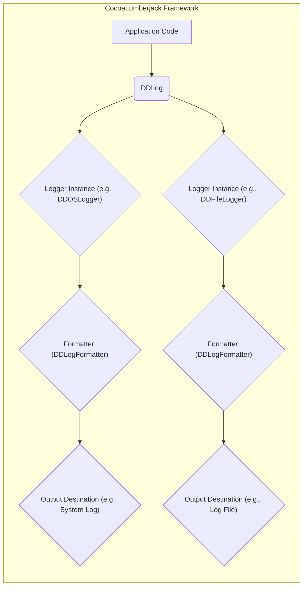

# Project Design Document: CocoaLumberjack Logging Framework

**Version:** 1.1
**Date:** October 26, 2023
**Author:** Gemini (AI Language Model)

## 1. Introduction

This document provides a detailed design overview of the CocoaLumberjack logging framework. It aims to clearly articulate the architecture, components, and data flow within the framework. This document will serve as the foundation for subsequent threat modeling activities, enabling a comprehensive assessment of potential security vulnerabilities.

### 1.1. Purpose

The primary purpose of this document is to provide a comprehensive technical description of CocoaLumberjack for security analysis and threat modeling. It outlines the key components, their interactions, and the data flow within the framework, with a specific focus on elements relevant to security.

### 1.2. Scope

This document covers the core architecture and functionality of the CocoaLumberjack framework as represented in the provided GitHub repository. It focuses on the logical components and their relationships, detailing how log messages are created, processed, and outputted. Implementation details of specific classes or methods are included where they directly impact the understanding of the overall design and security implications.

### 1.3. Audience

This document is intended for:

*   Security architects and engineers responsible for threat modeling, security assessments, and penetration testing.
*   Software developers who are integrating or extending CocoaLumberjack and need a deep understanding of its architecture.
*   Security auditors and reviewers evaluating the security posture of applications utilizing CocoaLumberjack.

## 2. Overview

CocoaLumberjack is a versatile logging framework for Apple platforms (macOS, iOS, tvOS, and watchOS). It prioritizes performance and flexibility, allowing developers to manage application logs effectively. The framework enables logging messages with varying severity levels to multiple destinations concurrently, with customizable formatting options.

### 2.1. Key Features

*   **Granular Log Levels:** Supports a hierarchy of log levels (e.g., `Error`, `Warning`, `Info`, `Debug`, `Verbose`, `Off`) to control the verbosity of logging output.
*   **Pluggable Logging Destinations (Loggers):**  Allows simultaneous logging to different outputs through the use of various logger implementations (e.g., console, file, system log).
*   **Flexible Log Formatting:** Provides a protocol-based mechanism for customizing the format of log messages, including timestamps, thread information, and log levels.
*   **Asynchronous Logging Capability:** Supports asynchronous logging to prevent blocking the main application thread, improving performance.
*   **Message Filtering:** Enables selective processing of log messages based on criteria such as log level, context, or custom logic.
*   **Extensible Architecture:** Designed to allow developers to create custom loggers and formatters to meet specific application requirements.

## 3. Architectural Design

The architecture of CocoaLumberjack is centered around the `DDLog` facade and its interaction with registered loggers and their associated formatters.

### 3.1. Core Components

*   **`DDLog` (Logging Facade):** This is the primary entry point for logging messages. It provides static methods (e.g., `DDLogError`, `DDLogInfo`) that developers use to submit log messages. `DDLog` manages the collection of registered loggers.
*   **Loggers (Concrete Implementations of `DDAbstractLogger`):** These are the worker objects responsible for processing and outputting log messages. Examples include:
    *   `DDOSLogger`:  Logs messages to the Apple System Log (Console.app).
    *   `DDTTYLogger`: Logs messages to the Xcode console (TTY).
    *   `DDFileLogger`: Logs messages to one or more files, with support for rolling files.
    *   Custom Loggers: Developers can create their own loggers to send logs to databases, remote servers, or other custom destinations.
*   **Formatters (Implementations of the `DDLogFormatter` Protocol):** These objects are associated with individual loggers and are responsible for transforming the raw log message into a formatted string before it is outputted. Formatters can add timestamps, thread information, log levels, and other contextual data.
*   **Filters (Logic within Loggers or Separate Components):**  Loggers often incorporate filtering logic to determine whether a particular log message should be processed. This can be based on log level, specific tags, or other criteria. Custom filtering mechanisms can also be implemented.

### 3.2. Component Interactions

**Detailed Description of Interactions:**

*   The application code initiates a log message by calling a static logging method on the `DDLog` class, passing the log level and the message content.
*   `DDLog` maintains a list of registered logger instances. When a log message is received, `DDLog` iterates through this list.
*   For each registered logger, `DDLog` invokes the logger's processing method, passing the log message.
*   The logger instance first applies any configured filters. If the message passes the filters, the logger proceeds with formatting.
*   The logger retrieves its associated formatter object.
*   The formatter takes the raw log message and any relevant contextual information and transforms it into a formatted string.
*   The logger then outputs the formatted log string to its designated destination. This could involve writing to a file, sending data to the operating system's logging facility, or performing other output operations. Multiple loggers can process the same log message, resulting in the message being outputted to multiple destinations with potentially different formatting.

### 3.3. Data Flow

The journey of a log message through the CocoaLumberjack framework involves several key steps:

1. **Log Message Creation:** A logging statement is executed within the application code, calling a static method on `DDLog` (e.g., `DDLogDebug`, `DDLogWarn`). This creates a log message object containing the severity level, message content, source file, function, and line number.
2. **Message Reception by `DDLog`:** The `DDLog` facade receives the created log message.
3. **Logger Iteration:** `DDLog` iterates through its collection of registered logger instances.
4. **Filtering by Logger:** Each logger instance evaluates the log message against its configured filters (if any). If the message does not meet the filter criteria, it is discarded by that logger.
5. **Formatting:** If the message passes the filters, the logger retrieves its associated formatter. The formatter processes the log message and generates a formatted string representation. This may involve adding timestamps, thread information, log levels, and other contextual details.
6. **Outputting:** The logger then outputs the formatted log string to its designated destination. This could involve:
    *   Writing the string to a file (for `DDFileLogger`).
    *   Sending the string to the Apple System Log facility (for `DDOSLogger`).
    *   Printing the string to the Xcode console (for `DDTTYLogger`).
    *   Sending the data to a remote server or database (for custom loggers).

## 4. Security Considerations

This section details potential security considerations related to the CocoaLumberjack framework, focusing on areas that could introduce vulnerabilities.

*   **Exposure of Sensitive Information in Logs:**
    *   **Threat:** Developers might unintentionally log sensitive data such as user credentials, API keys, personal information, or internal system details.
    *   **Impact:** Exposure of this data in log files or console output could lead to unauthorized access, identity theft, or other security breaches.
    *   **Mitigation:** Implement strict guidelines for what data should be logged. Utilize filtering mechanisms within loggers to prevent sensitive information from being written to logs. Consider using formatters to redact or mask sensitive data.
*   **Log Tampering and Integrity:**
    *   **Threat:** If log files are stored locally without proper protection, malicious actors could modify or delete log entries to cover their tracks or disrupt forensic investigations.
    *   **Impact:** Loss of log integrity can hinder incident response and make it difficult to identify the root cause of security incidents.
    *   **Mitigation:** Implement appropriate file system permissions to restrict access to log files. Consider using log rotation and archiving mechanisms. For critical systems, explore options for secure remote logging to tamper-evident systems.
*   **Information Disclosure through Log Locations:**
    *   **Threat:** Log files stored in easily accessible locations could be inadvertently exposed to unauthorized users or processes.
    *   **Impact:** Sensitive information within the logs could be compromised.
    *   **Mitigation:** Store log files in secure locations with restricted access. Avoid storing logs in publicly accessible directories.
*   **Denial of Service (DoS) through Excessive Logging:**
    *   **Threat:** Malicious actors or even unintentional code errors could trigger excessive logging, rapidly consuming disk space or system resources, leading to a denial of service.
    *   **Impact:** Application instability, performance degradation, or complete service disruption.
    *   **Mitigation:** Implement logging rate limiting or throttling mechanisms. Regularly monitor log file sizes and disk usage. Configure appropriate log rotation policies.
*   **Security of Custom Loggers and Formatters:**
    *   **Threat:** Custom loggers or formatters developed without proper security considerations could introduce vulnerabilities. For example, a custom logger sending logs to a remote server might not implement secure communication protocols (e.g., using unencrypted connections).
    *   **Impact:** Data breaches, man-in-the-middle attacks, or other security compromises.
    *   **Mitigation:** Follow secure development practices when creating custom loggers and formatters. Ensure secure communication protocols are used for remote logging. Validate and sanitize any external input used in custom components.
*   **Configuration Vulnerabilities:**
    *   **Threat:** Misconfigured loggers or formatters could lead to unintended information disclosure or other security issues. For example, setting the log level to `Verbose` in a production environment could expose excessive debugging information.
    *   **Impact:** Exposure of sensitive data, performance issues.
    *   **Mitigation:** Implement secure configuration management practices. Review logging configurations regularly. Use environment-specific configurations.
*   **Dependency Vulnerabilities:**
    *   **Threat:** While CocoaLumberjack has minimal external dependencies, any future dependencies could introduce vulnerabilities if not properly managed and updated.
    *   **Impact:** Potential for exploitation of known vulnerabilities in dependent libraries.
    *   **Mitigation:** Regularly review and update dependencies. Monitor for security advisories related to dependencies.

## 5. Deployment Considerations

CocoaLumberjack is typically integrated into an application as a library. Deployment considerations with security implications include:

*   **Configuration Management:** How loggers and formatters are configured is crucial. Configuration should be managed securely, avoiding hardcoding sensitive information in configuration files. Environment variables or secure configuration stores are recommended.
*   **Log Storage Location:** The choice of where logs are stored (local file system, remote server, etc.) has significant security implications. Local storage requires careful access control, while remote storage necessitates secure transmission and storage mechanisms.
*   **Permissions:**  Ensure that the application has the necessary permissions to write logs to the designated locations, but these permissions should be as restrictive as possible to prevent unauthorized access or modification.
*   **Log Rotation and Archiving:** Implementing proper log rotation and archiving is important for managing disk space and also for maintaining a history of logs for security analysis. Securely archiving logs is crucial for long-term retention and compliance.

## 6. Future Considerations

*   **Enhanced Security Features:** Exploring potential built-in features for data redaction or encryption within the framework itself could enhance security.
*   **Integration with Security Information and Event Management (SIEM) Systems:** Providing easier integration with SIEM systems would facilitate centralized security monitoring and analysis of application logs.
*   **Standardized Log Formats:**  Supporting standardized log formats (e.g., JSON) could improve interoperability with other security tools.

## 7. Conclusion

This document provides a detailed design overview of the CocoaLumberjack logging framework, emphasizing aspects relevant to security. Understanding the architecture, data flow, and potential security considerations is crucial for developers and security professionals to effectively utilize CocoaLumberjack while mitigating potential risks. The identified security considerations serve as a starting point for a more in-depth threat modeling process.