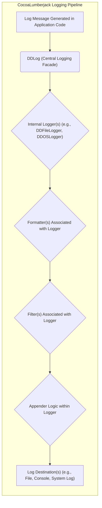
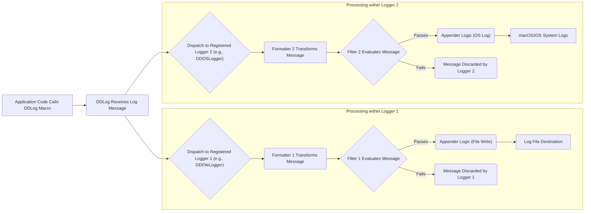

# Project Design Document: CocoaLumberjack Logging Framework

**Version:** 1.1
**Date:** October 26, 2023
**Author:** AI Software Architect

## 1. Introduction

This document provides an enhanced and detailed design overview of the CocoaLumberjack logging framework. It elaborates on the architecture, key components, and data flow within the system, with a specific focus on aspects relevant to threat modeling. This document serves as a comprehensive resource for understanding the framework's internal workings and identifying potential security vulnerabilities.

CocoaLumberjack is a versatile and widely adopted logging framework for Apple platforms, including macOS, iOS, tvOS, and watchOS. It empowers developers with the ability to log messages at various severity levels and direct those messages to a multitude of destinations in a configurable manner.

## 2. Goals and Objectives

The core design goals of CocoaLumberjack are:

* **Extreme Flexibility:** To offer a highly modular design, enabling developers to tailor logging behavior precisely to their needs.
* **Seamless Extensibility:** To facilitate the easy addition of new logging destinations (appenders) and message formatting options.
* **Minimal Performance Overhead:** To ensure that logging operations have a negligible impact on the application's performance, especially in production environments.
* **Fine-Grained Control:** To provide developers with precise control over which log messages are captured, processed, and routed to specific locations.
* **Non-Blocking Asynchronous Logging:** To perform the potentially time-consuming task of writing log messages off the main thread, preventing UI freezes and performance bottlenecks.

## 3. High-Level Architecture

The fundamental architecture of CocoaLumberjack centers around a pipeline processing log messages through distinct stages. Key components include the central logging facade, internal loggers, formatters, filters, and appenders (referred to as "loggers" within the code, which can be a source of potential confusion).

* **Log Message Generation:** Developers use `DDLog` macros within their application code to initiate the logging process.
* **DDLog (Central Logging Facade):** This component acts as the single entry point for all logging operations. It maintains a registry of active internal loggers and dispatches incoming log messages to them.
* **Internal Loggers:** These are the core processing units. Multiple loggers can be registered, each responsible for handling log messages according to its specific configuration. Examples include file loggers and system loggers.
* **Formatters:**  Formatters are attached to individual loggers and are responsible for transforming the raw log message data into a human-readable string representation.
* **Filters:** Filters are also associated with loggers and provide a mechanism to selectively process log messages based on criteria such as severity level or context.
* **Appender Logic within Logger:** This represents the code within each concrete logger implementation that handles the actual writing of the formatted log message to its designated destination.
* **Log Destinations:** These are the final locations where log messages are persisted or displayed.

## 4. Component Design

### 4.1. DDLog (Central Logging Facade)

* **Responsibilities:**
    * Serves as the primary interface for logging, providing static methods (implemented as macros) for logging messages at various severity levels: `DDLogVerbose`, `DDLogDebug`, `DDLogInfo`, `DDLogWarn`, `DDLogError`.
    * Manages a collection of registered internal `Logger` instances.
    * Determines which registered loggers should receive a given log message based on configuration settings and dispatches the message accordingly.
    * Offers global configuration options for enabling or disabling logging at different levels.

### 4.2. Internal Logger - `DDAbstractLogger` and Concrete Subclasses

* **Responsibilities:**
    * Receives log messages dispatched by `DDLog`.
    * Holds references to associated formatters and filters, defining the processing pipeline for messages it receives.
    * Orchestrates the formatting of the log message using its assigned formatter.
    * Executes filtering logic using its assigned filters to determine if the message should be written to the destination.
    * Implements the core logic for appending the formatted log message to its specific destination.
* **Key Concrete Subclasses (Examples):**
    * `DDOSLogger`:  Leverages the Apple unified logging system (`os_log`) for efficient system-level logging.
    * `DDFileLogger`:  Manages logging to one or more files, including features like file rotation and size limits.
    * `DDTTYLogger`:  Directs log output to the Xcode console (TTY - teletypewriter).
    * Developers can create custom loggers by subclassing `DDAbstractLogger` to implement specialized logging behavior.

### 4.3. Formatter - `DDLogFormatter` Protocol and Implementations

* **Responsibilities:**
    * Defines the contract (`DDLogFormatter` protocol) for formatting log messages.
    * Takes a `DDLogMessage` object as input, which contains all the raw information about the log event.
    * Returns a formatted `NSString` representation of the log message, ready for output.
* **Key Implementations (Examples):**
    * `DDDefaultLogFormatter`: Provides a basic, default formatting of log messages.
    * `DDDispatchQueueLogFormatter`: Enables formatting to be performed on a specific dispatch queue, useful for offloading formatting tasks.
    * Custom formatters can be created by implementing the `DDLogFormatter` protocol to achieve specific formatting requirements.

### 4.4. Filter - `DDLogFilter` Protocol and Implementations

* **Responsibilities:**
    * Defines the interface (`DDLogFilter` protocol) for filtering log messages.
    * Receives a `DDLogMessage` object as input.
    * Returns a boolean value indicating whether the log message should be processed further by the logger's appender.
* **Key Implementations (Examples):**
    * `DDLogFlagFilter`: Filters log messages based on their log flags (severity levels).
    * `DDContextFilter`: Filters messages based on the logging context (e.g., specific modules or categories).
    * Developers can implement custom filters by adhering to the `DDLogFilter` protocol to create sophisticated filtering logic.

### 4.5. Appender Logic (Within Concrete Loggers)

* **Responsibilities:**
    * This is the core functionality within each concrete `DDAbstractLogger` subclass responsible for the actual writing of the formatted log message.
    * Handles the low-level details of interacting with the chosen logging destination (e.g., file system operations for `DDFileLogger`, `os_log` API calls for `DDOSLogger`).
    * May include additional logic such as file rotation policies, buffering, or network communication.

### 4.6. DDLogMessage

* **Responsibilities:**
    * Represents a single, immutable log message.
    * Encapsulates all the relevant information about a log event:
        * `message`: The actual log message string.
        * `level`: The severity level of the log message (e.g., verbose, debug, info, warning, error).
        * `flag`:  A bitmask representing the log level.
        * `context`: An integer value representing the logging context.
        * `file`: The name of the source code file where the log message originated.
        * `function`: The name of the function where the log message originated.
        * `line`: The line number in the source code file.
        * `timestamp`: The date and time the log message was generated.
        * `threadID`: The identifier of the thread on which the log message was generated.
        * `threadName`: The name of the thread.

## 5. Data Flow

The journey of a log message through the CocoaLumberjack framework involves several distinct steps, often processed asynchronously.

1. **Log Message Origination:** The application code invokes one of the `DDLog` macros, creating a `DDLogMessage` object.
2. **Dispatching to Loggers:** `DDLog` examines its registry of active loggers and dispatches the `DDLogMessage` to each logger whose configured log level and other criteria match the message.
3. **Per-Logger Processing (Concurrent):** Each receiving logger processes the message independently and potentially concurrently.
4. **Formatting:** The logger applies its configured formatter to transform the `DDLogMessage` into a formatted string.
5. **Filtering:** The logger then applies its configured filters. If a filter rejects the message, further processing within that logger stops, and the message is discarded by that specific logger.
6. **Appending:** If the message passes all filters associated with a logger, the logger's appender logic is executed, writing the formatted message to its designated output (e.g., writing to a file, sending to the system log).

## 6. Security Considerations (For Threat Modeling)

While CocoaLumberjack primarily handles logging, its configuration and usage have significant security implications that must be considered during threat modeling:

* **Exposure of Sensitive Data in Logs:**
    * **Threat:** Accidental or intentional logging of sensitive information (e.g., user credentials, API keys, personal identifiable information (PII), financial data).
    * **Impact:**  Data breaches, compliance violations, reputational damage.
    * **Mitigation Strategies (within CocoaLumberjack context):**  Careful use of formatters to redact sensitive data, implementing filters to exclude logs containing sensitive information based on context or content patterns. Developer training and code review practices are crucial.
* **Log File Security (Local Storage):**
    * **Threat:** Unauthorized access, modification, or deletion of log files stored locally on the device or server.
    * **Impact:**  Compromised audit trails, potential for attackers to cover their tracks, information disclosure.
    * **Mitigation Strategies:**  Implementing appropriate file system permissions, encrypting log files at rest, considering secure storage locations.
* **Insecure Remote Logging:**
    * **Threat:** Transmitting log data to remote servers over unencrypted channels.
    * **Impact:**  Interception of sensitive information in transit.
    * **Mitigation Strategies:**  Enforcing the use of secure protocols like TLS/SSL for remote logging, implementing mutual authentication between the application and the logging server.
* **Log Injection Vulnerabilities:**
    * **Threat:**  Attackers injecting malicious content into log messages through user-controlled input that is subsequently logged without proper sanitization.
    * **Impact:**  Manipulation of log data, potential exploitation of vulnerabilities in log analysis tools, or even command injection in certain scenarios.
    * **Mitigation Strategies:**  Sanitizing user inputs before including them in log messages, using parameterized logging where supported by appenders, carefully reviewing the security of log analysis tools.
* **Denial of Service through Excessive Logging:**
    * **Threat:**  Attackers triggering excessive logging to consume excessive resources (CPU, disk space, network bandwidth), potentially leading to a denial of service.
    * **Impact:**  Application unavailability, performance degradation.
    * **Mitigation Strategies:**  Implementing rate limiting for logging, configuring appropriate log levels in production environments, setting limits on log file sizes and rotation.
* **Information Disclosure through Verbose Logging:**
    * **Threat:**  Overly detailed logging exposing internal application logic, configuration details, or architectural information that could be valuable to attackers.
    * **Impact:**  Facilitating reconnaissance and exploitation efforts by attackers.
    * **Mitigation Strategies:**  Carefully reviewing log output in production environments, ensuring only necessary information is logged, using appropriate log levels.
* **Insecure Configuration Management:**
    * **Threat:**  Unauthorized modification of CocoaLumberjack configuration (e.g., changing log levels, destinations) leading to security weaknesses.
    * **Impact:**  Disabling critical logging, redirecting logs to attacker-controlled locations.
    * **Mitigation Strategies:**  Securing configuration files, using secure methods for deploying configuration changes, restricting access to configuration settings.

## 7. Deployment Model

Integrating CocoaLumberjack into an application typically involves these steps:

* **Dependency Management:** Adding CocoaLumberjack as a dependency using tools like CocoaPods, Carthage, or the Swift Package Manager.
* **Logger Initialization:**  Creating instances of the desired concrete logger classes (e.g., `DDFileLogger`, `DDOSLogger`) and adding them to the `DDLog` singleton. This is usually done early in the application lifecycle.
* **Formatter and Filter Configuration:** Configuring custom formatters and filters for each logger instance to tailor the output and control which messages are logged.
* **Utilizing Logging Macros:** Employing the `DDLog` macros (e.g., `DDLogInfo`, `DDLogError`) throughout the codebase to generate log messages at appropriate locations.

## 8. Future Considerations

Potential enhancements and future directions for CocoaLumberjack include:

* **Enhanced Asynchronous Logging Mechanisms:** Exploring more advanced techniques for asynchronous logging to further reduce potential performance impact.
* **Native Structured Logging Support:**  Providing built-in support for structured logging formats like JSON, simplifying log parsing and analysis.
* **Improved Integration with Centralized Logging Platforms:**  Offering more seamless integrations with popular centralized logging services and tools.
* **Advanced Filtering Options:**  Implementing more sophisticated filtering capabilities, such as regular expression-based filtering or filtering based on custom logic.
* **Performance Optimization:** Continuously seeking opportunities to optimize the performance of the logging pipeline, especially in high-volume logging scenarios.

This refined design document offers a more in-depth understanding of the CocoaLumberjack logging framework, emphasizing aspects crucial for effective threat modeling. By carefully considering the architecture, components, data flow, and potential security implications, developers can proactively identify and mitigate vulnerabilities associated with logging practices.
