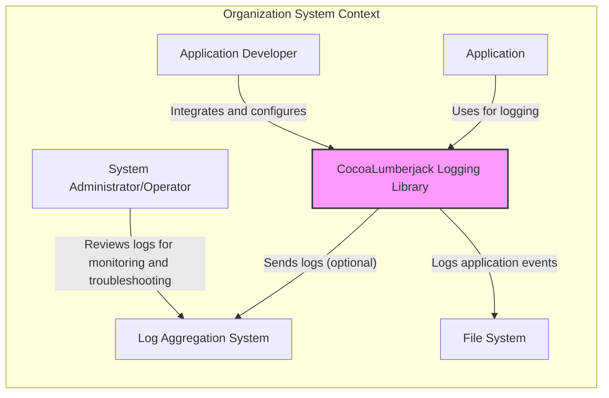
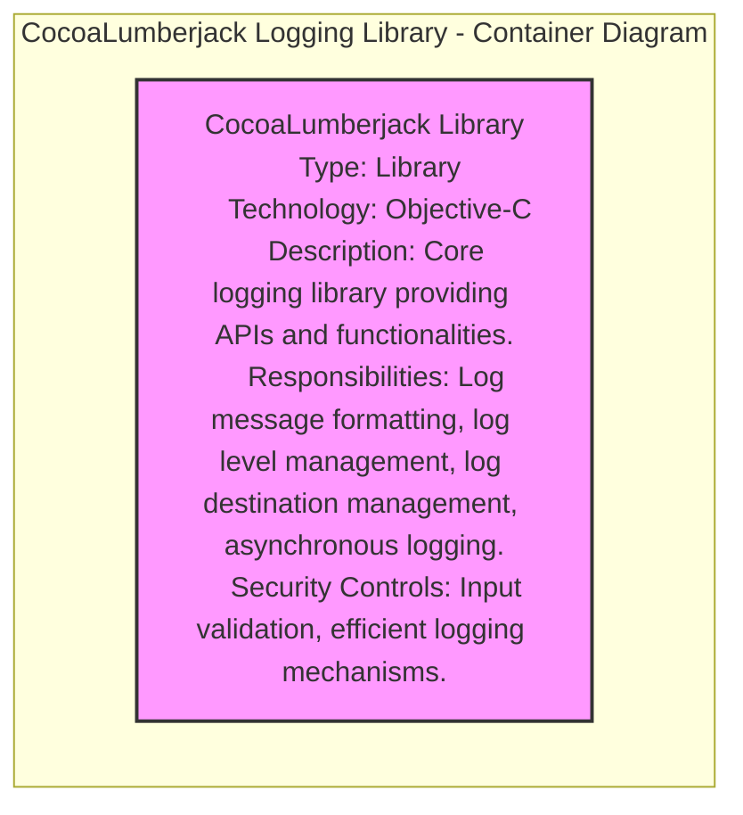

# BUSINESS POSTURE

This project, CocoaLumberjack, aims to provide a robust and flexible logging framework for applications running on Apple platforms (macOS, iOS, tvOS, and watchOS).

- Business Priorities and Goals:
  - Provide a high-performance logging solution that minimizes the performance impact on applications.
  - Offer a flexible and configurable logging framework that can be adapted to various application needs and environments.
  - Enable developers to efficiently debug, monitor, and audit their applications through comprehensive logging capabilities.
  - Maintain a stable and reliable logging library that developers can depend on for critical application logging.

- Business Risks:
  - Performance overhead introduced by logging could negatively impact application responsiveness and user experience.
  - Security vulnerabilities within the logging library could be exploited to compromise applications or leak sensitive information.
  - Improper handling of sensitive data within logs could lead to data breaches and privacy violations.
  - Reliability issues in the logging mechanism could result in loss of critical log data, hindering debugging and incident response efforts.

# SECURITY POSTURE

- Existing Security Controls:
  - security control: Code Review - The project is open source and hosted on GitHub, implying community and maintainer code review processes are in place. (Implemented: GitHub repository, implicitly through open source development model).
  - security control: Input Validation - Logging libraries inherently perform some level of input handling to format and process log messages. (Implemented: Within the CocoaLumberjack library code, implicitly for log message formatting).
  - security control: Secure Software Development Lifecycle - As a mature and widely used open-source project, it is assumed that secure development practices are generally followed. (Implemented: Implicitly through project maturity and community involvement).

- Accepted Risks:
  - accepted risk: Dependency Vulnerabilities - CocoaLumberjack might depend on other libraries, which could contain vulnerabilities. Managing these dependencies is an ongoing risk.
  - accepted risk: Misconfiguration by Users - Developers using CocoaLumberjack might misconfigure logging settings, potentially logging overly sensitive information or creating security vulnerabilities through excessive logging.
  - accepted risk: Log Injection Attacks - If input validation is insufficient, applications using CocoaLumberjack could be vulnerable to log injection attacks if attacker-controlled data is logged without proper sanitization.

- Recommended Security Controls:
  - security control: Automated Security Scanning (SAST/DAST) - Implement automated static and dynamic analysis security scanning tools in the development pipeline to identify potential vulnerabilities in the CocoaLumberjack codebase.
  - security control: Dependency Scanning - Utilize dependency scanning tools to continuously monitor and identify vulnerabilities in third-party libraries used by CocoaLumberjack.
  - security control: Secure Logging Practices Documentation - Provide comprehensive documentation and guidelines for developers on secure logging practices when using CocoaLumberjack, including recommendations for sanitizing log data and avoiding logging sensitive information.
  - security control: Regular Security Audits - Conduct periodic security audits of the CocoaLumberjack codebase by security experts to identify and address potential security weaknesses.

- Security Requirements:
  - Authentication: Not directly applicable to a logging library. Authentication is the responsibility of the application using the library.
  - Authorization: Not directly applicable to a logging library. Authorization is the responsibility of the application using the library.
  - Input Validation:
    - Requirement: Implement robust input validation and sanitization within CocoaLumberjack to prevent log injection attacks. Ensure that log messages are properly escaped or sanitized before being written to log destinations to prevent interpretation as commands or code.
    - Requirement: Document clearly for developers the importance of sanitizing user-provided input before logging it using CocoaLumberjack.
  - Cryptography:
    - Requirement: Cryptographic features are not a core requirement for the logging library itself. However, if log data needs to be protected in transit or at rest, this should be handled at the application level or by the log aggregation/storage systems used in conjunction with CocoaLumberjack. CocoaLumberjack should not introduce vulnerabilities that would hinder the application's ability to implement encryption for logs if needed.

# DESIGN

## C4 CONTEXT



- Context Diagram Elements:
  - - Name: Application Developer
    - Type: Person
    - Description: Software developers who integrate CocoaLumberjack into their applications to add logging capabilities.
    - Responsibilities: Configure and integrate CocoaLumberjack into applications, define logging levels and destinations, and utilize logs for debugging and monitoring.
    - Security controls: Follow secure coding practices when using CocoaLumberjack, sanitize sensitive data before logging, and configure logging appropriately to avoid excessive or insecure logging.
  - - Name: System Administrator/Operator
    - Type: Person
    - Description: Personnel responsible for monitoring application health, troubleshooting issues, and potentially reviewing logs for security incidents.
    - Responsibilities: Monitor application logs for performance issues, errors, and security events, analyze logs to diagnose problems, and potentially manage log aggregation and analysis systems.
    - Security controls: Implement secure access controls to log data, use log analysis tools to detect security threats, and ensure log data integrity and availability.
  - - Name: CocoaLumberjack Logging Library
    - Type: Software System
    - Description: The logging framework itself, providing APIs and functionalities for logging messages from applications.
    - Responsibilities: Capture log messages from applications, format log messages, manage log levels, route logs to configured destinations (file, console, network, etc.), and provide asynchronous logging capabilities.
    - Security controls: Input validation and sanitization of log messages to prevent injection attacks, efficient logging mechanisms to minimize performance impact, and secure handling of log data within the library.
  - - Name: Log Aggregation System
    - Type: Software System
    - Description: External systems like ELK stack, Splunk, or cloud-based logging services used to collect, store, and analyze logs from multiple applications and sources.
    - Responsibilities: Aggregate logs from various sources, provide search and analysis capabilities for logs, store logs securely and reliably, and potentially provide alerting and monitoring based on log data.
    - Security controls: Secure log ingestion and storage mechanisms, access controls to log data, encryption of logs in transit and at rest, and audit logging of access to log data.
  - - Name: File System
    - Type: Technology
    - Description: Local file system on the device or server where the application is running, used as a destination for log files.
    - Responsibilities: Store log files written by CocoaLumberjack, provide access to log files for applications and administrators.
    - Security controls: File system permissions to control access to log files, encryption of log files at rest if required, and secure storage and backup of log files.
  - - Name: Application
    - Type: Software System
    - Description: The application that integrates and uses the CocoaLumberjack logging library to generate logs.
    - Responsibilities: Utilize CocoaLumberjack APIs to log relevant events and data, configure CocoaLumberjack according to application needs, and handle sensitive data logging responsibly.
    - Security controls: Implement secure coding practices, sanitize user inputs before logging, configure logging levels appropriately, and manage access to application logs.

## C4 CONTAINER



- Container Diagram Elements:
  - - Name: CocoaLumberjack Library
    - Type: Library
    - Description: This is the single container representing the CocoaLumberjack library itself. It encapsulates all the core functionalities of the logging framework.
    - Responsibilities:
      - Log message formatting and processing.
      - Management of different log levels (e.g., debug, info, warning, error).
      - Routing logs to various destinations (e.g., files, console, network).
      - Asynchronous logging to minimize performance impact on the application.
      - Configuration management for logging behavior.
    - Security controls:
      - Security control: Input validation and sanitization of log messages to prevent log injection vulnerabilities.
      - Security control: Efficient logging mechanisms to avoid performance bottlenecks that could be exploited for denial-of-service attacks.
      - Security control: Secure handling of internal data and configurations within the library.

## DEPLOYMENT

CocoaLumberjack is a library that is embedded directly into applications. Therefore, the deployment context is primarily within the application's deployment environment.

Deployment Architecture: Embedded Library Deployment

```mermaid
flowchart LR
    subgraph "Deployment Environment: Application Runtime"
    A["Application Instance"
    Type: Application Process
    Description: Instance of the application using CocoaLumberjack.
    Responsibilities: Executes application logic, uses CocoaLumberjack for logging.
    Security Controls: Application-level security controls, OS-level security controls.]
    B["CocoaLumberjack Library"
    Type: Library (Embedded)
    Description: Embedded within the application process.
    Responsibilities: Provides logging services to the application.
    Security Controls: Inherits application and OS security context.]
    A --> B
    C["Operating System (macOS, iOS, etc.)"
    Type: Operating System
    Description: Underlying OS providing runtime environment.
    Responsibilities: Resource management, security isolation, system services.
    Security Controls: OS-level security features, sandboxing, access controls.]
    B --> C
    D["Log Destination (File System, Console, Network)"
    Type: Resource
    Description: Where logs are written (local file, console, or remote system).
    Responsibilities: Log storage, delivery, or display.
    Security Controls: Destination-specific security controls (file permissions, network security, etc.).]
    B --> D
    end
    style A fill:#ccf,stroke:#333,stroke-width:1px
    style B fill:#f9f,stroke:#333,stroke-width:2px
    style C fill:#ccf,stroke:#333,stroke-width:1px
    style D fill:#ccf,stroke:#333,stroke-width:1px
```

- Deployment Diagram Elements:
  - - Name: Application Instance
    - Type: Application Process
    - Description: A running instance of the application that has integrated the CocoaLumberjack library.
    - Responsibilities: Execute the application's core logic, utilize CocoaLumberjack for logging events, and manage the application's runtime environment.
    - Security controls: Application-level security controls such as input validation, authorization, and secure configuration management. Operating system-level security controls like process isolation and memory protection.
  - - Name: CocoaLumberjack Library (Embedded)
    - Type: Library (Embedded)
    - Description: The CocoaLumberjack library is deployed as an embedded component within the application instance. It runs within the same process as the application.
    - Responsibilities: Provide logging services to the application instance, format and process log messages, and route logs to configured destinations.
    - Security controls: Inherits the security context of the application instance and the underlying operating system. Relies on the application and OS for process isolation and resource management.
  - - Name: Operating System (macOS, iOS, etc.)
    - Type: Operating System
    - Description: The underlying operating system (macOS, iOS, tvOS, watchOS) on which the application and CocoaLumberjack are running.
    - Responsibilities: Provide the runtime environment for the application and library, manage system resources, enforce security policies, and provide system services.
    - Security controls: Operating system-level security features such as sandboxing, code signing, access controls, and kernel-level security mechanisms.
  - - Name: Log Destination (File System, Console, Network)
    - Type: Resource
    - Description: The destination where logs generated by CocoaLumberjack are written. This could be the local file system, the system console, or a remote log aggregation system over the network.
    - Responsibilities: Store log data (file system), display logs (console), or transmit logs to remote systems (network).
    - Security controls: Security controls specific to the log destination. For file system destinations, this includes file permissions and encryption. For network destinations, this includes network security protocols (TLS), authentication, and authorization. For console logging, access control to the console output.

## BUILD

```mermaid
flowchart LR
    A["Developer"
    Type: Person
    Description: Software developer contributing to CocoaLumberjack.
    Responsibilities: Writes code, commits changes, performs local builds.
    Security Controls: Developer workstation security, code review process.] --> B["Source Code Repository (GitHub)"
    Type: Code Repository
    Description: GitHub repository hosting CocoaLumberjack source code.
    Responsibilities: Version control, code storage, collaboration platform.
    Security Controls: Access controls, branch protection, audit logging.]
    B --> C["Build System (Xcodebuild, CI/CD)"
    Type: Automation System
    Description: System for automating the build, test, and packaging of CocoaLumberjack.
    Responsibilities: Compilation, testing, artifact generation, publishing.
    Security Controls: Secure build environment, access controls, build process integrity, dependency management.]
    C --> D["Build Artifacts (Library Files)"
    Type: Software Artifacts
    Description: Compiled library files (e.g., .a, .framework).
    Responsibilities: Distribution to developers, integration into applications.
    Security Controls: Code signing, artifact integrity checks, secure distribution channels.]
    style A fill:#ccf,stroke:#333,stroke-width:1px
    style B fill:#ccf,stroke:#333,stroke-width:1px
    style C fill:#ccf,stroke:#333,stroke-width:1px
    style D fill:#f9f,stroke:#333,stroke-width:2px
```

- Build Process Elements:
  - - Name: Developer
    - Type: Person
    - Description: A software developer who writes, modifies, and contributes code to the CocoaLumberjack project.
    - Responsibilities: Develop and maintain code, commit changes to the source code repository, perform local builds and testing.
    - Security controls: Secure developer workstations, code review processes, developer training on secure coding practices, and access control to development resources.
  - - Name: Source Code Repository (GitHub)
    - Type: Code Repository
    - Description: The GitHub repository that hosts the source code for CocoaLumberjack, managing version control and facilitating collaboration.
    - Responsibilities: Securely store source code, manage version history, provide a platform for code review and collaboration, and control access to the codebase.
    - Security controls: Access controls (authentication and authorization), branch protection rules, audit logging of repository activities, and vulnerability scanning of the repository infrastructure.
  - - Name: Build System (Xcodebuild, CI/CD)
    - Type: Automation System
    - Description: Automated build system, potentially using Xcodebuild and CI/CD pipelines (like GitHub Actions), to compile, test, and package CocoaLumberjack.
    - Responsibilities: Automate the build process, compile source code, run tests, generate build artifacts (library files), and potentially publish artifacts.
    - Security controls: Secure build environment (hardened build servers), access controls to the build system, integrity checks of the build process, dependency management (ensuring secure dependencies), and security scanning during the build process (e.g., SAST).
  - - Name: Build Artifacts (Library Files)
    - Type: Software Artifacts
    - Description: The compiled library files (e.g., static libraries, frameworks) produced by the build system, which are the distributable components of CocoaLumberjack.
    - Responsibilities: Be distributed to developers for integration into their applications, provide the runtime logging functionality.
    - Security controls: Code signing of build artifacts to ensure integrity and authenticity, artifact integrity checks (e.g., checksums), and secure distribution channels for delivering artifacts to developers.

# RISK ASSESSMENT

- Critical Business Processes:
  - Indirectly, CocoaLumberjack supports critical business processes by enabling application monitoring, debugging, auditing, and security incident investigation. These processes are crucial for maintaining application availability, performance, security, and compliance. The logging library itself is a supporting component for these processes.

- Data to Protect and Sensitivity:
  - Data to protect: Log data generated by applications using CocoaLumberjack.
  - Sensitivity: The sensitivity of log data varies greatly depending on what is logged by the application. Logs can contain:
    - Low Sensitivity: Debug messages, informational events, performance metrics.
    - Medium Sensitivity: User actions, system events, non-sensitive configuration data.
    - High Sensitivity: User IDs, IP addresses, session tokens, application states, and potentially Personally Identifiable Information (PII), financial data, or health information, depending on the application's logging practices.
  - It is crucial to consider that even seemingly low-sensitivity logs can become sensitive when aggregated or correlated. Developers must be aware of the potential sensitivity of the data they log and implement appropriate security measures.

# QUESTIONS & ASSUMPTIONS

- Questions:
  - Are there specific integrations with log aggregation systems that CocoaLumberjack officially supports or recommends? Understanding these integrations would be beneficial for considering end-to-end log security.
  - Are there any built-in mechanisms within CocoaLumberjack for log data sanitization or masking of sensitive information? If not, this should be strongly emphasized in the secure logging practices documentation for developers.
  - What is the process for reporting and addressing security vulnerabilities in CocoaLumberjack? Understanding the vulnerability management process is important for ongoing security maintenance.

- Assumptions:
  - It is assumed that developers using CocoaLumberjack are responsible for configuring the library securely and for ensuring that sensitive data is not inadvertently logged or is properly sanitized before logging.
  - It is assumed that the primary focus of CocoaLumberjack is to provide a performant and flexible logging mechanism, and security is a secondary but important consideration.
  - It is assumed that the build and release process for CocoaLumberjack follows standard open-source project practices, including code review and some level of testing.
  - It is assumed that the deployment environment for CocoaLumberjack is within applications running on Apple platforms, and the security of the overall application and the underlying OS is a shared responsibility.