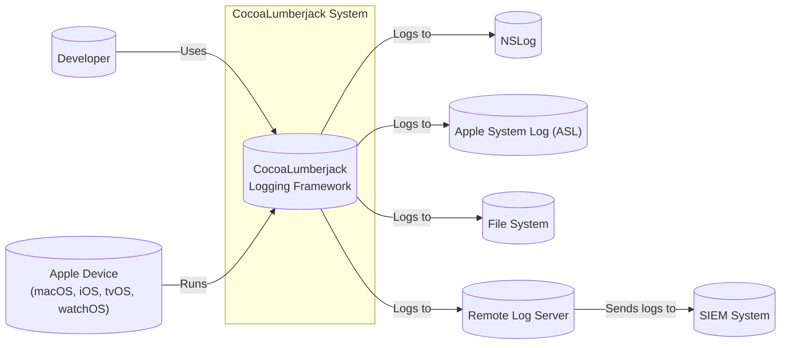
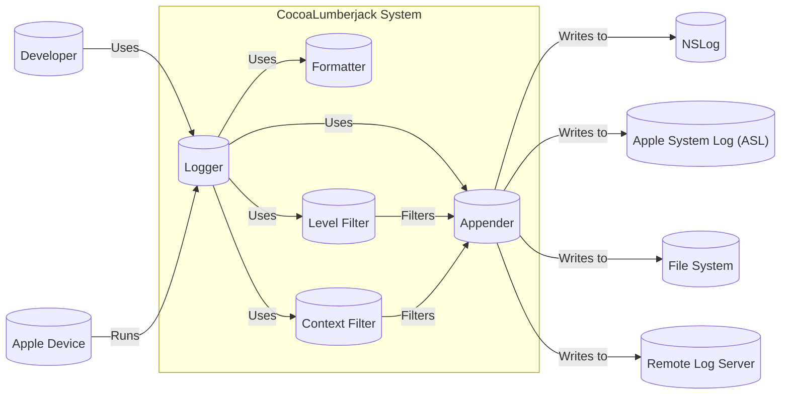
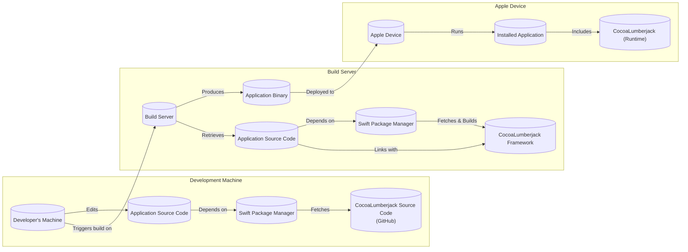
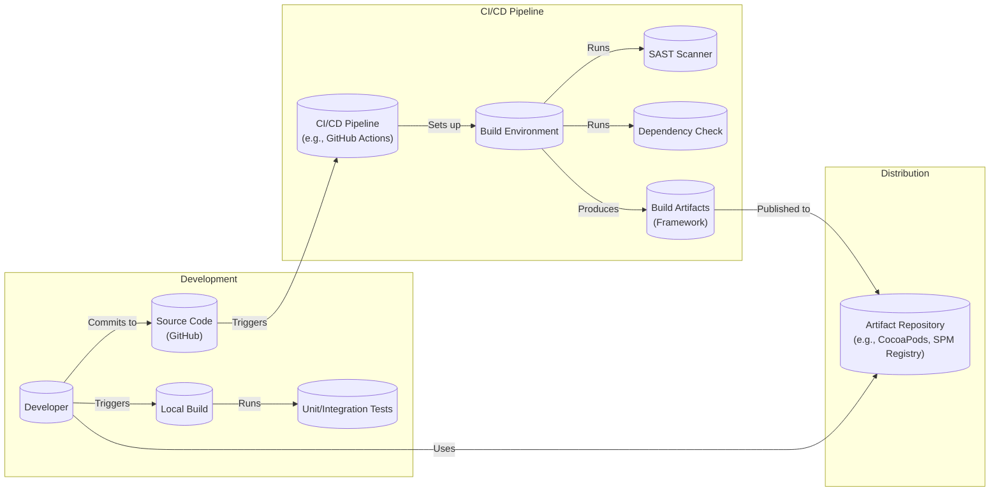

# BUSINESS POSTURE

Business Priorities and Goals:

*   Provide a fast, flexible, and accurate logging framework for Apple platforms (macOS, iOS, tvOS, watchOS).
*   Offer a logging solution that is easy to integrate and use for developers.
*   Maintain backward compatibility with existing logging systems (NSLog, ASL).
*   Provide configurable logging levels and output destinations.
*   Enable efficient log management and analysis.
*   Support a wide range of Apple devices and OS versions.
*   Maintain an active and supportive open-source community.

Business Risks:

*   Data leakage: Sensitive information might be inadvertently logged, posing privacy and security risks.
*   Performance impact: Excessive or inefficient logging could negatively impact application performance.
*   Log manipulation: Malicious actors could attempt to tamper with logs to conceal their activities or inject misleading information.
*   Denial of service: Overwhelming the logging system with excessive log data could lead to a denial-of-service condition.
*   Compatibility issues: Changes to the framework could introduce compatibility problems with existing applications or systems.
*   Lack of adoption: If the framework is not widely adopted, its long-term viability and support may be at risk.
*   Supply chain attacks: Compromised dependencies or build processes could introduce vulnerabilities into the framework.

# SECURITY POSTURE

Existing Security Controls:

*   security control: Code reviews: The project is open-source and subject to community code reviews. (Described in GitHub repository and contribution guidelines).
*   security control: Static analysis: The project likely uses static analysis tools, although this is not explicitly stated. (Assumed based on standard practices for Objective-C/Swift development).
*   security control: Logging levels: The framework supports different logging levels (e.g., error, warning, info, debug, verbose), allowing developers to control the verbosity of logging and reduce the risk of exposing sensitive information. (Described in project documentation).
*   security control: Configurable output: The framework allows developers to configure where log data is sent (e.g., console, file, custom destinations), providing some control over data storage and access. (Described in project documentation).

Accepted Risks:

*   accepted risk: Reliance on NSLog and ASL: The framework integrates with NSLog and ASL, inheriting any security limitations of these underlying systems.
*   accepted risk: Potential for misuse: Developers could misuse the framework to log sensitive data, despite the availability of logging levels.
*   accepted risk: Limited built-in security features: The framework itself does not provide advanced security features like encryption or integrity checking.

Recommended Security Controls:

*   security control: Implement input validation for log messages to prevent injection attacks.
*   security control: Provide guidance and best practices on secure logging, including avoiding logging sensitive data.
*   security control: Consider adding support for log data encryption at rest and in transit.
*   security control: Explore options for log integrity verification (e.g., hashing, digital signatures).
*   security control: Integrate with security information and event management (SIEM) systems for centralized log monitoring and analysis.
*   security control: Regularly perform security audits and penetration testing of the framework.
*   security control: Implement a robust vulnerability disclosure program.
*   security control: Use Software Bill of Materials (SBOM) to track dependencies and identify potential vulnerabilities.

Security Requirements:

*   Authentication: Not directly applicable to the logging framework itself, but any remote logging services used should require authentication.
*   Authorization: Not directly applicable to the logging framework itself, but access to log data should be controlled based on roles and permissions.
*   Input Validation:
    *   The framework should validate log messages to prevent injection attacks (e.g., escaping special characters).
    *   Limit the length of log messages to prevent excessive memory consumption.
*   Cryptography:
    *   Consider encrypting log data at rest, especially if it contains sensitive information.
    *   If log data is transmitted over a network, use secure protocols (e.g., TLS/SSL).
    *   If log integrity is critical, use cryptographic hashing or digital signatures.

# DESIGN

## C4 CONTEXT

Element Descriptions:

*   Element:
    *   Name: Developer
    *   Type: Person
    *   Description: A software developer who integrates CocoaLumberjack into their application.
    *   Responsibilities: Configures and uses CocoaLumberjack to log messages from their application.
    *   Security controls: Follows secure coding practices, avoids logging sensitive data.

*   Element:
    *   Name: Apple Device
    *   Type: Device
    *   Description: An Apple device (macOS, iOS, tvOS, watchOS) running an application that uses CocoaLumberjack.
    *   Responsibilities: Executes the application code, including the logging framework.
    *   Security controls: Operates within the security context of the Apple operating system.

*   Element:
    *   Name: CocoaLumberjack
    *   Type: Software System
    *   Description: The CocoaLumberjack logging framework.
    *   Responsibilities: Provides an API for logging messages, manages log levels, and directs log output to various destinations.
    *   Security controls: Input validation (recommended), configurable logging levels, configurable output destinations.

*   Element:
    *   Name: NSLog
    *   Type: External System
    *   Description: The standard NSLog logging facility provided by Apple.
    *   Responsibilities: Outputs log messages to the console.
    *   Security controls: Relies on the security mechanisms of the operating system.

*   Element:
    *   Name: ASL
    *   Type: External System
    *   Description: The Apple System Log (ASL) facility.
    *   Responsibilities: Stores log messages in a central system log.
    *   Security controls: Relies on the security mechanisms of the operating system.

*   Element:
    *   Name: File System
    *   Type: External System
    *   Description: The file system of the Apple device.
    *   Responsibilities: Stores log files if CocoaLumberjack is configured to write to files.
    *   Security controls: Relies on the file system permissions and security mechanisms of the operating system.

*   Element:
    *   Name: Remote Log Server
    *   Type: External System
    *   Description: A remote server that receives log data from CocoaLumberjack.
    *   Responsibilities: Collects, stores, and potentially analyzes log data.
    *   Security controls: Authentication, authorization, encryption in transit (TLS/SSL), secure storage.

*   Element:
    *   Name: SIEM System
    *   Type: External System
    *   Description: A Security Information and Event Management (SIEM) system.
    *   Responsibilities: Collects and analyzes security-related log data from various sources, including remote log servers.
    *   Security controls: Intrusion detection, anomaly detection, security monitoring, alerting.

## C4 CONTAINER

Element Descriptions:

*   Element:
    *   Name: Logger
    *   Type: Container
    *   Description: The main entry point for logging messages. Developers interact with Logger instances.
    *   Responsibilities: Provides methods for logging messages at different levels (e.g., logError, logWarning, logInfo).
    *   Security controls: None specific, relies on other components for security.

*   Element:
    *   Name: Formatter
    *   Type: Container
    *   Description: Formats log messages into a specific string representation.
    *   Responsibilities: Converts log event data (message, level, context, etc.) into a human-readable or machine-parsable string.
    *   Security controls: Should be designed to prevent injection attacks by properly escaping special characters.

*   Element:
    *   Name: Appender
    *   Type: Container
    *   Description: Sends formatted log messages to a specific output destination (e.g., console, file, remote server).
    *   Responsibilities: Writes log data to the configured destination.
    *   Security controls: Depends on the specific appender. File appenders should respect file system permissions. Network appenders should use secure protocols (TLS/SSL).

*   Element:
    *   Name: Context Filter
    *   Type: Container
    *   Description: Filters log messages based on contextual information (e.g., class name, method name).
    *   Responsibilities: Determines whether a log message should be processed based on its context.
    *   Security controls: None specific.

*   Element:
    *   Name: Level Filter
    *   Type: Container
    *   Description: Filters log messages based on their logging level (e.g., error, warning, info).
    *   Responsibilities: Determines whether a log message should be processed based on its level and the configured minimum logging level.
    *   Security controls: None specific.

*   Element:
    *   Name: Developer
    *   Type: Person
    *   Description: A software developer who integrates CocoaLumberjack into their application.
    *   Responsibilities: Configures and uses CocoaLumberjack to log messages from their application.
    *   Security controls: Follows secure coding practices, avoids logging sensitive data.

*   Element:
    *   Name: Apple Device
    *   Type: Device
    *   Description: An Apple device (macOS, iOS, tvOS, watchOS) running an application that uses CocoaLumberjack.
    *   Responsibilities: Executes the application code, including the logging framework.
    *   Security controls: Operates within the security context of the Apple operating system.

*   Element:
    *   Name: NSLog
    *   Type: External System
    *   Description: The standard NSLog logging facility provided by Apple.
    *   Responsibilities: Outputs log messages to the console.
    *   Security controls: Relies on the security mechanisms of the operating system.

*   Element:
    *   Name: ASL
    *   Type: External System
    *   Description: The Apple System Log (ASL) facility.
    *   Responsibilities: Stores log messages in a central system log.
    *   Security controls: Relies on the security mechanisms of the operating system.

*   Element:
    *   Name: File System
    *   Type: External System
    *   Description: The file system of the Apple device.
    *   Responsibilities: Stores log files if CocoaLumberjack is configured to write to files.
    *   Security controls: Relies on the file system permissions and security mechanisms of the operating system.

*   Element:
    *   Name: Remote Log Server
    *   Type: External System
    *   Description: A remote server that receives log data from CocoaLumberjack.
    *   Responsibilities: Collects, stores, and potentially analyzes log data.
    *   Security controls: Authentication, authorization, encryption in transit (TLS/SSL), secure storage.

## DEPLOYMENT

Possible Deployment Solutions:

1.  **Direct Integration:** The CocoaLumberjack framework is directly integrated into the application's source code. This is the most common approach for iOS/macOS libraries.
2.  **Dependency Manager (CocoaPods, Carthage, Swift Package Manager):** The framework is managed as a dependency using a dependency manager. This simplifies updates and version management.
3.  **Static Library:** The framework is compiled into a static library and linked with the application.
4.  **Dynamic Framework:** The framework is compiled into a dynamic framework and embedded in the application bundle.

Chosen Solution (Dependency Manager - Swift Package Manager):

Element Descriptions:

*   Element:
    *   Name: Developer's Machine
    *   Type: Device
    *   Description: The developer's computer where the application code is written and managed.
    *   Responsibilities: Hosts the source code, development tools, and dependency manager.
    *   Security controls: Standard development environment security practices (e.g., strong passwords, up-to-date software).

*   Element:
    *   Name: Application Source Code
    *   Type: Data
    *   Description: The source code of the application that integrates CocoaLumberjack.
    *   Responsibilities: Contains the application logic and calls to the CocoaLumberjack API.
    *   Security controls: Code reviews, static analysis, secure coding practices.

*   Element:
    *   Name: Swift Package Manager
    *   Type: Software
    *   Description: The Swift Package Manager (SPM) used to manage dependencies, including CocoaLumberjack.
    *   Responsibilities: Fetches the CocoaLumberjack source code from its repository, resolves dependencies, and builds the framework.
    *   Security controls: Uses HTTPS to fetch dependencies, verifies package integrity (if configured).

*   Element:
    *   Name: CocoaLumberjack Source Code (GitHub)
    *   Type: Data
    *   Description: The source code of the CocoaLumberjack framework hosted on GitHub.
    *   Responsibilities: Provides the implementation of the logging framework.
    *   Security controls: GitHub's security features, code reviews, community scrutiny.

*   Element:
    *   Name: Build Server
    *   Type: Device
    *   Description: A server (or local machine acting as a build server) that builds the application and its dependencies.
    *   Responsibilities: Compiles the application code, links with CocoaLumberjack, and produces the final application binary.
    *   Security controls: Secure build environment, limited access, regular security updates.

*   Element:
    *   Name: CocoaLumberjack Framework
    *   Type: Software
    *   Description: The compiled CocoaLumberjack framework.
    *   Responsibilities: Provides the logging functionality to the application.
    *   Security controls: Built from source with security considerations (see previous sections).

*   Element:
    *   Name: Application Binary
    *   Type: Data
    *   Description: The final executable file of the application, including the linked CocoaLumberjack framework.
    *   Responsibilities: Runs on the Apple device and performs the application's functions, including logging.
    *   Security controls: Code signing, application sandboxing (on iOS/macOS).

*   Element:
    *   Name: Apple Device
    *   Type: Device
    *   Description: The target device (iPhone, iPad, Mac, etc.) where the application is deployed.
    *   Responsibilities: Runs the application binary.
    *   Security controls: Operating system security features, device security policies.

*   Element:
    *   Name: Installed Application
    *   Type: Software
    *   Description: The application installed on the Apple device.
    *   Responsibilities: Provides the application's functionality to the user.
    *   Security controls: Application sandboxing, code signing verification.

*   Element:
    *   Name: CocoaLumberjack (Runtime)
    *   Type: Software
    *   Description: The CocoaLumberjack framework running as part of the installed application.
    *   Responsibilities: Handles logging within the application.
    *   Security controls: Inherits security context of the application and operating system.

## BUILD

Build Process Description:

1.  **Development:**
    *   Developers write code and commit changes to the source code repository (GitHub).
    *   Developers can trigger local builds to test their changes.
    *   Local builds run unit and integration tests to ensure code quality.

2.  **CI/CD Pipeline:**
    *   Changes pushed to the repository trigger the CI/CD pipeline (e.g., GitHub Actions).
    *   The pipeline sets up a build environment.
    *   Static Application Security Testing (SAST) tools scan the code for vulnerabilities.
    *   Dependency checks (e.g., using Swift Package Manager's built-in checks or dedicated tools) verify the security of dependencies.
    *   The build environment compiles the CocoaLumberjack framework and produces build artifacts.

3.  **Distribution:**
    *   Build artifacts (the compiled framework) are published to an artifact repository (e.g., CocoaPods, Swift Package Manager Registry).
    *   Developers using CocoaLumberjack can then easily integrate it into their projects using their preferred dependency manager.

Security Controls in Build Process:

*   security control: Code reviews: All code changes are reviewed before being merged into the main branch.
*   security control: SAST: Static analysis tools are used to identify potential vulnerabilities in the code.
*   security control: Dependency checks: Dependencies are regularly checked for known vulnerabilities.
*   security control: Secure build environment: The CI/CD pipeline runs in a secure environment with limited access.
*   security control: Automated builds: Builds are automated to ensure consistency and reduce the risk of manual errors.
*   security control: Artifact signing (recommended): Build artifacts should be digitally signed to ensure their integrity and authenticity.

# RISK ASSESSMENT

Critical Business Processes:

*   Application functionality: CocoaLumberjack is a supporting component, but its failure could indirectly impact application functionality by hindering debugging and troubleshooting.
*   Development workflow: The framework's availability and reliability are important for the development workflow.
*   Reputation: Security vulnerabilities in the framework could damage the reputation of the project and its maintainers.

Data Protection:

*   Data Sensitivity: The primary data concern is the *content of log messages*. While CocoaLumberjack itself doesn't handle sensitive data directly, developers might inadvertently log sensitive information (passwords, API keys, personal data). This is the most critical data to protect.
*   Log Data Sensitivity Levels:
    *   High: Sensitive data (passwords, PII, etc.) inadvertently logged.
    *   Medium: Debugging information that could reveal internal application logic or configuration details.
    *   Low: General informational messages that pose minimal risk.

# QUESTIONS & ASSUMPTIONS

Questions:

*   Are there any specific compliance requirements (e.g., GDPR, HIPAA) that apply to applications using CocoaLumberjack?
*   What are the specific threat models or attack scenarios that the maintainers are most concerned about?
*   What level of logging is typically used in production environments?
*   Are there any existing security audits or penetration test reports for CocoaLumberjack?
*   What is the process for handling security vulnerabilities reported by external researchers?
*   Is there a plan to implement artifact signing for distributed builds?

Assumptions:

*   BUSINESS POSTURE: The primary goal is to provide a reliable and efficient logging framework, with security as a secondary but important consideration. The project has a moderate risk appetite, typical of open-source projects.
*   SECURITY POSTURE: Developers are responsible for using the framework securely and avoiding logging sensitive data. The framework relies primarily on existing OS security mechanisms and standard development practices for its security.
*   DESIGN: The framework is designed to be flexible and extensible, allowing developers to customize its behavior. The deployment model will primarily rely on dependency managers like Swift Package Manager, CocoaPods, and Carthage. The build process will include automated security checks.