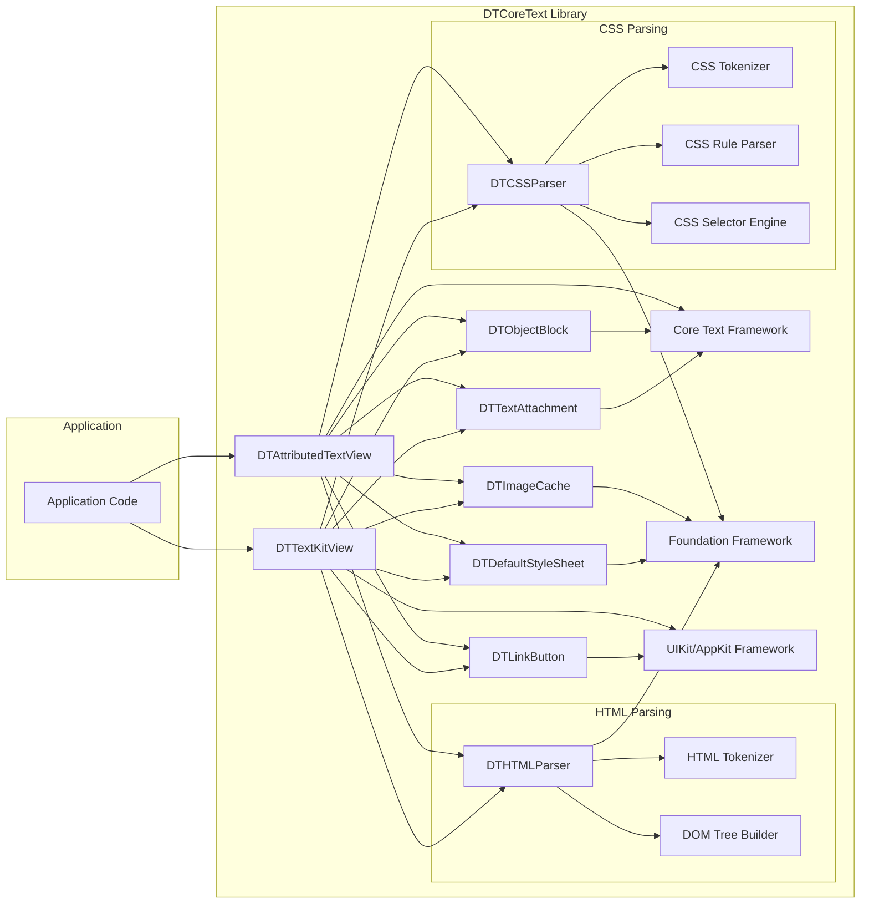
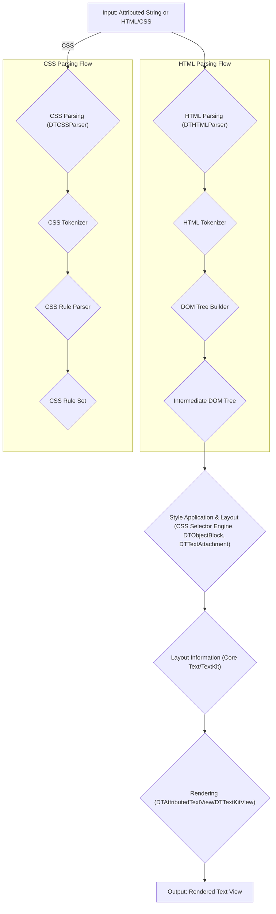

# Project Design Document: DTCoreText

**Document Version:** 1.1
**Date:** October 26, 2023
**Prepared By:** Gemini (AI Language Model)

## 1. Introduction

This document provides an enhanced architectural design of the DTCoreText library, a project focused on rendering attributed text efficiently. This detailed design will serve as the foundation for subsequent, comprehensive threat modeling activities. The document elaborates on the key components, data flow with more granular steps, and interactions within the library to facilitate a deeper understanding of potential vulnerabilities.

## 2. Project Overview

DTCoreText is an open-source Objective-C library that extends the capabilities of Core Text, Apple's text rendering framework. It offers a higher-level and more convenient API for laying out and rendering complex attributed strings, notably including robust support for HTML and CSS styling. The primary goal of the library is to simplify the display of richly formatted text within iOS and macOS applications.

## 3. System Architecture

The DTCoreText library is structured into several interconnected components, each with specific responsibilities. The following diagram provides a more detailed overview of the system architecture, highlighting key internal modules:

### 3.1. Key Components (Detailed)

*   **`DTAttributedTextView`:**  A `UIView` (iOS) or `NSView` (macOS) subclass serving as the primary interface for displaying attributed text. It manages rendering, scrolling, user interaction (like link taps), and coordinates the underlying layout process.
*   **`DTTextKitView`:** A more recent implementation leveraging Apple's TextKit framework for text layout and rendering. This component offers potential performance benefits and tighter integration with newer system features related to text handling.
*   **HTML Parsing Subsystem:**
    *   **`DTHTMLParser`:** The main entry point for parsing HTML. It orchestrates the tokenization and DOM tree building processes.
    *   **`HTML Tokenizer`:**  Breaks down the HTML input string into a stream of tokens (e.g., start tags, end tags, text content).
    *   **`DOM Tree Builder`:** Constructs a Document Object Model (DOM) tree from the token stream, representing the hierarchical structure of the HTML document.
*   **CSS Parsing Subsystem:**
    *   **`DTCSSParser`:**  Responsible for parsing CSS rules, whether provided inline within HTML `style` attributes or in external stylesheets.
    *   **`CSS Tokenizer`:**  Breaks down CSS input into tokens (e.g., selectors, properties, values).
    *   **`CSS Rule Parser`:**  Parses the CSS token stream to create a collection of CSS rules, associating selectors with style declarations.
    *   **`CSS Selector Engine`:**  Matches CSS selectors against elements in the DOM tree to determine which styles apply to which elements.
*   **`DTObjectBlock`:** Represents block-level elements within the text flow, such as paragraphs (`
`), lists (`<ul>`, `<ol>`), blockquotes (`<blockquote>`), and divs (`
`). These components manage the layout and styling of these block elements.
*   **`DTTextAttachment`:** Represents inline, embedded objects within the text, such as images (``) or custom views. It handles the loading, sizing, and positioning of these attachments within the text layout.
*   **`DTLinkButton`:** A custom button subclass used to handle hyperlinks (`<a>` tags) within the rendered text. It detects taps and triggers the opening of the associated URL.
*   **`DTImageCache`:** Manages the caching of images used in the attributed text to improve performance and reduce network requests. It typically uses a memory cache and potentially a disk cache.
*   **Core Text Framework:** Apple's fundamental framework for advanced text layout and rendering. DTCoreText utilizes this framework for the low-level drawing of glyphs and complex text shaping.
*   **Foundation Framework:** Provides essential data types, collections, and system services used throughout the library, including string manipulation, URL handling, and networking.
*   **UIKit/AppKit Framework:** Provides the user interface building blocks and event handling mechanisms for iOS and macOS applications, respectively.
*   **`DTDefaultStyleSheet`:** Provides a set of default CSS styles that are applied when no explicit styles are provided in the HTML or external stylesheets.

## 4. Data Flow (Enhanced)

The data flow within DTCoreText involves a more intricate sequence of steps, particularly within the parsing stages:

**Detailed Data Flow:**

1. **Input:** The application provides either an `NSAttributedString` directly or an HTML string (potentially with associated CSS, either inline or external).
2. **HTML Parsing (if applicable):**
    *   If the input is HTML, the `DTHTMLParser` initiates the parsing process.
    *   The **HTML Tokenizer** breaks down the HTML string into individual tokens.
    *   The **DOM Tree Builder** constructs a hierarchical DOM tree from these tokens, representing the HTML structure.
    *   The output is an **Intermediate DOM Tree**.
3. **CSS Parsing (if applicable):**
    *   If CSS is present, the `DTCSSParser` is invoked.
    *   The **CSS Tokenizer** breaks down the CSS into tokens.
    *   The **CSS Rule Parser** creates a set of CSS rules from these tokens.
    *   The output is a **CSS Rule Set**.
4. **Style Application and Layout:**
    *   The **CSS Selector Engine** matches CSS rules from the **CSS Rule Set** against the elements in the **Intermediate DOM Tree**.
    *   Based on the matched rules and default styles from `DTDefaultStyleSheet`, styling information is applied to the DOM tree nodes.
    *   `DTObjectBlock` and `DTTextAttachment` instances are created to represent block-level elements and embedded objects, respectively.
    *   Core Text (or TextKit in `DTTextKitView`) is used to perform the actual text layout, generating **Layout Information**, including line breaks, glyph positions, and attachment placement.
5. **Rendering:**
    *   The `DTAttributedTextView` or `DTTextKitView` uses the **Layout Information** to draw the text content, images, and other attachments onto the screen using Core Text or TextKit drawing primitives.
    *   The `DTImageCache` is utilized for efficient image loading and management.
    *   `DTLinkButton` instances are created and positioned for hyperlinks.
6. **Output:** The final output is a rendered view displaying the richly formatted text.

## 5. Component Details and Interactions (Elaborated)

This section provides a more detailed look at the interactions between key components, highlighting data flow and control flow:

*   **Application to View Interaction:** The application sets the `attributedString` or `HTMLString` property of `DTAttributedTextView` or `DTTextKitView`. This triggers the parsing and rendering process.
*   **Parser Orchestration:** `DTAttributedTextView` or `DTTextKitView` creates instances of `DTHTMLParser` and `DTCSSParser` as needed. The view might configure parser settings (e.g., base URL for resolving relative image paths).
*   **HTML Parsing Details:** The `DTHTMLParser` feeds the HTML string to the `HTML Tokenizer`, which produces a stream of tokens. The `DOM Tree Builder` consumes these tokens and constructs the DOM tree. Error handling during tokenization and tree building is crucial.
*   **CSS Parsing Details:** The `DTCSSParser` similarly uses the `CSS Tokenizer` to break down CSS. The `CSS Rule Parser` then creates CSS rules. The `CSS Selector Engine` takes the DOM tree and CSS rules as input and determines the styles applicable to each DOM node.
*   **Style Application Logic:** The results from the CSS Selector Engine are used to create `NSAttributedString` attributes. This involves mapping CSS properties to Core Text attributes (e.g., `font`, `foregroundColor`, `paragraphStyle`).
*   **Attachment Handling Workflow:** When the HTML parser encounters an `` tag, it creates a `DTTextAttachment`. The attachment might initiate a network request (using Foundation's URL loading capabilities) to fetch the image. The `DTImageCache` is consulted to avoid redundant downloads.
*   **Link Handling Mechanism:** The HTML parser identifies `<a>` tags and creates `DTLinkButton` instances, associating them with the `href` attribute. The text view handles touch events on these buttons and opens the corresponding URL using system APIs.
*   **Layout Engine Interaction:** `DTAttributedTextView` directly interacts with Core Text's layout objects (`CTFramesetter`, `CTFrame`). `DTTextKitView` uses TextKit's `NSTextStorage`, `NSLayoutManager`, and `NSTextContainer` for layout. Both approaches involve complex calculations to determine text positioning.

## 6. Security Considerations (Detailed)

This section expands on the initial security considerations, providing more specific examples and potential attack vectors:

*   **HTML Parsing Vulnerabilities:**
    *   **Cross-Site Scripting (XSS):** If the parsed and rendered HTML is later used in a web context (less likely with DTCoreText's primary use case in native apps, but possible if content is shared), malicious JavaScript embedded in the HTML could be executed. Example: ``.
    *   **Denial of Service (DoS):**  Crafted HTML with deeply nested elements or excessively large attributes could consume excessive memory or CPU during parsing, leading to application crashes or unresponsiveness. Example: Very long strings in attributes, deeply nested `
` elements.
    *   **HTML Injection:**  If user-provided data is directly embedded into the HTML being parsed without proper sanitization, attackers could inject malicious HTML.
*   **CSS Parsing Vulnerabilities:**
    *   **DoS through Complex Selectors:**  Extremely complex CSS selectors could cause the `CSS Selector Engine` to perform excessive computations, leading to performance degradation or DoS. Example: Highly specific and redundant selectors.
    *   **Resource Exhaustion through Styles:**  CSS rules that trigger the creation of a large number of layers or off-screen rendering could lead to memory exhaustion. Example:  Excessive use of shadows or filters.
    *   **Information Disclosure (less likely):** In rare cases, CSS vulnerabilities might be exploited to infer information about the user's system or environment.
*   **Image Handling Vulnerabilities:**
    *   **Remote Code Execution:** If the image loading process uses vulnerable image decoding libraries, malicious image files could potentially trigger code execution.
    *   **Denial of Service:**  Downloading extremely large images or a large number of images could consume excessive bandwidth and memory, leading to DoS.
    *   **Information Disclosure:**  Fetching images over insecure connections (HTTP) could expose the image content to eavesdropping.
    *   **Server-Side Request Forgery (SSRF):** If the application doesn't properly validate image URLs, an attacker might be able to make the application fetch resources from internal or restricted networks.
*   **Link Handling Vulnerabilities:**
    *   **Phishing:**  Maliciously crafted links could redirect users to fake login pages or other harmful websites.
    *   **URL Schemes Abuse:**  Custom URL schemes could be used to trigger unintended actions within the application or other installed applications.
    *   **Data Exfiltration:**  Carefully crafted URLs could be used to send sensitive data to attacker-controlled servers.
*   **Resource Exhaustion (General):** Rendering very large amounts of text or complex layouts can consume significant memory and CPU resources, potentially leading to application instability or crashes.
*   **Input Validation Failures:** Lack of proper validation on the input HTML or attributed string can open the door to many of the vulnerabilities listed above.

## 7. Assumptions and Constraints

*   DTCoreText is primarily used for rendering rich text within the UI of native iOS and macOS applications.
*   The security of the underlying Core Text and TextKit frameworks is assumed. However, interactions with these frameworks are within the scope of this analysis.
*   The threat model will focus on vulnerabilities exploitable through the DTCoreText API and its handling of untrusted input (HTML, CSS, image URLs).
*   This design document assumes a foundational understanding of common web security vulnerabilities like XSS and SSRF.

## 8. Future Considerations

*   **Content Security Policy (CSP) Implementation:** Explore the feasibility of implementing a CSP-like mechanism to restrict the types of resources that can be loaded and the actions that can be performed within the rendered content.
*   **HTML Sanitization:** Consider integrating or recommending the use of a robust HTML sanitization library before passing HTML to DTCoreText.
*   **Subresource Integrity (SRI):** For externally loaded resources (like images), investigate the possibility of using SRI to ensure that the fetched resources haven't been tampered with.
*   **Regular Security Audits and Penetration Testing:**  Periodic security assessments are crucial for identifying and addressing potential vulnerabilities.
*   **Staying Updated with Dependencies:**  Continuously monitor and update dependencies (including system frameworks) to benefit from security patches.

This improved design document provides a more granular and detailed view of the DTCoreText library's architecture, enhancing its value for subsequent threat modeling activities. The elaborated component descriptions, data flow, and security considerations offer a deeper understanding of the potential attack surfaces and vulnerabilities within the project.
