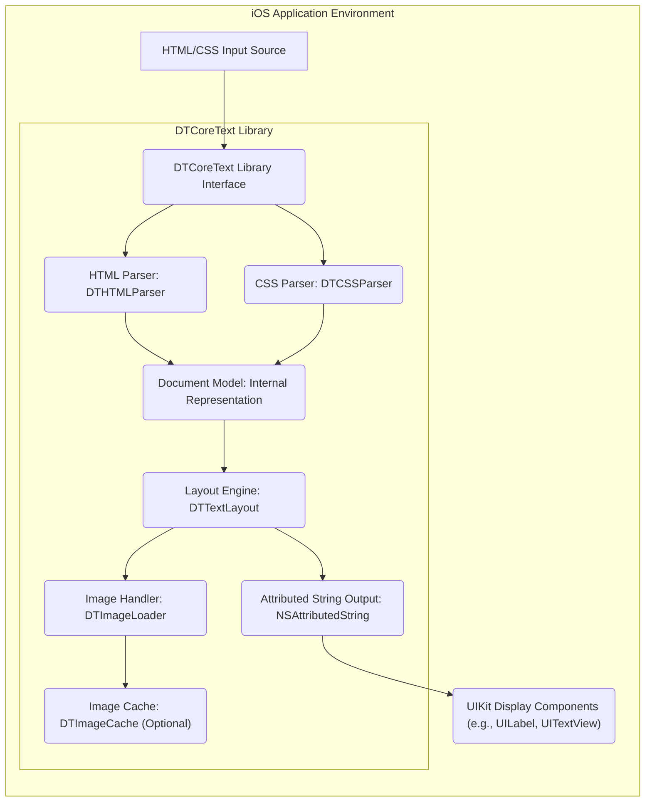

# Project Design Document: DTCoreText

**Project:** DTCoreText

**Version:** 1.1

**Date:** October 26, 2023

**Author:** AI Software Architect

## 1. Introduction

This document provides an enhanced design overview of the DTCoreText project, an open-source iOS library for rendering HTML and CSS into attributed strings. This detailed design serves as a crucial foundation for subsequent threat modeling activities, clearly outlining the system's architecture, data flow, and key components with a focus on potential security implications.

### 1.1. Project Goal

The primary goal of DTCoreText is to empower iOS developers with a robust and flexible mechanism for displaying rich text content within their applications. It achieves this by parsing and rendering HTML and CSS, enabling the presentation of formatted text, images, and other inline elements beyond the capabilities of standard native iOS text rendering. This allows for greater control over content presentation and the integration of web-based content.

### 1.2. Target Audience

This document is intended for a broad audience involved in the security and development lifecycle of applications utilizing DTCoreText:

*   Security engineers and architects responsible for threat modeling, security assessments, and penetration testing.
*   Software developers integrating and utilizing DTCoreText within their iOS applications.
*   Quality assurance engineers involved in testing the functionality and security of applications using DTCoreText.
*   Anyone requiring a deep understanding of the library's internal workings and potential security vulnerabilities.

## 2. System Architecture

DTCoreText functions as a library seamlessly integrated into an iOS application. It receives HTML and CSS input and processes it to generate an `NSAttributedString`, a native iOS object capable of displaying rich text using standard UIKit components such as `UILabel` or `UITextView`. The library's architecture is modular, separating concerns for parsing, styling, layout, and image handling.

### 2.1. Key Architectural Components:

*   **HTML/CSS Input Source:** Represents the origin of the HTML and CSS strings. This could be a remote server, a local file, user-generated content, or data embedded within the application. Understanding the source is crucial for assessing trust levels.
*   **DTCoreText Library Interface:** The public API of the library, providing methods for initiating the parsing and rendering process. This is the entry point for data and a key area for security checks.
*   **HTML Parser (`DTHTMLParser`):**  The component responsible for dissecting the HTML input, validating its structure, and constructing an internal Document Object Model (DOM) representation. This component is critical in preventing injection attacks.
*   **CSS Parser (`DTCSSParser`):**  This component analyzes the CSS input, interpreting style rules and associating them with corresponding HTML elements within the Document Model. It needs to handle potentially complex and even malicious CSS.
*   **Document Model (Internal Representation):** A structured, in-memory representation of the parsed HTML content enriched with styling information derived from the CSS. This serves as the central data structure for subsequent processing.
*   **Layout Engine (`DTTextLayout`):**  The core of the rendering process. It calculates the precise layout of text and inline elements based on the Document Model, applying CSS properties and considering available rendering space. This component is performance-sensitive and could be targeted for DoS attacks.
*   **Image Handler (`DTImageLoader`):**  Manages the retrieval, decoding, and processing of images referenced within the HTML. This involves network requests and potential interaction with external resources, making it a significant security consideration.
*   **Image Cache (`DTImageCache` - Optional):** An optional component designed to improve performance by storing downloaded images locally, reducing the need for repeated network requests. Proper cache management is important for security.
*   **Attributed String Output (`NSAttributedString`):** The final output of the DTCoreText library, a standard iOS object containing the styled text and inline attachments (like images), ready for display.
*   **UIKit Display Components (e.g., `UILabel`, `UITextView`):** The standard iOS UI elements used to display the rendered `NSAttributedString`. While not part of DTCoreText, their interaction is the final step in the rendering pipeline.

## 3. Data Flow

The rendering process within DTCoreText involves a series of transformations applied to the input data:

1. **Input Acquisition:** The iOS application provides HTML and CSS strings to the DTCoreText library through its public interface. The origin and nature of this input are critical security considerations.
2. **Parsing (HTML):** The `DTHTMLParser` receives the HTML string and performs lexical analysis and syntactic parsing. This involves:
    *   Tokenization: Breaking the HTML string into meaningful units (tags, attributes, text content).
    *   Tree Construction: Building a hierarchical representation (the Document Model) based on the HTML structure.
    *   Error Handling: Managing malformed or invalid HTML, which is crucial to prevent unexpected behavior or vulnerabilities.
3. **Parsing (CSS):** The `DTCSSParser` processes the CSS string, extracting style rules and selectors. This includes:
    *   Tokenization: Breaking the CSS string into tokens (selectors, properties, values).
    *   Rule Matching: Identifying which style rules apply to which HTML elements based on CSS selectors.
    *   Specificity Calculation: Resolving conflicting style rules based on CSS specificity rules.
4. **Document Model Enrichment:** The parsed HTML structure is augmented with the parsed CSS styles. This involves associating style properties with the corresponding elements in the Document Model.
5. **Layout Calculation:** The `DTTextLayout` engine traverses the enriched Document Model and calculates the layout of each element. This complex process involves:
    *   Text Shaping and Line Breaking: Determining how text should be broken into lines based on available width and language rules.
    *   Inline Element Placement: Positioning images and other inline elements within the text flow.
    *   Applying CSS Layout Properties: Interpreting and applying properties like margins, padding, floats, and positioning.
6. **Image Handling (Conditional):** If the HTML contains references to images:
    *   URL Extraction: The `DTImageLoader` extracts the image URLs from the Document Model.
    *   Cache Lookup: The `DTImageCache` is checked for a cached version of the image.
    *   Network Request (if not cached): If the image is not cached, a network request is initiated to fetch the image from the specified URL. This step introduces network security considerations.
    *   Image Decoding: The downloaded image data is decoded into a bitmap representation.
    *   Cache Storage (Optional): The downloaded image may be stored in the `DTImageCache`.
7. **Attributed String Generation:** The `DTAttributedStringBuilder` constructs the final `NSAttributedString`. This involves:
    *   Applying Text Attributes: Setting font, color, and other text attributes based on the calculated layout and styles.
    *   Embedding Attachments: Inserting image data as attachments within the attributed string.
8. **Output Display:** The generated `NSAttributedString` is passed to UIKit display components for rendering on the screen.

## 4. Key Components

This section provides a more in-depth look at the critical components within DTCoreText, highlighting their functionalities and potential security implications.

*   **`DTHTMLParser`:**
    *   **Functionality:** Parses HTML markup, handling tags, attributes, and text content. It aims to create a structured representation of the HTML document.
    *   **Security Considerations:**
        *   **XSS Vulnerabilities:**  Improper handling of script tags or event handlers in attributes could lead to the execution of malicious JavaScript.
        *   **HTML Injection:** Failure to sanitize or escape user-provided HTML could allow attackers to inject arbitrary HTML, potentially altering the page structure or injecting malicious content.
        *   **Denial of Service (DoS):**  Parsing extremely large or deeply nested HTML structures could consume excessive resources, leading to application crashes or hangs.
        *   **Billion Laughs Attack (XML Entity Expansion):** While primarily an XML issue, similar vulnerabilities could exist if the parser doesn't limit entity expansion.
*   **`DTCSSParser`:**
    *   **Functionality:** Parses CSS stylesheets, interpreting selectors, properties, and values to define the visual presentation of HTML elements.
    *   **Security Considerations:**
        *   **CSS Injection:**  Malicious CSS could be injected to alter the visual appearance of the application in unintended ways, potentially misleading users or masking malicious activity.
        *   **Data Exfiltration:**  While less common, certain CSS properties or techniques could potentially be abused to exfiltrate data (e.g., through timing attacks or by leveraging external resources).
        *   **Denial of Service (DoS):**  Complex or computationally expensive CSS rules could strain the layout engine, leading to performance issues or crashes.
        *   **Browser-Specific Hacks:**  The parser's handling of browser-specific CSS hacks could introduce inconsistencies or unexpected behavior.
*   **`DTTextLayout`:**
    *   **Functionality:**  Calculates the precise layout of text and inline elements, applying styles and considering available space. This is a computationally intensive process.
    *   **Security Considerations:**
        *   **Denial of Service (DoS):**  Crafted HTML and CSS that result in extremely complex layouts could consume excessive CPU and memory, leading to application unresponsiveness or crashes.
        *   **Integer Overflow/Underflow:**  Calculations related to layout dimensions could potentially be vulnerable to integer overflow or underflow issues if not handled carefully.
        *   **Layout Thrashing:**  Rapidly changing layout requirements could lead to performance degradation.
*   **`DTImageCache`:**
    *   **Functionality:**  Provides an optional mechanism for caching downloaded images to improve performance and reduce bandwidth usage.
    *   **Security Considerations:**
        *   **Cache Poisoning:** An attacker could potentially inject malicious images into the cache, which would then be served to users.
        *   **Cache Snooping:**  If the cache is not properly protected, an attacker might be able to access cached images, potentially revealing sensitive information.
        *   **Insufficient Cache Invalidation:**  Failure to properly invalidate cached images could lead to users seeing outdated or incorrect content.
*   **`DTImageLoader`:**
    *   **Functionality:**  Responsible for fetching images from URLs specified in the HTML. This involves making network requests.
    *   **Security Considerations:**
        *   **Insecure Connections (HTTP):**  Fetching images over HTTP makes the application vulnerable to man-in-the-middle (MITM) attacks, where an attacker could intercept and replace images with malicious content.
        *   **Server-Side Vulnerabilities:**  The image loader could be susceptible to vulnerabilities on the image server, such as server-side request forgery (SSRF) if not carefully implemented.
        *   **Data Validation:**  The loader should validate the downloaded image data to prevent issues caused by corrupted or malicious image files.
        *   **Resource Exhaustion:**  Fetching a large number of images or very large images could consume excessive bandwidth and memory.
*   **`DTAttributedStringBuilder`:**
    *   **Functionality:**  Constructs the final `NSAttributedString` object by applying styling information and embedding inline attachments.
    *   **Security Considerations:**
        *   **Attribute Injection:**  While less likely, vulnerabilities in how attributes are applied could potentially be exploited.
        *   **Data Integrity:**  Ensuring the integrity of the attributed string is important to prevent manipulation of the rendered content.

## 5. Dependencies

DTCoreText relies on the following core iOS frameworks:

*   **Foundation:** Provides fundamental data types, collections, and system services. Security considerations are generally inherited from the underlying OS.
*   **UIKit:** Provides the user interface elements and infrastructure. Security considerations relate to how DTCoreText interacts with UIKit components (e.g., handling touch events on rendered content).
*   **CoreGraphics:** Used for low-level drawing and image manipulation. Potential vulnerabilities could arise from improper use of CoreGraphics APIs.
*   **CoreText:** The underlying text rendering engine in iOS. Security considerations are generally handled by the OS, but DTCoreText's usage could expose vulnerabilities if not done correctly.

Depending on the specific build configuration and features used, DTCoreText might also depend on third-party libraries for tasks like image format decoding. These dependencies introduce their own set of security considerations that need to be evaluated.

## 6. Security Considerations (Pre-Threat Modeling)

Building upon the component descriptions, here are more specific security considerations:

*   **Cross-Site Scripting (XSS) via HTML Injection:**  If DTCoreText renders HTML from untrusted sources without proper sanitization, attackers can inject malicious `<script>` tags or event handlers to execute arbitrary JavaScript in the context of the application. Example: Rendering user-provided comments without sanitization.
*   **CSS Injection Leading to UI Redress or Data Exfiltration:** Malicious CSS could be used to overlay fake UI elements on top of legitimate ones (UI redress) or to subtly exfiltrate data by manipulating visual elements and observing user interactions. Example: Injecting CSS to make a "Cancel" button invisible and placing a malicious "Confirm" button in its place.
*   **Denial of Service (DoS) through Resource Exhaustion:**  Crafted HTML or CSS with deeply nested elements, excessively complex layouts, or very large images can overwhelm the parsing and rendering engine, leading to application freezes or crashes. Example: An HTML document with thousands of nested `
` tags.
*   **Man-in-the-Middle (MITM) Attacks on Image Downloads:** If images are fetched over insecure HTTP connections, attackers on the network can intercept the traffic and replace legitimate images with malicious ones. Example: Replacing a profile picture with offensive content.
*   **Image Cache Poisoning:** If the image cache lacks proper integrity checks, an attacker could potentially inject malicious images into the cache, which would then be served to other users. Example: Replacing a legitimate advertisement image with malware.
*   **Integer Overflow/Underflow in Layout Calculations:**  Careless handling of layout dimensions could lead to integer overflow or underflow vulnerabilities, potentially causing unexpected behavior or crashes. Example: Calculating the width of a very long line of text.
*   **Exposure of Sensitive Information through Error Messages:**  Detailed error messages during parsing or rendering could inadvertently reveal information about the application's internal workings or the structure of the data being processed.

## 7. Deployment Considerations

The security of an application using DTCoreText is heavily influenced by how the library is integrated and the nature of the input it processes.

*   **Input Sanitization is Paramount:**  Always sanitize or escape HTML and CSS input from untrusted sources before passing it to DTCoreText. Libraries like OWASP Java HTML Sanitizer (though Java-based, the principles apply) can provide guidance.
*   **Enforce Secure Connections (HTTPS):** Ensure that all external resources, especially images, are fetched over HTTPS to prevent MITM attacks.
*   **Implement Content Security Policy (CSP) where applicable:** If the HTML content originates from web sources, consider using CSP to restrict the sources from which scripts and other resources can be loaded.
*   **Regularly Update DTCoreText:** Keep the DTCoreText library updated to the latest version to benefit from bug fixes and security patches. Monitor the project's release notes and security advisories.
*   **Consider Sandboxing:** The iOS sandbox provides a degree of isolation, limiting the potential impact of vulnerabilities within DTCoreText. Ensure your application's sandbox is configured appropriately.
*   **Limit the Scope of Permissions:**  Ensure the application has only the necessary permissions to perform its functions. Avoid granting excessive network or file system access.
*   **Perform Thorough Testing:** Conduct comprehensive functional and security testing of all features that utilize DTCoreText, including penetration testing and vulnerability scanning.
*   **Educate Developers:** Ensure developers are aware of the potential security risks associated with rendering untrusted HTML and CSS and are trained on secure coding practices.

This enhanced design document provides a more detailed and security-focused overview of the DTCoreText project. It serves as a valuable resource for threat modeling and for understanding the potential security implications of using this library in iOS applications. The identified components, data flow, and security considerations should guide the process of identifying and mitigating potential vulnerabilities.