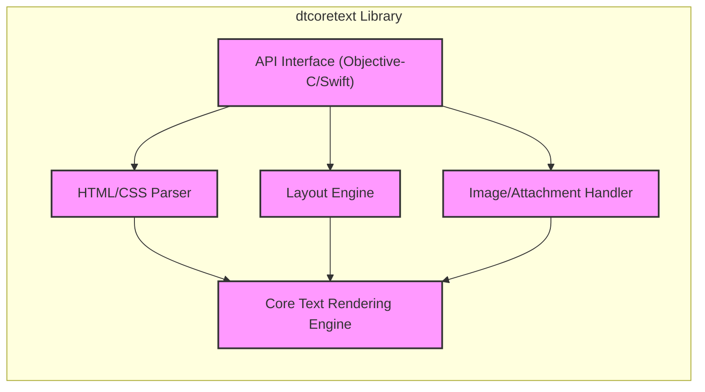

# BUSINESS POSTURE

This project, dtcoretext, is an open-source library for rendering rich text with HTML-like attributes and CSS styling on iOS and macOS.

- Business priorities:
  - Provide developers with a robust and flexible solution for displaying styled text in their applications.
  - Offer an alternative to platform-native text rendering that might be limited in features or customization.
  - Maintain compatibility and performance across different iOS and macOS versions.
  - Foster a community around the library for contributions and improvements.

- Business goals:
  - Increase adoption of dtcoretext among iOS and macOS developers.
  - Expand the library's features and capabilities to meet evolving developer needs.
  - Ensure the library remains a reliable and performant solution for rich text rendering.
  - Attract contributions and maintain active community engagement.

- Business risks:
  - Security vulnerabilities in the text rendering logic could lead to application crashes or unexpected behavior.
  - Performance issues could negatively impact user experience in applications using dtcoretext.
  - Lack of maintenance or community support could lead to the library becoming outdated or unusable.
  - Compatibility issues with new OS versions could break existing integrations.

# SECURITY POSTURE

- Security controls:
  - security control: Code review process for contributions (described in GitHub repository contribution guidelines).
  - security control: Static code analysis tools might be used by developers locally (not explicitly mentioned, but a common practice).
  - security control: Dependency management using tools like CocoaPods or Swift Package Manager (implicitly used for library integration).

- Accepted risks:
  - accepted risk: Open-source nature implies public code visibility, potentially exposing vulnerabilities if discovered.
  - accepted risk: Reliance on community contributions introduces a risk of malicious or poorly vetted code being merged.
  - accepted risk: No dedicated security team continuously monitoring the project for vulnerabilities.

- Recommended security controls:
  - security control: Implement automated static application security testing (SAST) in the CI/CD pipeline to detect potential vulnerabilities in code changes.
  - security control: Introduce dependency vulnerability scanning to identify and address known vulnerabilities in third-party libraries.
  - security control: Establish a process for reporting and handling security vulnerabilities, including a security policy and contact information.
  - security control: Consider code signing build artifacts to ensure integrity and authenticity of the library.

- Security requirements:
  - Authentication: Not applicable as dtcoretext is a library and does not handle user authentication directly. Applications using dtcoretext will manage authentication.
  - Authorization: Not applicable as dtcoretext is a library and does not handle user authorization directly. Applications using dtcoretext will manage authorization.
  - Input validation:
    - Requirement: Robust input validation is crucial to prevent vulnerabilities like cross-site scripting (XSS) if user-provided content is rendered.
    - Requirement: Validate HTML-like attributes and CSS styles to prevent unexpected behavior or security issues.
    - Requirement: Handle potentially malicious or malformed input gracefully without crashing or exposing sensitive information.
  - Cryptography: Not a primary requirement for dtcoretext as it is a text rendering library. Cryptography might be relevant if the library were to handle encrypted text, which is not its core function. However, applications using dtcoretext might need to handle encrypted data before rendering.

# DESIGN

## C4 CONTEXT

```mermaid
flowchart LR
    subgraph "Application Developer"
        A[Application Developer]
    end
    subgraph "iOS/macOS Application"
        B[iOS/macOS Application]
    end
    subgraph "dtcoretext Library"
        C["dtcoretext Library"]
    end
    subgraph "Operating System (iOS/macOS)"
        D[Operating System (iOS/macOS)]
    end
    A -->|Integrates| C
    C -->|Renders Text| B
    B -->|Uses OS APIs| D
    style C fill:#f9f,stroke:#333,stroke-width:2px
```

- Elements of context diagram:
  - - Name: Application Developer
    - Type: Person
    - Description: Developers who build iOS and macOS applications and want to display rich text content.
    - Responsibilities: Integrate dtcoretext library into their applications, provide text content and styling information.
    - Security controls: Responsible for securely using dtcoretext API and handling any sensitive data before rendering.
  - - Name: iOS/macOS Application
    - Type: Software System
    - Description: Applications built for iOS and macOS platforms that utilize dtcoretext to render rich text.
    - Responsibilities: Display rich text content to end-users, manage application lifecycle and user interactions.
    - Security controls: Application-level security controls, including input validation, data handling, and secure communication, are the responsibility of the application developer.
  - - Name: dtcoretext Library
    - Type: Software System
    - Description: Open-source library providing rich text rendering capabilities for iOS and macOS applications.
    - Responsibilities: Parse and render HTML-like text with CSS styling, provide API for application developers to integrate and customize text rendering.
    - Security controls: Input validation within the library to handle potentially malicious or malformed text input, memory safety to prevent crashes or vulnerabilities.
  - - Name: Operating System (iOS/macOS)
    - Type: Software System
    - Description: Underlying operating systems providing core functionalities for applications and libraries.
    - Responsibilities: Provide APIs for rendering, memory management, and other system-level services.
    - Security controls: OS-level security controls, including sandboxing, memory protection, and permission management.

## C4 CONTAINER



- Elements of container diagram:
  - - Name: Core Text Rendering Engine
    - Type: Container - Library Module
    - Description: The core module responsible for the actual text rendering using Core Text framework on iOS/macOS.
    - Responsibilities: Handles text layout, font rendering, and drawing operations.
    - Security controls: Memory safety checks, input validation of internal data structures, protection against buffer overflows.
  - - Name: HTML/CSS Parser
    - Type: Container - Library Module
    - Description: Parses HTML-like tags and CSS styles to interpret rich text formatting.
    - Responsibilities: Converts HTML/CSS input into a format understandable by the rendering engine.
    - Security controls: Input validation to prevent injection attacks, sanitization of HTML/CSS input, handling of malformed or malicious HTML/CSS.
  - - Name: Layout Engine
    - Type: Container - Library Module
    - Description: Calculates the layout of text elements based on styles and constraints.
    - Responsibilities: Determines line breaks, text alignment, and element positioning.
    - Security controls: Protection against layout-related vulnerabilities, resource management to prevent denial-of-service through excessive layout calculations.
  - - Name: Image/Attachment Handler
    - Type: Container - Library Module
    - Description: Manages images and other attachments embedded in the rich text.
    - Responsibilities: Loads and displays images, handles different attachment types.
    - Security controls: Secure handling of image data, validation of image formats to prevent image-based vulnerabilities, protection against path traversal if loading local resources.
  - - Name: API Interface (Objective-C/Swift)
    - Type: Container - Library Module
    - Description: Provides the public API for application developers to interact with dtcoretext.
    - Responsibilities: Exposes methods for setting text content, styling, and rendering.
    - Security controls: API design to encourage secure usage, input validation at the API boundary, clear documentation on secure usage practices.

## DEPLOYMENT

dtcoretext is a library, so it is not deployed as a standalone application. It is integrated into iOS and macOS applications during their development and build process. The deployment context is therefore the deployment of applications that *use* dtcoretext.

Deployment Architecture: Application Store Distribution

```mermaid
flowchart LR
    subgraph "Developer Environment"
        A[Developer Machine]
        B[Code Repository (GitHub)]
    end
    subgraph "Build & Distribution Pipeline"
        C[CI/CD System]
        D[Apple App Store Connect]
        E[Apple App Store]
    end
    subgraph "End-User Device (iOS/macOS)"
        F[User Device]
        G[Installed Application]
    end
    A --> B
    B --> C
    C --> D
    D --> E
    E --> F
    F --> G
    G -->|Uses dtcoretext| G
    style G fill:#f9f,stroke:#333,stroke-width:2px
```

- Elements of deployment diagram:
  - - Name: Developer Machine
    - Type: Infrastructure - Workstation
    - Description: Developer's local machine where code is written and tested.
    - Responsibilities: Code development, local testing, committing code changes.
    - Security controls: Developer workstation security practices, including OS security, endpoint protection, and secure development tools.
  - - Name: Code Repository (GitHub)
    - Type: Infrastructure - Cloud Service
    - Description: GitHub repository hosting the dtcoretext source code and application code.
    - Responsibilities: Version control, code collaboration, issue tracking.
    - Security controls: GitHub's security controls, including access control, authentication, and audit logging.
  - - Name: CI/CD System
    - Type: Infrastructure - Cloud Service/Self-hosted
    - Description: Automated system for building, testing, and deploying applications. (e.g., GitHub Actions, Jenkins).
    - Responsibilities: Automated build process, running tests, packaging application, and deploying to distribution platforms.
    - Security controls: Secure CI/CD pipeline configuration, access control to pipeline resources, secrets management for credentials, security scanning integration.
  - - Name: Apple App Store Connect
    - Type: Infrastructure - Cloud Service
    - Description: Apple's platform for managing and submitting applications to the App Store.
    - Responsibilities: Application submission, metadata management, app review process.
    - Security controls: Apple's platform security controls, including developer account security, app review process, and code signing requirements.
  - - Name: Apple App Store
    - Type: Infrastructure - Cloud Service
    - Description: Apple's marketplace for distributing iOS and macOS applications to end-users.
    - Responsibilities: Application distribution, user download and installation.
    - Security controls: Apple's App Store security measures, including app vetting, malware scanning, and user reviews.
  - - Name: User Device (iOS/macOS)
    - Type: Infrastructure - End-user Device
    - Description: End-user's iPhone, iPad, or Mac device.
    - Responsibilities: Running installed applications, user data storage, and interaction.
    - Security controls: Device-level security controls, including OS security, sandboxing, and user permissions.
  - - Name: Installed Application
    - Type: Software System - Application Instance
    - Description: Instance of the application using dtcoretext, installed on the user's device.
    - Responsibilities: Providing application functionality to the end-user, rendering rich text using dtcoretext.
    - Security controls: Application-level security controls, including secure data handling, input validation, and secure communication.

## BUILD

```mermaid
flowchart LR
    subgraph "Developer"
        A[Developer Machine]
    end
    subgraph "Code Repository (GitHub)"
        B[Source Code]
    end
    subgraph "CI/CD System (GitHub Actions)"
        C[Build Automation]
        D[Static Analysis (SAST)]
        E[Dependency Scan]
        F[Unit Tests]
        G[Build Artifacts]
    end
    subgraph "Artifact Repository (GitHub Releases)"
        H[Release Artifacts]
    end
    A --> B
    B --> C
    C --> D
    C --> E
    C --> F
    D --> C
    E --> C
    F --> C
    C --> G
    G --> H
    style G fill:#f9f,stroke:#333,stroke-width:2px
    style H fill:#f9f,stroke:#333,stroke-width:2px
```

- Elements of build diagram:
  - - Name: Developer Machine
    - Type: Environment
    - Description: Developer's local machine where code changes are made.
    - Responsibilities: Writing code, running local builds and tests, committing changes.
    - Security controls: Local security practices, code review before commit, developer training on secure coding.
  - - Name: Source Code
    - Type: Artifact - Code
    - Description: Source code of dtcoretext stored in GitHub repository.
    - Responsibilities: Storing source code, version control, managing code history.
    - Security controls: Access control to repository, branch protection, commit signing.
  - - Name: Build Automation
    - Type: Process - CI/CD
    - Description: Automated build process managed by CI/CD system (e.g., GitHub Actions).
    - Responsibilities: Compiling code, running tests, creating build artifacts, publishing releases.
    - Security controls: Secure CI/CD configuration, access control to CI/CD system, secrets management, build environment isolation.
  - - Name: Static Analysis (SAST)
    - Type: Process - Security Check
    - Description: Automated static application security testing tools integrated into the build pipeline.
    - Responsibilities: Scanning code for potential vulnerabilities, reporting findings.
    - Security controls: SAST tool configuration, vulnerability reporting and tracking.
  - - Name: Dependency Scan
    - Type: Process - Security Check
    - Description: Automated scanning of project dependencies for known vulnerabilities.
    - Responsibilities: Identifying vulnerable dependencies, reporting findings.
    - Security controls: Dependency scanning tool configuration, vulnerability database updates, remediation process.
  - - Name: Unit Tests
    - Type: Process - Quality Assurance
    - Description: Automated unit tests to verify code functionality.
    - Responsibilities: Ensuring code quality, detecting regressions.
    - Security controls: Test coverage for security-relevant code paths, secure test data management.
  - - Name: Build Artifacts
    - Type: Artifact - Binary/Library
    - Description: Compiled library files (e.g., frameworks, static libraries).
    - Responsibilities: Packaging compiled code, making artifacts available for distribution.
    - Security controls: Code signing of artifacts, integrity checks, secure storage of artifacts.
  - - Name: Release Artifacts
    - Type: Artifact - Release
    - Description: Published releases of dtcoretext library on GitHub Releases or package managers.
    - Responsibilities: Distributing library to developers, version management.
    - Security controls: Secure release process, integrity verification for downloaded artifacts.

# RISK ASSESSMENT

- Critical business process:
  - Providing reliable and secure rich text rendering functionality to application developers.
  - Maintaining the integrity and availability of the dtcoretext library.

- Data we are trying to protect:
  - Source code of dtcoretext: Sensitivity - High (Confidentiality, Integrity, Availability). Exposure could lead to intellectual property theft or supply chain attacks.
  - Build artifacts (compiled library): Sensitivity - Medium (Integrity, Availability). Compromised artifacts could lead to malicious applications using a vulnerable library.
  - User data processed by applications using dtcoretext: Sensitivity - Variable (Confidentiality, Integrity, Availability). Depends on the application and the type of text content being rendered. dtcoretext itself does not store user data, but applications using it might process sensitive information.

# QUESTIONS & ASSUMPTIONS

- BUSINESS POSTURE:
  - Question: What is the target audience for dtcoretext? Is it primarily for open-source projects or also used in commercial applications?
  - Assumption: The primary goal is to provide a useful and reliable open-source library for the iOS/macOS development community.

- SECURITY POSTURE:
  - Question: Are there any existing security policies or guidelines for contributing to dtcoretext?
  - Assumption: Current security practices rely mainly on code review and general open-source community vigilance.
  - Question: Are there any known past security vulnerabilities in dtcoretext?
  - Assumption:  Assuming no major publicly disclosed vulnerabilities, but standard security considerations for text rendering libraries apply.

- DESIGN:
  - Question: What are the performance considerations for dtcoretext? Are there any specific areas where performance is critical?
  - Assumption: Performance is important for smooth user experience in applications using dtcoretext.
  - Question: What is the intended level of customization and extensibility for dtcoretext?
  - Assumption: The library is designed to be reasonably customizable through styling and API options.
  - Question: What are the supported HTML/CSS features and limitations of the parser?
  - Assumption: The parser supports a subset of HTML/CSS relevant for rich text rendering, and limitations should be documented.