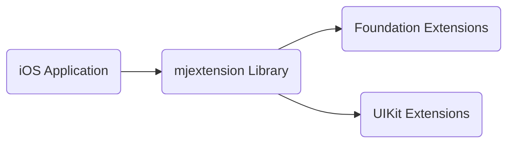
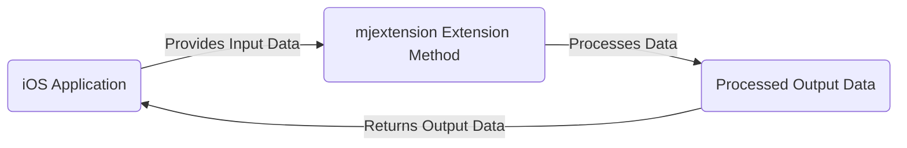

# Project Design Document: mjextension

**Version:** 1.1
**Date:** October 26, 2023
**Authors:** [Your Name/Organization]

## 1. Introduction

This document provides a detailed design overview of the `mjextension` project, a collection of extensions for Foundation and UIKit classes in Swift. This document is specifically crafted to serve as a foundation for subsequent threat modeling activities, enabling the identification of potential security vulnerabilities and the design of appropriate mitigations. The project's core aim is to offer convenient, well-tested helper methods and functionalities that enhance the development experience for iOS applications.

## 2. Goals and Objectives

* **Primary Goal:** To provide a curated set of useful and thoroughly tested extensions for common tasks encountered in iOS development.
* **Objectives:**
    * Extend the functionality of standard Swift classes without altering their fundamental behavior.
    * Provide implementations that are clear, concise, and promote improved code readability within consuming applications.
    * Offer a diverse range of extensions covering various facets of iOS development, including string manipulation, date handling, and view layout adjustments.
    * Maintain a high standard of code quality, ensuring proper documentation and adherence to best practices.

## 3. Scope

This design document encompasses the entire codebase of the `mjextension` project as it exists within the provided GitHub repository. This includes all Swift files containing extension implementations for both Foundation and UIKit classes.

* **In Scope:**
    * All Swift source code files within the repository.
    * The organizational structure and categorization of the extensions.
    * The specific functionality provided by each individual extension.
    * Any direct dependencies of the library (though these are expected to be minimal).

* **Out of Scope:**
    * The specific iOS applications that integrate and utilize this library.
    * The underlying operating system versions or hardware platforms on which the library is executed.
    * The software development environment used to build and test the library.
    * Detailed performance benchmarks or optimization strategies for the extensions.

## 4. High-Level Architecture

The `mjextension` project is architected as a library that augments the capabilities of existing Swift classes through extensions. It does not follow a traditional client-server model but is directly integrated into the consuming iOS application.

* **"iOS Application"**: The application that integrates and utilizes the functionalities provided by the `mjextension` library.
* **"mjextension Library"**: The central component of the project, housing all the implemented extension methods.
* **"Foundation Extensions"**:  A collection of extensions targeting classes within the Foundation framework (e.g., `String`, `Date`, `Array`, `URL`).
* **"UIKit Extensions"**: A collection of extensions targeting classes within the UIKit framework (e.g., `UIView`, `UIViewController`, `UIImage`, `UILabel`).

## 5. Detailed Design

The library is logically segmented into different Swift files, with each file typically containing extensions for a specific class or a group of semantically related classes.

* **Foundation Extensions:**
    * **String Extensions (`String+Extensions.swift`):**
        * Methods for common string manipulations like `trimmingWhitespace()`, `isEmptyOrWhitespace()`.
        * Functions for URL encoding and decoding.
        * Methods for checking string containment or prefixes/suffixes.
    * **Date Extensions (`Date+Extensions.swift`):**
        * Utility methods for formatting dates into various string representations.
        * Functions for calculating the interval between two dates.
        * Methods for adding or subtracting time components from a date.
    * **Array Extensions (`Array+Extensions.swift`):**
        * A method for safe subscripting to prevent out-of-bounds errors.
        * Functions for checking if an array contains a specific element.
        * Methods for removing duplicate elements from an array.
    * **Data Extensions (`Data+Extensions.swift`):**
        * Extensions for converting `Data` to `String` with specific encodings.
        * Methods for getting a hexadecimal representation of the data.
    * **Number Extensions (`Number+Extensions.swift`):**
        * Extensions for formatting numbers into currency or percentage strings.
        * Methods for checking if a number is within a specific range.

* **UIKit Extensions:**
    * **UIView Extensions (`UIView+Extensions.swift`):**
        * Convenience methods for setting view frame, bounds, and center properties.
        * Functionality for easily adding multiple subviews at once.
        * Methods for applying corner radius or border to a view.
    * **UIViewController Extensions (`UIViewController+Extensions.swift`):**
        * Helper methods for presenting and dismissing view controllers with animations.
        * Methods for accessing the currently visible view controller.
    * **UIImage Extensions (`UIImage+Extensions.swift`):**
        * Extensions for resizing images to specific dimensions.
        * Methods for tinting an image with a given color.
        * Functionality for creating a solid color image.
    * **UICollectionView/UITableView Extensions (`CollectionView+Extensions.swift`, `TableView+Extensions.swift`):**
        * Helpers for registering and dequeuing reusable cells using generics.
        * Methods for reloading data with animations.

## 6. Data Flow

The `mjextension` library operates primarily on data provided by the integrating iOS application. The extensions accept input data, perform specific operations on it, and then return the processed data. The library itself does not involve any persistent storage or interaction with external data sources.

* **"iOS Application"**: Initiates the use of an extension method by calling it with the necessary input data.
* **"mjextension Extension Method"**: A specific function defined within one of the library's extension files.
* **"Processed Output Data"**: The result of the operation performed by the extension method on the input data.

**Illustrative Data Flow Examples:**

* **String Extension Example:**
    1. An "iOS Application" has a string containing leading and trailing whitespace.
    2. It calls the `trimmingWhitespace()` extension method on this "String" object.
    3. The `trimmingWhitespace()` method processes the string by removing the whitespace.
    4. The "Processed Output Data" (the trimmed string) is returned to the "iOS Application".

* **UIView Extension Example:**
    1. An "iOS Application" needs to set the corner radius of a "UIView".
    2. It calls an extension method like `cornerRadius(_:)` on the "UIView" object, providing the desired radius value.
    3. The extension method modifies the view's layer to apply the corner radius.
    4. The "Processed Output Data" is the modified "UIView" object itself, now visually updated within the application.

## 7. Security Considerations (Focused on Threat Modeling)

Given its nature as a library integrated directly into an application, the primary security considerations for `mjextension` center around how its extensions handle data and the potential for unexpected or insecure behavior.

* **Input Validation and Data Sanitization:** While the responsibility largely lies with the consuming application, potential vulnerabilities could arise if extensions operate on unsanitized data. For example:
    * **String Extensions:** Extensions handling user-provided strings (e.g., for URL encoding) could be susceptible to issues if the input string contains malicious characters. Threat modeling should consider scenarios where an application might inadvertently pass untrusted data to these extensions.
    * **Data Extensions:** Extensions converting `Data` to `String` with specific encodings might misinterpret byte sequences if the encoding is not correctly handled, potentially leading to information disclosure or unexpected behavior.

* **Data Sensitivity and Handling:** Extensions might inadvertently operate on sensitive data depending on the application's context. Threat modeling should explore scenarios where:
    * **String Extensions:** Extensions might be used to manipulate sensitive information like API keys or user credentials. The design should ensure these extensions don't introduce vulnerabilities like logging sensitive data or insecure storage.
    * **Date Extensions:** While seemingly benign, incorrect handling of time zones or date formats could lead to inconsistencies or vulnerabilities in applications dealing with time-sensitive data.

* **Code Injection (Low Likelihood, but Consider Indirect Risks):** Direct code injection within the extensions is unlikely due to the use of standard Swift features. However, threat modeling should consider indirect risks:
    * If extensions were to dynamically construct or execute code (which is not the intended use), this would introduce a significant vulnerability. The current design does not suggest this, but it's worth noting for future considerations.

* **Denial of Service (Primarily Through Inefficient Algorithms):** While less likely, inefficiently implemented extensions could theoretically lead to performance issues or resource exhaustion. Threat modeling should consider:
    * **Array Extensions:**  Extensions performing complex operations on large arrays might introduce performance bottlenecks if not implemented efficiently.
    * **Image Extensions:**  Image resizing or manipulation extensions, if not optimized, could consume excessive memory or CPU, potentially leading to a denial of service.

* **Dependency Vulnerabilities (Focus on Transitive Dependencies):** While `mjextension` aims for minimal dependencies, any external libraries it might include (or that its dependencies might include transitively) could introduce vulnerabilities. Threat modeling should include:
    * Regularly reviewing the `Package.swift` or `Podfile.lock` to identify and assess the security of all direct and transitive dependencies.

* **Information Disclosure (Through Logging or Error Handling):** Threat modeling should consider if extensions inadvertently expose sensitive information through:
    * Excessive logging of data being processed.
    * Detailed error messages that might reveal internal implementation details or sensitive data paths.

## 8. Dependencies

The `mjextension` library's primary dependencies are the standard iOS SDK frameworks. Reviewing the project's manifest file (e.g., `Package.swift` for Swift Package Manager) will provide a definitive list.

* **Foundation:** Provides fundamental data types, collections, and operating system services.
* **UIKit:** Provides the necessary classes for building user interfaces and handling user interactions on iOS.

Any external dependencies beyond these standard frameworks would need careful security evaluation during threat modeling.

## 9. Deployment Considerations

The `mjextension` library is intended to be integrated into an iOS application during the development process. Common deployment methods include:

* **Swift Package Manager (SPM):** Declaring `mjextension` as a dependency in the application's `Package.swift` file.
* **CocoaPods:** Specifying `mjextension` in the application's `Podfile`.
* **Manual Integration:** Copying the source files directly into the application's Xcode project.

The deployment method itself doesn't inherently introduce security vulnerabilities to the library, but the security of the dependency management process and the integrity of the source code are important considerations.

## 10. Future Considerations (Security Implications)

Potential future enhancements or modifications to the `mjextension` library could introduce new security considerations:

* **Introduction of Extensions Interacting with External Services:** If future extensions involve network requests or interactions with external APIs, this would introduce significant new attack vectors related to authentication, authorization, data transmission security (e.g., TLS/SSL), and API security best practices.
* **More Complex Data Processing or Transformations:** As extensions become more sophisticated and perform more complex data manipulations, the risk of vulnerabilities related to input validation, buffer overflows (though less common in Swift), and incorrect data handling increases.
* **Adoption of New External Dependencies:**  Any new external libraries introduced as dependencies would need thorough security vetting to assess their potential vulnerabilities and ensure they align with the project's security posture.

This detailed design document provides a robust foundation for conducting a thorough threat model of the `mjextension` project. By understanding the architecture, data flow, and potential security considerations outlined here, developers and security professionals can effectively identify and mitigate potential risks.