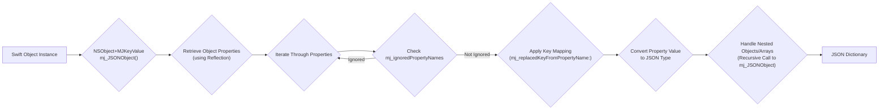
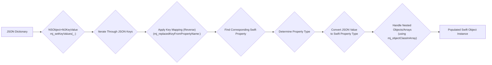

# Project Design Document: mjextension

**Version:** 1.1
**Date:** October 26, 2023
**Author:** AI Software Architect

## 1. Introduction

This document provides an enhanced design overview of the `mjextension` project, a Swift library available on GitHub at [https://github.com/codermjlee/mjextension](https://github.com/codermjlee/mjextension). This revised document aims for greater clarity and detail regarding the project's architecture, components, and data flow, specifically to facilitate comprehensive threat modeling activities.

## 2. Project Overview

`mjextension` is a Swift library designed to simplify the conversion between Swift objects and JSON data. It offers extensions to core Foundation classes like `NSObject`, `NSArray`, and `NSDictionary`, streamlining the serialization of Swift objects into JSON and the deserialization of JSON into Swift objects. The library handles common complexities such as mapping JSON keys to Swift property names and performing basic type conversions.

## 3. Goals

*   To offer a straightforward and efficient mechanism for serializing Swift objects into JSON format.
*   To provide a simple and efficient way to deserialize JSON data into instances of Swift objects.
*   To enable developers to define custom mappings between JSON keys and corresponding Swift property names.
*   To seamlessly handle nested object structures and arrays during the conversion process.
*   To provide flexibility in adapting to various JSON structures encountered in real-world applications.
*   To significantly reduce the amount of repetitive code typically required for JSON serialization and deserialization tasks.

## 4. Non-Goals

*   Implementing network communication functionalities. `mjextension`'s sole purpose is data transformation between Swift objects and JSON.
*   Serving as a complete Object-Relational Mapper (ORM) solution.
*   Supporting data formats other than JSON, such as XML or Protocol Buffers.
*   Providing user interface (UI) elements or UI frameworks.
*   Performing advanced data validation beyond the basic type conversions necessary for serialization and deserialization.

## 5. Architecture and Components

The `mjextension` library's architecture is centered around extending existing Foundation classes to add JSON conversion capabilities. Key components include:

*   **`NSObject+MJKeyValue` Extension:** This is the core of the library, providing the primary functionality for converting `NSObject` subclasses to and from JSON representations.
    *   Key methods include:
        *   `mj_JSONObject`:  Converts an `NSObject` instance into a JSON dictionary (`[String: Any]`).
        *   `mj_setKeyValues:`: Populates the properties of an `NSObject` instance from a JSON dictionary.
        *   `mj_ignoredPropertyNames`: Allows specifying an array of property names to be ignored during conversion.
        *   `mj_replacedKeyFromPropertyName:`: Enables defining custom mappings between Swift property names and their corresponding JSON keys. This can be implemented as a method that returns the JSON key for a given property name.
        *   `mj_objectClassInArray`:  Used when deserializing arrays, this method allows specifying the class of the objects contained within the array for a given property.

*   **`NSArray+MJKeyValue` Extension:** This extension focuses on handling arrays of objects during JSON conversion.
    *   Key methods include:
        *   `mj_JSONObject`: Converts an array of `NSObject` instances into an array of JSON dictionaries.
        *   `mj_objectArrayWithKeyValuesArray:`: Creates an array of `NSObject` instances from an array of JSON dictionaries.

*   **`NSDictionary+MJKeyValue` Extension:** This extension provides a convenient way to create `NSObject` instances directly from dictionaries.
    *   Key methods include:
        *   `mj_objectWithKeyValues:`: Creates and returns an instance of an `NSObject` subclass populated with data from a given dictionary.

*   **Internal Logic and Helpers:**  The library likely employs internal helper functions and logic to manage the intricacies of the conversion process:
    *   **Recursive Processing:**  Handles nested objects and arrays by recursively applying the conversion logic.
    *   **Type Conversion:**  Manages the conversion between JSON data types (string, number, boolean, null, array, object) and their corresponding Swift types (String, Int, Double, Bool, nil, Array, custom objects). This might involve handling optional types and potential conversion failures.
    *   **Key Mapping Application:**  Implements the logic for applying the custom key mappings defined by `mj_replacedKeyFromPropertyName:`.
    *   **Property Discovery:** Uses Swift's runtime capabilities (reflection) to discover the properties of `NSObject` subclasses.

## 6. Data Flow

The data flow within `mjextension` centers around the transformation of data between its JSON representation and its Swift object form.

### 6.1. Serialization (Swift Object to JSON)

**Process:**

1. An instance of a Swift object (inheriting from `NSObject`) is the starting point.
2. The `mj_JSONObject()` method within the `NSObject+MJKeyValue` extension is invoked.
3. The method uses Swift's reflection capabilities to access the object's properties.
4. The process iterates through each discovered property.
5. For each property, it checks if the property name is listed in `mj_ignoredPropertyNames`.
6. If the property is not ignored, the `mj_replacedKeyFromPropertyName:` method is called (if implemented) to determine the corresponding JSON key.
7. The property's value is then converted to its appropriate JSON representation (e.g., Swift `String` to JSON string, Swift `Int` to JSON number).
8. If a property is another `NSObject` subclass or an array of such objects, the `mj_JSONObject()` method is called recursively to handle the nested structure.
9. The final output is a JSON dictionary (`[String: Any]`) representing the Swift object.

### 6.2. Deserialization (JSON to Swift Object)

**Process:**

1. A JSON dictionary (`[String: Any]`) is provided as input.
2. The `mj_setKeyValues(_:)` method within the `NSObject+MJKeyValue` extension is called on an instance of the target Swift object class.
3. The method iterates through the keys present in the JSON dictionary.
4. For each JSON key, the `mj_replacedKeyFromPropertyName:` method is used (in reverse, to map the JSON key back to the Swift property name).
5. The corresponding Swift property in the object is identified.
6. The type of the Swift property is determined.
7. The JSON value associated with the key is converted to the Swift property's type. This might involve creating new instances of other `NSObject` subclasses or arrays based on information provided by `mj_objectClassInArray`.
8. If a JSON value is a dictionary or an array of dictionaries, the deserialization process is applied recursively to create the nested object structure.
9. The properties of the Swift object instance are populated with the converted values from the JSON.

### 6.3. Array Deserialization

Similar data flows apply to the `NSArray+MJKeyValue` extension, where the process iterates through the elements of the JSON array, and for each element (which is typically a dictionary), the object deserialization process described above is applied, potentially using `mj_objectClassInArray` to determine the type of objects within the array.

## 7. Security Considerations (For Threat Modeling)

This section expands on potential security considerations relevant for threat modeling, categorized for clarity.

*   **Malicious JSON Input:**
    *   **Denial of Service (DoS):**
        *   **Large Payloads:** Extremely large JSON payloads could exhaust memory resources or processing time, leading to application crashes or unresponsiveness.
        *   **Deeply Nested Structures:**  Excessively nested JSON objects or arrays can cause stack overflow errors or significant performance degradation during parsing and object creation.
    *   **Type Confusion/Coercion Issues:**
        *   Providing JSON values with unexpected types (e.g., a string where an integer is expected) could lead to runtime errors or unexpected behavior if type conversion is not handled strictly and securely.
        *   Implicit type coercion by the library could introduce vulnerabilities if not carefully managed.
    *   **Property Overwriting/Injection:**
        *   Malicious JSON could attempt to overwrite critical properties of Swift objects, potentially leading to unexpected application states or security breaches.
        *   Although `mjextension` primarily maps to existing properties, understanding how it handles extra or unexpected keys is important. Does it silently ignore them, or could this be exploited?

*   **Information Disclosure:**
    *   **Over-serialization of Sensitive Data:** If the `mj_JSONObject` method is used without careful consideration, it might inadvertently serialize sensitive information that should not be exposed. Developers need to use `mj_ignoredPropertyNames` effectively.
    *   **Verbose Error Messages:** While not directly a vulnerability in `mjextension` itself, overly detailed error messages during deserialization (if exposed to users or logs) could reveal information about the application's internal structure or data model.

*   **Dependency Chain Vulnerabilities:**
    *   While `mjextension` has minimal direct dependencies, vulnerabilities in the underlying Swift runtime or the Foundation framework could indirectly impact its security.

*   **Key Mapping Vulnerabilities:**
    *   **Incorrect or Inconsistent Mappings:** Errors in defining key mappings could lead to data being incorrectly mapped to properties, potentially causing logical flaws or security issues if sensitive data is misplaced.
    *   **Dynamic Key Mapping Issues:** If key mapping logic involves dynamic decisions based on input data, this could introduce vulnerabilities if the input data is malicious.

*   **Code Injection (Low Probability but Consider):**
    *   While highly unlikely given the library's focus on data transformation, it's worth briefly considering if there are any unforeseen scenarios where processing malicious JSON could lead to code execution (e.g., through vulnerabilities in Swift's reflection mechanism or unsafe type casting, though this is not a known risk with `mjextension`).

These considerations align with common threat modeling frameworks like STRIDE (Spoofing, Tampering, Repudiation, Information Disclosure, Denial of Service, Elevation of Privilege). Understanding these potential threats is crucial for developers using `mjextension` to implement appropriate safeguards in their applications.

## 8. Deployment Model

`mjextension` is designed as a client-side library, typically integrated directly into applications built for Apple platforms (iOS, macOS, tvOS, watchOS). It is incorporated into projects using dependency management tools such as:

*   Swift Package Manager
*   CocoaPods
*   Carthage

The library is embedded within the application's binary and operates within the application's process. It does not involve server-side deployment.

## 9. Technologies Used

*   **Swift:** The primary programming language in which `mjextension` is written.
*   **Foundation Framework:**  Provides the fundamental classes and data types that `mjextension` extends and relies upon.

## 10. Future Considerations (Beyond Immediate Threat Modeling)

*   Performance enhancements for handling extremely large and complex JSON structures.
*   More granular control over the serialization and deserialization process.
*   Enhanced error handling mechanisms, potentially providing more specific error information.
*   Support for custom data formatting options (e.g., handling different date formats).
*   Integration with data validation libraries to provide more robust data integrity checks.

This improved design document offers a more detailed and nuanced understanding of the `mjextension` project, providing a solid foundation for conducting thorough threat modeling activities. The enhanced descriptions of components, data flows, and security considerations aim to facilitate the identification of potential vulnerabilities and the development of effective mitigation strategies.