# BUSINESS POSTURE

- Business priorities and goals:
 - The project 'mjextension' is an Objective-C library designed to simplify the process of converting JSON data to Objective-C models and vice versa.
 - The primary business goal for a company using 'mjextension' would be to increase developer productivity by automating and streamlining data handling tasks in iOS and macOS application development.
 - This can lead to faster development cycles, reduced code complexity, and easier maintenance of applications that rely on JSON data.
 - By simplifying data mapping, 'mjextension' can also contribute to improved data consistency and reduced errors in data processing within applications.

- Most important business risks:
 - Dependency risk: Reliance on an external, open-source library introduces a dependency risk. If the library is not actively maintained, contains bugs, or introduces security vulnerabilities, it can negatively impact applications that depend on it.
 - Compatibility risk: Changes in the library or in the JSON data structures it processes could lead to compatibility issues, requiring application updates and potentially causing downtime.
 - Performance risk: Inefficient data conversion or memory leaks within the library could negatively impact the performance and stability of applications using 'mjextension'.
 - Security vulnerability risk: Security flaws in 'mjextension' could be exploited to compromise applications that use it, potentially leading to data breaches or other security incidents.
 - Data integrity risk: Incorrect data mapping or conversion by the library could lead to data corruption or inconsistencies within applications.

# SECURITY POSTURE

- Security controls:
 - security control: Source code is hosted on GitHub, providing version control and transparency. (Implemented: GitHub repository)
 - security control: The project is open-source, allowing for community review and potential security audits. (Implemented: Open-source nature)
 - security control: Basic unit tests are present in the repository, which can help catch some functional bugs, indirectly contributing to data integrity. (Implemented: `MJExtensionTests` directory)

- Accepted risks:
 - accepted risk: Reliance on community contributions for security updates and vulnerability patching. Response time to security issues may vary.
 - accepted risk: No formal security audit has been conducted on the library. Potential vulnerabilities may exist.
 - accepted risk: Limited security testing is evident in the provided repository. Deeper security analysis might be needed depending on the sensitivity of the data being processed in applications using this library.
 - accepted risk: Supply chain risk associated with using an external dependency. The library's dependencies are managed by CocoaPods, Carthage, or Swift Package Manager, which themselves introduce supply chain considerations.

- Recommended security controls:
 - security control: Implement automated dependency scanning to identify known vulnerabilities in the library's dependencies.
 - security control: Integrate static application security testing (SAST) tools into the development workflow to automatically scan the library's code for potential security flaws.
 - security control: Establish a process for monitoring security advisories related to Objective-C and JSON processing libraries and frameworks.
 - security control: Encourage and facilitate community security contributions by providing clear guidelines for reporting vulnerabilities and contributing security patches.
 - security control: If the library is used in applications handling sensitive data, consider performing a formal security audit or penetration testing of applications that utilize 'mjextension'.

- Security requirements:
 - Authentication: Not directly applicable to a library. Authentication is relevant for systems that *use* the library, but not the library itself.
 - Authorization: Not directly applicable to a library. Authorization is relevant for systems that *use* the library, but not the library itself.
 - Input validation:
  - security requirement: The library must robustly handle invalid or malformed JSON input to prevent crashes, unexpected behavior, or potential vulnerabilities like denial-of-service.
  - security requirement: Input validation should be performed on JSON data to ensure it conforms to expected schemas and data types before attempting to map it to Objective-C models.
 - Cryptography:
  - security requirement: If the library is intended to handle or process sensitive data that requires encryption, it should either integrate with established cryptographic libraries securely or clearly document that it is not designed for handling encrypted data and should not be used in such contexts without additional security measures in the consuming application. For a data mapping library, cryptography is likely handled at the application level, not within the library itself.

# DESIGN

## C4 CONTEXT

```mermaid
flowchart LR
    subgraph "Company Context"
    A["Mobile Application User"]:::person
    B["Backend System"]:::system
    end
    C["mjextension Library"]:::software_system
    D["Application Developer"]:::person

    A -->> C: Uses JSON data in Application
    B -->> C: Provides JSON data
    D -->> C: Integrates and uses Library
    C -->> D: Provides JSON Mapping Functionality

    classDef person fill:#AFEEEE,stroke:#333,stroke-width:2px
    classDef software_system fill:#ADD8E6,stroke:#333,stroke-width:2px
    classDef system fill:#D3D3D3,stroke:#333,stroke-width:2px
```

- Context Diagram Elements:
 - - Name: Mobile Application User
   - Type: Person
   - Description: End-users who interact with mobile applications that utilize 'mjextension' for data handling.
   - Responsibilities: Uses mobile applications to access data.
   - Security controls: User authentication and authorization within the mobile application (implemented by the application, not 'mjextension').
 - - Name: Backend System
   - Type: System
   - Description: External systems or services that provide JSON data consumed by mobile applications.
   - Responsibilities: Provides JSON data to mobile applications.
   - Security controls: API authentication and authorization, secure data transmission (HTTPS), input validation on data provided to applications (implemented by the backend system).
 - - Name: mjextension Library
   - Type: Software System
   - Description: Objective-C library for converting JSON data to Objective-C models and vice versa.
   - Responsibilities: Provides JSON data mapping and conversion functionality to mobile applications.
   - Security controls: Input validation within the library to handle malformed JSON, secure coding practices during development (to be implemented in the library).
 - - Name: Application Developer
   - Type: Person
   - Description: Software developers who integrate 'mjextension' into mobile applications.
   - Responsibilities: Integrates and utilizes 'mjextension' in application development, responsible for secure usage of the library.
   - Security controls: Secure development practices, dependency management, code review (implemented by the development team).

## C4 CONTAINER

```mermaid
flowchart LR
    subgraph "Mobile Application"
    A["Objective-C Application Code"]:::container
    B["mjextension Library"]:::container
    end

    A -->> B: Uses for JSON Mapping

    classDef container fill:#FFA07A,stroke:#333,stroke-width:2px
```

- Container Diagram Elements:
 - - Name: Objective-C Application Code
   - Type: Container
   - Description: The main application code written in Objective-C that utilizes 'mjextension' for JSON data handling. This is where the library is integrated and used.
   - Responsibilities: Application logic, data processing, user interface, network communication, and utilizing 'mjextension' for JSON mapping.
   - Security controls: Application-level authentication and authorization, secure data storage, secure communication protocols, input validation (in addition to library level validation), and overall application security measures.
 - - Name: mjextension Library
   - Type: Container
   - Description: The 'mjextension' library itself, providing the functionality for JSON to Objective-C model conversion and vice versa. It's a dependency of the Objective-C Application Code.
   - Responsibilities: JSON parsing, data mapping, and conversion logic.
   - Security controls: Input validation, secure coding practices within the library, and potentially static analysis security testing of the library code.

## DEPLOYMENT

- Deployment Architecture Options:
 - Option 1: Direct integration into application binary: The 'mjextension' library is compiled and linked directly into the mobile application binary during the application build process. This is the most common deployment method for libraries used in mobile apps.
 - Option 2: Dynamic library (less common for mobile): In some scenarios, the library could be packaged as a dynamic library, but for mobile apps, static linking is generally preferred for simplicity and performance.

- Detailed Deployment Architecture (Option 1 - Direct Integration):

```mermaid
flowchart LR
    subgraph "Developer Machine"
    A["Developer IDE"]:::node
    end
    subgraph "Build System"
    B["Build Server"]:::node
    C["Package Manager (CocoaPods/Carthage/SPM)"]:::node
    end
    subgraph "Mobile Device"
    D["Mobile Application"]:::node
    E["Operating System"]:::node
    end

    A -->> B: Code Commit & Build Trigger
    C -->> B: Dependency Resolution (mjextension)
    B -->> D: Application Binary (with mjextension)
    D -->> E: Runs on OS

    classDef node fill:#90EE90,stroke:#333,stroke-width:2px
```

- Deployment Diagram Elements:
 - - Name: Developer IDE
   - Type: Development Environment
   - Description: The Integrated Development Environment (e.g., Xcode) used by developers to write and build the mobile application code.
   - Responsibilities: Code development, local building and testing, committing code changes.
   - Security controls: Developer workstation security, code review processes, secure coding practices.
 - - Name: Build Server
   - Type: Build System
   - Description: Automated build server (e.g., CI/CD system) responsible for compiling the application code, including 'mjextension', and creating the application binary.
   - Responsibilities: Automated building, testing, and packaging of the mobile application.
   - Security controls: Secure build environment, access control to build system, build process integrity, and potentially automated security scans during the build process.
 - - Name: Package Manager (CocoaPods/Carthage/SPM)
   - Type: Dependency Management System
   - Description: Package managers used to manage dependencies, including 'mjextension', during the build process. They download and integrate 'mjextension' into the project.
   - Responsibilities: Dependency resolution, downloading and managing library dependencies.
   - Security controls: Dependency vulnerability scanning, ensuring integrity of downloaded packages (using checksums or signatures), and potentially using private package repositories for internal dependencies.
 - - Name: Mobile Application
   - Type: Application Instance
   - Description: The deployed mobile application running on a user's mobile device, containing the integrated 'mjextension' library.
   - Responsibilities: Application execution, data processing, user interaction.
   - Security controls: Application security controls (as described in Container section), operating system security features, and device security measures.
 - - Name: Operating System
   - Type: System Software
   - Description: The mobile operating system (e.g., iOS) on which the application runs.
   - Responsibilities: Providing a secure and stable environment for applications to run.
   - Security controls: Operating system security features, sandboxing, permission management, and regular security updates.

## BUILD

```mermaid
flowchart LR
    A["Developer"] -- Commit Code --> B["Version Control System (GitHub)"]
    B -- Trigger Build --> C["CI/CD System (GitHub Actions)"]
    C -- Checkout Code --> D["Build Environment"]
    C -- Resolve Dependencies --> E["Package Manager"]
    E -- Download mjextension --> D
    D -- Compile & Test --> F["Build Artifacts (Application Binary)"]
    F -- Publish Artifacts --> G["Distribution Platform (App Store)"]

    classDef node fill:#FFFFE0,stroke:#333,stroke-width:2px
```



- Build Process Elements:
 - - Name: Developer
   - Type: Person
   - Description: Software developer writing and committing code changes for the mobile application.
   - Responsibilities: Writing code, running local tests, committing code to the version control system.
   - Security controls: Secure coding practices, developer workstation security, code review before committing.
 - - Name: Version Control System (GitHub)
   - Type: Software System
   - Description: GitHub repository hosting the application's source code and build configurations.
   - Responsibilities: Source code management, version control, trigger CI/CD pipelines.
   - Security controls: Access control to the repository, branch protection, audit logging.
 - - Name: CI/CD System (GitHub Actions)
   - Type: Automation System
   - Description: Continuous Integration and Continuous Delivery system (e.g., GitHub Actions) that automates the build, test, and deployment process.
   - Responsibilities: Automated build process, running tests, creating build artifacts, and potentially deploying applications.
   - Security controls: Secure CI/CD configuration, access control to CI/CD pipelines, secrets management for credentials, and build environment security.
 - - Name: Build Environment
   - Type: Computing Environment
   - Description: The environment where the application code is compiled and built. This could be a virtual machine or container managed by the CI/CD system.
   - Responsibilities: Compiling code, running tests, creating build artifacts.
   - Security controls: Hardened build environment, minimal software installed, regular patching, and isolation from other environments.
 - - Name: Package Manager
   - Type: Software System
   - Description: Package manager (CocoaPods, Carthage, Swift Package Manager) used during the build process to download and manage dependencies, including 'mjextension'.
   - Responsibilities: Dependency resolution and download.
   - Security controls: Using trusted package repositories, verifying package integrity (checksums, signatures), and dependency vulnerability scanning.
 - - Name: Build Artifacts (Application Binary)
   - Type: Digital Asset
   - Description: The compiled application binary (e.g., IPA file for iOS) that is the output of the build process and includes the 'mjextension' library.
   - Responsibilities: Deployable application package.
   - Security controls: Code signing to ensure integrity and authenticity, secure storage of build artifacts before distribution.
 - - Name: Distribution Platform (App Store)
   - Type: Software System
   - Description: Platform for distributing the mobile application to end-users (e.g., Apple App Store).
   - Responsibilities: Application distribution, user access control, application updates.
   - Security controls: App Store security review process, platform security features, and secure application delivery.

# RISK ASSESSMENT

- Critical business processes we are trying to protect:
 - The critical business process is the functionality of mobile applications that rely on 'mjextension' for data handling. This includes features that display data fetched from backend systems, process user input, and generally interact with JSON data. Disruption or compromise of this library could impact the functionality and reliability of these applications. Data integrity within these applications is also a key concern.

- Data we are trying to protect and their sensitivity:
 - The data being processed by 'mjextension' is JSON data. The sensitivity of this data depends entirely on the context of the applications using the library.
 - Potential data sensitivity levels:
  - Public data: If the JSON data is publicly available and non-sensitive, the risk is lower. However, data integrity is still important to ensure application functionality.
  - Internal data: If the JSON data is internal company data, such as configuration settings or non-sensitive operational data, confidentiality and integrity are more important.
  - Sensitive personal data (PII): If the JSON data includes Personally Identifiable Information (PII), financial data, health records, or other sensitive data, then confidentiality, integrity, and availability are critical. Security breaches could lead to regulatory compliance issues, reputational damage, and harm to users.
  - Highly confidential data: In some cases, the JSON data might contain trade secrets, intellectual property, or other highly confidential information. In these scenarios, any compromise could have severe business consequences.

# QUESTIONS & ASSUMPTIONS

- Questions:
 - What is the specific business context for using 'mjextension'? What type of applications are being developed using this library?
 - What is the sensitivity of the data being processed by applications using 'mjextension'? Are we dealing with PII, financial data, or other sensitive information?
 - What is the company's risk appetite? Is it a startup with a higher risk tolerance or a large enterprise with strict security requirements?
 - Are there any existing security policies or guidelines that need to be considered for projects using open-source libraries?
 - What is the expected lifespan of applications using 'mjextension'? Long-term support and maintenance considerations might influence security priorities.
 - Are there any specific compliance requirements (e.g., GDPR, HIPAA, PCI DSS) that apply to the applications using 'mjextension'?

- Assumptions:
 - Assumption: 'mjextension' is being used in the development of mobile applications (iOS/macOS).
 - Assumption: The primary purpose of using 'mjextension' is to simplify JSON data handling and improve developer productivity.
 - Assumption: Standard software development practices are being followed for applications using 'mjextension', including version control, testing, and some level of code review.
 - Assumption: The security of applications using 'mjextension' is a concern, and proactive security measures are desired.
 - Assumption: The deployment environment for applications using 'mjextension' is typical mobile app deployment (App Store, TestFlight, etc.).
 - Assumption: The build process involves automated CI/CD pipelines for building and potentially deploying mobile applications.