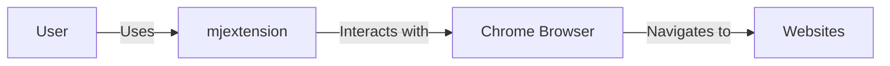
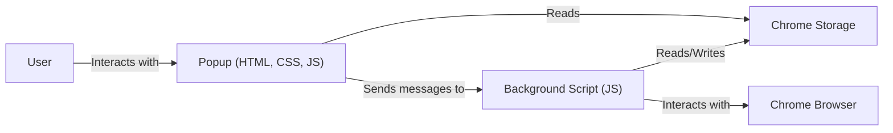
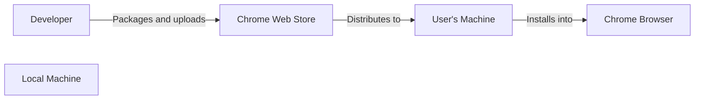
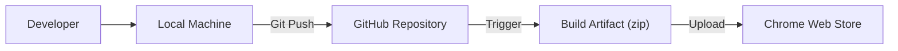

Okay, let's create a design document for the `mjextension` project.

# BUSINESS POSTURE

Business Priorities and Goals:

*   Provide a simple, user-friendly Chrome extension for basic URL manipulation.
*   Offer a free and open-source tool for the community.
*   Potentially serve as a learning project or a foundation for more complex extensions.
*   Minimize maintenance overhead.

Most Important Business Risks:

*   Malicious code injection: The extension could be compromised, leading to the injection of malicious code that could harm users or steal data.
*   Data privacy violations: If the extension handles user data improperly, it could lead to privacy violations.
*   Extension malfunction: Bugs or errors in the extension could lead to poor user experience or data loss.
*   Reputational damage: Security vulnerabilities or privacy issues could damage the reputation of the developer and the project.
*   Supply chain attacks: Compromised dependencies or build tools could introduce vulnerabilities.

# SECURITY POSTURE

Existing Security Controls:

*   security control: Manifest v3: Using Manifest v3 enhances security by limiting the extension's capabilities and requiring stricter permissions. (Described in `manifest.json`)
*   security control: Limited Permissions: The extension requests only necessary permissions (`activeTab`, `storage`). (Described in `manifest.json`)
*   security control: Content Security Policy (CSP): Although basic, the default CSP in Manifest v3 provides some protection against XSS attacks. (Described in `manifest.json`)
*   security control: Small codebase: The relatively small and simple codebase reduces the attack surface.

Accepted Risks:

*   accepted risk: Limited Input Validation: The extension performs minimal input validation, relying primarily on the browser's built-in protections.
*   accepted risk: Lack of Advanced Security Features: The extension does not implement advanced security features like encryption or detailed logging.
*   accepted risk: No formal code review process: The project appears to be a personal project, likely without a formal code review process.
*   accepted risk: No automated security testing: There is no evidence of automated security testing (SAST, DAST) in the repository.

Recommended Security Controls:

*   security control: Enhanced Input Validation: Implement more robust input validation to prevent potential injection attacks.
*   security control: Consider adding a more restrictive Content Security Policy (CSP).
*   security control: Implement a mechanism for secure updates to ensure users receive the latest security patches.
*   security control: Regularly review and update dependencies to mitigate supply chain risks.

Security Requirements:

*   Authentication: Not applicable, as the extension doesn't manage user accounts.
*   Authorization: Not applicable, as the extension doesn't have different user roles.
*   Input Validation:
    *   The extension should validate user input (URLs) to prevent common web vulnerabilities like XSS and injection attacks.  Specifically, check for unexpected characters or patterns.
*   Cryptography:
    *   If sensitive data is ever stored (currently, it appears only simple URLs are stored), use appropriate cryptographic methods (e.g., the Web Crypto API) for encryption.  Currently, this is not a requirement.
*   Output Encoding:
    *   Ensure that any data displayed to the user is properly encoded to prevent XSS vulnerabilities.

# DESIGN

## C4 CONTEXT

C4 Context Element List:

*   Element:
    *   Name: User
    *   Type: Person
    *   Description: A person who uses the mjextension Chrome extension.
    *   Responsibilities: Interacts with the extension's UI, provides input (URLs), and receives output.
    *   Security controls: None (relies on browser security).

*   Element:
    *   Name: mjextension
    *   Type: Software System
    *   Description: The Chrome extension that manipulates URLs.
    *   Responsibilities: Receives user input, processes URLs, displays results, and interacts with the Chrome browser.
    *   Security controls: Manifest v3, Limited Permissions, Basic CSP.

*   Element:
    *   Name: Chrome Browser
    *   Type: Software System
    *   Description: The Google Chrome web browser.
    *   Responsibilities: Hosts the extension, provides APIs for extension interaction, manages web navigation, and enforces browser security policies.
    *   Security controls: Browser sandboxing, site isolation, built-in XSS protection, and other browser security features.

*   Element:
    *   Name: Websites
    *   Type: Software System
    *   Description: External websites that the user visits.
    *   Responsibilities: Serve web content.
    *   Security controls: Relies on website's own security measures.

## C4 CONTAINER

C4 Container Element List:

*   Element:
    *   Name: User
    *   Type: Person
    *   Description: A person who uses the mjextension Chrome extension.
    *   Responsibilities: Interacts with the extension's UI.
    *   Security controls: None (relies on browser security).

*   Element:
    *   Name: Popup
    *   Type: Container (HTML, CSS, JavaScript)
    *   Description: The user interface of the extension.
    *   Responsibilities: Displays the UI, handles user input, and communicates with the background script.
    *   Security controls: Basic CSP, output encoding (implicit in browser rendering).

*   Element:
    *   Name: Background Script
    *   Type: Container (JavaScript)
    *   Description: The background script that handles extension logic.
    *   Responsibilities: Processes URLs, interacts with Chrome APIs, and manages storage.
    *   Security controls: Limited Permissions, Manifest v3 restrictions.

*   Element:
    *   Name: Chrome Storage
    *   Type: Container (Data Store)
    *   Description: The Chrome storage API for storing extension data.
    *   Responsibilities: Persists extension data across sessions.
    *   Security controls: Browser-provided storage security (sandboxed).

*   Element:
    *   Name: Chrome Browser
    *   Type: Software System
    *   Description: The Google Chrome web browser.
    *   Responsibilities: Hosts the extension, provides APIs for extension interaction, manages web navigation, and enforces browser security policies.
    *   Security controls: Browser sandboxing, site isolation, built-in XSS protection, and other browser security features.

## DEPLOYMENT

Possible Deployment Solutions:

1.  Manual Installation: Users download the extension files and load them unpacked in developer mode.
2.  Chrome Web Store: The extension is packaged and published on the Chrome Web Store.
3.  Enterprise Deployment: The extension is deployed to managed devices within an organization.

Chosen Solution (Chrome Web Store):

Deployment Element List:

*   Element:
    *   Name: Developer
    *   Type: Person
    *   Description: The developer of the mjextension.
    *   Responsibilities: Writes code, builds the extension, and publishes it to the Chrome Web Store.
    *   Security controls: Secure development practices, code signing (implicit in Chrome Web Store publishing).

*   Element:
    *   Name: Local Machine
    *   Type: Infrastructure Node
    *   Description: The developer's computer.
    *   Responsibilities: Hosts the development environment and build tools.
    *   Security controls: Standard developer machine security.

*   Element:
    *   Name: Chrome Web Store
    *   Type: Software System
    *   Description: Google's platform for distributing Chrome extensions.
    *   Responsibilities: Hosts the extension, manages updates, and provides a distribution channel.
    *   Security controls: Code review (by Google), code signing, and platform security.

*   Element:
    *   Name: User's Machine
    *   Type: Infrastructure Node
    *   Description: The computer of a user who installs the extension.
    *   Responsibilities: Downloads and installs the extension.
    *   Security controls: Standard user machine security.

*   Element:
    *   Name: Chrome Browser
    *   Type: Software System
    *   Description: The Google Chrome web browser.
    *   Responsibilities: Hosts the extension, provides APIs for extension interaction, manages web navigation, and enforces browser security policies.
    *   Security controls: Browser sandboxing, site isolation, built-in XSS protection, and other browser security features.

## BUILD

Build Process Description:

1.  Developer writes code on their Local Machine.
2.  Code is committed and pushed to the GitHub Repository.
3.  Currently, there is no automated build system. The developer manually creates a zip file of the extension's source code. This is the Build Artifact.
4.  The developer manually uploads the Build Artifact (zip file) to the Chrome Web Store for distribution.

Security Controls:

*   security control: Manual Build Process: The build process is manual, which introduces a risk of human error.
*   security control: Source Code Management: The code is stored in a Git repository (GitHub), providing version control and a history of changes.

Recommended Improvements:

*   security control: Implement a CI/CD pipeline (e.g., using GitHub Actions) to automate the build and packaging process.
*   security control: Integrate linters and static analysis tools into the build process to identify potential code quality and security issues.
*   security control: Consider using a tool to manage and audit dependencies for potential vulnerabilities.

# RISK ASSESSMENT

Critical Business Processes:

*   Providing a functional and reliable URL manipulation tool.
*   Maintaining user trust and privacy.

Data to Protect:

*   URLs entered by the user (Sensitivity: Low to Medium, depending on the URL).  While URLs themselves are not inherently sensitive, they could reveal browsing habits or contain sensitive information in query parameters.
*   Extension settings stored in Chrome Storage (Sensitivity: Low).

# QUESTIONS & ASSUMPTIONS

Questions:

*   Are there any plans to expand the functionality of the extension in the future?  This will impact the security requirements and design.
*   What is the target user base for this extension?  This helps determine the appropriate level of security measures.
*   Are there any specific compliance requirements (e.g., GDPR, CCPA) that need to be considered?

Assumptions:

*   BUSINESS POSTURE: The primary goal is to provide a simple, free, and open-source tool.  Monetization is not a primary concern.
*   SECURITY POSTURE: The developer has a basic understanding of web security principles but may not be a security expert.
*   DESIGN: The extension is intended to remain relatively simple, with a focus on core URL manipulation functionality. The current architecture is sufficient for the current feature set.