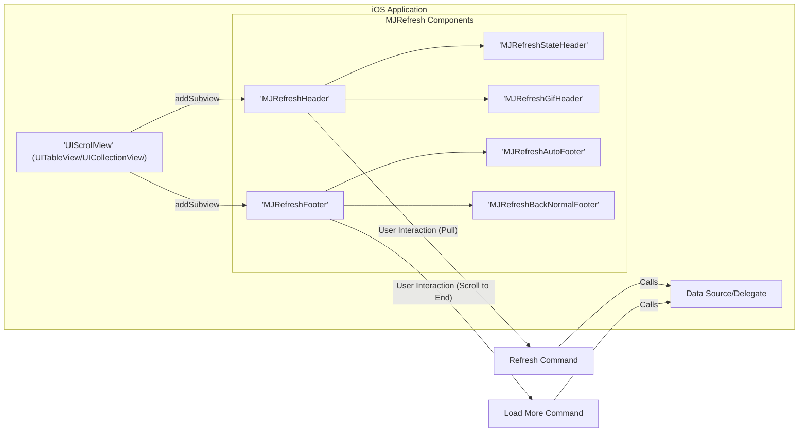
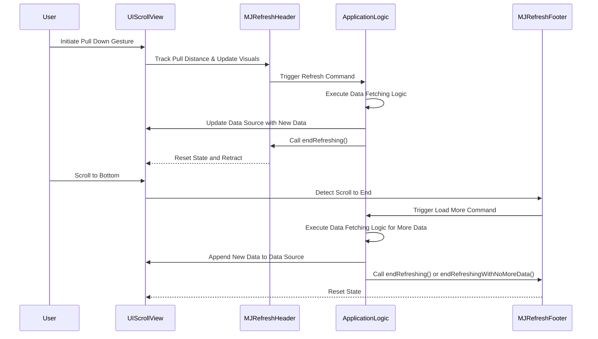

# Project Design Document: mjrefresh

**Version:** 1.1
**Date:** October 26, 2023
**Author:** Gemini (AI Language Model)

## 1. Introduction

This document provides a detailed design overview of the `mjrefresh` project, a popular Swift library for implementing pull-to-refresh and infinite scrolling functionalities in iOS applications. This document aims to provide a comprehensive understanding of the library's architecture, components, and data flow, which will serve as a robust foundation for subsequent threat modeling activities. The focus is on providing sufficient detail to identify potential security vulnerabilities and attack vectors.

## 2. Project Overview

`mjrefresh` is an open-source Swift library that significantly simplifies the implementation of common user interface patterns for refreshing and loading more content within scrollable views (such as `UITableView` and `UICollectionView`) on the iOS platform. It offers a collection of customizable refresh headers and footers that trigger predefined actions based on user interaction with the scroll view.

**Project Repository:** [https://github.com/codermjlee/mjrefresh](https://github.com/codermjlee/mjrefresh)

## 3. Goals and Objectives

The primary goals of `mjrefresh` are to:

*   Provide a straightforward and easily integrable solution for implementing pull-to-refresh and infinite scrolling features in iOS applications.
*   Offer a high degree of customization regarding the visual appearance and interactive behavior of the refresh controls.
*   Ensure compatibility and seamless integration with various types of scrollable views available in the iOS SDK.
*   Maintain optimal performance characteristics and responsiveness to user interactions.
*   Be thoroughly documented, facilitating ease of use and understanding for developers, and be actively maintained to address issues and incorporate improvements.

## 4. Target Audience

This design document is primarily intended for:

*   Security engineers and architects tasked with performing threat modeling on the `mjrefresh` library itself or on applications that incorporate it.
*   Software developers seeking a deeper technical understanding of the library's internal mechanisms and design principles.
*   Quality assurance engineers and testers who require a comprehensive understanding of the library's architecture to design effective test strategies.

## 5. System Architecture

`mjrefresh` operates as a client-side library that is directly embedded within iOS applications. It does not inherently involve any backend services or external infrastructure. The core of its architecture involves extending the capabilities of the fundamental `UIScrollView` class and its specialized subclasses.

Here's a more detailed component diagram illustrating the relationships:

**Components:**

*   **`UIScrollView` (UITableView/UICollectionView):** This is the foundational iOS view responsible for managing scrollable content. `mjrefresh` enhances its functionality.
*   **`MJRefreshHeader`:** An abstract base class for refresh headers. It provides the core logic for handling pull-to-refresh gestures.
    *   **`MJRefreshStateHeader`:** A concrete subclass of `MJRefreshHeader` that displays the refresh state (e.g., "Pull down to refresh", "Release to refresh", "Loading").
    *   **`MJRefreshGifHeader`:** A concrete subclass of `MJRefreshHeader` that allows for animated GIF images to be used as the refresh indicator.
*   **`MJRefreshFooter`:** An abstract base class for refresh footers, managing the logic for infinite scrolling.
    *   **`MJRefreshAutoFooter`:** A concrete subclass of `MJRefreshFooter` that automatically triggers the load more action when the user scrolls near the bottom.
    *   **`MJRefreshBackNormalFooter`:** A concrete subclass of `MJRefreshFooter` that requires the user to explicitly pull up to trigger the load more action.
*   **Data Source/Delegate:** The application-specific code responsible for providing the data to be displayed in the scroll view and for responding to events triggered by `mjrefresh`.
*   **Refresh Command:** The specific action or closure defined by the application developer that is executed when the `MJRefreshHeader` is activated. This typically involves initiating a data fetching process.
*   **Load More Command:** The specific action or closure defined by the application developer that is executed when the `MJRefreshFooter` is activated. This usually involves fetching additional data to append to the existing content.

## 6. Data Flow

The data flow within `mjrefresh` is driven by user interaction and involves callbacks to the application's custom logic:

1. **Initialization and Configuration:** The application developer integrates `mjrefresh` by instantiating and adding `MJRefreshHeader` and/or `MJRefreshFooter` objects as subviews to their `UIScrollView`. Crucially, they configure the refresh and load more actions by providing closures or target-action pairs that define the application's response to these events.
2. **Pull-to-Refresh Sequence:**
    *   The user initiates a refresh by performing a downward "pull" gesture on the `UIScrollView`.
    *   The `MJRefreshHeader` actively monitors the pull distance and dynamically updates its visual representation to provide feedback to the user.
    *   Once the pull distance surpasses a predefined threshold, the `MJRefreshHeader` transitions into the "refreshing" state, visually indicating that a refresh operation is in progress.
    *   The previously configured refresh action (defined within the application's code) is then executed. This action commonly involves initiating a network request to retrieve the latest data from a remote source.
    *   Upon successful retrieval and update of the data within the application's data source, the application explicitly calls the `endRefreshing()` method on the `MJRefreshHeader`. This signals the completion of the refresh operation and causes the header to reset its state and retract.
3. **Infinite Scrolling (Load More) Sequence:**
    *   The user scrolls downwards within the `UIScrollView`, eventually reaching the bottom of the currently loaded content.
    *   The `MJRefreshFooter` detects that the scroll view has reached its vertical extent.
    *   The load more action, as defined by the application developer, is then triggered. This action typically involves making a network request to fetch an additional batch of data.
    *   After the new data is successfully fetched and appended to the application's data source, the application calls either the `endRefreshing()` method (if more data is potentially available) or the `endRefreshingWithNoMoreData()` method (if all available data has been loaded) on the `MJRefreshFooter`. This signals the completion of the load more operation and updates the footer's state accordingly.

## 7. Security Considerations

While `mjrefresh` primarily focuses on UI enhancements, it's crucial to analyze potential security implications arising from its integration and usage within an application. The library itself doesn't handle sensitive data directly, but it triggers actions that can interact with such data.

**Potential Security Risks:**

*   **Data Integrity Violations (Indirect):** `mjrefresh` relies on the application's logic to handle data fetching and processing. If the refresh or load more actions fetch data from untrusted sources or lack proper validation, it could lead to the introduction of malicious or corrupted data into the application's data store and UI.
    *   **Example:** An API endpoint providing data for refresh is compromised and starts injecting malicious scripts. The application, upon refreshing, displays this script, leading to a cross-site scripting (XSS) vulnerability within the app's context.
*   **Man-in-the-Middle (MITM) Attacks (Indirect):** If the network requests initiated by the refresh or load more actions are performed over insecure HTTP connections, attackers could intercept and potentially modify the data being transmitted.
    *   **Example:** An attacker intercepts a refresh request and injects false data, leading the user to believe incorrect information.
*   **Denial of Service (DoS) Vulnerabilities (Indirect):**  A poorly implemented refresh or load more action could be exploited to trigger an excessive number of requests to backend services, potentially overwhelming them and causing a denial of service.
    *   **Example:** An attacker repeatedly pulls to refresh, causing the application to send numerous requests to the server, potentially exceeding rate limits or exhausting server resources.
*   **Client-Side Resource Exhaustion:** While less likely, if the application logic triggered by `mjrefresh` performs computationally expensive operations or downloads excessively large datasets without proper management, it could lead to resource exhaustion on the user's device, impacting performance and potentially leading to crashes.
*   **Dependency Chain Vulnerabilities:**  Vulnerabilities present in `mjrefresh` itself, or in its own dependencies (if any), could be exploited by attackers. Regularly updating the library is essential to mitigate this risk.
*   **Information Disclosure (Indirect):** Improper error handling within the refresh or load more action callbacks could inadvertently expose sensitive information in error messages or UI alerts.
    *   **Example:** An error message during a refresh operation reveals details about the backend database structure or API keys.
*   **UI Redressing/Clickjacking (Low Probability):** Although unlikely with standard usage, if the customization options of `MJRefreshHeader` or `MJRefreshFooter` are maliciously manipulated, it could theoretically be a component in a UI redressing attack.

**Areas for Focused Threat Modeling:**

*   **Security of Data Fetching Logic:**  Thoroughly examine the code executed within the refresh and load more action closures. Pay close attention to:
    *   Input validation of data received from external sources.
    *   The use of secure communication protocols (HTTPS).
    *   Implementation of proper authentication and authorization mechanisms for API requests.
*   **Error Handling Mechanisms:** Analyze how errors during data fetching and processing are handled. Ensure that error messages do not expose sensitive information.
*   **Rate Limiting and Resource Management:** Evaluate if the application implements appropriate rate limiting for refresh and load more actions to prevent abuse and DoS attacks.
*   **Dependency Management:**  Ensure that `mjrefresh` and any of its dependencies are kept up-to-date to patch known vulnerabilities.

## 8. Deployment Considerations

`mjrefresh` is typically integrated into iOS projects using popular dependency management tools such as:

*   **CocoaPods:** Add `pod 'MJRefresh'` to your `Podfile` and run `pod install`.
*   **Carthage:** Add `github "CoderMJLee/MJRefresh"` to your `Cartfile` and run `carthage update`.
*   **Swift Package Manager:** Add the repository URL to your project's Swift Packages.

Deployment considerations primarily involve ensuring the library is correctly included in the application bundle during the build process.

## 9. Future Enhancements (Out of Scope for Initial Threat Model)

While not directly relevant to the immediate threat modeling effort, potential future enhancements for `mjrefresh` could include:

*   More sophisticated and customizable animation options for refresh indicators.
*   Built-in support for accessibility features.
*   Performance optimizations for smoother scrolling and refresh experiences.

This improved design document provides a more detailed and security-focused overview of the `mjrefresh` library, offering a stronger foundation for effective threat modeling.