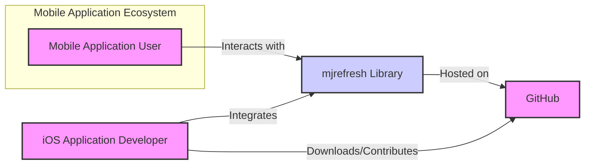
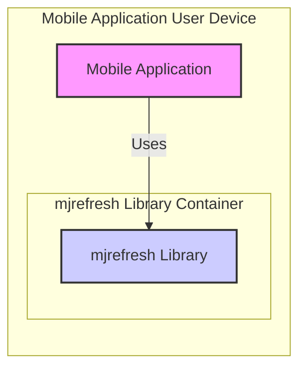
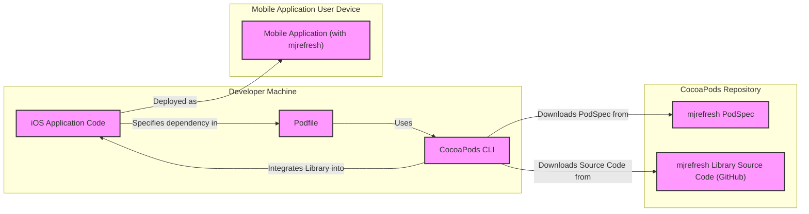
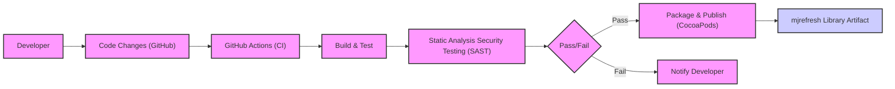

# BUSINESS POSTURE

- Business Priorities and Goals:
  - Enhance user experience in mobile applications by providing smooth and intuitive pull-to-refresh functionality.
  - Improve user engagement and satisfaction by allowing users to easily refresh content.
  - Provide a reusable and customizable component for iOS developers to accelerate application development.
  - Maintain a high-quality, stable, and performant library to build trust and encourage adoption.

- Business Risks:
  - Poor user experience due to bugs or performance issues in the refresh control.
  - Negative impact on application stability if the library introduces crashes or memory leaks.
  - Security vulnerabilities in the library could be exploited in applications that use it, leading to data breaches or other security incidents.
  - Lack of adoption or developer dissatisfaction if the library is difficult to use, poorly documented, or lacks necessary features.
  - Dependency on a single maintainer or lack of community support could lead to project stagnation or abandonment.

# SECURITY POSTURE

- Existing Security Controls:
  - security control: Code hosted on GitHub, providing version control and transparency. (Implemented: GitHub Repository)
  - security control: Open-source project, allowing community review and contributions. (Implemented: GitHub Repository)
  - accepted risk: Reliance on external contributors for security vulnerability identification and patching.
  - accepted risk: Potential for vulnerabilities to be introduced during development and not immediately detected.

- Recommended Security Controls:
  - security control: Implement automated static analysis security testing (SAST) in the CI/CD pipeline to identify potential code vulnerabilities.
  - security control: Introduce dependency scanning to identify and manage known vulnerabilities in third-party libraries used during development or build process.
  - security control: Establish a clear process for reporting and handling security vulnerabilities, including a security policy and contact information.
  - security control: Conduct regular security code reviews, especially for critical components and contributions from external developers.

- Security Requirements:
  - Authentication: Not applicable for a client-side library.
  - Authorization: Not applicable for a client-side library.
  - Input Validation: The library should handle various input conditions gracefully and prevent unexpected behavior or crashes due to invalid input from the application using it. Validate any configuration options or parameters provided by the integrating application.
  - Cryptography:  Likely not directly required for a UI library like this. If any data persistence or transmission is introduced in future versions, appropriate cryptographic measures should be considered. For now, no specific cryptography requirements.

# DESIGN

## C4 CONTEXT

- Context Diagram Elements:
  - - Name: Mobile Application User
    - Type: Person
    - Description: End-user who interacts with mobile applications that utilize the mjrefresh library.
    - Responsibilities: Uses mobile applications to consume content and expects a smooth and responsive user interface, including pull-to-refresh functionality.
    - Security controls: Device-level security controls, application-level permissions.
  - - Name: mjrefresh Library
    - Type: Software System
    - Description: iOS library providing pull-to-refresh functionality for UIKit components like UITableView and UICollectionView.
    - Responsibilities: Provides a reusable and customizable pull-to-refresh control for iOS applications. Ensures smooth animations and efficient content refreshing.
    - Security controls: Input validation, secure coding practices, vulnerability management.
  - - Name: iOS Application Developer
    - Type: Person
    - Description: Software developer who integrates the mjrefresh library into their iOS applications.
    - Responsibilities: Integrates the library correctly, configures it as needed, and ensures it works seamlessly within their application. Responsible for the overall security of their application, including the use of third-party libraries.
    - Security controls: Secure development practices, dependency management, code review.
  - - Name: GitHub
    - Type: Software System
    - Description: Web-based platform for version control and collaboration, hosting the mjrefresh library repository.
    - Responsibilities: Provides source code hosting, version control, issue tracking, and pull request management for the mjrefresh library.
    - Security controls: Access control, authentication, authorization, audit logging, infrastructure security.

## C4 CONTAINER

- Container Diagram Elements:
  - - Name: Mobile Application
    - Type: Software System
    - Description: iOS application developed by iOS Application Developers, which integrates the mjrefresh library to provide pull-to-refresh functionality.
    - Responsibilities: Provides application-specific features and content to the user. Integrates and utilizes the mjrefresh library for UI enhancements.
    - Security controls: Application-level security controls, including data protection, session management, input validation, authorization, and secure communication.
  - - Name: mjrefresh Library
    - Type: Library
    - Description:  A compiled library (likely a static library or framework in iOS context) that is integrated into the Mobile Application. It contains the code for the pull-to-refresh control.
    - Responsibilities: Implements the pull-to-refresh UI component. Handles user interactions and triggers refresh actions within the application.
    - Security controls: Input validation of configuration parameters, memory safety, prevention of denial-of-service conditions, adherence to secure coding practices.

## DEPLOYMENT

- Deployment Options:
  - Option 1: Direct integration via source code (less common for libraries).
  - Option 2: Integration via CocoaPods or similar dependency managers (most common for iOS libraries).
  - Option 3: Manual integration by downloading and linking the compiled library/framework.

- Detailed Deployment (Option 2 - CocoaPods):

- Deployment Diagram Elements:
  - - Name: iOS Application Code
    - Type: Codebase
    - Description: The source code of the iOS application being developed by the iOS Application Developer.
    - Responsibilities: Contains the application logic and integrates with the mjrefresh library.
    - Security controls: Developer workstation security, code repository access control, code review.
  - - Name: Podfile
    - Type: Configuration File
    - Description: A file that specifies the dependencies for the iOS application, including mjrefresh.
    - Responsibilities: Defines the required libraries and their versions for the project.
    - Security controls: Version control, access control to the codebase.
  - - Name: CocoaPods CLI
    - Type: Tool
    - Description: Command-line tool used by developers to manage dependencies defined in the Podfile.
    - Responsibilities: Resolves dependencies, downloads libraries, and integrates them into the Xcode project.
    - Security controls: Secure download and installation of dependencies, integrity checks (if available in CocoaPods).
  - - Name: mjrefresh PodSpec
    - Type: Metadata File
    - Description: A file in the CocoaPods repository that describes the mjrefresh library, its source location, and other metadata.
    - Responsibilities: Provides information for CocoaPods to locate and install the mjrefresh library.
    - Security controls: Repository security, access control to the CocoaPods repository.
  - - Name: mjrefresh Library Source Code (GitHub)
    - Type: Source Code Repository
    - Description: The source code of the mjrefresh library hosted on GitHub.
    - Responsibilities: Stores the source code of the library, allowing CocoaPods to download it.
    - Security controls: GitHub security controls, access control, version control.
  - - Name: Mobile Application (with mjrefresh)
    - Type: Application Instance
    - Description: The deployed iOS application running on a user's mobile device, including the integrated mjrefresh library.
    - Responsibilities: Provides application functionality to the end-user, utilizing the pull-to-refresh feature from the mjrefresh library.
    - Security controls: Mobile device security controls, application sandboxing, operating system security features.

## BUILD

- Build Process Elements:
  - - Name: Developer
    - Type: Person
    - Description: Software developer working on the mjrefresh library.
    - Responsibilities: Writes code, fixes bugs, and implements new features for the library.
    - Security controls: Secure coding practices, code review, workstation security.
  - - Name: Code Changes (GitHub)
    - Type: Source Code
    - Description: Code modifications pushed by the developer to the GitHub repository.
    - Responsibilities: Represents the latest version of the library's source code.
    - Security controls: Version control, access control, branch protection.
  - - Name: GitHub Actions (CI)
    - Type: CI/CD System
    - Description: GitHub's built-in CI/CD service, used to automate the build, test, and publishing process.
    - Responsibilities: Automates the build pipeline, runs tests, and performs security checks.
    - Security controls: Secure pipeline configuration, access control, secret management, audit logging.
  - - Name: Build & Test
    - Type: Build Stage
    - Description: Compilation of the source code and execution of unit and integration tests.
    - Responsibilities: Ensures the code compiles correctly and functions as expected.
    - Security controls: Secure build environment, dependency management, test case coverage.
  - - Name: Static Analysis Security Testing (SAST)
    - Type: Security Tool
    - Description: Automated tool that analyzes the source code for potential security vulnerabilities.
    - Responsibilities: Identifies potential security flaws in the code before deployment.
    - Security controls: Tool configuration, vulnerability reporting, integration with CI/CD pipeline.
  - - Name: Pass/Fail
    - Type: Decision Point
    - Description: Determines whether the build and security checks have passed successfully.
    - Responsibilities: Controls the flow of the build pipeline based on test and security results.
    - Security controls: Defined criteria for passing and failing, automated decision-making.
  - - Name: Package & Publish (CocoaPods)
    - Type: Publishing Stage
    - Description: Packaging the compiled library and publishing it to the CocoaPods repository.
    - Responsibilities: Makes the library available for iOS developers to integrate into their applications.
    - Security controls: Secure publishing process, access control to CocoaPods repository, integrity checks.
  - - Name: Notify Developer
    - Type: Notification
    - Description: Informs the developer about build failures or security issues.
    - Responsibilities: Provides feedback to the developer for necessary corrections.
    - Security controls: Secure communication channels, appropriate notification mechanisms.
  - - Name: mjrefresh Library Artifact
    - Type: Software Artifact
    - Description: The compiled and packaged mjrefresh library, ready for distribution.
    - Responsibilities: The final output of the build process, ready to be used by iOS application developers.
    - Security controls: Artifact integrity, secure storage, versioning.

# RISK ASSESSMENT

- Critical Business Processes:
  - Providing a reliable and user-friendly pull-to-refresh experience in mobile applications.
  - Maintaining developer trust and encouraging adoption of the mjrefresh library.
  - Ensuring the stability and performance of applications that integrate the library.

- Data to Protect and Sensitivity:
  - Source code of the mjrefresh library (Medium Sensitivity - Intellectual Property).
  - No direct handling of user data by the library itself. However, applications using the library may handle sensitive user data. The library should not introduce vulnerabilities that could compromise this data. (High Sensitivity - Indirectly related to user data via integrating applications).
  - Build and release pipeline integrity (Medium Sensitivity - Operational Security).

# QUESTIONS & ASSUMPTIONS

- Questions:
  - What is the intended scope of security testing for the library? (e.g., focus on memory safety, input validation, or broader security concerns?)
  - Are there any specific compliance requirements or industry standards that the library needs to adhere to?
  - What is the process for handling security vulnerability reports from the community?
  - Is there a dedicated security team or individual responsible for overseeing the security of the mjrefresh library project?

- Assumptions:
  - The primary goal of the mjrefresh library is to enhance user experience in iOS applications.
  - Security is a secondary but important consideration for the project.
  - The library is intended to be used by a wide range of iOS application developers, potentially including those working on applications that handle sensitive user data.
  - The project is open to community contributions and feedback, including security-related input.
  - The build and release process is currently manual or semi-automated and can be improved with more robust security controls.