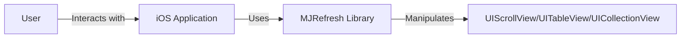
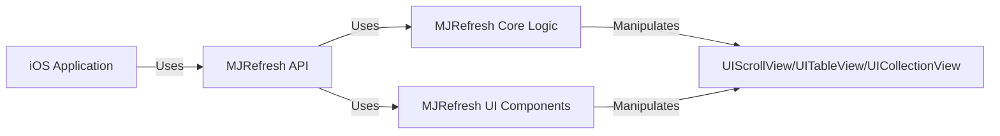
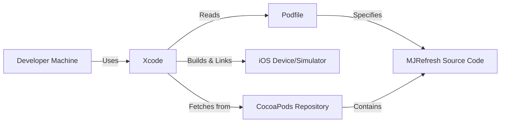
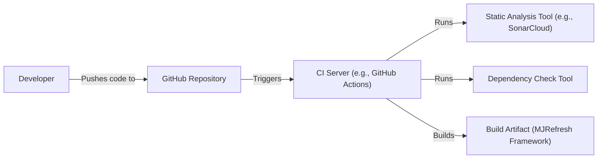

Okay, let's create a design document for the MJRefresh project.

# BUSINESS POSTURE

Business Priorities and Goals:

*   Provide an easy-to-use, highly customizable, and reliable pull-to-refresh and load-more functionality for iOS developers.
*   Reduce development time for implementing common UI patterns in mobile applications.
*   Maintain a lightweight and performant library to minimize impact on application size and responsiveness.
*   Offer a well-documented and actively maintained solution to ensure long-term usability.
*   Foster a community around the project to encourage contributions and address user needs.

Most Important Business Risks:

*   Security vulnerabilities within the library could be exploited, potentially leading to data breaches or application instability.
*   Poor performance or excessive resource consumption could negatively impact the user experience of applications using the library.
*   Lack of compatibility with newer iOS versions or devices could limit the library's adoption and usefulness.
*   Inadequate documentation or support could hinder developer adoption and lead to frustration.
*   Competition from other similar libraries could reduce the project's market share and relevance.

# SECURITY POSTURE

Existing Security Controls:

*   security control: The project is open-source, allowing for community review and identification of potential vulnerabilities. (Described in GitHub repository)
*   security control: The library primarily deals with UI elements and does not directly handle sensitive user data or network communication. (Described in GitHub repository)
*   security control: The project uses standard iOS development practices and APIs, leveraging the built-in security features of the iOS platform. (Described in GitHub repository)

Accepted Risks:

*   accepted risk: The library relies on the security of the underlying iOS platform and the developer's implementation of their application.
*   accepted risk: The library does not implement specific encryption or data protection mechanisms, as it primarily focuses on UI functionality.

Recommended Security Controls:

*   security control: Implement regular dependency updates to address known vulnerabilities in third-party libraries.
*   security control: Conduct static code analysis (e.g., using tools like SonarCloud) to identify potential security issues.
*   security control: Provide clear guidelines for developers on how to securely integrate the library into their applications.

Security Requirements:

*   Authentication: Not directly applicable, as the library does not handle user authentication.
*   Authorization: Not directly applicable, as the library does not manage user roles or permissions.
*   Input Validation: The library should ensure that user-provided input (e.g., custom configurations) is properly validated to prevent unexpected behavior or vulnerabilities.
*   Cryptography: Not directly applicable, as the library does not handle sensitive data requiring encryption.

# DESIGN

## C4 CONTEXT

Element Descriptions:

*   Element:
    *   Name: User
    *   Type: Person
    *   Description: The end-user interacting with the iOS application.
    *   Responsibilities: Initiates pull-to-refresh and load-more actions.
    *   Security controls: None (handled by the iOS application).

*   Element:
    *   Name: iOS Application
    *   Type: Software System
    *   Description: The mobile application utilizing the MJRefresh library.
    *   Responsibilities: Integrates MJRefresh, handles data loading, and displays content.
    *   Security controls: Implements application-specific security measures (e.g., authentication, data validation).

*   Element:
    *   Name: MJRefresh Library
    *   Type: Software System
    *   Description: The library providing pull-to-refresh and load-more functionality.
    *   Responsibilities: Provides UI components and logic for refresh/load-more actions.
    *   Security controls: Input validation, dependency management, static code analysis.

*   Element:
    *   Name: UIScrollView/UITableView/UICollectionView
    *   Type: Framework Component
    *   Description: Standard iOS UI components that MJRefresh interacts with.
    *   Responsibilities: Displays scrollable content.
    *   Security controls: Relies on iOS platform security.

## C4 CONTAINER

Element Descriptions:

*   Element:
    *   Name: iOS Application
    *   Type: Software System
    *   Description: The mobile application utilizing the MJRefresh library.
    *   Responsibilities: Integrates MJRefresh, handles data loading, and displays content.
    *   Security controls: Implements application-specific security measures.

*   Element:
    *   Name: MJRefresh API
    *   Type: API
    *   Description: The public interface of the MJRefresh library.
    *   Responsibilities: Provides methods and properties for developers to configure and control refresh/load-more behavior.
    *   Security controls: Input validation.

*   Element:
    *   Name: MJRefresh Core Logic
    *   Type: Component
    *   Description: The core functionality of the MJRefresh library.
    *   Responsibilities: Handles refresh/load-more state management, event handling, and interaction with UIScrollView.
    *   Security controls: Internal consistency checks.

*   Element:
    *   Name: MJRefresh UI Components
    *   Type: Component
    *   Description: The visual components of the MJRefresh library (e.g., refresh indicators).
    *   Responsibilities: Provides visual feedback to the user during refresh/load-more operations.
    *   Security controls: None (primarily visual).

*   Element:
    *   Name: UIScrollView/UITableView/UICollectionView
    *   Type: Framework Component
    *   Description: Standard iOS UI components that MJRefresh interacts with.
    *   Responsibilities: Displays scrollable content.
    *   Security controls: Relies on iOS platform security.

## DEPLOYMENT

Possible Deployment Solutions:

1.  CocoaPods: A dependency manager for Swift and Objective-C Cocoa projects.
2.  Carthage: A decentralized dependency manager for Cocoa.
3.  Swift Package Manager: A tool for managing the distribution of Swift code, integrated with the Swift build system.
4.  Manual Integration: Directly adding the MJRefresh source files to the project.

Chosen Solution: CocoaPods (most common and convenient)

Element Descriptions:

*   Element:
    *   Name: Developer Machine
    *   Type: Infrastructure Node
    *   Description: The developer's computer used for development.
    *   Responsibilities: Hosts the development environment.
    *   Security controls: Standard development machine security practices.

*   Element:
    *   Name: CocoaPods Repository
    *   Type: Infrastructure Node
    *   Description: The central repository for CocoaPods packages.
    *   Responsibilities: Stores and distributes MJRefresh and other libraries.
    *   Security controls: Managed by CocoaPods maintainers.

*   Element:
    *   Name: iOS Device/Simulator
    *   Type: Infrastructure Node
    *   Description: The target device or simulator for running the application.
    *   Responsibilities: Executes the compiled application.
    *   Security controls: Relies on iOS platform security.

*   Element:
    *   Name: Xcode
    *   Type: Software System
    *   Description: The integrated development environment (IDE) for iOS development.
    *   Responsibilities: Manages the project, builds the application, and deploys it to the device/simulator.
    *   Security controls: Relies on Xcode's built-in security features.

*   Element:
    *   Name: Podfile
    *   Type: Configuration File
    *   Description: Specifies the project's dependencies, including MJRefresh.
    *   Responsibilities: Defines which libraries to include in the project.
    *   Security controls: None (configuration file).

*   Element:
    *   Name: MJRefresh Source Code
    *   Type: Code
    *   Description: The source code of the MJRefresh library.
    *   Responsibilities: Provides the functionality of the library.
    *   Security controls: Code-level security measures (e.g., input validation).

## BUILD

Build Process Description:

1.  Developer pushes code changes to the GitHub repository.
2.  A CI server (e.g., GitHub Actions) is triggered by the push event.
3.  The CI server runs static analysis tools (e.g., SonarCloud) to identify potential code quality and security issues.
4.  The CI server runs dependency check tools to identify known vulnerabilities in third-party libraries.
5.  The CI server builds the MJRefresh framework, creating the build artifact.
6.  The build artifact can then be distributed via CocoaPods, Carthage, Swift Package Manager, or manual integration.

Security Controls:

*   security control: Static code analysis during the build process.
*   security control: Dependency vulnerability scanning during the build process.
*   security control: Automated build process to ensure consistency and reduce manual errors.
*   security control: Use of a CI server to enforce security checks on every code change.

# RISK ASSESSMENT

Critical Business Processes:

*   Providing a reliable and performant UI component for iOS applications.
*   Maintaining a positive developer experience and community engagement.

Data Protection:

*   The library itself does not handle sensitive user data.
*   The primary concern is to prevent vulnerabilities that could be exploited in the context of the *hosting* application.
*   Data Sensitivity: Low (for the library itself), but potentially high for the applications using it.

# QUESTIONS & ASSUMPTIONS

Questions:

*   Are there any specific compliance requirements (e.g., HIPAA, GDPR) that the applications using MJRefresh need to adhere to? (This would influence guidance provided to developers.)
*   What is the expected frequency of updates and releases for the library?
*   What is the process for reporting and addressing security vulnerabilities discovered in the library?

Assumptions:

*   BUSINESS POSTURE: The primary goal is to provide a useful and reliable UI component, not to handle sensitive data directly.
*   SECURITY POSTURE: Developers using the library are responsible for the overall security of their applications.
*   DESIGN: The library's design prioritizes ease of use and performance, while leveraging the security features of the iOS platform. The library is primarily used within the iOS ecosystem.