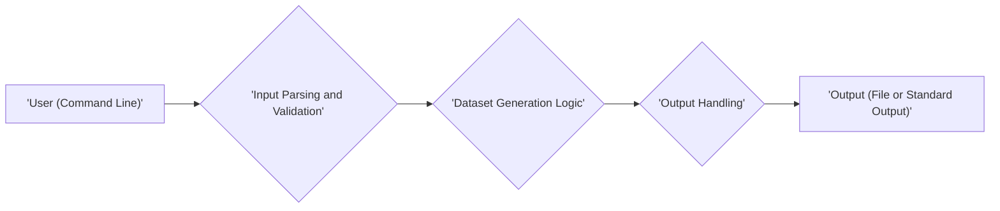

## Project Design Document: dznemptydataset - Improved

**1. Introduction**

This document provides a detailed design for the `dznemptydataset` project, a command-line tool designed to generate empty datasets of a specified size. This document serves as the foundational artifact for subsequent threat modeling activities, ensuring a common understanding of the system's architecture and potential vulnerabilities.

**1.1. Purpose**

The primary purpose of this document is to articulate the architecture, components, and data flow of the `dznemptydataset` project with sufficient detail to facilitate effective threat identification and analysis. This detailed design will be the basis for constructing threat models and identifying potential security weaknesses.

**1.2. Scope**

This document comprehensively describes the core functionality of the `dznemptydataset` project, encompassing:

*   Accepting user-provided input defining the desired dataset size.
*   Internally generating an empty dataset structure based on the specified size.
*   Facilitating the output of the generated empty dataset to a user-defined location or the standard output stream.

This document explicitly excludes:

*   Low-level implementation details specific to the chosen programming language (Python).
*   Comprehensive error handling strategies beyond basic input validation and reporting.
*   Advanced dataset generation features such as schema enforcement or data type specification.
*   Detailed deployment strategies beyond basic execution within a compatible environment.

**1.3. Goals**

The overarching goals of this design document are to:

*   Present a clear and thorough depiction of the system's architectural design.
*   Identify and describe all essential components and their interactions within the system.
*   Clearly illustrate the movement and transformation of data throughout the system's operation.
*   Establish a robust and well-defined foundation for the subsequent identification of potential security vulnerabilities and risks.

**2. System Overview**

The `dznemptydataset` project is conceived as a command-line interface (CLI) tool. User interaction is exclusively through the command line, where arguments are provided to dictate the desired dimensions of the empty dataset. Upon execution, the tool processes these inputs, constructs the empty dataset, and directs the output to either a specified file or the standard output stream.

**2.1. High-Level Architecture**

**2.2. Components**

*   **User (Command Line):** Represents the external entity (human or script) initiating the execution of the tool and providing input parameters via the command line.
*   **Input Parsing and Validation:** This crucial component is responsible for:
    *   Receiving the raw command-line arguments provided by the user.
    *   Deconstructing these arguments to extract the intended dataset size and, optionally, the output location.
    *   Performing rigorous validation on the extracted input, ensuring the size is a valid numerical value (e.g., a positive integer).
*   **Dataset Generation Logic:** The core processing unit of the tool, responsible for:
    *   Accepting the validated dataset size from the Input Parsing and Validation component.
    *   Dynamically creating an empty dataset structure in the system's memory, conforming to the specified size. The internal representation might involve an empty list, a dictionary with empty values, or another suitable data structure depending on implementation choices.
*   **Output Handling:** This component manages the final stage of the process, responsible for:
    *   Receiving the fully generated empty dataset from the Dataset Generation Logic component.
    *   Determining the appropriate output destination, either a user-specified file or the standard output stream, based on provided arguments or default behavior.
    *   Formatting the in-memory dataset structure into a suitable output format (e.g., a series of empty lines, a JSON structure with empty fields) and writing it to the designated output.

**2.3. Data Flow**

1. The **User** initiates the `dznemptydataset` tool from the command line, providing necessary arguments, including the desired dataset size (e.g., `dznemptydataset --size 100 --output data.txt`).
2. The **Input Parsing and Validation** component receives these raw command-line arguments.
3. This component parses the arguments, extracting the size value and potentially an output file path.
4. The component then validates the extracted size value, ensuring it represents a valid positive integer. If the input is invalid, an informative error message is displayed to the user, and the tool's execution is terminated.
5. If the input is deemed valid, the validated size (and optionally the output path) is passed to the **Dataset Generation Logic** component.
6. The **Dataset Generation Logic** component dynamically constructs an empty dataset structure within the system's memory, adhering to the received size specification.
7. The generated empty dataset is subsequently passed to the **Output Handling** component.
8. The **Output Handling** component determines the output destination (either the specified file or standard output). It then formats the in-memory dataset and writes the formatted output to the chosen destination.

**3. Component Details**

**3.1. Input Parsing and Validation**

*   **Responsibilities:**
    *   Accurately parse command-line arguments provided by the user.
    *   Extract the critical dataset size parameter from the parsed arguments.
    *   Perform rigorous validation of the dataset size, ensuring it is a non-negative integer within acceptable limits (to prevent resource exhaustion).
    *   Optionally extract and validate a user-provided output file path, ensuring it is a valid path.
    *   Implement robust handling for missing or malformed arguments, providing clear and informative error messages to the user.
*   **Inputs:** Raw command-line arguments as a string array.
*   **Outputs:** A validated dataset size (integer), a validated output file path (string, optional), or error messages indicating invalid input.

**3.2. Dataset Generation Logic**

*   **Responsibilities:**
    *   Receive the validated dataset size from the preceding component.
    *   Dynamically allocate and construct an empty data structure in memory based on the received size. This might involve creating a list of a specific length, a dictionary with a certain number of keys, or other appropriate structures depending on the intended representation of the "empty dataset."
    *   Ensure the generated data structure is indeed empty, containing no meaningful data.
*   **Inputs:** Validated dataset size (integer).
*   **Outputs:** An empty dataset structure residing in memory.

**3.3. Output Handling**

*   **Responsibilities:**
    *   Receive the generated empty dataset structure from the Dataset Generation Logic.
    *   Determine the final output destination: either a file specified by the user or the standard output stream if no file is specified.
    *   Format the in-memory empty dataset into a suitable output representation. This could involve writing empty lines, structuring the output as a JSON object with empty fields, or another appropriate format.
    *   Write the formatted empty dataset to the determined output destination. This includes handling file creation and writing operations.
*   **Inputs:** The generated empty dataset structure.
*   **Outputs:** The formatted empty dataset written to a file or the standard output stream.

**4. Data Storage**

*   **Volatile In-Memory Data:** The core of the generated empty dataset exists primarily as a volatile data structure within the system's memory during the tool's execution. This data is transient and disappears once the program finishes.
*   **Persistent Output File (Optional):** If the user provides an output file path, the generated empty dataset is serialized and written to a file on the file system. This represents persistent storage of the generated empty dataset.

**5. Security Considerations (Initial)**

This section outlines preliminary security considerations identified during the design phase. A more in-depth threat model will be developed based on this design.

*   **Command Injection:**  While the tool primarily processes numerical input for size, if future features involve processing string-based input (e.g., for output formatting), careful sanitization is needed to prevent command injection vulnerabilities.
*   **Input Validation and Sanitization:**  Robust validation of the dataset size is crucial to prevent resource exhaustion attacks by limiting excessively large size requests. If output paths are user-provided, validation is needed to prevent path traversal vulnerabilities (writing to arbitrary file system locations).
*   **Resource Exhaustion (Memory):** Generating very large empty datasets could lead to excessive memory consumption, potentially causing the application or even the system to crash. Implementing limits on the maximum allowed size and monitoring resource usage are important.
*   **Denial of Service (DoS):**  Malicious users might attempt to overload the system by repeatedly requesting the generation of extremely large datasets. Rate limiting or other DoS prevention mechanisms might be considered for publicly accessible deployments (though this tool is likely for local use).
*   **Dependency Vulnerabilities:** If the project utilizes external libraries, maintaining up-to-date versions and being aware of any known vulnerabilities in those dependencies is crucial. Supply chain security should be considered.
*   **Output File Permissions:** When writing to a file, the tool should operate with the least necessary privileges and ensure appropriate file permissions are set to prevent unauthorized access or modification of the generated output.

**6. Deployment**

The intended deployment model for `dznemptydataset` is as a standalone command-line tool, typically executed directly on a user's local machine or within a development/testing environment. Deployment primarily involves:

*   Packaging the core Python script (`.py` file) along with any necessary supporting files (if any).
*   Ensuring the user has a compatible Python interpreter (and potentially required libraries) installed on their system. This might involve providing instructions for setting up a suitable Python environment.
*   Making the script executable, which might involve setting appropriate file permissions on Unix-like systems.
*   Distribution could be as a simple script, or potentially packaged using tools like `PyInstaller` to create a standalone executable for easier distribution and execution on systems without pre-installed Python.

**7. Future Considerations**

*   **Support for Diverse Data Formats:** Expanding the tool to support generating empty datasets in various formats (e.g., CSV, JSON, XML) would significantly increase its utility. This would require adding options for specifying the desired output format and implementing corresponding formatting logic.
*   **Schema Definition Capabilities:** Allowing users to define a basic schema for the empty dataset (e.g., specifying column names and data types for a tabular dataset) would make the generated datasets more realistic and useful for testing and development purposes. This would introduce new input parameters and require more complex dataset generation logic.
*   **Enhanced Error Handling and Logging:** Implementing more comprehensive error handling mechanisms, including detailed logging of events and errors, would improve the tool's robustness, debuggability, and provide valuable insights into its operation.
*   **Security Implications of Future Features:** When considering future features, it's crucial to proactively assess their potential security implications. For example, allowing users to specify complex output formats might introduce new vulnerabilities related to format string bugs or injection attacks.