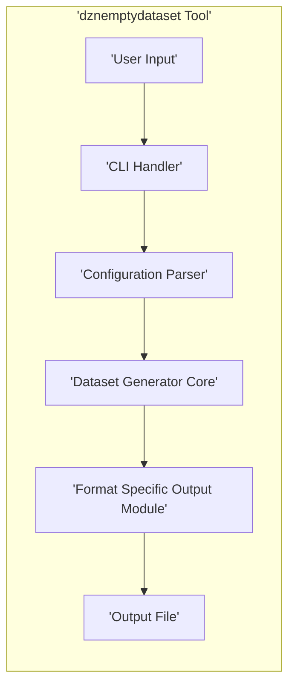

# Project Design Document: dznemptydataset (Improved)

**Version:** 1.1
**Date:** October 26, 2023
**Author:** AI Software Architect

## 1. Introduction

This document provides an enhanced design overview of the `dznemptydataset` project, a command-line tool designed for generating empty datasets in various formats. This detailed design serves as a crucial foundation for subsequent threat modeling activities, enabling a comprehensive understanding of the system's architecture, components, and data flow.

Building upon the initial analysis of the GitHub repository ([https://github.com/dzenbot/dznemptydataset](https://github.com/dzenbot/dznemptydataset)), this document elaborates on the anticipated internal workings and external interactions of the tool, providing a more granular view for security assessment.

## 2. Goals and Objectives

*   **Primary Goal:** To furnish a refined and more detailed design overview of the `dznemptydataset` project specifically tailored for effective threat modeling.
*   **Objectives:**
    *   Present a more granular description of the tool's architecture.
    *   Provide detailed responsibilities and potential interactions of key components.
    *   Illustrate the data flow within the system with greater clarity.
    *   Highlight potential areas of security concern with more specific examples based on the design.
    *   Offer a stronger foundation for identifying and analyzing potential threats and vulnerabilities.

## 3. High-Level Architecture

The `dznemptydataset` tool functions as a command-line application. Its core process involves accepting user-provided configuration, meticulously processing it, and subsequently generating an empty dataset conforming to the specified format.

*   **User Input (CLI Arguments/Configuration File):** Users interact with the tool by providing instructions, typically through command-line arguments or an external configuration file. This input dictates the desired dataset format, schema details (if applicable), and the intended output location.
*   **Configuration Parser:** This component is responsible for the critical task of interpreting the user's input. It validates the input against expected formats and rules, extracting the necessary parameters required for the subsequent dataset generation process.
*   **Dataset Generator Core:** This represents the central processing unit of the application. It receives the validated configuration and orchestrates the creation of the empty dataset structure in memory.
*   **Format Specific Output Module:** Based on the output format specified in the configuration (e.g., CSV, JSON, Parquet), this module takes the in-memory representation of the empty dataset and handles the formatting and writing of this data to the designated output file.
*   **Output Dataset File:** The final artifact produced by the tool – the generated empty dataset file, formatted according to the user's specifications.

## 4. Detailed Design

### 4.1. Components

*   **Command-Line Interface (CLI) Handler:**
    *   Receives and parses arguments provided directly on the command line.
    *   Handles the optional reading of configuration parameters from a specified file.
    *   Performs initial, basic validation of input parameters, such as checking for the presence of required arguments.
    *   Passes the raw configuration data to the Configuration Parser.
*   **Configuration Parser:**
    *   Accepts raw configuration data, which can originate from CLI arguments or a configuration file.
    *   Rigorous validation of the configuration data against a predefined schema or set of rules. This includes checking data types, mandatory fields, and allowed values.
    *   Handles errors encountered during parsing, providing informative messages to the user about invalid configuration.
    *   Transforms the raw configuration into a structured, internal representation (e.g., a dictionary or object) that is easily consumed by the Dataset Generator Core.
*   **Dataset Generator Core:**
    *   Receives the validated and structured configuration from the Configuration Parser.
    *   Contains the core logic for constructing the empty dataset structure in memory. This might involve creating empty lists, dictionaries, or dataframes based on the schema defined in the configuration.
    *   Determines the appropriate Format Specific Output Module to use based on the target output format.
    *   Passes the in-memory representation of the empty dataset to the selected output module.
*   **Format Specific Output Modules:**
    *   Dedicated modules responsible for handling the nuances of different output formats (e.g., `csv_writer.py`, `json_writer.py`, `parquet_writer.py`).
    *   Each module takes the generic, in-memory representation of the empty dataset.
    *   Formats the data according to the specific syntax and requirements of the target format (e.g., adding commas and newlines for CSV, structuring JSON objects).
    *   Utilizes appropriate libraries (e.g., `csv` for CSV, `json` for JSON, `pyarrow` or `fastparquet` for Parquet) to efficiently write the formatted data to the output file.
*   **Error Handling and Logging:**
    *   A centralized module or set of functions dedicated to managing errors that occur during any stage of the process.
    *   Provides clear and informative error messages to the user, aiding in debugging and problem resolution.
    *   Implements logging capabilities to record events, errors, and potentially audit trails for debugging and monitoring purposes.

### 4.2. Data Flow

1. **User Input:** The user initiates the tool execution by providing commands and arguments via the command line or by specifying a configuration file.
2. **CLI Handler:** The CLI Handler receives the initial input, parses the command-line arguments, and if specified, reads the contents of the configuration file.
3. **Configuration Parser:** The raw configuration data is then passed to the Configuration Parser. This component performs validation and transforms the data into a structured format.
4. **Dataset Generator Core:** The validated and structured configuration is received by the Dataset Generator Core. This core logic uses the configuration to construct the empty dataset structure in memory.
5. **Format Specific Output Module:** Based on the configured output format, the Dataset Generator Core selects the appropriate Format Specific Output Module. The in-memory empty dataset structure is then passed to this module.
6. **Output File:** The selected Format Specific Output Module formats the empty dataset and writes it to the designated output file on the file system.

### 4.3. Technology Stack (Assumptions)

Based on the project's nature and its presence on GitHub, the following technologies are highly probable:

*   **Primary Programming Language:** Python
*   **Python Standard Library:** Extensive use of Python's built-in libraries for core functionalities such as file input/output operations, command-line argument parsing (likely using `argparse`), and fundamental data structures (lists, dictionaries).
*   **External Libraries (Likely):**
    *   `json`: For handling the generation of JSON formatted datasets.
    *   `csv`: For managing the creation of CSV formatted datasets.
    *   `pyarrow` or `fastparquet`: For efficient handling of Parquet formatted datasets.
    *   Potentially other libraries depending on the range of supported output formats (e.g., libraries for YAML, Avro, etc.).

## 5. Security Considerations (Detailed)

This section expands on the potential security concerns, providing more specific examples relevant to threat modeling.

*   **Input Validation Vulnerabilities:**
    *   **Configuration Injection:** Malicious actors could craft specially designed configuration inputs (via CLI arguments or configuration files) to exploit weaknesses in the Configuration Parser. This could lead to:
        *   **Arbitrary Code Execution:** If the parser incorrectly handles certain input sequences, it might be possible to inject and execute arbitrary code on the system running the tool.
        *   **Denial of Service (DoS):**  Providing extremely large or deeply nested configurations could overwhelm the parser, leading to excessive resource consumption and a denial of service.
        *   **Logic Errors:**  Carefully crafted input might bypass validation checks and cause the Dataset Generator Core to behave in unintended ways.
    *   **Path Traversal:** If the configuration allows users to specify output file paths without proper sanitization, attackers could potentially overwrite critical system files or write sensitive information to unauthorized locations.
*   **Dependency Management Risks:**
    *   **Exploiting Vulnerable Dependencies:** The project's reliance on external libraries introduces a potential attack vector. Known vulnerabilities in these dependencies could be exploited if the project doesn't keep them updated. Attackers could leverage these vulnerabilities to compromise the system.
*   **Output Handling Weaknesses:**
    *   **Although generating *empty* datasets inherently reduces the risk of data injection in the output, consider future extensions:** If the tool were to be extended to include metadata or schema information derived from user input, insufficient output sanitization could lead to injection vulnerabilities (e.g., if generating SQL schema, malicious input could lead to SQL injection if not properly escaped).
*   **Error Handling and Information Disclosure:**
    *   **Verbose Error Messages:**  Overly detailed error messages, especially those logged or displayed to the user, could inadvertently reveal sensitive information about the system's internal structure, file paths, or dependencies, aiding attackers in reconnaissance.
*   **Resource Consumption and Denial of Service:**
    *   **Malicious Configuration for Resource Exhaustion:** Attackers could provide configurations that, while seemingly valid, cause the Dataset Generator Core to consume excessive CPU, memory, or disk space during processing, leading to a denial of service. For example, requesting an extremely large number of columns or rows (even if empty).
*   **Lack of Secrets Management (If Applicable in Future):** If future versions of the tool were to interact with external services requiring authentication (e.g., cloud storage), improper handling or storage of API keys or credentials would be a significant security risk.
*   **Insufficient Logging and Auditing:**  A lack of comprehensive logging could hinder the ability to detect and investigate malicious activity or security breaches.

## 6. Deployment Considerations

The `dznemptydataset` tool is primarily designed for deployment and execution as a command-line utility across various operating systems.

*   **Installation Methods:** Users will likely install the tool using standard Python package management tools like `pip`. Distribution via platform-specific packages (e.g., DEB, RPM) or container images (Docker) are also possibilities.
*   **Execution Environment:** The tool is executed directly from the command line, requiring users to have Python installed on their system. It will operate under the permissions of the user executing the command.
*   **File System Permissions:** The tool requires appropriate file system permissions to read configuration files (if used) and, critically, to write the generated output dataset file to the specified location. Incorrect permissions could lead to the tool failing or, in some cases, security vulnerabilities.
*   **Containerization (Docker):**  Deploying the tool within a Docker container provides a more isolated and reproducible environment, potentially enhancing security by limiting the tool's access to the host system.

## 7. Future Considerations (Security Implications)

Potential future enhancements to the `dznemptydataset` tool could introduce new security challenges:

*   **Generating Datasets with Sample Data:** Extending the tool to generate datasets populated with sample data would introduce significant new security considerations related to data sanitization, the source of the sample data, and potential biases or sensitive information within the samples.
*   **Schema Inference from Existing Data Sources:** If the tool were to automatically infer schemas from existing data sources, vulnerabilities related to accessing and processing potentially untrusted data sources would need careful consideration. Authentication and authorization for accessing these sources would become critical.
*   **Integration with Cloud Services:** Direct integration with cloud storage (e.g., AWS S3, Azure Blob Storage, Google Cloud Storage) or data processing services would necessitate secure handling of cloud credentials and adherence to cloud security best practices.
*   **Web Interface or API:** Providing a web interface or REST API for the tool would introduce a wide range of web application security concerns, including authentication, authorization, input validation (especially for web forms and API requests), and protection against common web attacks (e.g., Cross-Site Scripting (XSS), Cross-Site Request Forgery (CSRF)).
*   **Data Masking or Anonymization Features:** If the tool were to incorporate features for masking or anonymizing data (even if generating empty datasets based on a masked schema), the implementation of these features would need to be robust to prevent information leakage or the possibility of reversing the masking/anonymization.

## 8. Conclusion

This improved design document offers a more detailed and nuanced understanding of the `dznemptydataset` project, specifically tailored for effective threat modeling. By providing a granular view of the architecture, component responsibilities, and data flow, it facilitates a more thorough identification and analysis of potential security vulnerabilities. This document serves as a valuable resource for security assessments, guiding mitigation strategies and informing secure development practices for the project's future.