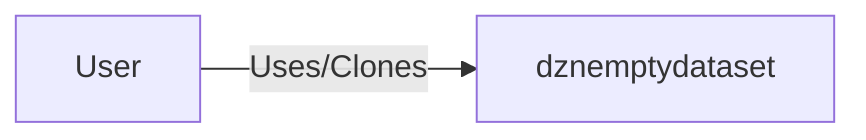
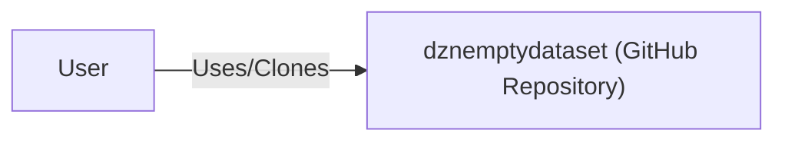
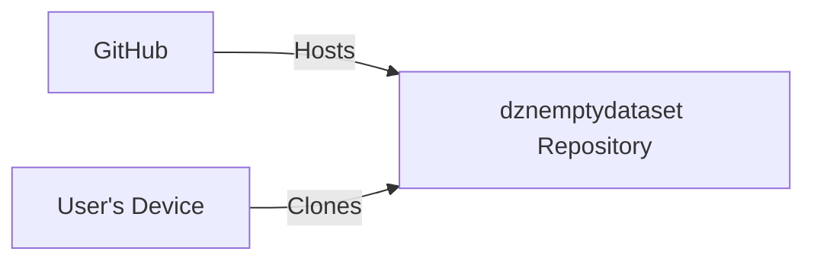
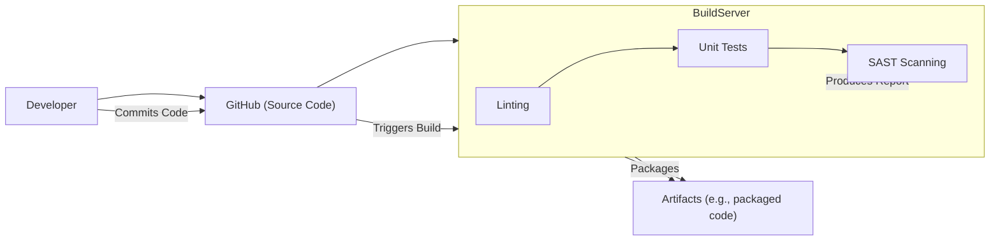

Okay, let's create a design document for the `dznemptydataset` project.

# BUSINESS POSTURE

Business Priorities and Goals:

*   Provide a minimal, empty dataset template for demonstration or testing purposes.
*   Serve as a starting point for building more complex datasets.
*   Illustrate a basic file structure for data projects.
*   Be easily cloneable and usable via Git and GitHub.

Business Risks:

*   Since this is an *empty* dataset, the primary business risk isn't data leakage, but rather misuse of the template.  If users build upon this template without adding appropriate security controls for *their* data, they could expose *their* sensitive information. This is a risk of the template being used as a foundation without further security considerations.
*   Another risk is that the template might be too simplistic and not reflect best practices for real-world, production-ready datasets, leading to users developing insecure or poorly designed systems.
*   Lack of documentation or clear usage guidelines could lead to misinterpretation and incorrect implementation by users.

# SECURITY POSTURE

Existing Security Controls:

*   security control: The repository is public, meaning access control is inherently open. This is by design for a template project. (GitHub repository settings).
*   security control: Version control using Git allows tracking of changes and potential rollbacks. (Git history).
*   security control: GitHub provides basic infrastructure security (physical security of their servers, etc.). (GitHub's security documentation).

Accepted Risks:

*   accepted risk: The project contains no sensitive data itself, so the risk of data breaches is minimal *for the template itself*.
*   accepted risk: The project is intentionally simple and doesn't implement complex security features, as it's meant to be a starting point.

Recommended Security Controls:

*   security control: Add a `SECURITY.md` file to the repository. This file should clearly state the security posture of the *template* and strongly advise users to implement appropriate security measures when they add their own data.  It should also include contact information for reporting security vulnerabilities.
*   security control: Add a `CONTRIBUTING.md` file that outlines secure coding practices and guidelines for contributing to the project, if contributions are allowed.
*   security control: Consider adding a basic linter (e.g., for Python code if the template is expanded) to enforce coding style and potentially catch simple errors.

Security Requirements:

*   Authentication: Not applicable for this specific, empty dataset template. However, any system built *using* this template that handles sensitive data *must* implement robust authentication mechanisms.
*   Authorization: Not directly applicable to the template itself.  Systems built upon it should implement appropriate authorization controls to restrict access to data based on user roles and permissions.
*   Input Validation: Not applicable to the empty template.  Any system built using this template that accepts user input or external data *must* implement thorough input validation to prevent injection attacks and other vulnerabilities.
*   Cryptography: Not applicable to the empty template. Systems built upon this template that handle sensitive data should use strong, industry-standard cryptographic techniques for data at rest and in transit.

# DESIGN

## C4 CONTEXT

Element Descriptions:

*   Element:
    *   Name: User
    *   Type: Person
    *   Description: A developer or data scientist who uses the `dznemptydataset` template.
    *   Responsibilities: Clones the repository, uses it as a starting point for their own project, adds their own data and security controls.
    *   Security controls: Responsible for implementing security controls in their own project built upon the template.

*   Element:
    *   Name: dznemptydataset
    *   Type: Software System
    *   Description: A GitHub repository containing an empty dataset template.
    *   Responsibilities: Provides a basic file structure, serves as a starting point for data projects.
    *   Security controls: Limited inherent security controls; relies on GitHub's infrastructure security and version control.

## C4 CONTAINER

Since this project is extremely simple, the Container diagram is essentially the same as the Context diagram.

Element Descriptions:

*   Element:
    *   Name: User
    *   Type: Person
    *   Description: A developer or data scientist.
    *   Responsibilities: Clones, uses, and extends the template.
    *   Security controls: Responsible for implementing security in their derived project.

*   Element:
    *   Name: dznemptydataset (GitHub Repository)
    *   Type: Repository
    *   Description: The Git repository hosted on GitHub.
    *   Responsibilities: Stores the template files, tracks changes.
    *   Security controls: Relies on GitHub's security and Git's version control.

## DEPLOYMENT

Possible Deployment Solutions:

1.  No deployment needed (user clones the repository).
2.  Deployment as a GitHub Template Repository.

Chosen Solution: No deployment needed (user clones the repository). This is the simplest and most direct approach for this project.

Element Descriptions:

*   Element:
    *   Name: GitHub
    *   Type: Platform
    *   Description: The online platform hosting the Git repository.
    *   Responsibilities: Provides hosting, version control, access control (for collaborators).
    *   Security controls: Implements platform-level security (physical, network, etc.).

*   Element:
    *   Name: dznemptydataset Repository
    *   Type: Repository
    *   Description: The Git repository containing the template.
    *   Responsibilities: Stores the files, tracks changes.
    *   Security controls: Relies on GitHub's security and Git's version control.

*    Element:
    *   Name: User's Device
    *   Type: Device
    *   Description: The user's computer or development environment.
    *   Responsibilities: Clones the repository, runs the code (if any).
    *   Security controls: Relies on the user's device security (OS, antivirus, etc.).

## BUILD

This project, in its current state, has no build process. It's simply a set of files. However, if it were to be expanded (e.g., with Python code), a build process might be added.

Hypothetical Build Process (if expanded):

Build Process Description:

1.  Developer commits code to the GitHub repository.
2.  A build server (e.g., GitHub Actions) is triggered.
3.  Linting is performed to check code style.
4.  Unit tests are run.
5.  Static Application Security Testing (SAST) is performed to identify potential vulnerabilities.
6.  If all steps pass, the code is packaged into artifacts.

Security Controls in Build Process:

*   security control: Linting helps enforce coding standards and can catch some errors.
*   security control: Unit tests verify the functionality of individual components.
*   security control: SAST scanning helps identify security vulnerabilities in the code.
*   security control: Build automation ensures a consistent and repeatable build process.

# RISK ASSESSMENT

*   Critical Business Process: Providing a clean, usable template for data projects. The risk is that the template itself could be flawed or lead to insecure practices.
*   Data to Protect:  The template itself contains no sensitive data.  The risk lies in the *use* of the template.  Users must be responsible for protecting *their* data when they build upon this foundation.
    *   Data Sensitivity:  Not applicable to the template itself.  The sensitivity of data added by users will vary.

# QUESTIONS & ASSUMPTIONS

Questions:

*   Will this template be expanded to include any actual code (e.g., Python scripts for data processing)? If so, a build process and more robust security considerations will be needed.
*   Will there be any contribution guidelines or community involvement? If so, a `CONTRIBUTING.md` and `SECURITY.md` are essential.
*   What specific types of data projects is this template intended to support? This will help tailor the template and its documentation.

Assumptions:

*   BUSINESS POSTURE: The primary goal is to provide a simple, easily accessible starting point, not a production-ready, highly secure system.
*   SECURITY POSTURE: Users are expected to understand basic security principles and implement appropriate controls when they add their own data.
*   DESIGN: The project will remain relatively simple, serving as a basic template rather than a complex framework.