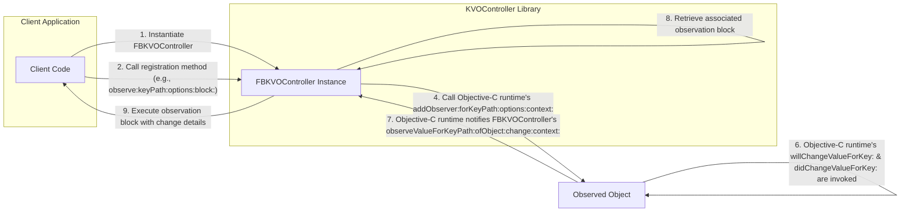

# Project Design Document: KVOController

**Version:** 1.1
**Date:** October 26, 2023
**Author:** AI Software Architect

## 1. Introduction

This document provides an enhanced design overview of the KVOController project, an Objective-C library designed to streamline and centralize Key-Value Observing (KVO) within Cocoa-based applications. This revised document aims to provide a more robust foundation for subsequent threat modeling activities by offering a clearer and more detailed understanding of the system's architecture, components, and data flow.

### 1.1. Purpose

The primary purpose of this document is to furnish a comprehensive design description of KVOController, specifically tailored to facilitate effective threat modeling. It meticulously outlines the library's core components, their interactions, and the data they process. This level of detail is crucial for security analysts to accurately identify potential vulnerabilities, attack vectors, and areas of security concern within the library and its typical usage scenarios.

### 1.2. Scope

This document focuses on the internal design and operational mechanics of the KVOController library itself. It details how the library manages KVO observations and interacts with both client application code and the underlying Objective-C runtime environment. While it does not delve into the specific designs of applications utilizing KVOController, it provides the necessary context to understand the library's role and potential security implications within such applications.

### 1.3. Audience

This document is primarily intended for:

* Security engineers and analysts tasked with performing threat modeling and security assessments on systems incorporating KVOController.
* Software developers seeking an in-depth understanding of KVOController's architecture and internal workings.

## 2. Overview

KVOController is an Objective-C library that simplifies the implementation of Key-Value Observing (KVO), a mechanism in Cocoa for observing changes to properties of objects. It offers a more structured and less error-prone approach to managing observers compared to manual KVO implementation, thereby reducing boilerplate code and mitigating common pitfalls like failing to unregister observers.

### 2.1. Key Features

* **Centralized and Typed Observer Management:** Provides a dedicated controller object (`FBKVOController`) to manage all KVO observers for a given observed object, offering type safety for observation blocks.
* **Block-Based Observation with Context:** Enables the definition of observation logic using concise blocks, including the ability to pass a context object for more complex scenarios.
* **Automatic Observer Lifecycle Management:** Automatically handles the unregistration of observers when the `FBKVOController` instance is deallocated, preventing potential crashes due to dangling observer pointers.
* **Flexible Observation Options:** Supports various KVO options, such as receiving initial notifications and specifying the context.
* **Thread Safety Considerations:** Designed with thread safety in mind to allow observation from different threads, although proper usage in concurrent environments remains crucial.

## 3. Architecture

The core of the KVOController library is the `FBKVOController` class, which acts as a central hub for managing KVO observer registrations and notifications.

### 3.1. Components

* **`FBKVOController` Instance:** The primary object responsible for managing KVO observations. It maintains collections of registered observers, associating them with the observed object and key paths.
* **Observer Registration Methods (e.g., `observe:keyPath:options:block:`):** Public methods on `FBKVOController` that client code uses to register observers. These methods accept the observed object, the key path to observe, observation options, and a block to execute upon changes.
* **Observation Blocks:** Closure-based code blocks that are executed when a change to an observed property occurs. These blocks typically receive the observed object, the changed key path, and a change dictionary containing the old and new values.
* **Observed Object:** The instance of an Objective-C class whose properties are being monitored for changes.
* **Observed Key Path (String):** A string representing the path to the property being observed (e.g., `"name"`, `"data.count"`).
* **Observation Options (enum):**  Flags specifying the desired observation behavior (e.g., `NSKeyValueObservingOptionNew`, `NSKeyValueObservingOptionOld`, `NSKeyValueObservingOptionInitial`).
* **Observation Context (void *):** An optional pointer that can be provided during registration and is passed back to the observation block. This allows for associating custom data with an observation.
* **Internal Observer Registry:**  Data structures within `FBKVOController` (likely dictionaries or sets) used to store and manage the registered observers and their associated information.
* **Objective-C Runtime's KVO Implementation:** The underlying mechanism provided by the Objective-C runtime that KVOController leverages to register and receive KVO notifications.

### 3.2. Interactions and Data Flow

The following diagram illustrates the sequence of events involved in registering an observer and receiving KVO notifications using KVOController:

**Detailed Steps:**

1. **Client Code Instantiates `FBKVOController`:** The client application creates an instance of `FBKVOController`, often associating it with the object whose observations it will manage.
2. **Client Code Registers Observer:** The client calls a registration method on the `FBKVOController` instance, providing the object to observe, the key path, observation options, and the block to execute when the property changes.
3. **`FBKVOController` Stores Observer Details:** Internally, the `FBKVOController` stores the provided information (observed object, key path, block, options, context) in its internal observer registry.
4. **`FBKVOController` Adds Runtime Observer:** The `FBKVOController` uses the Objective-C runtime's `addObserver:forKeyPath:options:context:` method to register itself as an observer of the specified key path on the observed object. This is the core KVO mechanism.
5. **Observed Property is Modified:**  At some point, the value of the observed property on the observed object is changed, either directly or indirectly.
6. **Objective-C Runtime Notifications:** The Objective-C runtime's KVO implementation intercepts property changes by automatically invoking `willChangeValueForKey:` before the change and `didChangeValueForKey:` after the change.
7. **Runtime Notifies `FBKVOController`:**  As a registered observer, the `FBKVOController`'s `observeValueForKeyPath:ofObject:change:context:` method is called by the Objective-C runtime, providing details about the change (key path, object, change dictionary, context).
8. **`FBKVOController` Retrieves Observation Block:** The `FBKVOController` uses the provided key path and observed object to look up the corresponding observation block in its internal registry.
9. **`FBKVOController` Executes Observation Block:** The stored observation block is executed, with the `change` dictionary (containing `NSKeyValueChangeOldKey` and `NSKeyValueChangeNewKey` if requested) and the provided context passed as arguments.

### 3.3. Data Handling

* **Observed Object References:** `FBKVOController` maintains strong references to the observed objects for which it manages observations. Improper lifecycle management of the controller could lead to issues if the observed object is deallocated prematurely.
* **Key Path Strings:** Key paths are stored as strings. Incorrectly formatted or maliciously crafted key paths could potentially lead to unexpected behavior or exceptions.
* **Observation Options:** The selected observation options are stored and used to configure the behavior of the underlying KVO mechanism.
* **Observation Blocks (Code):** The actual code blocks to be executed are stored as closures. Potential vulnerabilities could arise if these blocks perform insecure operations or access sensitive data without proper safeguards.
* **Observation Context Pointers:** The optional context pointer is stored and passed back to the observation block. If this pointer references sensitive data, it needs to be handled securely.
* **Change Dictionary (NSDictionary):** The `change` dictionary passed to the observation block contains information about the property change. The contents of this dictionary depend on the observation options specified.

## 4. Security Considerations (For Threat Modeling)

This section expands on potential security concerns to guide threat modeling efforts.

* **Unauthorized Observation of Sensitive Properties:** An attacker gaining the ability to register observers on sensitive object properties could lead to unauthorized data access and information disclosure. This could occur through vulnerabilities in the application logic that uses KVOController.
* **Resource Exhaustion through Excessive Observation:**  Maliciously registering a large number of observers or triggering frequent property changes could lead to excessive resource consumption (CPU, memory), potentially causing a denial-of-service condition.
* **Information Disclosure via Observation Context:** If the observation context pointer is used to pass sensitive information and is not handled carefully within the observation block, it could be a source of information leakage.
* **Race Conditions in Concurrent Environments:** While KVOController aims for thread safety, improper usage in multithreaded environments could introduce race conditions, leading to unexpected behavior or potential vulnerabilities if observer registration or unregistration is not properly synchronized.
* **Object Deallocation Issues Leading to Use-After-Free:** Although KVOController manages observer unregistration, incorrect lifecycle management of the `FBKVOController` instance itself could potentially lead to scenarios where the controller is deallocated while observations are still active, potentially resulting in crashes or use-after-free vulnerabilities if the underlying KVO mechanism attempts to access the deallocated controller.
* **Key Path Injection:** While less likely with direct usage of KVOController, if key paths are derived from untrusted input, there's a theoretical risk of "key path injection," where a carefully crafted key path could be used to access unintended properties or trigger unexpected behavior.
* **Side Effects within Observation Blocks:** If the code within the observation blocks has unintended side effects or performs insecure operations, this could be exploited. For example, a block that modifies shared state without proper synchronization could introduce concurrency issues.
* **Abuse of Observation Options:** While not a direct vulnerability in KVOController, the misuse of observation options (e.g., always requesting old and new values even when not needed) could lead to unnecessary overhead and potential performance issues.

## 5. Dependencies

KVOController has minimal external dependencies, primarily relying on the fundamental frameworks provided by Apple.

* **Foundation Framework:** Provides the core KVO implementation (`NSObject` protocol methods related to KVO) and other essential Objective-C classes and utilities.

## 6. Deployment

KVOController is typically integrated into applications targeting Apple platforms (iOS, macOS, tvOS, watchOS). Integration can be achieved through:

* **Direct Source Code Inclusion:** Adding the KVOController source files directly to the project.
* **Dependency Management Tools:** Using tools like CocoaPods or Carthage to manage the KVOController dependency.

The library runs within the application's process and its lifecycle is tied to the objects that manage its instances.

## 7. Future Considerations (Beyond Immediate Threat Modeling)

* Exploring more advanced observation patterns or abstractions.
* Potential integration with reactive programming frameworks.

This improved design document provides a more detailed and nuanced understanding of the KVOController library, enhancing its value as a foundation for thorough threat modeling. The expanded descriptions of components, interactions, data flow, and security considerations offer a more comprehensive view of potential attack surfaces and vulnerabilities.
