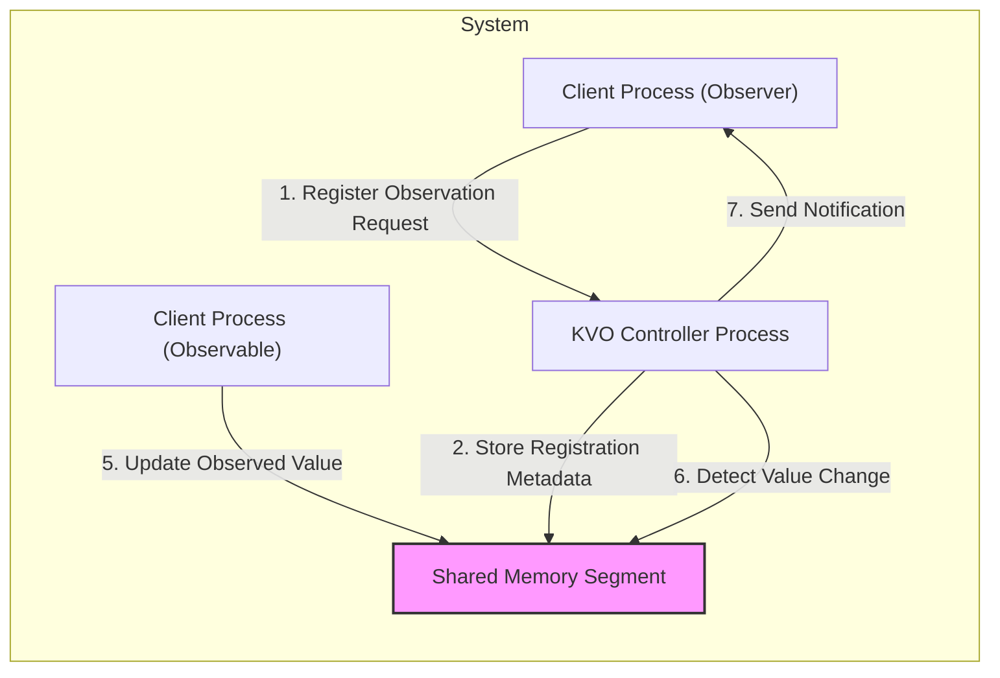
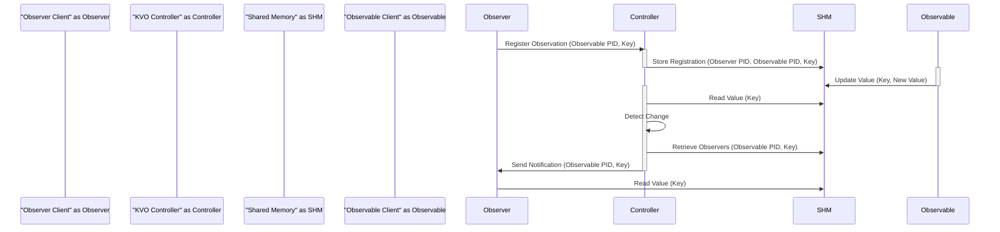

# Project Design Document: KVO Controller

**Version:** 1.1
**Date:** October 26, 2023
**Author:** AI Software Architect

## 1. Introduction

This document provides an enhanced design for the `kvocontroller` project, an archived project from Facebook designed to enable Key-Value Observation (KVO) across different processes. This detailed design will serve as a robust foundation for future threat modeling activities.

The `kvocontroller` project facilitates inter-process KVO, allowing a "client process (observer)" to monitor changes in specific properties ("keys") of objects residing in another "client process (observable)". This inter-process communication (IPC) mechanism leverages a shared memory segment for efficient data transfer and a central "KVO Controller Process" for managing observation registrations and delivering change notifications.

## 2. Goals and Objectives

The primary goals of the `kvocontroller` project are:

*   To provide a reliable and efficient mechanism for inter-process KVO.
*   To offer a high-performance solution by utilizing shared memory for data exchange.
*   To ensure a consistent and up-to-date view of observed values across participating processes.
*   To provide a well-defined and easy-to-use API for client processes to register and receive KVO notifications.
*   To minimize overhead and latency associated with inter-process KVO.

## 3. High-Level Architecture

The system comprises three core components that interact to facilitate inter-process KVO:

*   **"Client Process (Observer)":** The process that initiates the observation and receives notifications when the observed value changes.
*   **"Client Process (Observable)":** The process whose properties are being observed and which updates the observed values.
*   **"KVO Controller Process":** A dedicated central process responsible for managing all KVO registrations, monitoring value changes, and dispatching notifications to observers.
*   **"Shared Memory Segment":** A shared memory region accessible by all participating processes, used to store KVO registration metadata and the actual observed values.

**Interaction Flow:**

1. A "Client Process (Observer)" sends a registration request to the "KVO Controller Process", specifying the target "Client Process (Observable)" and the key to observe.
2. The "KVO Controller Process" stores the received registration details (including observer process ID, observable process ID, and the observed key) within the "Shared Memory Segment".
3. The "Client Process (Observable)" updates the value of the observed key directly within the "Shared Memory Segment".
4. The "KVO Controller Process" periodically monitors the "Shared Memory Segment" for changes in the registered observed values. This might involve comparing timestamps or using other change detection mechanisms.
5. Upon detecting a change in an observed value, the "KVO Controller Process" identifies all "Client Process (Observer)" instances registered for that specific key and observable process.
6. The "KVO Controller Process" sends a notification to each registered "Client Process (Observer)". This notification typically includes information about the observable process and the changed key.
7. The "Client Process (Observer)" receives the notification and can then retrieve the updated value from the "Shared Memory Segment".

## 4. Detailed Design

### 4.1. "KVO Controller Process"

*   **Responsibilities:**
    *   Receiving and validating KVO registration and unregistration requests from client processes.
    *   Maintaining a consistent and up-to-date registry of active KVO observations within the "Shared Memory Segment".
    *   Efficiently monitoring the "Shared Memory Segment" for changes in observed values.
    *   Identifying and notifying the correct observer processes when observed values change.
    *   Managing the lifecycle of KVO registrations, including handling process termination and explicit unregistration requests.
    *   Potentially implementing error handling, logging, and resource management related to KVO operations.
*   **Components:**
    *   **"Registration Manager":**
        *   Handles incoming registration requests, validating parameters (e.g., process IDs, key names).
        *   Adds new registrations to the "Registration Table" in the "Shared Memory Segment".
        *   Handles unregistration requests, removing entries from the "Registration Table".
    *   **"Monitoring Engine":**
        *   Periodically scans the "Value Store" within the "Shared Memory Segment" for modifications.
        *   Employs a change detection mechanism (e.g., comparing timestamps, storing previous values).
        *   Triggers the "Notification Manager" when changes are detected.
    *   **"Notification Manager":**
        *   Retrieves the list of registered observers for a changed key from the "Registration Table".
        *   Constructs and sends notifications to the relevant observer processes, potentially using IPC mechanisms like message queues or signals.
    *   **"IPC Listener":**
        *   Listens for incoming registration and unregistration requests from client processes. This could utilize mechanisms like Unix domain sockets, shared memory message queues, or other IPC methods.
        *   Handles communication protocols and message parsing.
    *   **"Shared Memory Interface":**
        *   Provides an abstraction layer for interacting with the "Shared Memory Segment".
        *   Encapsulates details of memory mapping, locking, and data access.

### 4.2. "Client Process (Observer)"

*   **Responsibilities:**
    *   Initiating KVO registration requests with the "KVO Controller Process".
    *   Receiving KVO notifications from the "KVO Controller Process".
    *   Accessing the "Shared Memory Segment" to retrieve the updated observed value upon receiving a notification.
    *   Managing its own set of KVO subscriptions and potentially unregistering observations when no longer needed.
*   **Components:**
    *   **"KVO Registration Client":**
        *   Provides an API for the client application to register and unregister for KVO notifications.
        *   Handles communication with the "KVO Controller Process" to send registration requests.
    *   **"Notification Listener":**
        *   Listens for incoming KVO notifications from the "KVO Controller Process".
        *   Handles the reception and processing of notification messages.
        *   Potentially uses a callback mechanism to inform the application about received notifications.
    *   **"Shared Memory Interface":**
        *   Provides an abstraction layer for accessing the "Shared Memory Segment" to read the updated observed values.

### 4.3. "Client Process (Observable)"

*   **Responsibilities:**
    *   Holding the data that can be observed by other processes.
    *   Updating the observed values within the "Shared Memory Segment".
    *   Potentially managing access control and synchronization to ensure data integrity when updating shared values.
*   **Components:**
    *   **"Shared Memory Interface":**
        *   Provides an API for updating the observed values in the designated area within the "Shared Memory Segment".
        *   May include mechanisms for locking or atomic operations to ensure data consistency during updates.

### 4.4. "Shared Memory Segment"

*   **Responsibilities:**
    *   Providing a shared memory region accessible by all participating processes.
    *   Storing KVO registration metadata, enabling the "KVO Controller Process" to track active observations.
    *   Storing the actual observed values that are being monitored.
*   **Data Structures:**
    *   **"Registration Table":**
        *   Stores information about active KVO registrations.
        *   Each entry might contain:
            *   "Observable Process ID"
            *   "Observer Process ID"
            *   "Observed Key"
            *   Potentially a timestamp for registration.
    *   **"Value Store":**
        *   Stores the observed values.
        *   Each entry might contain:
            *   "Process ID of the Observable"
            *   "Key"
            *   "Value"
            *   "Last Updated Timestamp" (used for change detection).

## 5. Data Flow

**Detailed Data Flow for a KVO Event:**

1. The **"Observer Client"** sends a registration request to the **"KVO Controller"**, specifying the process ID of the observable client and the key to observe.
2. The **"KVO Controller"** receives the request and writes the registration details into the **"Shared Memory"**.
3. The **"Observable Client"** updates the value of the observed key in the **"Shared Memory"**.
4. The **"KVO Controller"** periodically reads the values in the **"Shared Memory"**.
5. The **"KVO Controller"** detects a change in the observed value by comparing the current value with the previously read value (or using timestamps).
6. The **"KVO Controller"** retrieves the list of observers registered for that specific key and observable process from the **"Shared Memory"**.
7. The **"KVO Controller"** sends a notification to the **"Observer Client"**, indicating that the observed value has changed.
8. The **"Observer Client"**, upon receiving the notification, reads the updated value from the **"Shared Memory"**.

## 6. Security Considerations (Pre-Threat Modeling)

This section outlines potential security vulnerabilities and threats that should be thoroughly investigated during threat modeling:

*   **Unauthorized Access to Shared Memory:**
    *   **Threat:** Malicious processes could gain unauthorized access to the "Shared Memory Segment" to read sensitive observed values or tamper with registration data, potentially disrupting the KVO mechanism or gaining unauthorized information.
    *   **Mitigation Considerations:** Implement robust access control mechanisms at the operating system level to restrict access to the shared memory segment to only authorized processes.
*   **Data Integrity Violations in Shared Memory:**
    *   **Threat:** Malicious or faulty processes with write access to the "Shared Memory Segment" could corrupt observed values or registration data, leading to incorrect notifications or system instability.
    *   **Mitigation Considerations:** Employ checksums or other data integrity checks for data stored in shared memory. Implement proper synchronization mechanisms (e.g., mutexes, semaphores) to prevent race conditions during concurrent access.
*   **Denial of Service (DoS) Attacks on the "KVO Controller Process":**
    *   **Threat:** A malicious client could flood the "KVO Controller Process" with a large number of registration or unregistration requests, overwhelming its resources and potentially causing it to crash or become unresponsive.
    *   **Mitigation Considerations:** Implement rate limiting on registration requests. Employ input validation to prevent malformed requests from consuming excessive resources. Consider resource quotas for individual clients.
*   **Spoofing of Notifications:**
    *   **Threat:** A malicious process could forge KVO notifications, impersonating the "KVO Controller Process" and misleading observer clients into taking incorrect actions based on false information.
    *   **Mitigation Considerations:** Implement secure communication channels between the "KVO Controller Process" and client processes. Use digital signatures or message authentication codes to verify the authenticity of notifications.
*   **Information Disclosure through Shared Memory:**
    *   **Threat:** If the "Shared Memory Segment" is not properly managed, residual data from previous KVO operations could be left behind, potentially exposing sensitive information to unauthorized processes that gain access later.
    *   **Mitigation Considerations:** Securely initialize and clear memory regions within the "Shared Memory Segment" before and after use. Implement appropriate memory management practices.
*   **Input Validation Failures:**
    *   **Threat:** The "KVO Controller Process" might be vulnerable to malformed or malicious input in registration requests (e.g., excessively long key names, invalid process IDs), potentially leading to buffer overflows or other vulnerabilities.
    *   **Mitigation Considerations:** Implement thorough input validation and sanitization for all data received by the "KVO Controller Process".
*   **Race Conditions and Synchronization Issues:**
    *   **Threat:** Concurrent access to the "Shared Memory Segment" by multiple processes without proper synchronization can lead to race conditions, resulting in data corruption or inconsistent state.
    *   **Mitigation Considerations:** Utilize appropriate synchronization primitives (e.g., mutexes, semaphores) to protect shared data structures within the "Shared Memory Segment".

## 7. Deployment Considerations

*   The "KVO Controller Process" must be initiated and running before any client processes attempt to register for observations.
*   The "Shared Memory Segment" needs to be created and configured with appropriate permissions to allow access from all participating processes. Operating system-specific mechanisms for shared memory management will be utilized (e.g., `shmget` on Linux).
*   Client processes need a mechanism to discover and communicate with the "KVO Controller Process". This could involve using a well-known Unix domain socket path, a shared configuration file, or a dedicated service discovery mechanism.
*   Robust error handling and logging mechanisms are crucial for debugging, monitoring, and troubleshooting the KVO system. Logging should include information about registration requests, notifications sent, and any errors encountered.
*   Consideration should be given to the lifecycle management of the "Shared Memory Segment". Mechanisms for cleanup and deallocation when the KVO system is no longer needed are important.

## 8. Future Considerations

*   **Scalability and Performance Enhancements:** Explore strategies to improve the scalability of the KVO system to handle a larger number of clients and observations. This could involve optimizing the monitoring engine, using more efficient data structures, or exploring distributed architectures.
*   **Enhanced Security Features:** Implement more advanced security measures, such as authentication and authorization for registration requests, encryption of data within the "Shared Memory Segment", and more sophisticated intrusion detection mechanisms.
*   **Fault Tolerance and Resilience:** Design the system to be more resilient to failures, such as the unexpected termination of client processes or the "KVO Controller Process". This could involve implementing mechanisms for automatic re-registration or failover.
*   **Monitoring and Metrics Collection:** Integrate comprehensive monitoring and metrics collection capabilities to track the performance and health of the KVO system. This could include metrics on registration rates, notification latency, and resource utilization.
*   **Support for Different Data Types:** Extend the system to support a wider range of data types for observed values, potentially including complex objects.
*   **API Enhancements:** Consider providing a richer and more flexible API for client processes, potentially allowing for more fine-grained control over observation parameters and notification delivery.

This enhanced design document provides a more detailed and comprehensive understanding of the `kvocontroller` project. It serves as a valuable resource for subsequent threat modeling activities, enabling a deeper analysis of potential security risks and the development of effective mitigation strategies.
