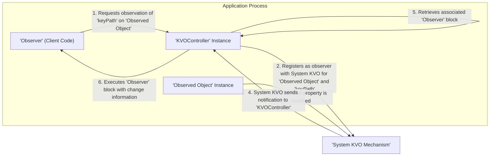

# Project Design Document: kvocontroller

**Version:** 1.1
**Date:** October 26, 2023
**Author:** AI Software Architect

## 1. Introduction

This document provides an enhanced design overview of the `kvocontroller` project, an archived project from Facebook on GitHub. The primary goal of this document is to offer a clear and detailed articulation of the system's architecture, components, and data flow. This level of detail is essential for conducting thorough threat modeling exercises. While the project is in an archived state, understanding its design principles remains valuable for security analysis, potential adaptation, or learning about KVO management techniques.

## 2. Goals and Non-Goals

### 2.1. Goals

*   To offer a more streamlined and type-safe API for utilizing Key-Value Observing (KVO) within Objective-C and potentially Swift environments.
*   To significantly reduce the amount of repetitive boilerplate code typically required for manual KVO setup, observation, and cleanup.
*   To provide a block-based mechanism for handling KVO notifications, offering a more concise and localized approach compared to traditional delegate methods.
*   To automatically manage the lifecycle of KVO observers, thereby mitigating the risk of crashes caused by accessing deallocated observer objects (dangling pointers).
*   Potentially to enable the observation of multiple distinct key paths on a single observed object using a unified observer block or handler.

### 2.2. Non-Goals

*   To serve as a comprehensive reactive programming framework encompassing features beyond the core KVO observation mechanism.
*   To incorporate advanced data transformation, filtering, or aggregation capabilities directly within the KVO notification pipeline.
*   To inherently manage complex multi-threading scenarios beyond providing options for specifying the dispatch queue on which notifications are delivered.
*   To offer tight integration with specific UI frameworks beyond the fundamental KVO mechanism provided by the operating system.
*   To provide built-in functionality for the persistent storage or serialization of KVO observer configurations.

## 3. System Architecture

The `kvocontroller` library is designed as a client-side component, intended for direct integration into applications requiring KVO functionality. It operates within the application's process and does not involve separate server-side components or network communication.

### 3.1. Key Components

*   **`KVOController` Instance:** This is the central object responsible for orchestrating KVO observations. It acts as an intermediary, managing the relationship between the observed object and the observer's notification handler. There might be variations or specialized subclasses of this controller to cater to different observation patterns.
*   **Observer Block (Client-Provided):** This is a closure or block of code supplied by the client that defines the actions to be taken when a change is observed. It receives information about the property change.
*   **Observed Object Instance:** This is an instance of a class whose properties are being monitored for changes. This object must be KVO-compliant, adhering to the necessary runtime mechanisms.
*   **Key Path String:** A string literal that specifies the particular property or a chain of properties to observe on the `Observed Object`. This string uses dot notation to traverse object graphs.
*   **Change Notification Payload:** The data passed to the observer block when a change occurs. This typically includes the old and new values of the observed property.
*   **Internal Observation Registry:** The `KVOController` likely maintains an internal data structure (e.g., a dictionary or set) to keep track of active observations, associating observers with their observed objects and key paths.

## 4. Data Flow

The typical sequence of events when observing a property change using `kvocontroller` is illustrated below:

**Detailed Steps:**

1. **Initiating Observation:** The client code (the 'Observer') interacts with a `KVOController` instance, requesting to observe a specific `keyPath` on a designated `Observed Object` instance. This request includes providing the 'Observer Block' that will handle notifications.
    *   The `KVOController` stores this observation request internally, linking the 'Observer Block' with the 'Observed Object' and the 'keyPath'.
2. **System KVO Registration:** Internally, the `KVOController` utilizes the standard Objective-C runtime's KVO API (`addObserver:forKeyPath:options:context:`) to register itself as an observer of the 'Observed Object' for the specified 'keyPath'.
3. **Property Modification:** When the value of the observed property on the 'Observed Object' is changed, the operating system's KVO mechanism detects this change.
4. **Notification to `KVOController`:** The system KVO mechanism triggers a notification, invoking the `observeValueForKeyPath:ofObject:change:context:` method of the `KVOController` instance that was registered as the observer.
5. **Retrieving Observer Information:** Upon receiving the system KVO notification, the `KVOController` identifies the associated 'Observer Block' based on the 'Observed Object' and 'keyPath' involved in the change.
6. **Executing Observer Block:** The `KVOController` then executes the registered 'Observer Block', passing along information about the property change, such as the old and new values. This allows the client code to react to the observed change.

## 5. Component Details

### 5.1. `KVOController` Instance

*   **Core Responsibilities:**
    *   Providing a high-level, developer-friendly API for initiating and terminating KVO observations.
    *   Managing the complete lifecycle of KVO observers, ensuring proper registration and unregistration to prevent memory leaks and crashes.
    *   Acting as an intermediary between the client code and the underlying system KVO mechanism.
    *   Maintaining an internal registry of active observations, associating observer blocks with their corresponding observed objects and key paths.
    *   Handling the invocation of observer blocks when KVO notifications are received from the system.
    *   Potentially offering configuration options such as specifying the dispatch queue for notification delivery or requesting initial notifications.
*   **Likely Internal Structure:**
    *   An internal data structure, possibly a dictionary where the keys are the observed objects (or their memory addresses) and the values are further dictionaries mapping key paths to sets of associated observer blocks or handler objects.
    *   Methods for adding observers (e.g., `observe:keyPath:options:block:`), removing observers (e.g., `unobserve:keyPath:` or `unobserveAll`), and the crucial `observeValueForKeyPath:ofObject:change:context:` method to handle system KVO notifications.
    *   Potentially, properties or methods to configure observation options like notification dispatch queues.

### 5.2. Observer Block (Client-Provided)

*   **Core Responsibilities:**
    *   Defining the specific actions to be performed when the observed property's value changes.
    *   Receiving information about the property change (old and new values) as parameters.
*   **Interaction with `KVOController`:**
    *   The client provides this block when registering for observation using the `KVOController`'s API.
    *   The `KVOController` executes this block when a relevant KVO notification is received.

### 5.3. Observed Object Instance

*   **Core Responsibilities:**
    *   Being KVO-compliant, which means its class implementation supports the necessary runtime mechanisms for KVO to function correctly.
    *   Having properties that the client code wishes to monitor for changes.
*   **Interaction with `KVOController`:**
    *   The `KVOController` registers itself as an observer of this object using the system's KVO API.
    *   The 'Observed Object' itself is generally unaware of the `KVOController`'s existence or its role in managing observations.

## 6. Security Considerations (For Threat Modeling)

This section details potential security vulnerabilities and attack vectors that could be relevant when using or analyzing the `kvocontroller` library.

### 6.1. Information Disclosure

*   **Over-Subscription to Key Paths:** A malicious or compromised component could register to observe an excessive number of key paths on an object, potentially gaining unauthorized access to sensitive data exposed through these properties.
*   **Exposure Through Notification Payload:** The change dictionary or the new value passed to the observer block might inadvertently contain sensitive information. If the observer block itself is compromised or contains vulnerabilities, this information could be leaked or misused.
*   **Observing Unexpected Objects:** If the `KVOController` allows observation of arbitrary objects without proper validation, a malicious actor might be able to observe properties of system-level objects or other sensitive components they should not have access to.

### 6.2. Denial of Service

*   **Resource Exhaustion via Excessive Observers:** An attacker could register a very large number of observers on a single object or across multiple objects. When the observed properties change, the overhead of processing and dispatching these notifications could consume significant system resources, leading to performance degradation or even a denial of service.
*   **Notification Flooding:** If an observed object's property is designed or can be manipulated to change extremely rapidly, it could trigger a flood of KVO notifications. This could overwhelm the application's main thread or the dispatch queues used for notification delivery, leading to unresponsiveness.

### 6.3. Integrity

*   **Spoofing or Tampering with Notifications (Less Likely but Possible):** While the underlying system KVO mechanism is generally robust, vulnerabilities in the `KVOController`'s implementation could theoretically allow for the injection or modification of KVO notifications. This could lead to the observer receiving incorrect or misleading information about property changes.
*   **Unintended Side Effects in Observer Blocks:** If observer blocks are not carefully written, they might introduce unintended side effects when executed in response to notifications. A malicious actor might exploit this by triggering specific property changes to cause harmful actions within the application.

### 6.4. Other Considerations

*   **Memory Management Issues:** Improper handling of observer registrations and deallocations within the `KVOController` could lead to memory leaks, potentially causing the application to crash or become unstable over time.
*   **Threading and Concurrency Vulnerabilities:** If the `KVOController` does not properly manage concurrent access to its internal data structures (e.g., the observation registry), it could be susceptible to race conditions, leading to unpredictable behavior or crashes.

## 7. Deployment

The `kvocontroller` library is intended for direct integration into the application's codebase. The deployment process typically involves:

*   Including the library's source files or a pre-compiled framework within the application's project directory.
*   Configuring the application's build settings to link against the `kvocontroller` library.
*   Ensuring the library is included in the application's bundle during the build process.

## 8. Future Considerations (From a Design and Security Perspective)

*   **Modernization for Swift and Combine:** Adapting the library to leverage Swift's more modern features, such as property wrappers and integration with the Combine framework for reactive programming, could enhance its usability and type safety.
*   **Enhanced Type Safety for Key Paths:** Exploring mechanisms to provide stronger type safety around key paths, potentially using key path literals in Swift, could reduce errors and improve code maintainability.
*   **Robust Error Handling and Validation:** Implementing more comprehensive error handling for invalid key paths, incorrect observation setups, or unexpected runtime conditions could improve the library's resilience.
*   **Performance Optimization for Large-Scale Observation:** Investigating and implementing performance optimizations, particularly for scenarios involving a large number of observed objects or key paths, would be beneficial.
*   **Security Audits and Best Practices:** Conducting thorough security audits and incorporating secure coding practices throughout the library's development lifecycle would be crucial for mitigating potential vulnerabilities.

This revised document provides a more detailed and nuanced design overview of the `kvocontroller` project, with a strong emphasis on aspects relevant for security threat modeling. This enhanced understanding is essential for identifying potential security risks and developing appropriate mitigation strategies.