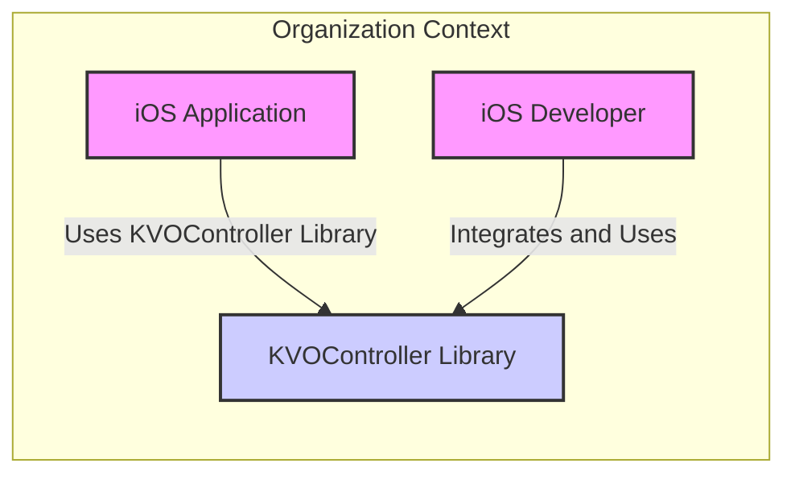
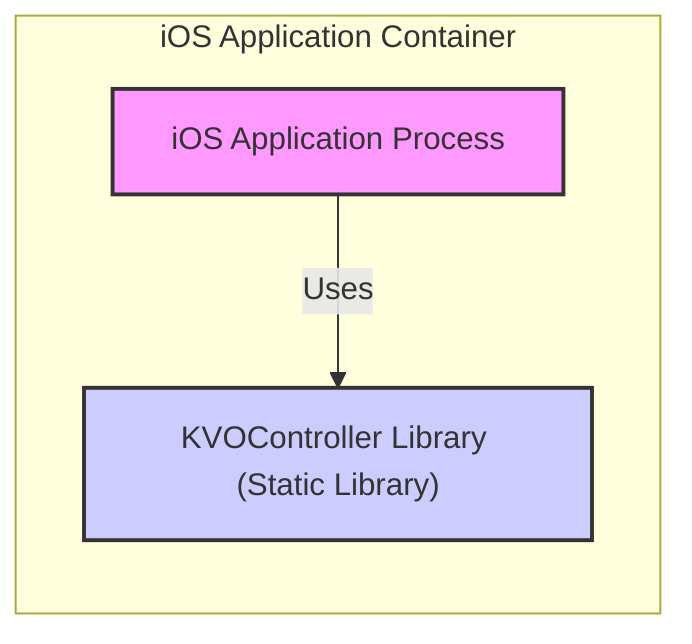
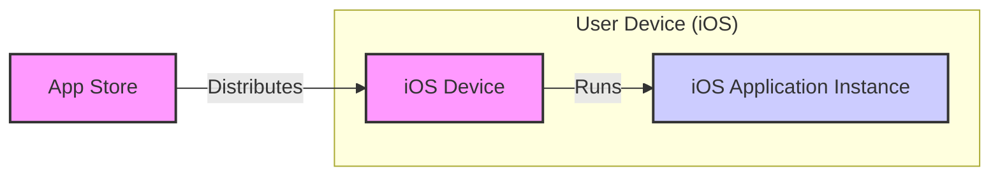

# BUSINESS POSTURE

This project, `kvocontroller`, is an archived open-source library from Facebook, designed to simplify Key-Value Observing (KVO) in iOS development.

- Business Priorities and Goals:
  - Goal: To provide a reusable and efficient solution for managing KVO in iOS applications.
  - Priority: Enhance developer productivity and code maintainability by abstracting away the complexities of manual KVO implementation in iOS projects. This aims to reduce development time and potential errors associated with manual KVO management.

- Most Important Business Risks:
  - Risk of Code Defects: As an archived project, active maintenance and bug fixes are unlikely. Potential defects in the library could lead to unexpected behavior or crashes in applications that depend on it, negatively impacting user experience.
  - Risk of Security Vulnerabilities: Although less likely for a UI utility library, vulnerabilities could exist. Lack of active maintenance means any discovered security issues might not be addressed, posing a risk to applications using the library.
  - Risk of Compatibility Issues:  The library might not be compatible with newer versions of iOS or Xcode, potentially requiring significant rework or abandonment of the library in future projects.
  - Risk of Dependency on Unmaintained Code: Relying on an archived library introduces a long-term dependency risk. If issues arise or new features are needed, the development team will need to address them internally, increasing maintenance burden.

# SECURITY POSTURE

- Security Controls:
  - security control: Code is publicly available on GitHub, allowing for community review and scrutiny. (Implemented: GitHub Repository)
  - security control: Standard iOS development practices are assumed to be followed by developers using the library, including memory management and secure coding principles. (Implemented: Developer Responsibility)

- Accepted Risks:
  - accepted risk:  As an archived open-source project, there is no guarantee of ongoing security maintenance or timely patching of vulnerabilities.
  - accepted risk:  Security vulnerabilities within the library might exist and remain unaddressed due to lack of active development.
  - accepted risk:  Applications integrating this library are responsible for their own overall security posture, including how they utilize KVO and handle data.

- Recommended Security Controls:
  - security control: Static Code Analysis: Implement static code analysis tools to scan the library code for potential vulnerabilities before integrating it into a project.
  - security control: Dependency Scanning: Although this library likely has minimal dependencies, ensure any dependencies are scanned for known vulnerabilities.
  - security control: Code Review: Conduct a thorough code review of the library before integration to understand its functionality and identify potential security concerns.
  - security control: Security Testing: Perform basic security testing, including unit and integration tests focusing on edge cases and potential error conditions, to ensure the library behaves as expected and doesn't introduce vulnerabilities.

- Security Requirements:
  - Authentication: Not directly applicable to a UI utility library like `kvocontroller`. Authentication is handled at the application level.
  - Authorization: Not directly applicable to `kvocontroller`. Authorization is handled at the application level based on application logic and user roles.
  - Input Validation:  If `kvocontroller` takes any input from the application (e.g., property names, observer objects), ensure proper validation to prevent unexpected behavior or potential vulnerabilities.  This should be validated within the library itself.
  - Cryptography:  Not directly applicable to `kvocontroller`. Cryptographic operations are handled at the application level if needed. However, ensure the library itself does not inadvertently introduce weaknesses if it interacts with data that might be cryptographically protected at the application level.

# DESIGN

## C4 CONTEXT

- Context Diagram Elements:
  - - Name: "iOS Application"
    - Type: Software System
    - Description: An iOS application developed by the organization that utilizes the `KVOController Library` to manage Key-Value Observing.
    - Responsibilities: To provide user functionality, manage application data, and utilize the `KVOController Library` for efficient property observation.
    - Security controls: Application-level security controls, including authentication, authorization, data protection, and secure communication, are implemented within the iOS Application.

  - - Name: "KVOController Library"
    - Type: Software System / Library
    - Description: The `kvocontroller` library itself, providing an abstraction layer for managing Key-Value Observing in iOS.
    - Responsibilities: To simplify KVO management for iOS developers, reduce boilerplate code, and provide a safer and more efficient way to observe property changes.
    - Security controls: The library should be designed and implemented following secure coding practices. Input validation within the library (if applicable) and prevention of memory safety issues are key security controls.

  - - Name: "iOS Developer"
    - Type: Person
    - Description:  A software developer within the organization responsible for developing and maintaining iOS applications.
    - Responsibilities: To integrate and utilize the `KVOController Library` effectively in iOS applications, ensuring proper usage and understanding of its functionalities.
    - Security controls: Developers are responsible for using the library correctly and securely within the context of the iOS application, following secure development guidelines and best practices.

## C4 CONTAINER

- Container Diagram Elements:
  - - Name: "iOS Application Process"
    - Type: Application Runtime Process
    - Description: The running process of the iOS application on a user's device. This process executes the application code, including the integrated `KVOController Library`.
    - Responsibilities: To execute the iOS application logic, manage application state, interact with the operating system and device hardware, and utilize the functionalities provided by the `KVOController Library`.
    - Security controls: Operating system level security controls provided by iOS, application sandboxing, code signing, and runtime security features. Application-level security controls implemented within the iOS application code.

  - - Name: "KVOController Library (Static Library)"
    - Type: Static Library
    - Description: The `kvocontroller` library is compiled and linked as a static library into the iOS application. It becomes part of the application's executable.
    - Responsibilities: To provide KVO management functionalities to the iOS application at runtime. It is responsible for handling KVO registration, observation, and notification within the application process.
    - Security controls: Security controls are primarily focused on the library's code quality and secure coding practices to prevent vulnerabilities that could be exploited within the application process. Static analysis and code review are important security controls during development.

## DEPLOYMENT

- Deployment Diagram Elements:
  - - Name: "iOS Device"
    - Type: Physical Device
    - Description: A user's iPhone or iPad running the iOS operating system.
    - Responsibilities: To provide the runtime environment for the iOS application, execute the application code, and interact with the user.
    - Security controls: Device-level security controls provided by iOS, including device encryption, passcode/biometric authentication, and app sandboxing.

  - - Name: "iOS Application Instance"
    - Type: Application Instance
    - Description: A specific instance of the iOS application running on a user's iOS device. This instance includes the `KVOController Library` as part of its executable.
    - Responsibilities: To provide the application's functionalities to the user, manage user data, and utilize the `KVOController Library` for KVO management.
    - Security controls: Application-level security controls implemented within the application code, and runtime security features provided by the iOS operating system.

  - - Name: "App Store"
    - Type: Distribution Platform
    - Description: Apple's App Store, used to distribute iOS applications to users.
    - Responsibilities: To host and distribute iOS applications, perform basic app vetting processes, and facilitate application installation on user devices.
    - Security controls: App Store review process, code signing requirements for applications, and platform security measures to prevent distribution of malicious applications.

## BUILD

```mermaid
flowchart LR
    A["iOS Developer"] -- "Writes Code" --> B["Source Code (Git)"]
    B -- "Pushes Code" --> C["Build System (Xcode)"]
    C -- "Builds & Tests" --> D["Build Artifact (Static Library)"]
    D -- "Integrates into" --> E["iOS Application Project"]
    style A fill:#f9f,stroke:#333,stroke-width:2px
    style B fill:#ccf,stroke:#333,stroke-width:2px
    style C fill:#ccf,stroke:#333,stroke-width:2px
    style D fill:#ccf,stroke:#333,stroke-width:2px
    style E fill:#f9f,stroke:#333,stroke-width:2px
```

- Build Process Elements:
  - - Name: "iOS Developer"
    - Type: Person
    - Description: A software developer writing and modifying the code for the `KVOController Library` (if actively developing or customizing it) or integrating it into an iOS application.
    - Responsibilities: To write clean, secure, and functional code, and to integrate the library correctly into iOS projects.
    - Security controls: Secure coding practices, code reviews, and developer training on secure development principles.

  - - Name: "Source Code (Git)"
    - Type: Code Repository
    - Description: A Git repository (like GitHub) where the source code of the `KVOController Library` is stored and version controlled.
    - Responsibilities: To securely store and manage the source code, track changes, and facilitate collaboration among developers.
    - Security controls: Access control to the repository, branch protection, and audit logging of code changes. For an archived project, these controls are likely already in place by GitHub.

  - - Name: "Build System (Xcode)"
    - Type: Build Tool
    - Description: Apple's Xcode IDE and build tools, used to compile, build, and test the `KVOController Library` and the iOS application.
    - Responsibilities: To compile the source code, link libraries, run tests, and create build artifacts (static library, application binary).
    - Security controls: Use of trusted build environments, secure build configurations, and potentially integration of static analysis tools within the build process. Code signing is a crucial security control during the application build process, but less directly relevant to building just the library itself.

  - - Name: "Build Artifact (Static Library)"
    - Type: Software Artifact
    - Description: The compiled static library file (`.a`) of the `KVOController Library`, which is the output of the build process.
    - Responsibilities: To be integrated into iOS application projects and provide the KVO management functionalities.
    - Security controls: Ensuring the build artifact is generated from trusted source code and build processes. Verification of the artifact's integrity if distributed separately.

  - - Name: "iOS Application Project"
    - Type: Software Project
    - Description: The Xcode project for the iOS application that will integrate and use the `KVOController Library`.
    - Responsibilities: To incorporate the `KVOController Library` and build the final iOS application that will be distributed to users.
    - Security controls: Application-level security controls are implemented within the application project, including secure coding practices, dependency management, and integration of security testing tools.

# RISK ASSESSMENT

- Critical Business Processes:
  - iOS Application Functionality: The primary critical business process is the correct and reliable functioning of iOS applications that utilize KVO for managing data and UI updates. If `kvocontroller` introduces bugs or vulnerabilities, it could disrupt application functionality and user experience.

- Data to Protect and Sensitivity:
  - Application Data: The data being protected is the data handled by the iOS applications that use `kvocontroller`. The sensitivity of this data varies greatly depending on the specific application. It could range from publicly available information to highly sensitive personal or financial data.
  - Library Code: The source code of the `kvocontroller` itself is also data to protect, primarily for integrity and availability. However, as it's open source, confidentiality is not a primary concern.

# QUESTIONS & ASSUMPTIONS

- BUSINESS POSTURE:
  - Assumption: The primary business goal for using `kvocontroller` is to improve developer efficiency and code maintainability in iOS projects.
  - Question: Are there specific performance requirements or scalability needs for KVO management in the target applications?

- SECURITY POSTURE:
  - Assumption: The applications using `kvocontroller` will handle their own application-level security concerns, and `kvocontroller` is expected to be a secure and reliable component.
  - Question: Are there any specific regulatory compliance requirements (e.g., HIPAA, GDPR, PCI DSS) that the applications using `kvocontroller` must adhere to? This would influence the required security controls.

- DESIGN:
  - Assumption: `kvocontroller` is used as a static library integrated directly into iOS applications.
  - Question: Are there any plans to modify or extend the `kvocontroller` library? If so, this would necessitate a more detailed security review and potentially changes to the build process.
  - Question: Are there any specific integration points with other libraries or systems that could introduce security considerations? (Assuming minimal external dependencies for a UI utility library).