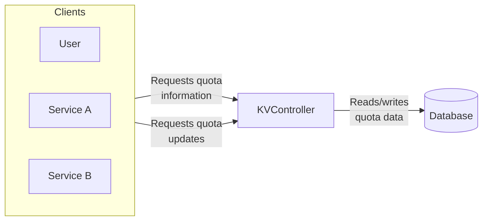
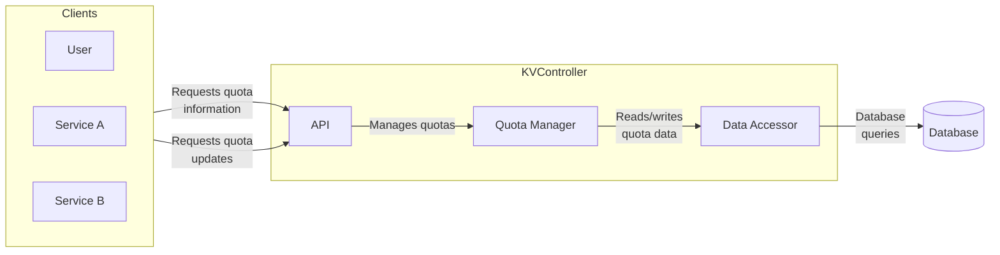
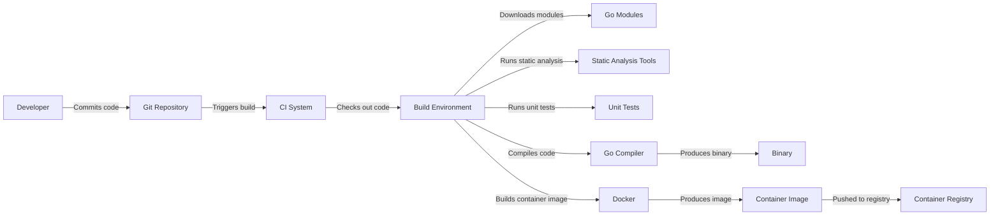

Okay, let's create a design document for the `kvocontroller` project, formerly hosted at `facebookarchive/kvocontroller`.  Since it's an archived project, we'll need to make some assumptions, but we'll clearly state them.  The primary focus will be on creating a document suitable for later threat modeling.

# BUSINESS POSTURE

The `kvocontroller` project appears to have been designed to manage resource quotas (specifically, key-value pairs representing resource limits) within a distributed system, likely at Facebook's scale.  Given Facebook's (now Meta's) core business, we can infer the following:

*   Priorities:
    *   High Availability:  The system managing quotas must be highly available to avoid disrupting services that depend on it.  Downtime of the quota system could lead to service outages or performance degradation.
    *   Scalability:  The system must scale to handle a massive number of requests and a large number of managed resources, reflecting Facebook's infrastructure size.
    *   Consistency:  Quota enforcement must be consistent across the distributed system.  Inconsistent enforcement could lead to resource exhaustion in some parts of the system while other parts have unused capacity.
    *   Efficiency:  The system should manage quotas with minimal overhead, avoiding unnecessary resource consumption or latency.
    *   Manageability: The system should be easy to operate and monitor.

*   Goals:
    *   Prevent resource exhaustion and denial-of-service scenarios caused by misconfigured or malicious clients.
    *   Provide a centralized and consistent mechanism for managing resource allocation across a large, distributed infrastructure.
    *   Enable fine-grained control over resource usage, potentially down to individual users, services, or jobs.
    *   Support dynamic updates to quotas without requiring service restarts.

*   Business Risks:
    *   Service disruption due to quota mismanagement or system failure.
    *   Resource exhaustion leading to performance degradation or outages.
    *   Inconsistent quota enforcement, creating "noisy neighbor" problems.
    *   Operational complexity leading to misconfigurations and errors.
    *   Security vulnerabilities allowing unauthorized access or modification of quotas.

# SECURITY POSTURE

Based on the repository (which is archived and may not represent the final state), we can identify the following:

*   Existing Security Controls:
    *   security control: Code Review: The GitHub repository indicates a history of code reviews, which is a crucial security control for identifying vulnerabilities. (Inferred from GitHub history).
    *   security control: Limited External Dependencies: The project appears to have few external dependencies, reducing the attack surface. (Observed from the `go.mod` file).
    *   security control: Go Language: The use of Go provides some memory safety benefits compared to languages like C/C++.

*   Accepted Risks:
    *   accepted risk: Archived Project: The project is archived, meaning it's no longer actively maintained. This implies an acceptance of risks associated with unpatched vulnerabilities or outdated dependencies.
    *   accepted risk: Limited Documentation: The available documentation is sparse, making it difficult to fully assess the security posture. This lack of documentation is an accepted risk.
    *   accepted risk: Lack of Explicit Authentication/Authorization: The provided code snippets don't show explicit authentication or authorization mechanisms. It's likely these were handled by a surrounding infrastructure, but this is an accepted risk within the scope of this isolated project review.

*   Recommended Security Controls:
    *   Authentication: Implement robust authentication to verify the identity of clients requesting quota changes or information.
    *   Authorization: Implement fine-grained authorization to control which clients can access or modify specific quotas.
    *   Input Validation: Thoroughly validate all inputs to prevent injection attacks or unexpected behavior.
    *   Auditing: Log all quota changes and access attempts for security monitoring and incident response.
    *   Rate Limiting: Implement rate limiting on API requests to prevent denial-of-service attacks.
    *   Secret Management: If any secrets (e.g., API keys, database credentials) are used, they should be managed securely using a dedicated secret management system.
    *   Dependency Management: Even though the project is archived, a process for managing and updating dependencies (if it were active) would be crucial to mitigate supply chain risks.
    *   Static Analysis: Integrate static analysis tools into the build process to automatically detect potential vulnerabilities.
    *   Dynamic Analysis: Consider using dynamic analysis tools (e.g., fuzzers) to test the system's resilience to unexpected inputs.

*   Security Requirements:

    *   Authentication:
        *   Requirement: The system must authenticate all clients before allowing access to quota information or modification capabilities.
        *   Requirement: Authentication mechanisms should be resistant to common attacks like brute-force and credential stuffing.

    *   Authorization:
        *   Requirement: The system must implement role-based access control (RBAC) or attribute-based access control (ABAC) to restrict access to quotas based on client identity and permissions.
        *   Requirement: Authorization policies should be configurable and easily manageable.

    *   Input Validation:
        *   Requirement: All inputs from clients must be validated against a strict schema to prevent injection attacks and ensure data integrity.
        *   Requirement: Validation rules should be comprehensive and cover all relevant data types and formats.

    *   Cryptography:
        *   Requirement: If sensitive data (e.g., API keys, user identifiers) is transmitted or stored, it must be protected using strong encryption.
        *   Requirement: Cryptographic keys must be managed securely and rotated regularly.

# DESIGN

## C4 CONTEXT



*   Elements:

    *   Name: User
        *   Type: Person
        *   Description: A human user interacting with the system, potentially through a UI or CLI.
        *   Responsibilities: Requesting quota information, requesting quota updates.
        *   Security Controls: Authentication, Authorization (likely handled externally).

    *   Name: Service A
        *   Type: System
        *   Description: An automated service that requires resource quotas.
        *   Responsibilities: Requesting quota information, requesting quota updates.
        *   Security Controls: Authentication, Authorization (likely handled externally).

    *   Name: Service B
        *   Type: System
        *   Description: Another automated service that requires resource quotas.
        *   Responsibilities: Requesting quota information, requesting quota updates.
        *   Security Controls: Authentication, Authorization (likely handled externally).

    *   Name: KVController
        *   Type: System
        *   Description: The system responsible for managing key-value based resource quotas.
        *   Responsibilities: Receiving quota requests, validating requests, reading/writing quota data from/to the database, enforcing quota limits.
        *   Security Controls: Input Validation, (Potentially) Authentication, (Potentially) Authorization.

    *   Name: Database
        *   Type: System
        *   Description: The persistent storage for quota data.
        *   Responsibilities: Storing quota data, providing data access to the KVController.
        *   Security Controls: Access Control, Encryption at Rest, (Potentially) Auditing.

## C4 CONTAINER



*   Elements:

    *   Name: User, Service A, Service B, Database
        *   Same as in C4 Context diagram.

    *   Name: API
        *   Type: Container (e.g., Web API)
        *   Description: The entry point for clients to interact with the KVController.
        *   Responsibilities: Receiving requests, validating requests, forwarding requests to the Quota Manager.
        *   Security Controls: Input Validation, (Potentially) Authentication, (Potentially) Authorization, Rate Limiting.

    *   Name: Quota Manager
        *   Type: Container (e.g., Application Logic)
        *   Description: The core logic for managing quotas.
        *   Responsibilities: Enforcing quota limits, updating quota values, coordinating with the Data Accessor.
        *   Security Controls: Business Logic Enforcement.

    *   Name: Data Accessor
        *   Type: Container (e.g., Data Access Layer)
        *   Description: Handles interaction with the database.
        *   Responsibilities: Reading quota data from the database, writing quota data to the database.
        *   Security Controls: Parameterized Queries (to prevent SQL injection), Connection Security.

## DEPLOYMENT

Possible deployment solutions:

1.  Kubernetes: Deploying the KVController as a set of pods within a Kubernetes cluster. This is a likely scenario given Facebook's use of Kubernetes.
2.  Standalone VMs: Deploying the KVController on dedicated virtual machines.
3.  Hybrid Approach: A combination of Kubernetes and standalone VMs, potentially for different components or environments.

Chosen solution (for detailed description): Kubernetes

```mermaid
graph LR
    subgraph Kubernetes Cluster
        subgraph Namespace: kvocontroller
            subgraph API Pods
                API1[API Pod 1]
                API2[API Pod 2]
            end
            subgraph Quota Manager Pods
                QM1[Quota Manager Pod 1]
                QM2[Quota Manager Pod 2]
            end
            subgraph Data Accessor Pods
                DA1[Data Accessor Pod 1]
                DA2[Data Accessor Pod 2]
            end
            Service[Kubernetes Service]
        end
    end
    subgraph Database Cluster
        DB1[Database Node 1]
        DB2[Database Node 2]
    end
    
    API Pods -- "Load Balanced" --> Service
    Service -- "Internal Traffic" --> Quota Manager Pods
    Quota Manager Pods -- "" --> Data Accessor Pods
    Data Accessor Pods -- "Database Connection" --> Database Cluster

```

*   Elements:

    *   Name: API Pod 1, API Pod 2
        *   Type: Deployment Node (Kubernetes Pod)
        *   Description: Instances of the API container.
        *   Responsibilities: Handling incoming requests.
        *   Security Controls: Network Policies (restricting traffic), Resource Limits (preventing resource exhaustion).

    *   Name: Quota Manager Pod 1, Quota Manager Pod 2
        *   Type: Deployment Node (Kubernetes Pod)
        *   Description: Instances of the Quota Manager container.
        *   Responsibilities: Enforcing quota logic.
        *   Security Controls: Network Policies, Resource Limits.

    *   Name: Data Accessor Pod 1, Data Accessor Pod 2
        *   Type: Deployment Node (Kubernetes Pod)
        *   Description: Instances of the Data Accessor container.
        *   Responsibilities: Communicating with the database.
        *   Security Controls: Network Policies (restricting access to the database), Resource Limits, Secret Management (for database credentials).

    *   Name: Kubernetes Service
        *   Type: Deployment Node (Kubernetes Service)
        *   Description: Provides a stable endpoint for accessing the API pods.
        *   Responsibilities: Load balancing traffic across API pods.
        *   Security Controls: Network Policies.

    *   Name: Database Node 1, Database Node 2
        *   Type: Deployment Node (Database Instance)
        *   Description: Nodes of the database cluster.
        *   Responsibilities: Storing and retrieving quota data.
        *   Security Controls: Network Policies, Encryption at Rest, Access Control, Auditing.

## BUILD

The `kvocontroller` project uses Go modules for dependency management. A likely build process would involve:

1.  Developer commits code to the repository.
2.  A Continuous Integration (CI) system (e.g., Jenkins, GitHub Actions, CircleCI) triggers a build.
3.  The CI system checks out the code.
4.  Go modules are downloaded and verified (`go mod download`, `go mod verify`).
5.  Static analysis tools (e.g., `go vet`, `staticcheck`, `golangci-lint`) are run to identify potential code quality and security issues.
6.  Unit tests are executed (`go test`).
7.  The code is compiled (`go build`).
8.  A container image is built (e.g., using Docker).
9.  The container image is pushed to a container registry.
10. (Potentially) Dynamic analysis is performed on the built container.



* Security Controls in Build Process:
    *   Dependency Management: Go modules provide a mechanism for managing dependencies and verifying their integrity.
    *   Static Analysis: Static analysis tools help identify potential vulnerabilities early in the development lifecycle.
    *   Unit Tests: Unit tests help ensure that the code behaves as expected and can catch security-related bugs.
    *   Containerization: Building a container image provides a consistent and isolated environment for running the application.
    *   Container Registry: Storing container images in a secure registry helps prevent unauthorized access or modification.
    *   CI/CD Pipeline: Automating the build and deployment process reduces the risk of human error and ensures consistency.

# RISK ASSESSMENT

*   Critical Business Processes:
    *   Resource allocation and management for all services relying on `kvocontroller`.
    *   Prevention of resource exhaustion and denial-of-service.
    *   Consistent and reliable operation of dependent services.

*   Data:
    *   Quota Definitions: (Sensitivity: Medium) These define the resource limits for various entities. Unauthorized modification could lead to service disruption.
    *   Current Resource Usage: (Sensitivity: Medium) This data reflects the current resource consumption of various entities.  Exposure could reveal information about system load and potentially sensitive operational details.
    *   Client Identifiers: (Sensitivity: Medium to High) Depending on how clients are identified (e.g., user IDs, service accounts), this data could be sensitive and require protection.
    *   Audit Logs: (Sensitivity: High) These logs contain information about quota changes and access attempts, which is crucial for security monitoring and incident response.  Compromise of audit logs could allow attackers to cover their tracks.

# QUESTIONS & ASSUMPTIONS

*   Questions:
    *   What specific database technology was used? (This impacts security controls for the database.)
    *   What authentication and authorization mechanisms were in place? (The code snippets don't reveal this.)
    *   What were the specific deployment environments and configurations? (This impacts the deployment diagram and security controls.)
    *   Were there any monitoring or alerting systems integrated with `kvocontroller`?
    *   What was the intended lifecycle of this project? (Knowing the original goals helps understand the accepted risks.)
    *   What kind of testing (besides unit tests) was performed? (e.g., integration tests, performance tests, security tests)

*   Assumptions:
    *   BUSINESS POSTURE: We assume a high-availability, scalable, and consistent system is required, reflecting Facebook's operational needs.
    *   SECURITY POSTURE: We assume that authentication and authorization were handled by external systems, as the provided code doesn't show explicit mechanisms. We assume basic code review practices were followed. We assume the archived nature of the project implies acceptance of certain risks.
    *   DESIGN: We assume a Kubernetes-based deployment is likely, given Facebook's infrastructure. We assume a standard client-server architecture with a database for persistent storage. We assume a typical CI/CD pipeline was used for building and deploying the application.
    *   We assume that the database is secured with proper access controls and encryption.