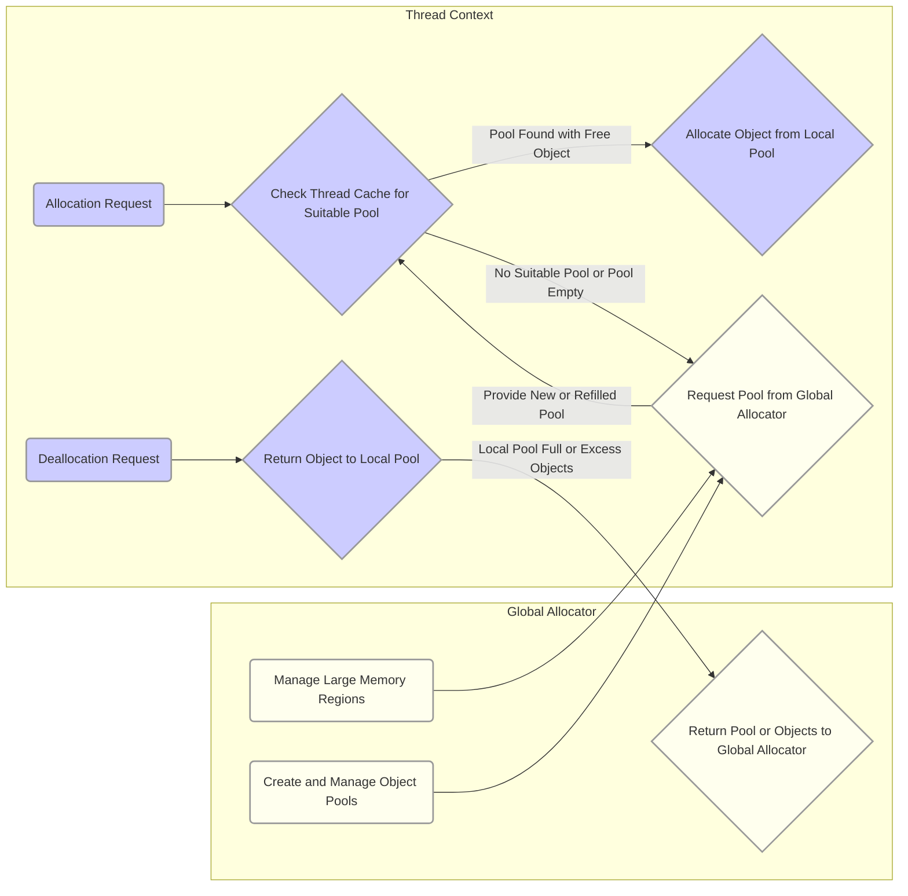

# Project Design Document: Shimmer Memory Management Library

**Version:** 1.1
**Date:** October 26, 2023
**Author:** AI Software Architect

## 1. Introduction

This document provides an enhanced and detailed design overview of the Shimmer memory management library, an open-source project previously developed by Facebook (now Meta). Shimmer is engineered as a high-performance memory management solution specifically optimized for building I/O-intensive applications. Its core focus is on achieving efficient allocation and deallocation of memory, particularly in scenarios characterized by a high volume of small, short-lived objects. This document aims to deliver a comprehensive understanding of Shimmer's architecture, its constituent components, and the flow of data within the system. This detailed design will serve as a robust foundation for subsequent threat modeling activities, enabling a thorough security analysis of the library and its potential integration points.

## 2. Goals and Objectives

The overarching goals driving the design of the Shimmer library are:

* **Maximize Allocation and Deallocation Performance:** Minimize the latency and overhead associated with memory allocation and deallocation operations, leading to tangible improvements in application responsiveness and throughput.
* **Optimize Memory Utilization:** Efficiently manage memory resources to reduce fragmentation and overall memory footprint, especially in workloads involving frequent creation and destruction of small objects.
* **Achieve High Concurrency and Scalability:** Design the library to maintain performance and stability under conditions of high concurrency, effectively supporting multi-threaded applications.
* **Leverage NUMA Architectures for Performance Gains:**  Intelligently utilize Non-Uniform Memory Access (NUMA) architectures to enhance performance by ensuring memory allocations are localized to the processor accessing that memory.
* **Minimize Lock Contention for Improved Throughput:** Reduce reliance on global locks to mitigate performance bottlenecks and improve concurrency by allowing multiple threads to operate with less interference.
* **Provide Flexible Allocation Strategies and Customization:** Offer a range of configurable allocation strategies and parameters to allow developers to tailor the library's behavior to the specific needs of their applications.

## 3. Architectural Overview

Shimmer employs a layered and modular architecture to achieve its performance and efficiency objectives. The key components interact in a coordinated manner to handle memory allocation requests.

* **Core Concept: Object Pools:** The fundamental unit of memory management in Shimmer. Object pools are pre-allocated blocks of memory divided into fixed-size chunks, each representing a potential object. This pre-allocation significantly speeds up allocation for small, fixed-size objects.
* **Thread-Local Caching:** Each thread maintains its own set of object pools (thread caches). When a thread requires memory, it first attempts to allocate from its local cache, drastically reducing contention on shared resources.
* **Centralized Global Allocator:**  When a thread cache cannot fulfill an allocation request (e.g., the required pool is empty), it interacts with the global allocator. This component manages larger memory segments from which object pools are created and replenished.
* **NUMA-Aware Allocation:** Shimmer incorporates NUMA awareness into its design. It strives to allocate memory for object pools on the same NUMA node as the thread that will primarily utilize them, thereby minimizing the performance impact of cross-node memory access.
* **Instrumentation and Monitoring Capabilities:** Shimmer includes mechanisms for collecting and exposing runtime statistics related to memory allocation and deallocation. This allows for real-time monitoring of the library's performance and aids in identifying potential bottlenecks or inefficiencies.

## 4. Component Details

This section provides a more in-depth examination of the internal workings of Shimmer's key components.

### 4.1. Object Pools

* **Primary Function:** To efficiently manage the allocation and deallocation of fixed-size objects.
* **Implementation:**  A contiguous block of memory is pre-allocated and then subdivided into equal-sized chunks. Each chunk represents a potential object.
* **Internal State Management:** Object pools maintain an internal data structure (often a free list or a bitmask) to track which objects within the pool are currently available for allocation.
* **State Transitions:** Object pools transition through states such as:
    * **Empty:**  No objects are currently available for allocation.
    * **Partial:** Some objects are available, and some are currently in use.
    * **Full:** All objects within the pool are currently allocated.
* **Management Operations:**
    * **Allocation:**  Retrieving a free object from the pool and marking it as used.
    * **Deallocation:** Returning a used object to the pool, making it available for future allocation.

### 4.2. Thread Caches

* **Primary Function:** To minimize contention on shared memory resources by providing thread-local pools.
* **Structure:** Each thread possesses a collection of object pools, typically organized by the size of the objects they manage.
* **Allocation Process:**
    1. When a thread needs to allocate an object, it first checks its local cache for a pool of the appropriate size.
    2. If a suitable pool is found with available objects, an object is allocated directly from that pool.
    3. If the local pool is empty, the thread cache may request a refill of the pool from the global allocator.
* **Deallocation Process:**
    1. When a thread deallocates an object, it is typically returned to the object pool within the thread's local cache from which it was originally allocated.
    2. To prevent excessive memory usage per thread, thread caches may implement strategies to return excess objects or entire pools back to the global allocator when they exceed certain thresholds.
* **Benefits:** Significantly reduces the need for threads to acquire locks on shared data structures during allocation and deallocation, leading to improved concurrency.

### 4.3. Global Allocator

* **Primary Function:** To manage larger regions of memory and provide object pools to the thread caches.
* **Interaction with the Operating System:** The global allocator interacts directly with the underlying operating system's memory management facilities (e.g., `malloc`, `mmap`, or platform-specific allocation APIs) to acquire large blocks of memory.
* **Responsibilities:**
    * **Acquiring Memory Segments:** Allocating large chunks of memory from the operating system.
    * **Pool Creation and Management:** Creating new object pools within the acquired memory segments and managing their lifecycle.
    * **Servicing Thread Cache Requests:** Responding to requests from thread caches for new pools or for refilling existing pools that have become depleted.
    * **Memory Reclamation:** Potentially reclaiming memory from thread caches when they have excess capacity or when threads terminate.

### 4.4. NUMA Awareness

* **Primary Function:** To optimize memory allocation in systems with Non-Uniform Memory Access (NUMA) architectures.
* **Mechanism:** Shimmer attempts to allocate memory for object pools on the same NUMA node as the thread that is expected to access those objects most frequently. This minimizes the latency associated with accessing memory located on a different NUMA node.
* **Information Gathering:**  The library typically relies on operating system APIs or configuration settings to determine the NUMA topology of the system.
* **Allocation Strategy:** When a thread cache requests a new pool, the global allocator considers the NUMA node of the requesting thread when allocating the underlying memory for the pool.

### 4.5. Statistics and Monitoring

* **Primary Function:** To provide insights into the library's runtime behavior and memory usage patterns.
* **Metrics Collected:** Shimmer can collect various metrics, including:
    * **Allocation and Deallocation Counts:** The number of successful allocation and deallocation operations.
    * **Thread Cache Hit Rates:** The percentage of allocation requests that were successfully served from the thread-local caches.
    * **Memory Usage Breakdown:**  Information about memory usage per object size class and per component (e.g., global allocator, thread caches).
    * **Contention Metrics:**  Indicators of contention on shared resources, such as the global allocator.
* **Usage Scenarios:** This data can be used for:
    * **Performance Analysis and Tuning:** Identifying performance bottlenecks and optimizing Shimmer's configuration.
    * **Debugging:** Diagnosing memory-related issues or unexpected behavior.
    * **Resource Monitoring:** Tracking memory consumption and identifying potential memory leaks.

## 5. Data Flow

The following flowchart provides a visual representation of the typical data flow for memory allocation and deallocation requests within the Shimmer library.

**Detailed Steps:**

* **Memory Allocation:**
    * **Step 1: Allocation Request:** An application thread initiates a request to allocate memory for an object of a specific size.
    * **Step 2: Thread Cache Check:** Shimmer first examines the requesting thread's local cache to determine if an object pool capable of accommodating the requested object size exists and has available objects.
    * **Step 3a: Local Allocation (Cache Hit):** If a suitable pool with free objects is found in the thread cache, an object is allocated directly from that pool. This is the most performant path.
    * **Step 3b: Request from Global Allocator (Cache Miss):** If no suitable pool is found or the existing pool is empty, the thread cache sends a request to the global allocator for a new or refilled object pool.
    * **Step 4: Global Allocator Servicing:** The global allocator allocates a new block of memory (if necessary) and creates or provides an existing object pool to the requesting thread cache. NUMA awareness is considered at this stage.
    * **Step 5: Allocation from New Pool:** The thread cache then allocates the requested object from the newly acquired pool.

* **Memory Deallocation:**
    * **Step 1: Deallocation Request:** An application thread requests the deallocation of a previously allocated object.
    * **Step 2: Return to Thread Cache:** The object is typically returned to the specific object pool within the thread's local cache from which it was originally allocated.
    * **Step 3: Global Allocator Management (Optional):** If a thread cache's pool becomes excessively full or exceeds predefined thresholds, the thread cache might return some objects or the entire pool back to the global allocator for more centralized management and potential redistribution.

## 6. Security Considerations (Detailed)

While Shimmer's primary focus is on performance and efficiency, security considerations are crucial for its safe and reliable integration into larger systems. Potential security vulnerabilities and threats include:

* **Memory Corruption Vulnerabilities:**
    * **Buffer Overflows:**  If the library incorrectly calculates or handles object sizes, it could lead to buffer overflows during allocation or deallocation, potentially allowing attackers to overwrite adjacent memory regions.
    * **Use-After-Free:**  Improper management of object lifetimes could result in use-after-free vulnerabilities, where a thread attempts to access memory that has already been freed, leading to crashes or exploitable conditions.
    * **Double-Free Errors:**  Deallocating the same memory region multiple times can corrupt the heap and potentially be exploited.
* **Resource Exhaustion Attacks:**
    * **Excessive Allocation:** A malicious actor could intentionally trigger a large number of allocation requests, potentially exhausting available memory and leading to a denial-of-service condition.
    * **Pool Starvation:**  Attackers might try to manipulate allocation patterns to starve specific object pools, impacting the performance or stability of applications relying on those pools.
* **Information Disclosure:**
    * **Exposure of Sensitive Data:** If deallocated memory is not properly sanitized or zeroed out, it might contain sensitive data that could be inadvertently exposed to other parts of the application or even to other processes.
* **Dependencies and Third-Party Libraries:**
    * **Vulnerabilities in Dependencies:** Shimmer's security posture is also dependent on the security of the underlying C++ standard library and the operating system's memory management functions. Vulnerabilities in these dependencies could indirectly affect Shimmer.
* **Concurrency and Thread Safety Issues:**
    * **Race Conditions:**  Improper synchronization between threads accessing shared data structures within Shimmer could lead to race conditions, resulting in unpredictable behavior or security vulnerabilities.

A dedicated and thorough threat modeling exercise, utilizing methodologies like STRIDE, will be essential to systematically identify, categorize, and prioritize these and other potential security threats.

## 7. Deployment Considerations

Deploying and integrating Shimmer into applications requires careful consideration of several factors:

* **Compilation and Linking:** Shimmer, being a C++ library, needs to be compiled and linked with the target application. Ensure compatibility between the compiler versions and build settings.
* **Configuration Options:** Shimmer might expose configuration parameters (e.g., initial pool sizes, cache sizes, allocation strategies) that can be tuned to optimize its performance for specific application workloads. Understanding and appropriately configuring these options is crucial.
* **Platform Compatibility:** Verify that Shimmer is compatible with the target operating systems (Linux, Windows, macOS, etc.) and hardware architectures (x86, ARM, etc.) where the application will be deployed.
* **Integration with Existing Memory Management:** If the application already employs custom memory management techniques or other memory allocators, careful consideration is needed to avoid conflicts or unexpected interactions.
* **Memory Footprint:** Be mindful of the memory footprint introduced by Shimmer, especially the initial allocation of object pools and thread caches. This is important for resource-constrained environments.
* **Monitoring and Observability:** Implement mechanisms to monitor Shimmer's performance and memory usage in production environments. This allows for proactive identification of potential issues and optimization opportunities.

## 8. Future Considerations

The Shimmer library could be further enhanced and developed in several areas:

* **Advanced Allocation Strategies:** Explore and implement more sophisticated allocation algorithms, such as size-segregated fit or buddy allocators, to optimize for different memory access patterns and reduce fragmentation.
* **Enhanced Monitoring and Debugging Tools:** Develop more comprehensive tools for monitoring Shimmer's internal state, visualizing memory usage, and debugging memory-related issues. This could include integration with existing debugging tools or custom visualization dashboards.
* **Integration with Memory Sanitizers and Analysis Tools:**  Improve integration with memory error detection tools like AddressSanitizer (ASan), MemorySanitizer (MSan), and Valgrind to facilitate early detection of memory corruption vulnerabilities during development and testing.
* **Support for Variable-Size Objects:** Investigate and potentially implement mechanisms to efficiently manage allocations of variable-size objects alongside the existing fixed-size object pool approach.
* **Adaptive Pool Management:** Explore dynamic adjustment of pool sizes and cache configurations based on runtime application behavior and memory pressure.
* **Formal Security Audits:** Conduct regular formal security audits and penetration testing to identify and address potential security vulnerabilities in the library.

This enhanced design document provides a more detailed and comprehensive understanding of the Shimmer memory management library. It serves as a valuable resource for developers integrating the library and provides a solid foundation for conducting thorough threat modeling and security analysis.
