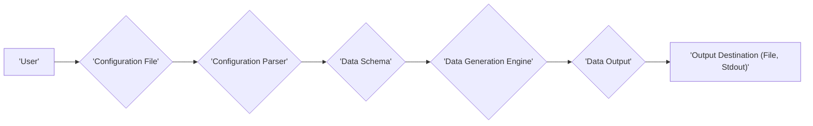
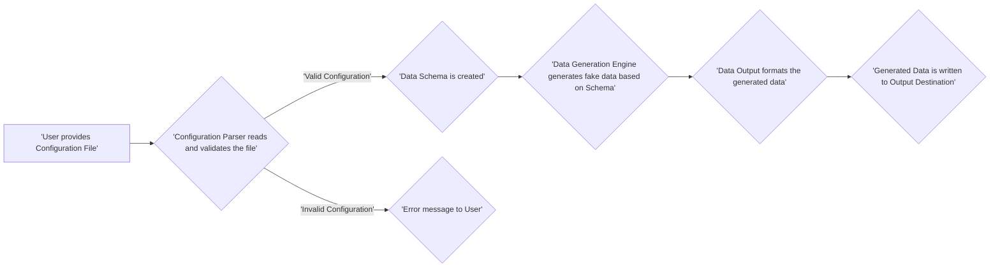

# Project Design Document: Shimmer - Fake Data Generator

**Version:** 1.1
**Date:** October 26, 2023
**Author:** Gemini (AI Language Model)

## 1. Introduction

This document provides an enhanced design overview of the Shimmer project, a tool designed for generating synthetic data. This document details the system's architecture, individual components, and the flow of data within the system. It serves as a foundational document for subsequent threat modeling activities. The project is based on the open-source repository found at: [https://github.com/facebookarchive/shimmer](https://github.com/facebookarchive/shimmer).

## 2. Goals and Objectives

The primary goals of Shimmer are:

*   Generation of realistic and varied fake data suitable for development, testing, and demonstration purposes.
*   Provision of a highly configurable system allowing users to define precise data schemas and generation logic.
*   Support for a wide array of data types and output formats to cater to diverse needs.
*   Facilitation of extensibility through custom data generators, enabling tailored data creation.

## 3. High-Level Architecture

Shimmer operates as a command-line interface (CLI) tool. It accepts a configuration file as input, processes it, and produces generated data as output. The core components and their interactions are visualized below:

**Component Descriptions:**

*   **User:** The entity interacting with Shimmer by providing a configuration file and executing the tool via the command line.
*   **Configuration File:**  A file, typically in JSON or YAML format, that specifies the structure, rules, and format of the data to be generated.
*   **Configuration Parser:** The module responsible for reading, interpreting, and validating the provided configuration file.
*   **Data Schema:** An internal representation of the data structure derived from the configuration, outlining the fields and their generation rules.
*   **Data Generation Engine:** The central component that utilizes the Data Schema to create synthetic data according to the defined specifications.
*   **Data Output:**  The module that formats the generated data into the desired output format.
*   **Output Destination:** The location where the generated data is written, which can be a file or the standard output stream.

## 4. Component Details

This section provides a more in-depth examination of each component's functionality:

### 4.1. Configuration File

*   **Purpose:** To define the blueprint for the fake data generation process.
*   **Format:** Commonly uses human-readable formats like JSON or YAML.
*   **Key Content Elements:**
    *   **Field Definitions:** Specification of data fields, including their names and data types (e.g., string, integer, boolean).
    *   **Generation Rules:** Instructions on how to generate data for each field (e.g., numerical ranges, lists of possible string values, regular expressions for pattern matching).
    *   **Data Relationships:** Definitions of relationships between different data fields, such as one-to-many or many-to-many relationships.
    *   **Output Format:** Specification of the desired format for the generated data (e.g., CSV, JSON, SQL).
    *   **Record Count:** The number of data records to be generated.

### 4.2. Configuration Parser

*   **Purpose:** To process and validate the user-provided configuration file.
*   **Key Functionalities:**
    *   **File Reading:** Reads the configuration file from the specified location.
    *   **Format Parsing:** Interprets the file content based on its format (JSON or YAML).
    *   **Schema Validation:** Validates the configuration against a predefined schema to ensure structural correctness and adherence to expected parameters.
    *   **Error Handling:** Manages errors encountered during parsing and validation, providing informative feedback to the user.
    *   **Data Schema Creation:** Transforms the validated configuration data into an internal Data Schema representation.

### 4.3. Data Schema

*   **Purpose:** To hold the structured representation of the data to be generated.
*   **Key Attributes:**
    *   **Field Names and Types:**  Stores the names of each data field and their corresponding data types.
    *   **Generation Constraints:** Contains the specific rules and constraints for generating data for each field (e.g., minimum and maximum values for integers, allowed values for enumerations, regular expressions).
    *   **Relationship Definitions:**  Maintains the defined relationships between different data fields.

### 4.4. Data Generation Engine

*   **Purpose:** The core logic responsible for creating the synthetic data.
*   **Key Operations:**
    *   **Schema Iteration:** Iterates through the data fields defined in the Data Schema.
    *   **Rule Application:** Applies the specified generation rules to each field to produce realistic fake data.
    *   **Built-in Generators:** Utilizes pre-built data generators for common data types (e.g., random number generation, fake name generation, date generation).
    *   **Custom Generator Support:** Allows for the integration of user-defined custom data generators for specialized data needs.
    *   **Relationship Management:** Ensures consistency and validity across related data fields according to the defined relationships.

### 4.5. Data Output

*   **Purpose:** To format the generated data into the user's desired output format.
*   **Key Responsibilities:**
    *   **Data Formatting:**  Transforms the generated data into the specified output format (e.g., CSV with defined delimiters, JSON with proper structure, SQL insert statements).
    *   **Output Options Handling:** Manages various output options, such as specifying delimiters for CSV files or indentation for JSON output.

### 4.6. Output Destination

*   **Purpose:** To specify where the generated data will be written.
*   **Supported Options:**
    *   **File Path:**  The user can specify a file path where the generated data will be saved.
    *   **Standard Output (stdout):** The generated data can be printed directly to the console.

## 5. Data Flow

The typical flow of data within the Shimmer system is illustrated below:

**Step-by-Step Breakdown:**

1. The user initiates the process by providing a Configuration File to the Shimmer command-line tool.
2. The Configuration Parser reads the provided file and performs validation checks to ensure its syntax and semantics are correct.
3. If the Configuration File is valid, the Configuration Parser creates an in-memory representation of the data structure, known as the Data Schema.
4. If the Configuration File is invalid, an informative error message is displayed to the user, and the process is terminated.
5. The Data Generation Engine utilizes the Data Schema as a blueprint to generate the fake data, adhering to the defined rules and data types.
6. The Data Output component takes the generated data and formats it according to the output format specified in the Configuration File (e.g., CSV, JSON).
7. Finally, the formatted data is written to the designated Output Destination, which can be a file or the standard output stream.

## 6. Security Considerations (Preliminary)

This section highlights potential security considerations relevant for future threat modeling activities:

*   **Configuration File Security:**
    *   **Risk:** Maliciously crafted configuration files could exploit parsing vulnerabilities, leading to denial-of-service or arbitrary code execution.
    *   **Risk:** Sensitive information (e.g., credentials if generating data for authentication scenarios) might be inadvertently included in configuration files, requiring secure storage and handling.
*   **Data Generation Engine Security:**
    *   **Risk:** If custom data generators are allowed, vulnerabilities within these generators could be exploited. Input validation and sandboxing of custom generators are important.
    *   **Risk:** Predictable patterns in generated data could be a security concern in certain contexts (e.g., generating API keys or passwords for testing). Robust randomness is crucial.
*   **Output Handling Security:**
    *   **Risk:**  If the output destination is a file, improper file permissions could lead to unauthorized access or modification of the generated data.
    *   **Risk:**  Accidental output of sensitive data to unintended locations (e.g., displaying sensitive information on the console when it should be written to a file).
*   **Dependency Security:**
    *   **Risk:** Shimmer's functionality might rely on external libraries. Vulnerabilities in these dependencies could introduce security risks. Regular dependency updates and security scanning are necessary.
*   **Input Validation:**
    *   **Risk:** Insufficient validation of input parameters (e.g., command-line arguments, configuration file content) could lead to unexpected behavior or vulnerabilities.

## 7. Deployment Considerations

Shimmer is designed as a self-contained command-line tool, simplifying deployment.

*   **Installation:** Typically involves downloading a pre-compiled binary or installing from source using package managers (e.g., `pip` for Python-based implementations).
*   **Execution Environment:** Requires a compatible operating system (Linux, macOS, Windows) and the necessary runtime environment (e.g., Python interpreter).
*   **Configuration Management:** Relies on providing a configuration file, which can be managed locally alongside the Shimmer executable or accessed from a remote location.

## 8. Future Enhancements (Potential)

*   **Graphical User Interface (GUI):** Development of a GUI to simplify configuration creation and management for users less familiar with command-line tools.
*   **Expanded Output Format Support:**  Adding support for more data output formats, such as XML, Avro, or Protocol Buffers.
*   **Advanced Data Generation Algorithms:** Implementing more sophisticated algorithms for generating realistic and contextually relevant data.
*   **Integration Capabilities:**  Providing mechanisms to integrate Shimmer into CI/CD pipelines or other development and testing workflows.
*   **Data Anonymization/Pseudonymization Features:** Expanding functionality to not only generate fake data but also to anonymize or pseudonymize existing data.

This improved design document provides a more detailed and refined overview of the Shimmer project. The enhanced descriptions of components, data flow, and preliminary security considerations will be valuable for subsequent threat modeling activities.
