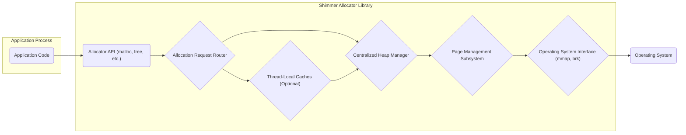
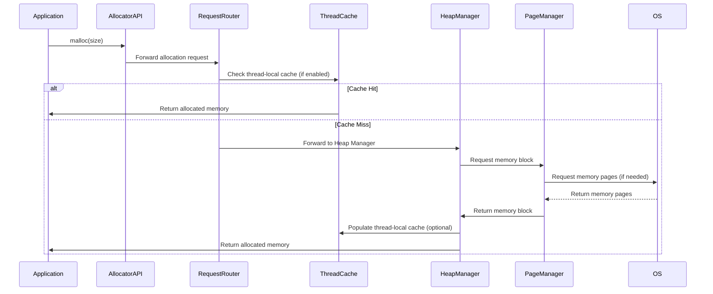
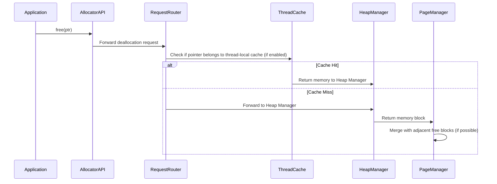

# Project Design Document: Shimmer Memory Allocator

**Version:** 1.1
**Date:** October 26, 2023
**Author:** AI Software Architect

## 1. Introduction

This document provides an enhanced design overview of the Shimmer memory allocator project, based on the [facebookarchive/shimmer](https://github.com/facebookarchive/shimmer) repository. This revised document aims to offer a more refined and detailed understanding of the system's architecture, components, and data flow, specifically tailored for subsequent threat modeling activities.

Shimmer is understood to be a high-performance memory allocator engineered to minimize memory fragmentation and accelerate allocation and deallocation operations compared to standard system-provided allocators. This document delves into its key functionalities and internal mechanisms, drawing upon publicly available information and common practices in memory allocator design.

## 2. Goals and Objectives

The core objectives of the Shimmer project, as inferred from its description and implementation patterns, are:

*   **High-Performance Memory Management:**  Achieving superior speed in memory allocation and deallocation processes.
*   **Minimizing Memory Fragmentation:** Reducing both internal (wasted space within allocated blocks) and external (unusable free space between blocks) fragmentation.
*   **Scalable Design:**  Potentially supporting efficient operation across multiple threads and/or processes.
*   **Configurable Behavior:** Offering adjustable parameters to optimize performance for diverse workload characteristics.
*   **Seamless Integration:**  Facilitating straightforward adoption as a replacement for standard memory allocation functions (e.g., `malloc`, `free`).

## 3. System Architecture

Shimmer likely employs a layered architecture to achieve its performance and fragmentation goals. The primary components and their interactions can be visualized as follows:

**Components:**

*   **Application Code:** The software utilizing Shimmer for dynamic memory allocation and deallocation.
*   **Allocator API:**  Provides the standard C-style memory allocation functions (e.g., `malloc`, `free`, `calloc`, `realloc`). This serves as the primary interaction point for applications.
*   **Allocation Request Router:**  The initial point of contact within Shimmer. It receives allocation requests and determines the appropriate path for handling them, potentially directing requests to thread-local caches or the central heap manager.
*   **Thread-Local Caches (Optional):**  In multi-threaded environments, these caches provide per-thread private memory pools for frequently allocated small objects, reducing contention on shared resources.
*   **Centralized Heap Manager:** The core of the allocator, responsible for managing the overall heap structure, including metadata about allocated and free blocks. It implements the primary allocation and deallocation logic.
*   **Page Management Subsystem:**  Manages larger memory regions (pages) obtained from the operating system. This component tracks the status of pages and handles the splitting and merging of memory blocks within those pages.
*   **Operating System Interface:**  Provides an abstraction layer for interacting with the operating system's memory management facilities through system calls like `mmap` or `brk` (or their platform-specific equivalents).
*   **Operating System:** The underlying system providing memory management services.

## 4. Component Details

This section provides a more detailed description of each component's responsibilities and potential internal workings:

*   **Allocator API:**
    *   **Functionality:** Exposes standard memory allocation and deallocation functions.
    *   **Inputs:**  Requested allocation size, pointers to memory blocks for deallocation.
    *   **Outputs:** Pointers to allocated memory, success/failure indications.
    *   **Details:**  Performs basic input validation and forwards requests to the Allocation Request Router.

*   **Allocation Request Router:**
    *   **Functionality:**  Directs allocation requests based on factors like size and thread context.
    *   **Inputs:** Allocation requests, deallocation requests.
    *   **Outputs:**  Forwarded requests to appropriate components.
    *   **Details:**  Implements the logic for utilizing thread-local caches or directing requests to the central heap.

*   **Thread-Local Caches (Optional):**
    *   **Functionality:** Provides fast allocation and deallocation for small objects within a single thread.
    *   **Inputs:** Allocation sizes, pointers for deallocation.
    *   **Outputs:** Pointers to allocated memory.
    *   **Details:**  Typically manages small, fixed-size blocks. When a cache is exhausted, it requests more blocks from the Centralized Heap Manager.

*   **Centralized Heap Manager:**
    *   **Functionality:**  Manages the main heap, including metadata structures (e.g., free lists, size classes, bitmaps).
    *   **Inputs:** Allocation requests (when thread caches miss), deallocation requests.
    *   **Outputs:** Pointers to allocated memory blocks.
    *   **Details:**  Likely employs various allocation strategies (e.g., best-fit, first-fit) and techniques for managing fragmentation.

*   **Page Management Subsystem:**
    *   **Functionality:**  Interacts with the OS to obtain and release memory pages. Manages the division of pages into smaller blocks.
    *   **Inputs:** Requests for memory pages, requests to release pages.
    *   **Outputs:** Pointers to memory pages.
    *   **Details:**  Handles the underlying memory mapping and potentially implements strategies for efficient page utilization.

*   **Operating System Interface:**
    *   **Functionality:**  Provides a consistent interface for interacting with OS memory management, abstracting away platform-specific details.
    *   **Inputs:** Memory request sizes, addresses for release.
    *   **Outputs:** Pointers to OS-allocated memory regions.
    *   **Details:**  Encapsulates system calls related to memory management.

## 5. Data Flow

The typical data flow for memory allocation and deallocation can be illustrated as follows:

**Allocation:**

**Deallocation:**

## 6. Security Considerations (Pre-Threat Modeling)

Based on the architecture and data flow, key security considerations that should be addressed during threat modeling include:

*   **Memory Safety Violations:**
    *   **Buffer Overflows:** Occurring when write operations exceed the boundaries of allocated memory regions.
    *   **Use-After-Free:**  Accessing memory after it has been deallocated, potentially leading to corruption or information leaks.
    *   **Double-Free:** Attempting to deallocate the same memory block multiple times, which can corrupt allocator metadata.
*   **Information Disclosure:**
    *   **Uninitialized Memory:**  Returning memory to the application without proper initialization, potentially exposing sensitive data.
    *   **Metadata Leaks:**  Exposure of allocator metadata, which could reveal information about memory layout and potentially aid in exploitation.
*   **Denial of Service (DoS):**
    *   **Memory Exhaustion:**  Malicious allocation of large amounts of memory to consume available resources.
    *   **Fragmentation Exploitation:**  Triggering excessive fragmentation to hinder the allocator's ability to fulfill legitimate requests.
*   **Integer Security Issues:**
    *   **Integer Overflows/Underflows:**  Errors in calculations involving allocation sizes, potentially leading to incorrect memory management.
*   **Concurrency Vulnerabilities (Multi-threading):**
    *   **Race Conditions:**  Unintended behavior arising from unsynchronized access to shared data structures (e.g., free lists, caches).
    *   **Deadlocks:**  Situations where threads are blocked indefinitely while waiting for each other to release resources.
*   **Reliance on OS Security:**  The security of Shimmer is inherently tied to the security of the underlying operating system's memory management mechanisms.

## 7. Deployment Considerations

Shimmer is expected to be deployed as a dynamically linked library that applications can link against. This implies:

*   **Integration Process:** Applications need to be compiled and linked with the Shimmer library.
*   **Configuration Options:** Shimmer might offer configuration mechanisms (e.g., environment variables, compile-time flags, configuration files) to customize its behavior and performance characteristics.
*   **Operating System Dependencies:** Shimmer's functionality relies on the memory management capabilities provided by the host operating system.

## 8. Future Considerations

Potential future enhancements and development directions for Shimmer could include:

*   **Advanced Fragmentation Mitigation:** Implementing more sophisticated techniques to further reduce memory fragmentation, such as compaction or more advanced free list management.
*   **Non-Uniform Memory Access (NUMA) Optimization:**  Tailoring allocation strategies to optimize performance on NUMA architectures by preferring local memory allocation.
*   **Enhanced Security Features:**  Incorporating additional security checks and mitigations to address potential vulnerabilities proactively.
*   **Improved Debuggability and Observability:**  Integrating with memory debugging tools (e.g., Valgrind, AddressSanitizer) and providing better runtime insights into allocator behavior.

This revised document provides a more detailed and structured understanding of the Shimmer memory allocator, specifically designed to facilitate comprehensive threat modeling activities. The information presented here highlights key areas of functionality and potential security concerns that should be thoroughly investigated.