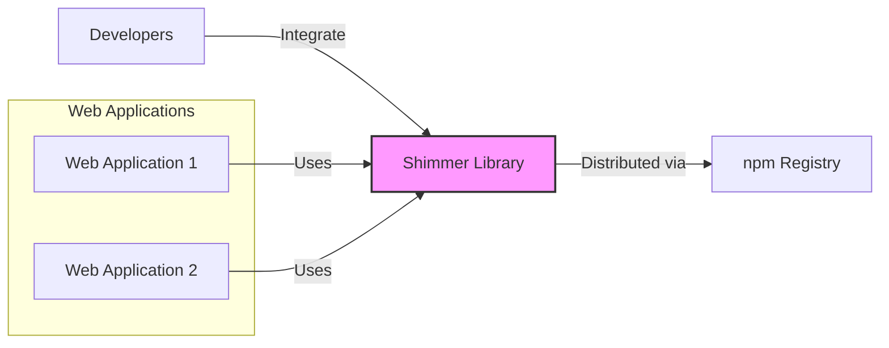

# BUSINESS POSTURE

This project, Shimmer, is a JavaScript library designed to enhance user experience in web applications by providing performant loading placeholders. The primary business goal is to improve user perceived performance and reduce user frustration during content loading. This contributes to better user engagement and satisfaction with web applications that integrate Shimmer.

Most important business risks that need to be addressed:
- Risk of decreased user experience if Shimmer library itself introduces performance issues or visual glitches.
- Risk of developer adoption failure if the library is difficult to use, poorly documented, or incompatible with common web development frameworks.
- Risk of security vulnerabilities in the Shimmer library that could be exploited in web applications using it, potentially leading to cross-site scripting (XSS) or other client-side attacks.
- Risk of supply chain attacks if the library or its dependencies are compromised, affecting all applications that use it.

# SECURITY POSTURE

Existing security controls:
- security control: Repository hosted on GitHub, providing version control and transparency. (Implemented: GitHub)
- security control: Open source project, allowing community review and contributions. (Implemented: GitHub)
- accepted risk: Reliance on JavaScript ecosystem and npm for dependency management, which can introduce supply chain risks.

Recommended security controls:
- security control: Implement automated security scanning (SAST, dependency scanning) in the CI/CD pipeline to detect vulnerabilities in the code and dependencies.
- security control: Establish a clear process for reporting and handling security vulnerabilities.
- security control: Regularly update dependencies to patch known vulnerabilities.
- security control: Provide clear documentation and examples on secure usage of the library, especially regarding input handling if the library accepts any configuration.

Security requirements:
- Authentication: Not directly applicable to a client-side library. However, if the library interacts with any backend services (which is not apparent from the description), authentication would be a requirement for those interactions.
- Authorization: Not directly applicable to a client-side library. Authorization would be relevant in the context of the web applications that use Shimmer, to control access to the content being loaded.
- Input validation: If Shimmer library accepts any configuration options or data from the web application, it must perform input validation to prevent injection attacks. For example, if Shimmer allows customization of placeholder styles via user-provided strings, these strings must be carefully sanitized to prevent XSS.
- Cryptography: Not directly applicable to Shimmer library as a placeholder rendering component. Cryptography would be relevant for the web applications using Shimmer if they handle sensitive data.

# DESIGN

## C4 CONTEXT



Context Diagram elements:

- Element:
  - Name: Web Applications
  - Type: System
  - Description: Various web applications that integrate the Shimmer library to display loading placeholders.
  - Responsibilities: To use the Shimmer library to enhance user experience by showing placeholders while content is loading. To configure and integrate Shimmer appropriately within their codebase.
  - Security controls: Security controls are implemented by each individual web application and are outside the scope of the Shimmer library itself. These controls would typically include input validation, output encoding, authentication, authorization, and protection against common web vulnerabilities.

- Element:
  - Name: Shimmer Library
  - Type: Software System
  - Description: A JavaScript library that provides functionality to create performant loading placeholders.
  - Responsibilities: To generate and render efficient and visually appealing loading placeholders. To be easily integrable into various web applications and frameworks. To be performant and not introduce performance bottlenecks.
  - Security controls: Security controls for the Shimmer library itself include secure coding practices, vulnerability scanning during development, and supply chain security for its dependencies.

- Element:
  - Name: Developers
  - Type: Person
  - Description: Software developers who integrate the Shimmer library into their web applications.
  - Responsibilities: To understand and correctly use the Shimmer library. To ensure proper integration and configuration within their applications. To report any issues or vulnerabilities found in the library.
  - Security controls: Developers are responsible for using the library securely and following secure development practices in their own applications.

- Element:
  - Name: npm Registry
  - Type: External System
  - Description: A public registry for JavaScript packages, used to distribute the Shimmer library.
  - Responsibilities: To host and distribute the Shimmer library package. To provide package management functionalities.
  - Security controls: npm Registry implements security controls to protect the registry itself and the packages it hosts. However, it's also a potential point of supply chain risk if compromised.

## C4 CONTAINER

```mermaid
flowchart LR
    subgraph Web Browser
    A["Web Application"]
        subgraph Shimmer Library Container
        B["Placeholder Renderer"]
        C["Animation Engine"]
        D["Configuration Handler"]
        end
    A --> B
    A --> D
    B --> C
    end
    E["npm Registry"]
    F["Developers"]

    F -->|Integrate| Shimmer Library Container
    Web Browser -->|Downloads| E
    style "Shimmer Library Container" fill:#ccf,stroke:#333,stroke-width:2px
```

Container Diagram elements:

- Element:
  - Name: Web Application
  - Type: Container
  - Description: The web application running in a user's web browser that utilizes the Shimmer library.
  - Responsibilities: To load and execute JavaScript code, including the Shimmer library. To display the user interface and interact with the user. To fetch data and content to be displayed.
  - Security controls: Web application implements standard web security controls such as input validation, output encoding, session management, authentication, authorization, and protection against XSS, CSRF, and other web vulnerabilities.

- Element:
  - Name: Shimmer Library Container
  - Type: Container (JavaScript Library)
  - Description:  Encapsulates the Shimmer library components. Deployed as part of the web application's front-end assets.
  - Responsibilities: To provide the core functionality of generating and rendering loading placeholders. To manage animations and visual effects for placeholders. To handle configuration and customization options.
  - Security controls: Security controls within the Shimmer Library Container focus on secure coding practices, preventing vulnerabilities within the library itself, and ensuring safe handling of any configuration or input it might receive from the web application.

- Element:
  - Name: Placeholder Renderer
  - Type: Component
  - Description: Responsible for the actual rendering of the placeholder elements in the DOM.
  - Responsibilities: To efficiently create and update placeholder elements in the browser's Document Object Model (DOM). To ensure placeholders are visually consistent and performant.
  - Security controls:  Focus on preventing DOM-based XSS vulnerabilities if the renderer dynamically generates DOM elements based on any input.

- Element:
  - Name: Animation Engine
  - Type: Component
  - Description: Handles animations and visual effects applied to the placeholders to create a shimmer effect.
  - Responsibilities: To manage animations smoothly and efficiently, ensuring good performance. To provide customizable animation styles.
  - Security controls: Ensure animations do not introduce performance issues or unexpected behavior that could be exploited.

- Element:
  - Name: Configuration Handler
  - Type: Component
  - Description: Manages configuration options and customization settings for the Shimmer library.
  - Responsibilities: To parse and validate configuration options provided by the web application. To apply configurations to the placeholder rendering and animation.
  - Security controls: Input validation is crucial here to prevent injection attacks if configuration options are derived from user input or external sources. Sanitize and validate all configuration parameters.

- Element:
  - Name: npm Registry
  - Type: External System
  - Description: Public registry for JavaScript packages.
  - Responsibilities: Distribute Shimmer library.
  - Security controls: npm security controls.

- Element:
  - Name: Developers
  - Type: Person
  - Description: Software developers integrating Shimmer.
  - Responsibilities: Integrate and configure Shimmer.
  - Security controls: Secure development practices.

## DEPLOYMENT

Deployment Architecture: Client-Side Deployment (Web Browser)

```mermaid
flowchart LR
    A["User's Browser"]
    subgraph Client Device
    B["Web Browser Runtime"]
        subgraph Web Application Environment
        C["Web Application Code"]
        D["Shimmer Library (JavaScript)"]
        end
    end
    E["npm CDN (Optional)"]
    F["Web Server"]

    A --> B
    B --> C
    C --> D
    C --> F
    D --> B
    C -.->|Load from CDN| E
    style "Web Application Environment" fill:#efe,stroke:#333,stroke-width:2px
    style "Client Device" fill:#eee,stroke:#333,stroke-width:2px
```

Deployment Diagram elements:

- Element:
  - Name: User's Browser
  - Type: Environment
  - Description: The end-user's web browser where the web application and Shimmer library are executed.
  - Responsibilities: To execute JavaScript code, render web pages, and interact with the user. To provide a runtime environment for web applications.
  - Security controls: Browser security features such as sandboxing, Content Security Policy (CSP), and same-origin policy.

- Element:
  - Name: Web Browser Runtime
  - Type: Software
  - Description: The JavaScript engine and browser environment within the user's web browser.
  - Responsibilities: To interpret and execute JavaScript code, including the Shimmer library and web application code. To manage the DOM and rendering of the web page.
  - Security controls: Browser security mechanisms, JavaScript engine security, and adherence to web standards.

- Element:
  - Name: Web Application Environment
  - Type: Software Environment
  - Description: The execution context within the web browser where the web application and Shimmer library reside.
  - Responsibilities: To provide a contained environment for the web application to run. To manage resources and interactions between the web application and the browser.
  - Security controls:  Limited by browser security policies and the security of the web application code itself.

- Element:
  - Name: Web Application Code
  - Type: Software
  - Description: The JavaScript, HTML, and CSS code of the web application that integrates the Shimmer library.
  - Responsibilities: To implement the application logic, user interface, and data handling. To utilize the Shimmer library for loading placeholders.
  - Security controls: Web application security controls, including secure coding practices, input validation, output encoding, authentication, and authorization.

- Element:
  - Name: Shimmer Library (JavaScript)
  - Type: Software (Library)
  - Description: The Shimmer JavaScript library code that is loaded and executed by the web application.
  - Responsibilities: To provide placeholder rendering functionality.
  - Security controls: Security controls within the library code itself, as described in previous sections.

- Element:
  - Name: npm CDN (Optional)
  - Type: Infrastructure (Content Delivery Network)
  - Description: A Content Delivery Network (CDN) that can be used to host and serve the Shimmer library package.
  - Responsibilities: To provide fast and reliable delivery of the Shimmer library to web browsers.
  - Security controls: CDN security measures to protect against DDoS attacks and ensure content integrity. HTTPS for secure delivery.

- Element:
  - Name: Web Server
  - Type: Infrastructure
  - Description: The web server hosting the web application's HTML, JavaScript, and CSS files.
  - Responsibilities: To serve the web application's static assets to users' browsers.
  - Security controls: Web server security configurations, HTTPS, access controls, and protection against web server vulnerabilities.

## BUILD

```mermaid
flowchart LR
    A["Developer"] -->|Code Changes, Commit, Push| B["GitHub Repository"]
    B -->|Webhook Trigger| C["CI/CD Pipeline (GitHub Actions)"]
    subgraph CI/CD Pipeline (GitHub Actions)
    D["Checkout Code"]
    E["Install Dependencies (npm install)"]
    F["Linting & Code Analysis"]
    G["Unit Tests"]
    H["Security Scanning (SAST, Dependency Check)"]
    I["Build (Webpack/Rollup)"]
    J["Publish to npm Registry"]
    end
    C --> D
    D --> E
    E --> F
    F --> G
    G --> H
    H --> I
    I --> J
    J --> K["npm Registry"]
    style "CI/CD Pipeline (GitHub Actions)" fill:#cce,stroke:#333,stroke-width:2px
```

Build Process Description:

1. Developer: Developers write code, commit changes, and push them to the GitHub repository.
2. GitHub Repository: Hosts the source code of the Shimmer library and triggers the CI/CD pipeline on code changes.
3. CI/CD Pipeline (GitHub Actions): Automated build and deployment pipeline, likely using GitHub Actions.
4. Checkout Code: Retrieves the latest code from the GitHub repository.
5. Install Dependencies (npm install): Installs project dependencies defined in `package.json` using npm.
6. Linting & Code Analysis: Performs static code analysis using linters (e.g., ESLint) and code analysis tools to identify code quality issues and potential bugs.
7. Unit Tests: Executes unit tests to ensure the functionality of the library components.
8. Security Scanning (SAST, Dependency Check): Performs Static Application Security Testing (SAST) to find potential vulnerabilities in the code and checks dependencies for known vulnerabilities.
9. Build (Webpack/Rollup): Bundles and minifies the JavaScript code using a bundler like Webpack or Rollup to create production-ready build artifacts.
10. Publish to npm Registry: Publishes the built library package to the npm registry, making it available for developers to install and use.
11. npm Registry: Hosts the published Shimmer library package.

Security Controls in Build Process:
- security control: Source code hosted in a version control system (GitHub) for traceability and integrity.
- security control: Automated CI/CD pipeline to ensure consistent and repeatable builds.
- security control: Linting and code analysis to improve code quality and catch potential issues early.
- security control: Unit tests to verify functionality and prevent regressions.
- security control: Security scanning (SAST) to identify potential code-level vulnerabilities.
- security control: Dependency checking to identify and manage vulnerable dependencies.
- security control: Publishing to a trusted package registry (npm).
- security control: Code review process before merging code changes to the main branch.

# RISK ASSESSMENT

Critical business process we are trying to protect:
- Maintaining a positive user experience in web applications by providing loading placeholders.
- Ensuring developer trust and adoption of the Shimmer library.
- Maintaining the integrity and availability of the Shimmer library package in the npm registry.

Data we are trying to protect and their sensitivity:
- Source code of the Shimmer library: Sensitive as it represents the intellectual property and contains the logic of the library. Confidentiality and integrity are important.
- Build artifacts (JavaScript library package): Integrity and availability are crucial to ensure users download and use a safe and functional library.
- User data within web applications using Shimmer: While Shimmer itself doesn't directly handle user data, the web applications that use it do. The sensitivity of this data depends on the specific application and is outside the direct scope of Shimmer library's risk assessment, but is indirectly relevant as Shimmer is part of the application's ecosystem.

# QUESTIONS & ASSUMPTIONS

Questions:
- What is the intended scope of customization for the Shimmer library? Does it accept user-provided styles or scripts? If so, input validation and output encoding become critical security requirements.
- Are there any backend services or APIs that the Shimmer library interacts with (even indirectly)? If so, authentication and authorization considerations would be relevant.
- What is the process for reporting and handling security vulnerabilities in the Shimmer library?
- What is the expected lifetime and maintenance plan for the Shimmer library?

Assumptions:
- BUSINESS POSTURE: The primary business goal is to improve user experience in web applications by providing loading placeholders. The library is intended for general use in web development.
- SECURITY POSTURE: The project follows basic secure development practices, including using version control and open-source principles. Security scanning and dependency management are recommended but not explicitly stated as existing controls.
- DESIGN: The Shimmer library is primarily a client-side JavaScript library. It is distributed via npm and used in web applications running in web browsers. The build process involves standard JavaScript build tools and practices.