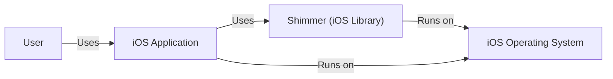
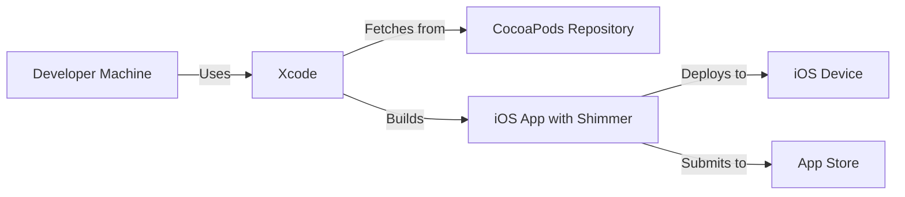
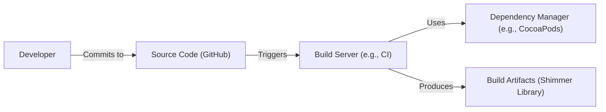

Okay, let's create a design document for the Shimmer project (now archived) from Facebook, keeping in mind its purpose and potential security considerations.  Since it's an archived project, we'll focus on the design as it existed and potential risks/controls relevant at the time of its active development, rather than suggesting current improvements.

# Project Design Document: Shimmer (Facebook Archive)

## BUSINESS POSTURE

*   Priorities and Goals:
    *   Provide a simple, performant, and reliable way to create animations for iOS applications.
    *   Reduce the complexity of animation code for developers.
    *   Improve the user experience of Facebook's iOS applications through smooth and engaging animations.
    *   Offer a reusable component that can be easily integrated into various parts of the application.
*   Business Risks:
    *   Performance issues: Poorly optimized animations could negatively impact application performance and user experience, leading to user frustration and potentially app abandonment.
    *   Security vulnerabilities: While unlikely in a purely UI-focused library, vulnerabilities could potentially be introduced through unexpected interactions with other parts of the application or system, leading to crashes or, in extreme cases, exploitable conditions.
    *   Maintainability: As an open-source project (even archived), lack of clear design and maintainability could lead to difficulties in fixing bugs or adapting the library to new iOS versions.
    *   Compatibility issues: Failure to maintain compatibility with newer iOS versions or device configurations could limit the library's usefulness and adoption.

## SECURITY POSTURE

*   Existing Security Controls:
    *   security control: Code Reviews: The GitHub repository history would likely have included code reviews as part of Facebook's development process. This helps identify potential bugs and security issues before they are merged. (Implicit in standard open-source development practices).
    *   security control: Static Analysis: Facebook likely used static analysis tools to scan the codebase for potential vulnerabilities and coding errors. (Implicit in standard development practices at a company like Facebook).
    *   security control: Limited Scope: The library's focused scope (UI animation) inherently limits its attack surface. It doesn't directly handle sensitive data or network communication.
*   Accepted Risks:
    *   accepted risk: Third-Party Dependencies: The project might have relied on third-party libraries, introducing a potential risk of supply chain vulnerabilities. This risk is common in software development and is typically mitigated through careful selection and monitoring of dependencies.
    *   accepted risk: iOS Platform Vulnerabilities: The library ultimately relies on the security of the underlying iOS platform. Vulnerabilities in iOS could potentially affect the library's behavior or security.
*   Recommended Security Controls (High Priority - at the time of development):
    *   Fuzz Testing: Implementing fuzz testing could help identify unexpected behavior or crashes caused by unusual input values.
    *   Regular Dependency Updates: Keeping third-party dependencies up-to-date is crucial for mitigating supply chain risks.
*   Security Requirements:
    *   Authentication: Not directly applicable, as Shimmer is a UI library and doesn't handle user authentication.
    *   Authorization: Not directly applicable, as Shimmer doesn't manage access control.
    *   Input Validation: While Shimmer primarily deals with animation parameters, validating these inputs (e.g., ensuring animation durations are within reasonable bounds) is important to prevent unexpected behavior or potential crashes.  This should be handled within the Shimmer library itself.
    *   Cryptography: Not directly applicable, as Shimmer doesn't handle encryption or cryptographic operations.

## DESIGN

### C4 CONTEXT

*   Elements Description:
    *   User:
        *   Name: User
        *   Type: Person
        *   Description: The end-user interacting with the iOS application.
        *   Responsibilities: Interacts with the iOS application's UI.
        *   Security controls: Relies on the security controls of the iOS application and operating system.
    *   Shimmer (iOS Library):
        *   Name: Shimmer (iOS Library)
        *   Type: Software System
        *   Description: The Shimmer animation library.
        *   Responsibilities: Provides animation capabilities to the iOS application.
        *   Security controls: Input validation of animation parameters, code reviews, static analysis.
    *   iOS Application:
        *   Name: iOS Application
        *   Type: Software System
        *   Description: The iOS application that integrates the Shimmer library.
        *   Responsibilities: Provides the overall application functionality to the user.
        *   Security controls: Depends on the specific application's security implementation.
    *   iOS Operating System:
        *   Name: iOS Operating System
        *   Type: Software System
        *   Description: The underlying operating system on which the application and Shimmer run.
        *   Responsibilities: Provides the core platform services and security features.
        *   Security controls: iOS built-in security features (sandboxing, code signing, etc.).

### C4 CONTAINER

Since Shimmer is a single library, the Container diagram is essentially the same as the Context diagram, with the addition of internal components if we were to decompose the library further. For simplicity, we'll keep it at the library level.

*   Elements Description:
    *   User:
        *   Name: User
        *   Type: Person
        *   Description: The end-user interacting with the iOS application.
        *   Responsibilities: Interacts with the iOS application's UI.
        *   Security controls: Relies on the security controls of the iOS application and operating system.
    *   Shimmer (iOS Library):
        *   Name: Shimmer (iOS Library)
        *   Type: Software System
        *   Description: The Shimmer animation library.
        *   Responsibilities: Provides animation capabilities to the iOS application.
        *   Security controls: Input validation of animation parameters, code reviews, static analysis.
    *   iOS Application:
        *   Name: iOS Application
        *   Type: Software System
        *   Description: The iOS application that integrates the Shimmer library.
        *   Responsibilities: Provides the overall application functionality to the user.
        *   Security controls: Depends on the specific application's security implementation.
    *   iOS Operating System:
        *   Name: iOS Operating System
        *   Type: Software System
        *   Description: The underlying operating system on which the application and Shimmer run.
        *   Responsibilities: Provides the core platform services and security features.
        *   Security controls: iOS built-in security features (sandboxing, code signing, etc.).

### DEPLOYMENT

*   Possible Deployment Solutions:
    *   Direct Integration: Developers could directly include the Shimmer source code in their iOS projects.
    *   CocoaPods: Shimmer was likely distributed as a CocoaPods dependency, allowing developers to easily integrate it into their projects.
    *   Carthage: Another dependency manager for Cocoa projects, providing an alternative to CocoaPods.
    *   Swift Package Manager: Although less common at the time of Shimmer's active development, Swift Package Manager could have been used.

*   Chosen Solution (CocoaPods - most likely):

*   Elements Description:
    *   Developer Machine:
        *   Name: Developer Machine
        *   Type: Infrastructure
        *   Description: The developer's workstation used for coding and building the application.
        *   Responsibilities: Hosts the development environment and tools.
        *   Security controls: Standard developer machine security practices (antivirus, firewall, etc.).
    *   CocoaPods Repository:
        *   Name: CocoaPods Repository
        *   Type: Infrastructure
        *   Description: The central repository for CocoaPods dependencies.
        *   Responsibilities: Stores and serves the Shimmer library and its dependencies.
        *   Security controls: Relies on the security of the CocoaPods infrastructure.
    *   iOS Device:
        *   Name: iOS Device
        *   Type: Infrastructure
        *   Description: The end-user's iPhone or iPad.
        *   Responsibilities: Runs the iOS application.
        *   Security controls: iOS built-in security features.
    *   App Store:
        *   Name: App Store
        *   Type: Infrastructure
        *   Description: Apple's platform for distributing iOS applications.
        *   Responsibilities: Distributes the application to end-users.
        *   Security controls: Apple's App Store review process and security measures.
    *   Xcode:
        *   Name: Xcode
        *   Type: Software
        *   Description: Apple's integrated development environment (IDE) for iOS development.
        *   Responsibilities: Used for coding, building, and debugging the application.
        *   Security controls: Relies on the security of Xcode and the developer's machine.
    *   iOS App with Shimmer:
        *   Name: iOS App with Shimmer
        *   Type: Software
        *   Description: Compiled application that includes Shimmer library.
        *   Responsibilities: Provide application functionality to user.
        *   Security controls: Relies on security controls implemented in application and iOS.

### BUILD

*   Build Process Description:
    1.  Developers write and commit code to the GitHub repository.
    2.  A Continuous Integration (CI) system (e.g., Travis CI, Jenkins, or a similar system used by Facebook) detects the changes.
    3.  The CI server fetches the source code and any dependencies (likely using CocoaPods).
    4.  The CI server runs build scripts, which likely include:
        *   Compilation of the Shimmer source code.
        *   Running unit tests.
        *   Potentially running static analysis tools (e.g., linters, security scanners).
    5.  If the build and tests are successful, the CI server produces build artifacts (the compiled Shimmer library).
    6.  The build artifacts are made available for distribution (e.g., through CocoaPods).

*   Security Controls:
    *   security control: CI/CD Pipeline: Automating the build process ensures consistency and reduces the risk of manual errors.
    *   security control: Static Analysis: Integrating static analysis tools into the build process helps identify potential vulnerabilities early.
    *   security control: Dependency Management: Using a dependency manager like CocoaPods helps manage and track dependencies, reducing the risk of using outdated or vulnerable libraries.
    *   security control: Code Signing: The compiled library would likely be code-signed by Facebook to ensure its authenticity and integrity.

## RISK ASSESSMENT

*   Critical Business Process: Providing a smooth and engaging user experience through animations within iOS applications.
*   Data Protection: Shimmer itself does not handle sensitive data directly.  The primary concern is the *performance* and *stability* of the application using it.  Indirectly, if Shimmer were to cause crashes or unexpected behavior, it could lead to a poor user experience, potentially impacting user trust and engagement with the larger application.  There is no data sensitivity classification applicable to Shimmer itself.

## QUESTIONS & ASSUMPTIONS

*   Questions:
    *   What specific static analysis tools were used by Facebook during Shimmer's development?
    *   What was the exact CI/CD pipeline used for building and releasing Shimmer?
    *   Were there any specific security reviews or audits conducted on the Shimmer library?
    *   What was the process for handling reported vulnerabilities in Shimmer?
*   Assumptions:
    *   BUSINESS POSTURE: We assume that Facebook prioritized user experience and application performance, and that Shimmer was designed to contribute to these goals.
    *   SECURITY POSTURE: We assume that Facebook followed its standard security practices for iOS development, including code reviews, static analysis, and dependency management. We assume that the iOS platform's security features provide a baseline level of protection.
    *   DESIGN: We assume that Shimmer was primarily distributed through CocoaPods. We assume that a CI/CD system was used for building and testing the library.