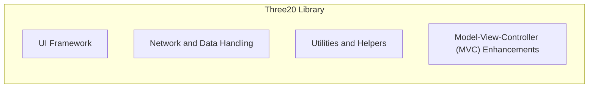
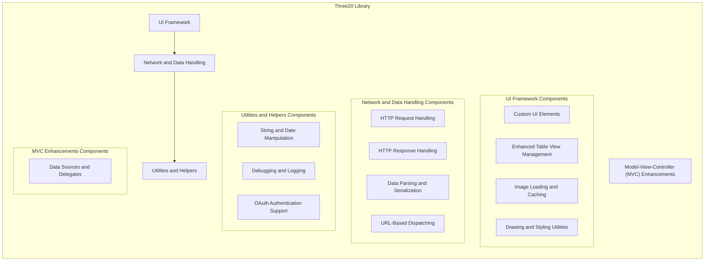
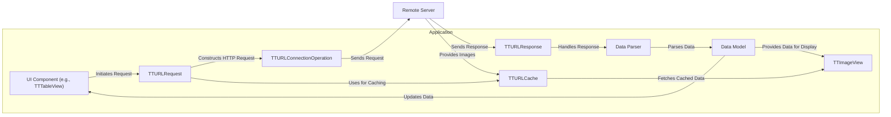

# Project Design Document: Three20 Library (Improved)

**Version:** 1.1
**Date:** October 26, 2023
**Prepared By:** AI Software Architect

## 1. Introduction

This document provides an enhanced and more detailed design overview of the Three20 library, an Objective-C library formerly developed by Facebook for iOS development. Although the project is archived and no longer actively maintained, a thorough understanding of its architecture and components remains essential for security assessments and threat modeling, particularly for applications that continue to rely on this library. This document aims to offer a comprehensive understanding of the library's internal structure, data handling mechanisms, and potential security vulnerabilities to facilitate robust security analysis.

## 2. Goals and Objectives

The primary goal of this document is to furnish a clear, detailed, and actionable architectural overview of the Three20 library, specifically tailored for threat modeling purposes. The objectives are:

*   Provide an in-depth description of the library's high-level architecture and design principles.
*   Identify and elaborate on the functionalities of key components and their interactions.
*   Illustrate the typical and critical data flows within applications utilizing Three20, highlighting potential interception points.
*   Thoroughly analyze and detail potential security considerations, attack surfaces, and common vulnerability patterns associated with the library.
*   Serve as a robust and informative foundation for subsequent threat modeling activities, enabling identification of potential risks and mitigation strategies.

## 3. High-Level Architecture

Three20's architecture is centered around providing a suite of reusable and modular components to streamline iOS application development. It promotes a separation of concerns by offering distinct modules for UI enhancements, network operations, data management, and utility functions. The library was designed to be integrated into existing iOS projects, augmenting the standard iOS SDK functionalities.

Key architectural characteristics include:

*   **Modularity for Focused Functionality:** Components are designed with specific responsibilities, allowing developers to integrate only the necessary parts of the library, reducing potential overhead and complexity. For example, a project might use the image loading capabilities without needing the table view enhancements.
*   **Extensibility through Subclassing and Delegation:** The library encourages customization and extension by providing opportunities to subclass existing classes and implement delegate protocols, allowing developers to tailor the behavior of components to their specific needs.
*   **Convenience and Abstraction for Common Tasks:** Three20 abstracts away boilerplate code and provides convenient APIs for frequently performed tasks such as making network requests, caching data, and displaying formatted information, simplifying the development process.
*   **Convention over Configuration:** The library often adopts sensible defaults and conventions to reduce the amount of configuration required, allowing developers to focus on application-specific logic.

## 4. Component Architecture

The Three20 library comprises several interconnected components, each responsible for a specific set of functionalities. Understanding these components is crucial for identifying potential attack vectors.

*   **UI Framework:** This component focuses on enhancing the user interface development experience.
    *   **Custom UI Elements:** Provides pre-built and styled UI elements like buttons, labels, and activity indicators (e.g., `TTButton`, `TTLabel`, `TTActivityLabel`). These might have custom drawing or interaction logic that could introduce vulnerabilities if not carefully implemented.
    *   **Enhanced Table View Management:** Offers advanced table view classes (e.g., `TTTableView`, `TTTableViewController`) with features like asynchronous image loading and variable row heights. Improper handling of data sources or delegates could lead to crashes or unexpected behavior.
    *   **Image Loading and Caching:** Includes classes for asynchronous image loading from URLs (`TTImageView`) and a caching mechanism (`TTURLCache`). Vulnerabilities could arise from insecure URL handling, cache poisoning, or improper handling of image data.
    *   **Drawing and Styling Utilities:** Provides tools for custom drawing and styling of UI elements. Insecure handling of drawing contexts or external resources could be a risk.
*   **Network and Data Handling:** This component deals with fetching data from remote sources and processing it.
    *   **HTTP Request Handling:** Offers classes for constructing and executing HTTP requests (`TTURLRequest`, `TTURLConnectionOperation`). Lack of proper HTTPS enforcement or vulnerabilities in request construction could expose sensitive data.
    *   **HTTP Response Handling:** Provides mechanisms for handling server responses, including status codes and data (`TTURLResponse`). Improper parsing or validation of responses could lead to vulnerabilities.
    *   **Data Parsing and Serialization:** Includes support for parsing common data formats like JSON and XML. Vulnerabilities like injection attacks (if data is used in web views) or denial-of-service (DoS) through malformed data are possible if parsing is not robust.
    *   **URL-Based Dispatching:** A system for mapping URLs to specific actions within the application. If not carefully controlled, this could be exploited for unauthorized access or actions.
*   **Utilities and Helpers:** This component offers a collection of utility classes for common tasks.
    *   **String and Date Manipulation:** Provides helper functions for working with strings and dates. Potential vulnerabilities are less likely here but could arise from locale-specific issues or buffer overflows in older implementations.
    *   **Debugging and Logging:** Includes tools for debugging and logging application behavior. Sensitive information inadvertently logged could be a security risk.
    *   **OAuth Authentication Support:**  Provides classes for implementing OAuth authentication. Vulnerabilities in the OAuth implementation could lead to unauthorized access to user accounts.
*   **Model-View-Controller (MVC) Enhancements:** This component provides classes that facilitate the implementation of the MVC pattern.
    *   **Data Sources and Delegates:** Offers abstractions for managing data and handling events within the UI. Improper implementation of data sources or delegates could lead to data leaks or unexpected behavior.

## 5. Data Flow

Understanding how data flows through an application using Three20 is crucial for identifying potential interception and manipulation points. Consider the following common data flow scenario:

1. **User Interaction Triggers Data Request:** A user action in the UI (e.g., tapping a button in a `TTTableView`) initiates a request for data.
2. **`TTURLRequest` Construction:** The application uses `TTURLRequest` to create an HTTP request object. This involves specifying the target URL, request method (GET, POST, etc.), any necessary parameters, and headers. *Security Note:* If user-provided data is used to construct the URL or parameters without proper sanitization, it could lead to injection vulnerabilities.
3. **Network Request via `TTURLConnectionOperation`:** The `TTURLRequest` is executed using `TTURLConnectionOperation` (or similar). This handles the actual network communication. *Security Note:* If HTTPS is not enforced or certificate validation is disabled, the communication is vulnerable to man-in-the-middle attacks.
4. **Server Responds:** The remote server processes the request and sends back a response, typically containing data in JSON or XML format, along with HTTP headers.
5. **`TTURLResponse` Handling:** The `TTURLResponse` object encapsulates the server's response, including the status code, headers, and data. *Security Note:* Improper handling of redirect responses could lead to open redirects.
6. **Data Parsing:** The application uses a data parser (e.g., a JSON or XML parser) to process the data received in the `TTURLResponse`. *Security Note:* Vulnerabilities in the parsing logic could lead to crashes or the ability to execute arbitrary code if malformed data is received.
7. **Data Model Update:** The parsed data is used to update the application's data models.
8. **UI Update via `TTImageView` and `TTTableView`:** UI components like `TTImageView` (for displaying images fetched via URLs, potentially using `TTURLCache`) and `TTTableView` are updated to reflect the changes in the data models. *Security Note:* If image URLs are not validated, malicious actors could serve inappropriate or harmful content. Cache poisoning in `TTURLCache` could also be a risk.

## 6. Security Considerations

Given Three20's archived status, it is crucial to recognize that potential vulnerabilities are unlikely to be patched. Applications still using this library face significant security risks. Key considerations include:

*   **Network Communication Security:**
    *   **Lack of Default HTTPS:** Older configurations might not enforce HTTPS for network requests, making data transmitted vulnerable to eavesdropping and manipulation via man-in-the-middle (MITM) attacks.
    *   **Vulnerabilities in `TTURLRequest` and `TTURLResponse`:**  Potential for vulnerabilities such as request smuggling, response splitting, or improper handling of HTTP headers, which could be exploited to inject malicious content or redirect users to malicious sites.
    *   **Insufficient Certificate Validation:** If custom certificate validation is implemented incorrectly, it could allow connections to servers with invalid or self-signed certificates, increasing the risk of MITM attacks.
*   **Data Handling and Parsing:**
    *   **Injection Attacks:** If data received from external sources is not properly sanitized before being displayed in web views or used in other contexts, it could lead to cross-site scripting (XSS) vulnerabilities. Similarly, improper handling of data in SQL queries (if applicable) could lead to SQL injection.
    *   **Denial of Service (DoS) via Malformed Data:**  Vulnerabilities in the data parsing logic could be exploited by sending specially crafted, malformed data that causes the application to crash or consume excessive resources.
    *   **Data Integrity Issues:** Lack of proper validation of input data could lead to data corruption or inconsistencies within the application.
*   **Image Handling:**
    *   **Denial of Service (DoS) via Image Bomb:**  Processing extremely large or malformed images could exhaust device resources and lead to application crashes.
    *   **Information Disclosure via Image Metadata:** Improper handling or stripping of image metadata could inadvertently expose sensitive information embedded within the image files.
*   **Authentication and Authorization:**
    *   **Vulnerabilities in OAuth Implementation:** If using Three20's OAuth components, ensure the implementation adheres to current security best practices. Outdated or flawed implementations could expose access tokens or other sensitive credentials.
    *   **Insecure Storage of Credentials:**  If authentication tokens or other sensitive credentials are stored locally, they must be encrypted securely to prevent unauthorized access.
*   **Dependency Vulnerabilities:**
    *   Three20 itself may rely on other third-party libraries that have known vulnerabilities. Due to its archived status, these dependencies are unlikely to be updated, posing a significant risk. Identifying and assessing these transitive dependencies is crucial.
*   **Local Data Storage:**
    *   If Three20 is used for local data persistence (e.g., caching), ensure that sensitive data is encrypted at rest.
*   **Input Validation:**
    *   All user inputs processed by Three20 components must be rigorously validated to prevent injection attacks, buffer overflows, and other input-related vulnerabilities.
*   **URL-Based Dispatching Risks:**
    *   If the URL-based dispatching mechanism is not carefully implemented and secured, malicious actors could craft URLs to trigger unintended actions or access restricted functionalities within the application.

## 7. Dependencies

Three20's primary dependencies are the standard Objective-C runtime and the iOS SDK. However, it's likely to have transitive dependencies on other open-source libraries for functionalities like JSON parsing or networking utilities. A thorough security assessment requires identifying these indirect dependencies and evaluating them for known vulnerabilities. Without direct code inspection or dependency management files, a precise list is difficult to ascertain.

## 8. Deployment

Three20 is typically deployed as a static library or framework that is linked into the iOS application during the build process. The library's code becomes part of the application's binary and runs directly on the user's iOS device. No separate deployment steps for the library itself are usually required.

## 9. Future Considerations (for Security Assessment)

When conducting a threat model for an application utilizing Three20, the following points are crucial for a comprehensive assessment:

*   **Specific Three20 Version Identification:**  Determine the exact version of the Three20 library being used. Older versions are more likely to contain unpatched vulnerabilities.
*   **Analysis of Utilized Components:** Focus the threat model on the specific Three20 components that are actively used within the application. This narrows the scope and allows for a more targeted analysis of potential attack surfaces.
*   **Mapping Integration Points:**  Thoroughly analyze how Three20 integrates with other parts of the application's codebase and with external services or APIs. These integration points often represent high-risk areas.
*   **Data Flow Analysis with Security Lens:**  Scrutinize the data flows involving Three20 components, specifically looking for points where data is processed, stored, or transmitted, and identify potential vulnerabilities at each stage.
*   **Sensitivity of Handled Data:**  Evaluate the types of data being processed by Three20 components. Prioritize threats based on the sensitivity of the data and the potential impact of a breach.
*   **Mitigation Strategy Planning:**  For each identified threat, explore potential mitigation strategies. This might involve updating to newer, more secure libraries (if feasible), implementing additional security controls (e.g., input validation, output encoding), or sandboxing functionalities. Given the archived status, mitigation often involves replacing vulnerable components.
*   **Regular Security Audits:**  Implement a process for regular security audits and penetration testing of applications using Three20 to proactively identify and address potential vulnerabilities.

This enhanced design document provides a more detailed and security-focused overview of the Three20 library. This information is essential for performing thorough threat modeling and implementing appropriate security measures for applications that continue to rely on this archived library. The lack of active maintenance necessitates a heightened awareness of potential risks and proactive security practices.