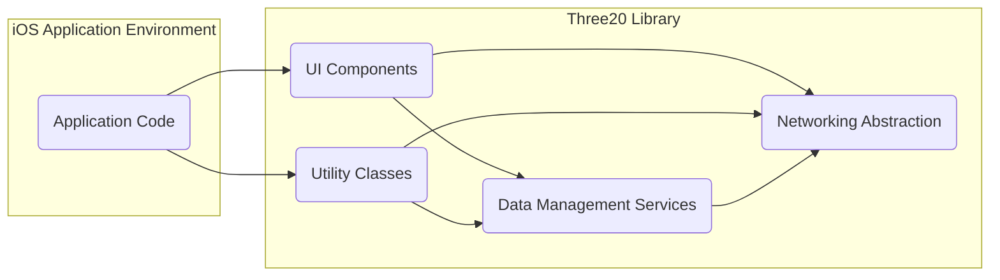
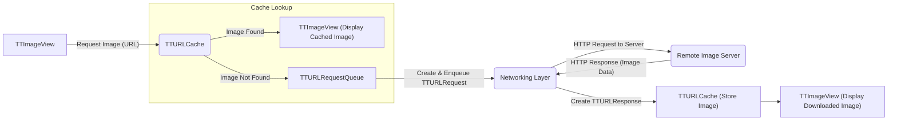

# Project Design Document: Three20 iOS Library

**Version:** 1.1
**Date:** October 26, 2023
**Author:** AI Software Architect

## 1. Introduction

This document provides an enhanced design overview of the Three20 project, an archived Objective-C library from Facebook. Its purpose is to facilitate threat modeling by offering a clear understanding of the library's architecture, components, and data flow within iOS applications.

Three20 aimed to accelerate iOS development by offering a collection of reusable UI components and utility classes. While no longer actively maintained, its design remains relevant for security analysis of applications that still incorporate it.

## 2. Goals and Objectives

The original goals of the Three20 library were to:

*   Simplify iOS development through reusable UI elements.
*   Provide utility classes for common tasks (networking, caching, image handling).
*   Promote a consistent user interface across application sections.
*   Abstract complex UI patterns for easier implementation.

This design document aims to:

*   Clearly define the major components and their responsibilities within the library.
*   Illustrate the interactions and data flow between these components.
*   Highlight key areas relevant to security analysis and the subsequent threat modeling process.

## 3. System Architecture

Three20's architecture is modular, comprising distinct components that interact to provide its functionality. The high-level structure is depicted below:

**Architectural Layers:**

*   **UI Components:** Offers pre-built UI elements and view controllers, extending standard UIKit. Examples include custom table views, image views, and photo viewers.
*   **Data Management Services:** Handles data retrieval, local caching, and potentially data persistence. Focuses on managing data flow from network sources to UI elements.
*   **Networking Abstraction:** Provides an interface for making HTTP requests and processing responses, simplifying network operations within the application.
*   **Utility Classes:** A collection of helper classes for common tasks like string manipulation, date formatting, and image processing, used across other components.

## 4. Component Design

This section details the key components within each architectural layer, providing a more granular view.

### 4.1. UI Components

*   **`TTTableView` & Extensions:** Enhanced table view implementations offering features like asynchronous image loading and improved data source management.
*   **`TTImageView`:** A custom image view designed for asynchronous loading and caching of images from local files or remote URLs.
*   **`TTPhotoViewController` Suite:** Components for displaying and navigating collections of images, often with features like zooming and captions.
*   **`TTNavigator`:** A URL-based navigation system enabling deep linking and managing application flow through URL patterns.
*   **`TTTabBarController` & `TTTab`:** Custom implementations for tab bar interfaces.
*   **`TTAlertViewController` & `TTActionSheetController`:** Custom implementations for displaying alerts and action sheets.
*   Various other custom views, controls, and view controllers designed to simplify common UI patterns.

### 4.2. Data Management Services

*   **`TTURLRequest` & `TTURLResponse`:** Classes encapsulating HTTP requests and their corresponding responses, providing a structured way to handle network communication.
*   **`TTURLCache`:** A caching mechanism for storing network responses, reducing redundant network requests and improving performance.
*   **`TTURLJSONResponse` & `TTURLXMLResponse`:** Classes designed to parse JSON and XML data received from network responses, facilitating data extraction.
*   **`TTModel` Framework:** A framework for managing application data models, often used in conjunction with data fetched from network sources.

### 4.3. Networking Abstraction

*   **`TTURLRequestQueue`:** Manages a queue of `TTURLRequest` objects, allowing for concurrent execution of network requests.
*   **`TTURLDownloadResponse`:** A specialized response class for handling file downloads, providing specific methods for accessing downloaded files.
*   Support for standard HTTP methods (GET, POST, PUT, DELETE, etc.).
*   Basic authentication handling for network requests.

### 4.4. Utility Classes

*   **String Utilities:** Classes providing helper methods for string manipulation and processing.
*   **Date & Time Utilities:** Classes for formatting and manipulating dates and times.
*   **Image Processing Utilities:** Functions for basic image manipulation tasks.
*   **Logging & Debugging Utilities:** Mechanisms for logging events and debugging information within the library.
*   **Geometry & Layout Utilities:** Helper functions for calculating sizes and positions of UI elements.

## 5. Data Flow

Data flow within a Three20-based application typically follows these patterns:

*   **User Interaction Initiated:** User actions within the application's UI trigger events that may require data retrieval or updates.
*   **Navigation via `TTNavigator`:** The `TTNavigator` component interprets URLs to manage transitions between different views and application states.
*   **Data Fetching Process:** UI components often initiate requests for data from remote servers using the networking layer.
    *   The application creates a `TTURLRequest` specifying the resource to be fetched.
    *   This request is added to the `TTURLRequestQueue` for processing.
    *   The networking layer executes the request, sending an HTTP request to the remote server.
    *   The remote server responds with data.
    *   A `TTURLResponse` object encapsulates the server's response.
    *   `TTURLCache` is checked; if the response is cached and valid, it's retrieved from the cache.
    *   If not cached or invalid, the new response is potentially stored in the cache.
    *   The response data is parsed (e.g., using `TTURLJSONResponse` or `TTURLXMLResponse`).
    *   The parsed data is then used to update data models and UI components.
*   **Asynchronous Image Loading:** `TTImageView` handles the asynchronous loading and display of images.
    *   When a `TTImageView` needs to display an image from a URL, it first checks `TTURLCache`.
    *   If the image is in the cache, it's loaded directly.
    *   If not, a network request is initiated via the networking layer.
    *   Upon successful download, the image data is cached and then displayed in the `TTImageView`.

**Detailed Data Flow (Image Loading Example):**

## 6. Security Considerations (For Threat Modeling)

Considering the architecture and data flow, several potential security considerations are relevant for threat modeling:

*   **Network Security:**
    *   **Lack of HTTPS Enforcement:** If `TTURLRequest` is not configured to enforce HTTPS, communication can be intercepted (Man-in-the-Middle attacks).
    *   **Insecure Data Transmission:** Sensitive data transmitted over HTTP without encryption poses a significant risk.
    *   **Vulnerable TLS/SSL Configurations:** Older versions of TLS/SSL might be used, making connections susceptible to known vulnerabilities.
*   **Data Caching Vulnerabilities:**
    *   **Insecure Cache Storage:** Cached data might be stored unencrypted on the device's file system, accessible to malicious applications or attackers with physical access.
    *   **Cache Poisoning:** If the `TTURLCache` implementation lacks proper validation, attackers might inject malicious content into the cache.
*   **`TTNavigator` and URL Handling:**
    *   **Deep Linking Exploits:** Improperly validated URLs passed to `TTNavigator` could lead to unintended actions or access to sensitive application functionalities.
    *   **Open Redirection:** Maliciously crafted URLs could redirect users to external, potentially harmful websites.
*   **Input Validation Issues:**
    *   **Cross-Site Scripting (XSS) via Web Views:** If Three20 components interact with web views, inadequate input sanitization could lead to XSS vulnerabilities.
    *   **Injection Attacks:** Failure to sanitize data from external sources before using it in database queries (if applicable within the application using Three20) could lead to SQL injection or similar attacks.
*   **Dependency Security:**
    *   **Vulnerabilities in Three20:** As an archived project, Three20 itself might contain known, unpatched vulnerabilities.
    *   **Transitive Dependencies:**  Any underlying libraries or frameworks used by Three20 could also introduce vulnerabilities.
*   **Local Data Storage Security:**
    *   **Insecure Storage of Sensitive Information:** If the application uses Three20 utilities for local storage (beyond caching), sensitive data might be stored without encryption.

## 7. Dependencies

Three20 relies on the following core iOS frameworks and the Objective-C runtime:

*   **Objective-C Runtime:** The fundamental runtime environment for the library.
*   **Foundation Framework:** Provides essential object types, collections, and system services.
*   **UIKit Framework:** The framework for building the graphical user interface of iOS applications.
*   **CoreGraphics Framework:** Used for 2D drawing and image manipulation.
*   Potentially other system frameworks depending on the specific features of Three20 being utilized.

## 8. Deployment

Three20 is typically integrated into an iOS project through one of the following methods:

*   **Direct Source Code Inclusion:** Adding the Three20 source files directly to the project.
*   **Static Library Linking:** Linking against a pre-compiled static library version of Three20.
*   **Framework Integration:** Embedding the Three20 framework into the application bundle.

Regardless of the method, proper configuration of build settings is required to include necessary frameworks and link the library correctly.

## 9. Assumptions and Constraints

*   This design document is based on the publicly available source code and documentation of the archived Three20 project.
*   The primary use case is within the context of native iOS applications.
*   The security risks outlined are potential and depend on the specific implementation and usage of Three20 within an application.
*   Being an archived project, active development and security patching are not expected.

## 10. Future Considerations for Security Analysis

This design document provides a foundation for more in-depth security analysis. Future steps should include:

*   **Detailed Source Code Audits:**  Manually reviewing the Three20 source code to identify potential vulnerabilities and security flaws.
*   **Threat Modeling Exercises:**  Conducting structured threat modeling (e.g., using STRIDE methodology) based on this design document to identify specific threats and attack vectors.
*   **Static and Dynamic Analysis:** Utilizing static analysis tools to identify potential code-level vulnerabilities and dynamic analysis techniques to observe runtime behavior and identify security weaknesses.
*   **Dependency Vulnerability Scanning:**  Analyzing the dependencies of Three20 for known vulnerabilities.
*   **Security Testing of Applications Using Three20:** Performing penetration testing and security assessments on applications that incorporate the Three20 library.