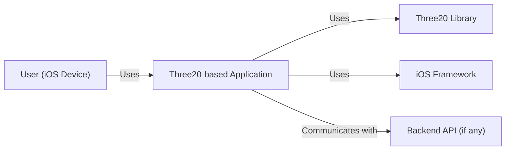
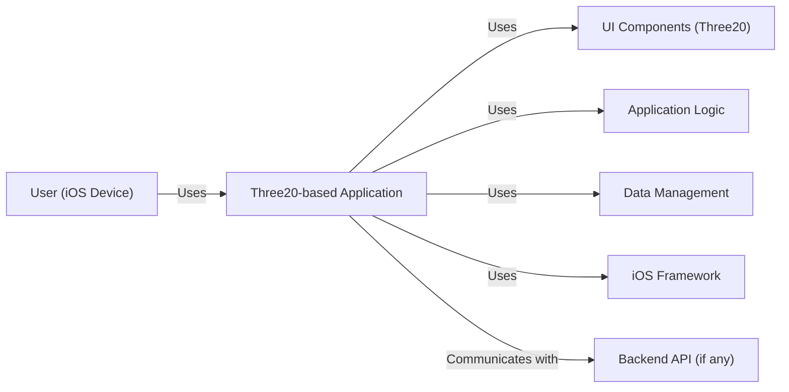
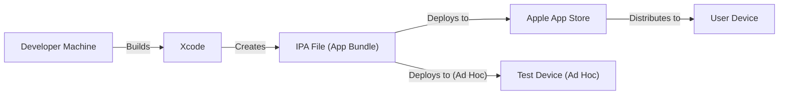
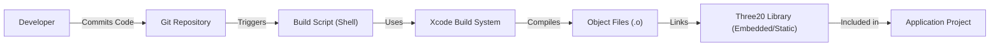

Okay, let's create a design document for the Three20 project, keeping in mind its context and purpose.  Since this is an archived project, we'll need to make some assumptions and focus on its historical context while still applying sound architectural principles.

# BUSINESS POSTURE

Three20 was a collection of Objective-C libraries widely used by iOS developers before the advent of more modern frameworks like UIKit and SwiftUI.  It aimed to simplify and accelerate iOS development by providing pre-built components and utilities.  Given Facebook's (now Meta) historical focus on rapid iteration and feature delivery, we can infer the following:

Priorities and Goals:

*   Accelerated Development: Reduce the time and effort required to build common iOS UI features.
*   Code Reusability: Provide a library of reusable components to avoid "reinventing the wheel."
*   Community Adoption: Foster a large community of users and contributors to improve the library and share knowledge.
*   Consistency: Offer a consistent look and feel across different iOS applications (though this was less of a priority than speed).

Business Risks:

*   Outdated Codebase: As an archived project, the primary risk is that Three20 relies on outdated APIs and patterns, potentially leading to compatibility issues with newer iOS versions and devices.
*   Security Vulnerabilities: Older code may contain unpatched security vulnerabilities, making applications that use it susceptible to attacks.
*   Lack of Maintenance: Since it's archived, there are no ongoing updates or security patches, increasing the risk over time.
*   Dependency Conflicts: Three20 might have dependencies on other outdated libraries, compounding the risks.
*   Performance Issues: Older code might not be optimized for newer hardware and software, leading to performance bottlenecks.
*   Lack of Support: No official support channel exists, making it difficult to resolve issues.

# SECURITY POSTURE

Given that Three20 is an archived, client-side library, the security posture focuses on secure coding practices within the library itself and how it *should* be used by developers.  We'll assume a context where a company might be considering using (or historically used) Three20 in a mobile application.

Existing Security Controls (Inferred from the repository and common practices of the time):

*   security control: Code Reviews: While not explicitly documented in the archive, it's highly likely that Facebook had internal code review processes for contributions to Three20. (Implementation: Internal Facebook development processes).
*   security control: Static Analysis: Basic static analysis tools *might* have been used, but this is less certain given the age of the project. (Implementation: Potentially through build scripts or IDE integrations).
*   security control: Community Scrutiny: As an open-source project, Three20 benefited from community scrutiny, where external developers could identify and report potential issues. (Implementation: GitHub issues and pull requests).

Accepted Risks:

*   accepted risk: Reliance on Deprecated APIs: Three20 likely uses some deprecated iOS APIs, which is unavoidable for a library of its age.
*   accepted risk: Limited Input Validation: While some input validation might exist within specific components, it's unlikely to be comprehensive across the entire library.
*   accepted risk: Lack of Modern Security Features: Three20 predates many modern iOS security features (like App Transport Security), so it doesn't explicitly leverage them.

Recommended Security Controls (If Three20 were to be used/revived today - HIGHLY DISCOURAGED):

*   Comprehensive Static Analysis: Integrate modern static analysis tools (e.g., SonarQube, Coverity) into the build process to identify potential vulnerabilities.
*   Dynamic Analysis: Use dynamic analysis tools (e.g., fuzzers) to test the library's behavior with unexpected inputs.
*   Dependency Scanning: Regularly scan dependencies for known vulnerabilities using tools like OWASP Dependency-Check.
*   Input Validation: Add robust input validation to all components that handle user-provided data.
*   Secure Coding Guidelines: Develop and enforce secure coding guidelines for any modifications or extensions to the library.

Security Requirements:

*   Authentication: Three20 itself doesn't handle authentication directly. Any application using Three20 would need to implement authentication separately, following best practices for iOS (e.g., using Keychain for secure storage, implementing OAuth 2.0 for third-party authentication).
*   Authorization: Similarly, Three20 doesn't handle authorization. The application using it must implement appropriate authorization checks to control access to resources and functionality.
*   Input Validation: All components that accept user input (e.g., text fields, forms) *should* perform thorough input validation to prevent common vulnerabilities like cross-site scripting (XSS) and injection attacks.  This is a critical area where Three20 likely needs improvement.
*   Cryptography: If Three20 handles any sensitive data (which it ideally shouldn't, as a UI library), it *should* use appropriate cryptographic algorithms and techniques (e.g., AES for encryption, SHA-256 for hashing). However, data handling should primarily be the responsibility of the application, not the UI library.

# DESIGN

## C4 CONTEXT

C4 Context Element List:

*   Element:
    *   Name: User
    *   Type: Person
    *   Description: A person interacting with the iOS application.
    *   Responsibilities: Interacts with the application's UI, provides input, views output.
    *   Security controls: Relies on device-level security (passcode, biometrics) and application-level security.

*   Element:
    *   Name: Three20-based Application
    *   Type: Software System
    *   Description: An iOS application that utilizes the Three20 library for UI components and utilities.
    *   Responsibilities: Provides application-specific functionality, handles user interactions, communicates with backend services (if any).
    *   Security controls: Implements authentication, authorization, input validation, and secure communication with backend services.

*   Element:
    *   Name: Three20 Library
    *   Type: Software System
    *   Description: The Three20 library, providing pre-built UI components and utilities.
    *   Responsibilities: Provides UI components, simplifies common development tasks.
    *   Security controls: Should implement input validation within its components.

*   Element:
    *   Name: iOS Framework
    *   Type: Software System
    *   Description: The underlying iOS operating system and frameworks.
    *   Responsibilities: Provides core OS functionality, manages hardware resources, enforces security policies.
    *   Security controls: Implements sandboxing, code signing, data protection, and other OS-level security features.

*   Element:
    *   Name: Backend API
    *   Type: Software System
    *   Description: Any backend services that the application communicates with.
    *   Responsibilities: Provides data and business logic to the application.
    *   Security controls: Implements authentication, authorization, input validation, and secure data storage.

## C4 CONTAINER

Since Three20 is a library, the container diagram is essentially an extension of the context diagram. The "containers" are logical components within the application.

C4 Container Element List:

*   Element:
    *   Name: User
    *   Type: Person
    *   Description: A person interacting with the iOS application.
    *   Responsibilities: Interacts with the application's UI, provides input, views output.
    *   Security controls: Relies on device-level security and application-level security.

*   Element:
    *   Name: Three20-based Application
    *   Type: Mobile App
    *   Description: An iOS application that utilizes the Three20 library.
    *   Responsibilities: Provides application-specific functionality, handles user interactions, communicates with backend services (if any).
    *   Security controls: Implements authentication, authorization, input validation, and secure communication.

*   Element:
    *   Name: UI Components (Three20)
    *   Type: Library
    *   Description: The UI components provided by the Three20 library.
    *   Responsibilities: Renders UI elements, handles user input events.
    *   Security controls: Should implement input validation within its components.

*   Element:
    *   Name: Application Logic
    *   Type: Code
    *   Description: The application-specific business logic.
    *   Responsibilities: Processes data, implements application features.
    *   Security controls: Implements authorization checks, enforces business rules.

*   Element:
    *   Name: Data Management
    *   Type: Code
    *   Description: Code responsible for managing data persistence and retrieval.
    *   Responsibilities: Stores and retrieves data locally (e.g., using Core Data, SQLite) or from remote sources.
    *   Security controls: Implements data encryption (if necessary), secure data storage practices.

*   Element:
    *   Name: iOS Framework
    *   Type: Software System
    *   Description: The underlying iOS operating system and frameworks.
    *   Responsibilities: Provides core OS functionality, manages hardware resources.
    *   Security controls: Implements sandboxing, code signing, data protection.

*   Element:
    *   Name: Backend API
    *   Type: Software System
    *   Description: Any backend services that the application communicates with.
    *   Responsibilities: Provides data and business logic to the application.
    *   Security controls: Implements authentication, authorization, input validation, and secure data storage.

## DEPLOYMENT

Deployment options for an iOS application using Three20 (historically):

1.  **Direct Embedding:** The Three20 library code is directly included in the application's Xcode project. This is the most likely scenario.
2.  **Static Library:** Three20 could be built as a static library (.a file) and linked into the application.
3.  **Framework (Less Likely):**  While less common at the time, Three20 *could* have been packaged as a framework (.framework).

We'll describe the most likely scenario: **Direct Embedding**.

Deployment Element List:

*   Element:
    *   Name: Developer Machine
    *   Type: Workstation
    *   Description: The developer's computer used for coding and building the application.
    *   Security controls: Relies on developer machine security (OS security, access controls).

*   Element:
    *   Name: Xcode
    *   Type: IDE
    *   Description: Apple's Integrated Development Environment for iOS development.
    *   Security controls: Uses code signing, relies on developer certificates.

*   Element:
    *   Name: IPA File (App Bundle)
    *   Type: File
    *   Description: The packaged application file, ready for distribution.
    *   Security controls: Digitally signed with a developer certificate.

*   Element:
    *   Name: Apple App Store
    *   Type: Platform
    *   Description: Apple's official distribution platform for iOS applications.
    *   Security controls: Performs app review, enforces security policies.

*   Element:
    *   Name: Test Device (Ad Hoc)
    *   Type: Mobile Device
    *   Description: A device used for testing the application via Ad Hoc distribution.
    *   Security controls: Requires provisioning profiles, device registration.

*   Element:
    *   Name: User Device
    *   Type: Mobile Device
    *   Description: The end-user's iOS device.
    *   Security controls: Relies on device-level security and application sandboxing.

## BUILD

The build process for Three20, based on the repository structure, likely involved the following:

1.  **Developer:** Writes code, commits changes to the repository (likely using Git).
2.  **Build Script (Likely Shell Scripts):**  The repository contains shell scripts (e.g., `src/scripts/`) that were likely used to automate parts of the build process, such as compiling the code, running tests (if any), and potentially packaging the library.
3.  **Xcode Project:** The core build process would have used Xcode's build system to compile the Objective-C code into object files and then link them together.
4.  **Output:** The output would have been either directly embedded code within an Xcode project or, less likely, a compiled static library (.a file).

Security Controls in the Build Process (Hypothetical, given the project's age):

*   security control: Code Signing: Xcode would have used code signing to ensure the integrity of the compiled code.
*   security control: Basic Static Analysis:  Simple static analysis *might* have been integrated into the build scripts, but this is uncertain.

# RISK ASSESSMENT

*   Critical Business Process: The critical business process being protected is the *user experience* of the iOS application. A compromised or poorly performing UI library directly impacts the user's interaction with the app.
*   Data Sensitivity: Three20, as a UI library, *should not* directly handle sensitive user data.  However, if misused, it could be involved in:
    *   **Low Sensitivity:** Displaying non-sensitive UI elements.
    *   **Medium Sensitivity:**  Potentially handling user input that *could* be sensitive if not properly validated and passed to secure components.
    *   **High Sensitivity (Incorrect Usage):** If Three20 is incorrectly used to store or transmit sensitive data (e.g., passwords, personal information), this represents a high-risk scenario.  This is a misuse of the library, but it's a potential risk.

# QUESTIONS & ASSUMPTIONS

Questions:

*   Were there any specific security audits or reviews performed on Three20 during its active development?
*   What were the specific build tools and processes used beyond the basic Xcode build system?
*   Were there any documented security guidelines or best practices for developers using Three20?
*   What were the known limitations or vulnerabilities of Three20, as acknowledged by the developers?

Assumptions:

*   BUSINESS POSTURE: Assumed that rapid development and community adoption were key priorities.
*   SECURITY POSTURE: Assumed basic code review practices were in place. Assumed limited use of static analysis tools. Assumed reliance on community scrutiny for vulnerability identification.
*   DESIGN: Assumed direct embedding of the library code into applications was the primary deployment method. Assumed a basic build process using Xcode and shell scripts.