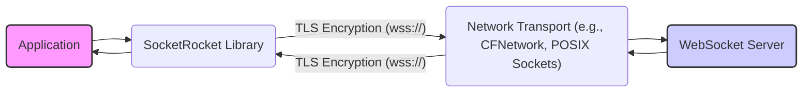
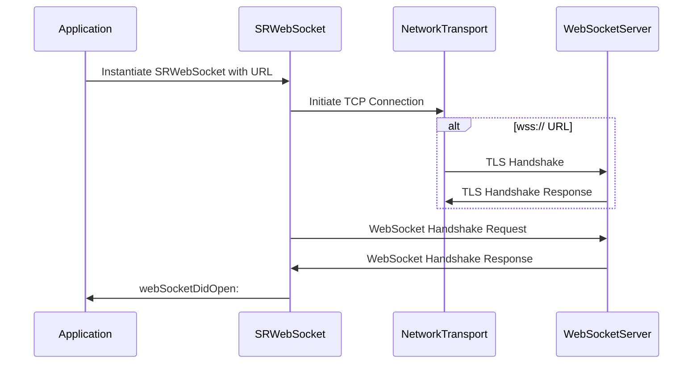
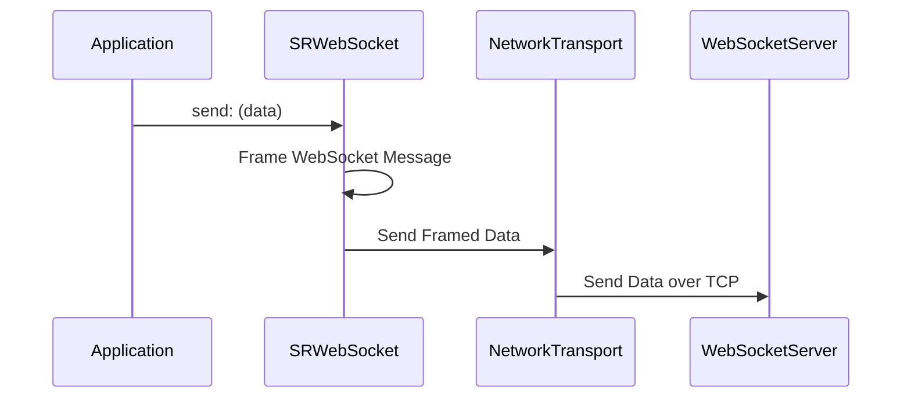
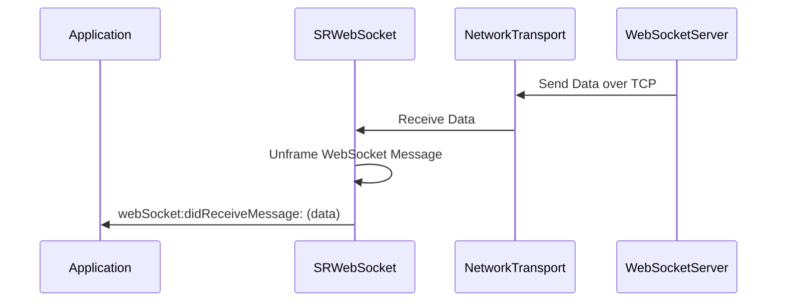
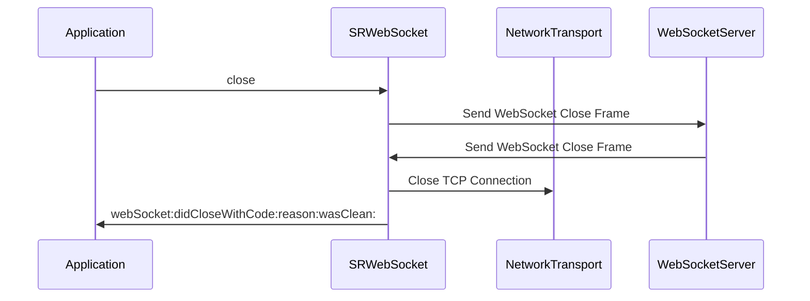

# Project Design Document: SocketRocket WebSocket Client

**Version:** 1.1
**Date:** October 26, 2023
**Author:** AI Software Architect

## 1. Introduction

This document provides an enhanced design overview of the SocketRocket project, a widely used WebSocket client library primarily for iOS and macOS development. Its purpose is to offer a clear understanding of the library's architecture, internal components, and data flow, specifically tailored for effective threat modeling. This document serves as a crucial resource for identifying potential security vulnerabilities and informing mitigation strategies.

## 2. Goals

*   Deliver a refined and more detailed description of the SocketRocket architecture.
*   Provide a clearer breakdown of key components and their specific responsibilities.
*   Offer more granular illustrations of data flow within the library and its interactions with external systems.
*   Emphasize security-relevant aspects of the design with greater specificity.
*   Serve as an improved foundation for comprehensive threat modeling activities.

## 3. Non-Goals

*   This document remains a high-level design overview and does not delve into the minutiae of the codebase.
*   Detailed explanations of operating system networking API implementations are outside the scope.
*   In-depth performance analysis, benchmarking, and optimization strategies are not covered.
*   Specific implementation details of error handling routines or logging mechanisms are not exhaustively described.

## 4. Architectural Overview

SocketRocket is architected as a client-side library, empowering applications to establish and maintain robust WebSocket connections with remote servers. It handles the complexities of the WebSocket protocol, presenting developers with a streamlined API for sending and receiving data.

**Key Architectural Points:**

*   **Client-Centric Design:** SocketRocket operates exclusively on the client side, initiating and managing connections to remote WebSocket endpoints.
*   **Protocol Abstraction:** It effectively hides the low-level intricacies of the WebSocket protocol, offering a more intuitive and developer-friendly interface.
*   **Event-Driven Interaction:** Applications interact with SocketRocket primarily through a delegate pattern or callback mechanisms, reacting to asynchronous events such as connection establishment, message arrival, and connection closure.
*   **Platform-Specific Networking:**  It leverages the underlying networking capabilities of the host platform (e.g., CFNetwork on Apple platforms, potentially POSIX sockets on other systems) for the actual network communication.

## 5. Component Breakdown

This section provides a more detailed breakdown of the key components within the SocketRocket library and their specific responsibilities.

*   **`SRWebSocket` Class:**
    *   The primary interface for application interaction with the library.
    *   Manages the complete lifecycle of a WebSocket connection, including opening, maintaining, closing, and attempting reconnection.
    *   Provides methods for sending both text and binary data over the WebSocket connection.
    *   Implements the delegate or callback mechanism to notify the application about connection status and received messages.
    *   Handles the WebSocket handshake negotiation process with the server.
    *   Encapsulates and manages the underlying network connection.

*   **Network Transport Layer:**
    *   Provides an abstraction over the platform's underlying network communication mechanisms.
    *   On Apple platforms, this typically utilizes `CFNetwork` or `Foundation`'s networking classes.
    *   Responsible for establishing the initial TCP connection to the server.
    *   Handles TLS/SSL negotiation when using secure WebSocket connections (`wss://`).
    *   Manages the low-level socket input and output operations.

*   **WebSocket Protocol Handler:**
    *   Implements the core logic of the WebSocket protocol as defined in RFC 6455 and related specifications.
    *   Handles the framing and unframing of WebSocket messages, converting between raw bytes and structured messages.
    *   Manages WebSocket control frames, such as `ping`, `pong`, and `close` frames.
    *   Performs the masking of payload data for messages sent from the client to the server, as required by the protocol.
    *   Maintains the current state of the WebSocket connection (e.g., connecting, open, closing, closed).

*   **Delegate/Callback Interface:**
    *   Defines the protocol or set of callback methods that the integrating application implements to receive notifications from SocketRocket.
    *   Key methods include:
        *   `webSocketDidOpen:`: Notifies the delegate when the WebSocket connection has been successfully established.
        *   `webSocket:didReceiveMessage:`: Delivers received text or binary data to the delegate.
        *   `webSocket:didCloseWithCode:reason:wasClean:`: Informs the delegate about the closure of the WebSocket connection, including the closure code and reason.
        *   `webSocket:didFailWithError:`: Notifies the delegate that the WebSocket connection failed to establish or encountered an error.
        *   Potentially other methods for handling specific events like receiving ping frames.

*   **Run Loop Integration (on Apple platforms):**
    *   Integrates with the operating system's run loop mechanism to efficiently handle asynchronous network events.
    *   Allows SocketRocket to perform network operations without blocking the main application thread, ensuring a responsive user interface.

## 6. Data Flow

This section provides a more detailed description of the data flow during typical WebSocket communication using SocketRocket.

### 6.1. Establishing a Connection

1. The application instantiates an `SRWebSocket` object, providing the URL of the WebSocket server.
2. `SRWebSocket` instructs the Network Transport Layer to initiate a TCP connection to the specified server address and port.
3. If the URL scheme is `wss://`, the Network Transport Layer performs a TLS/SSL handshake with the server to establish a secure connection.
4. `SRWebSocket` constructs a WebSocket handshake request, including essential headers like `Upgrade`, `Connection`, and a randomly generated `Sec-WebSocket-Key`.
5. The handshake request is sent to the WebSocket server via the Network Transport Layer.
6. The WebSocket server responds with a handshake response, including a `Sec-WebSocket-Accept` header derived from the `Sec-WebSocket-Key`.
7. `SRWebSocket` validates the server's handshake response to ensure it matches the expected value, preventing accidental protocol upgrades.
8. Upon successful handshake validation, `SRWebSocket` notifies its delegate by calling the `webSocketDidOpen:` method.

### 6.2. Sending Data

1. The application calls the `send:` method on the `SRWebSocket` instance, providing the data to be sent (either a text string or binary `NSData`).
2. `SRWebSocket`'s WebSocket Protocol Handler frames the data according to the WebSocket protocol. This involves adding a header indicating the payload type (text or binary) and applying masking to the payload bytes.
3. The framed WebSocket message is passed to the Network Transport Layer.
4. The Network Transport Layer transmits the framed data over the established TCP connection to the WebSocket server.
5. The WebSocket server receives the framed data.

### 6.3. Receiving Data

1. The Network Transport Layer receives raw data from the WebSocket server over the TCP connection.
2. The received data is passed to the `SRWebSocket` instance.
3. `SRWebSocket`'s WebSocket Protocol Handler unframes the incoming data. This involves parsing the WebSocket frame header to determine the payload type and unmasking the payload data. It also handles potential message fragmentation, reassembling fragmented messages.
4. If a data frame is received, the payload (either text or binary data) is extracted.
5. `SRWebSocket` notifies its delegate by calling the `webSocket:didReceiveMessage:` method, providing the received data.

### 6.4. Closing the Connection

1. The application can initiate the closure of the WebSocket connection by calling the `close` method on the `SRWebSocket` instance.
2. `SRWebSocket`'s WebSocket Protocol Handler constructs a WebSocket Close frame, optionally including a status code and reason for closure.
3. The Close frame is sent to the server via the Network Transport Layer.
4. Upon receiving a Close frame (either initiated by the client or the server), `SRWebSocket` sends an acknowledgement Close frame back to the sender.
5. The Network Transport Layer closes the underlying TCP connection.
6. `SRWebSocket` notifies its delegate by calling the `webSocket:didCloseWithCode:reason:wasClean:` method, indicating the closure status.

## 7. Security Considerations

This section provides a more detailed examination of security considerations relevant to SocketRocket.

*   **Transport Layer Security (TLS/SSL):**
    *   SocketRocket strongly supports secure WebSocket connections (`wss://`) through TLS/SSL encryption.
    *   The underlying Network Transport Layer (e.g., `CFNetwork`) is responsible for handling the complexities of the TLS handshake, including certificate validation and cipher suite negotiation.
    *   **Threat:** Man-in-the-Middle (MitM) attacks where an attacker intercepts and potentially modifies communication.
    *   **Mitigation:**  Ensure proper certificate validation is enabled and consider implementing certificate pinning to further restrict accepted certificates.

*   **WebSocket Handshake Security:**
    *   SocketRocket correctly implements the WebSocket handshake, including the use of the `Sec-WebSocket-Key` and `Sec-WebSocket-Accept` headers.
    *   **Threat:**  Accidental or malicious protocol downgrade or cross-protocol scripting attacks.
    *   **Mitigation:**  The handshake mechanism itself provides inherent protection against these threats if implemented correctly, as it is in SocketRocket.

*   **Data Masking:**
    *   As a WebSocket client, SocketRocket adheres to the protocol requirement of masking all data frames sent to the server.
    *   **Threat:**  While primarily a concern for servers, improper masking on the client side could theoretically be exploited in certain network configurations.
    *   **Mitigation:** SocketRocket's correct implementation of masking mitigates this risk.

*   **Input Validation and Sanitization:**
    *   While SocketRocket primarily focuses on sending and receiving framed data, applications using SocketRocket must be vigilant about validating and sanitizing data received from the server.
    *   **Threat:**  Injection attacks (e.g., cross-site scripting if the data is displayed in a web view) or other vulnerabilities arising from processing untrusted data.
    *   **Mitigation:**  Applications must implement their own input validation and sanitization logic for received messages.

*   **Denial of Service (DoS) Attacks:**
    *   A malicious server could attempt to overwhelm the client by sending a large volume of messages or excessively large messages.
    *   **Threat:** Client resource exhaustion (CPU, memory, network bandwidth).
    *   **Mitigation:** SocketRocket likely has internal buffering and flow control mechanisms. Applications can implement additional safeguards like connection timeouts and message size limits.

*   **Authentication and Authorization:**
    *   SocketRocket does not provide built-in authentication or authorization mechanisms.
    *   **Threat:** Unauthorized access to server resources or actions.
    *   **Mitigation:** Applications must implement their own authentication and authorization schemes, often involving sending tokens or credentials during the initial handshake or within subsequent messages.

*   **Resource Management:**
    *   Improper management of WebSocket connections can lead to resource leaks.
    *   **Threat:**  Excessive resource consumption on the client device.
    *   **Mitigation:**  Applications should ensure proper connection lifecycle management, closing connections when they are no longer needed.

*   **Dependency Management:**
    *   The security of SocketRocket is also dependent on the security of its underlying dependencies, particularly the networking libraries provided by the operating system.
    *   **Threat:** Vulnerabilities in underlying libraries could be exploited through SocketRocket.
    *   **Mitigation:** Keeping the operating system and development tools up-to-date is crucial.

*   **Error Handling:**
    *   Robust error handling within SocketRocket is important to prevent unexpected behavior or information leaks.
    *   **Threat:**  Information disclosure through overly verbose error messages or unexpected application states.
    *   **Mitigation:**  Error messages should be informative for debugging but avoid revealing sensitive information.

## 8. Deployment

SocketRocket is typically deployed as a library integrated directly into the application's project. Developers include the SocketRocket source files or a pre-built framework into their Xcode project (for iOS and macOS). The application then instantiates and utilizes the `SRWebSocket` class to manage WebSocket connections at runtime.

## 9. Future Considerations

*   **Potential vulnerabilities in underlying platform networking libraries:** Continuous monitoring of security advisories and timely updates are essential.
*   **Evolving WebSocket standards and extensions:** Future versions of SocketRocket may need to incorporate new features or security enhancements from updated WebSocket specifications.
*   **Formal security audits:** Periodic security audits of the SocketRocket codebase by security experts can help identify potential vulnerabilities.
*   **Consideration of additional security features:** Exploring features like built-in support for certificate pinning or configurable message size limits could enhance security.

This improved design document provides a more detailed and security-focused overview of the SocketRocket project. It serves as a valuable resource for security professionals to conduct thorough threat modeling and for developers to understand the security implications of using this library.