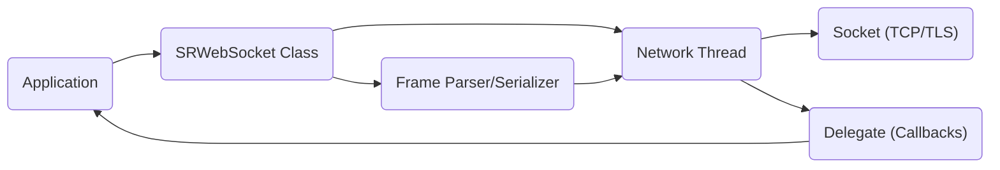
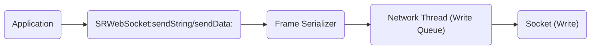
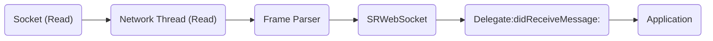
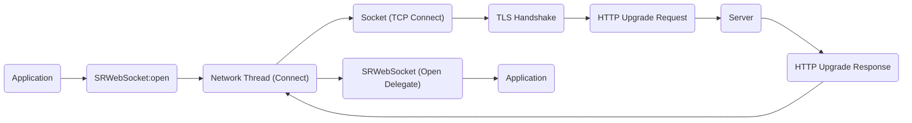

# Project Design Document: SocketRocket

**Version:** 1.1
**Date:** October 26, 2023
**Author:** AI Software Architect

## 1. Introduction

This document provides an enhanced design overview of the SocketRocket project, an open-source C++ WebSocket client library developed by Facebook Incubator. This iteration builds upon the previous version, offering greater detail and clarity, particularly in areas pertinent to security analysis and threat modeling. The document aims to provide a comprehensive understanding of the system's architecture, components, and data flow, specifically tailored for subsequent security evaluations. It elaborates on key functionalities, design choices, and potential security considerations inherent in the library's design.

## 2. Goals and Objectives

The primary goals of SocketRocket are to provide:

* **High Performance:**  Achieving efficient and low-latency bi-directional communication over WebSockets.
* **Reliability:** Ensuring robust connection management, including handling network interruptions and providing mechanisms for reconnection.
* **Scalability:**  Designing the library to handle a significant number of concurrent WebSocket connections without performance degradation.
* **Ease of Use:** Offering a developer-friendly and intuitive API that simplifies the integration of WebSocket functionality into applications.
* **Platform Independence:** Supporting a range of operating systems and architectures where C++ is a viable development language.
* **Security:** Implementing secure communication practices and minimizing potential vulnerabilities.

This design document places a strong emphasis on elucidating the architectural aspects directly relevant to security and potential weaknesses that could be exploited.

## 3. System Architecture

SocketRocket employs an event-driven, non-blocking architecture to maximize efficiency. It leverages asynchronous operations and event loops for effective management of network input/output (I/O) and the processing of WebSocket frames. This design minimizes blocking and allows for handling numerous concurrent connections.

### 3.1. High-Level Architecture Diagram

* **Application:** The user's software that integrates and utilizes the SocketRocket library for WebSocket communication.
* **SRWebSocket Class:** The central interface provided by the library. It encapsulates the WebSocket connection lifecycle, provides methods for sending and receiving data, and manages the delegation of events.
* **Network Thread:** A dedicated background thread responsible for all network-related operations, including reading from and writing to the socket. This separation prevents blocking the main application thread.
* **Socket (TCP/TLS):** The underlying transport mechanism. SocketRocket uses TCP sockets for communication and supports secure WebSocket connections (WSS) by implementing TLS on top of TCP.
* **Frame Parser/Serializer:** This component handles the encoding and decoding of WebSocket frames according to the RFC 6455 specification. It manages framing, masking/unmasking of data, and processing of control frames.
* **Delegate (Callbacks):** A design pattern used to notify the application about significant events occurring within the WebSocket connection, such as successful connection, reception of messages, connection closure, and errors.

### 3.2. Component Breakdown

* **SRWebSocket:**
    * **Connection Management:**  Manages the entire lifecycle of a WebSocket connection, transitioning through states like connecting, open, closing, and closed.
    * **API Interface:** Provides public methods for initiating a connection (`open`), sending data (`sendString:`, `sendData:`), closing the connection (`close`), and setting the delegate.
    * **Handshake Negotiation:** Implements the client-side of the WebSocket handshake, including sending the HTTP Upgrade request and verifying the server's response.
    * **Reconnection Logic:**  May include optional logic for automatically attempting to reconnect if the connection is lost.
    * **Error Handling:**  Manages and propagates errors that occur during the connection lifecycle.
* **Network Thread (Internal):**
    * **Asynchronous I/O:** Utilizes platform-specific asynchronous I/O mechanisms (e.g., `select`, `poll`, `epoll` on Linux; kqueue on macOS/iOS; IOCP on Windows) for non-blocking network operations.
    * **Socket Management:**  Creates, connects, and manages the underlying TCP socket.
    * **TLS Handling:** If WSS is used, this thread handles the TLS handshake process, likely using a library such as OpenSSL, BoringSSL, or a platform-provided TLS implementation. This includes certificate verification.
    * **Read/Write Operations:**  Continuously monitors the socket for incoming data and manages the sending of outgoing data.
    * **Buffering:**  Implements buffering for both incoming and outgoing data to handle situations where data arrives or needs to be sent in chunks.
* **Frame Parser:**
    * **Byte Stream Processing:**  Takes raw byte streams received from the network socket and interprets them according to the WebSocket frame format.
    * **Frame Reconstruction:**  Assembles complete WebSocket frames from potentially fragmented data.
    * **Protocol Enforcement:**  Enforces the rules of the WebSocket protocol, such as validating frame headers, checking for reserved bits, and verifying frame lengths.
    * **Masking/Unmasking:**  Handles the masking and unmasking of payload data as required by the WebSocket specification for client-originated messages.
    * **Control Frame Handling:**  Specifically processes control frames like Ping, Pong, and Close, triggering appropriate actions.
    * **Error Detection:**  Identifies protocol violations and errors in the received data.
* **Frame Serializer:**
    * **Message Encoding:**  Converts outgoing messages (strings or binary data) into valid WebSocket frames.
    * **Header Construction:**  Creates the appropriate frame headers, including opcode, flags (FIN, RSV1-3), and payload length.
    * **Masking Application:**  Applies the masking algorithm to the payload data of client-originated frames.
    * **Fragmentation (Optional):**  May implement logic for fragmenting large messages into smaller frames if necessary.
* **Delegate Protocol:**
    * **Event Notification:** Defines a clear interface for the application to receive notifications about WebSocket events.
    * **Key Methods:** Includes methods such as:
        * `"webSocketDidOpen:"`: Called when the WebSocket connection has been successfully established.
        * `"webSocket:didReceiveMessage:"`:  Invoked when a complete WebSocket message (either text or binary) is received.
        * `"webSocket:didCloseWithCode:reason:wasClean:"`:  Called when the WebSocket connection is closed, providing details about the closure.
        * `"webSocket:didFailWithError:"`:  Invoked when an error occurs during the WebSocket connection lifecycle.
* **Run Loop Integration (Implicit):** SocketRocket likely integrates with the underlying operating system's event loop mechanism. This allows the library to efficiently process network events without requiring dedicated polling or blocking operations, improving responsiveness.

## 4. Data Flow

The following details the typical flow of data when sending and receiving messages, as well as the connection establishment process.

### 4.1. Sending a Message

* **Application initiates send:** The application calls the `sendString:` or `sendData:` method on the `SRWebSocket` instance, providing the message to be sent.
* **Frame Serialization:** The `Frame Serializer` takes the message data and encodes it into one or more WebSocket frames, applying the masking algorithm to the payload.
* **Queuing for Network Thread:** The serialized frames are placed into a write queue managed by the `Network Thread`. This allows the application thread to continue without waiting for the network I/O to complete.
* **Socket Write:** The `Network Thread` retrieves frames from the write queue and writes the raw bytes to the underlying TCP socket.

### 4.2. Receiving a Message

* **Socket Read:** Data arrives from the network and is read by the `Network Thread` using asynchronous I/O operations.
* **Frame Parsing:** The `Frame Parser` processes the raw byte stream, identifying and reconstructing individual WebSocket frames.
* **Message Assembly:** The `SRWebSocket` class handles the assembly of fragmented messages, combining multiple frames into a complete message if necessary.
* **Delegate Callback:** Once a complete message is assembled, the `SRWebSocket` instance invokes the appropriate delegate method (e.g., `didReceiveMessage:`) on the application's delegate, passing the received data.
* **Application Processing:** The application receives the message data through the delegate callback and can then process it accordingly.

### 4.3. Connection Establishment (WSS)

* **Application initiates connection:** The application calls the `open` method on the `SRWebSocket` instance to initiate the connection process.
* **TCP Connection:** The `Network Thread` attempts to establish a TCP connection to the specified server address and port.
* **TLS Handshake:** If the connection is a secure WebSocket (WSS), a TLS handshake is performed. This involves the client and server exchanging cryptographic information to establish a secure, encrypted channel. This includes server certificate verification by the client.
* **HTTP Upgrade Request:** After the TLS handshake (if applicable), the client sends an HTTP Upgrade request to the server. This request includes headers indicating the desire to switch to the WebSocket protocol.
* **Server Response:** The server processes the Upgrade request and, if successful, responds with an HTTP 101 Switching Protocols response, confirming the protocol upgrade.
* **Open Delegate:** Upon successful receipt and validation of the server's upgrade response, the `SRWebSocket` instance notifies the application by calling the `webSocketDidOpen:` method on its delegate.

## 5. Security Considerations

This section elaborates on potential security considerations inherent in the design of SocketRocket, providing a basis for thorough threat modeling:

* **Transport Layer Security (TLS) Configuration and Implementation:**
    * **Cipher Suite Negotiation:** The library's TLS implementation needs to negotiate strong cipher suites to prevent downgrade attacks and ensure robust encryption. Weak or outdated cipher suites can be vulnerable.
    * **Protocol Version Support:**  Supporting only the latest TLS protocol versions (TLS 1.2 and above) is crucial to avoid vulnerabilities present in older versions.
    * **Certificate Validation:** Strict validation of the server's TLS certificate, including hostname verification and checking against trusted Certificate Authorities, is paramount to prevent man-in-the-middle attacks. Bypassing or weakening certificate validation introduces a significant vulnerability.
    * **Secure Context Options:** The library should allow configuration of TLS context options, such as disabling insecure renegotiation or enabling OCSP stapling, to enhance security.
    * **Vulnerabilities in Underlying TLS Library:**  SocketRocket's security is dependent on the security of the underlying TLS library (e.g., OpenSSL). Regular updates and awareness of vulnerabilities in these dependencies are essential.
* **WebSocket Protocol Implementation Vulnerabilities:**
    * **Frame Parsing Exploits:**  Bugs in the `Frame Parser` could be exploited by sending malformed or oversized frames, potentially leading to buffer overflows, denial-of-service, or other unexpected behavior. Thorough input validation and error handling are critical.
    * **Masking Issues:** While client-side masking is primarily a security requirement for the client itself, a flawed implementation could have unintended consequences.
    * **Control Frame Abuse:**  Improper handling or lack of rate-limiting for control frames (especially Ping frames) could be exploited for denial-of-service attacks.
    * **Fragmentation Attacks:**  Vulnerabilities might arise from improper handling of fragmented messages, such as excessive memory consumption or out-of-order processing issues.
* **Resource Management and Denial of Service:**
    * **Memory Exhaustion:**  The library needs to implement safeguards against excessive memory allocation, particularly when handling large incoming messages or a high volume of connections.
    * **Connection Limits:**  While the library itself might not enforce global connection limits, the application using it should consider implementing such limits to prevent resource exhaustion.
    * **Message Size Limits:**  Enforcing limits on the maximum size of incoming messages can prevent memory exhaustion and other resource-related attacks.
    * **Slowloris Attacks:**  The library should be resilient against attacks that attempt to keep connections open indefinitely by sending partial data.
* **Error Handling and Information Disclosure:**
    * **Verbose Error Messages:**  Error messages logged or propagated to the application should avoid revealing sensitive internal details that could aid attackers.
    * **Unhandled Exceptions:**  Robust error handling is necessary to prevent crashes or unexpected behavior that could be exploited.
* **Third-Party Dependencies:**
    * **Dependency Vulnerabilities:**  Regularly auditing and updating third-party dependencies (especially the TLS library) is crucial to mitigate known vulnerabilities.
* **API Security and Usage:**
    * **Delegate Security:** The application developer needs to ensure that the delegate methods are implemented securely and do not introduce vulnerabilities.
    * **Thread Safety:**  While SocketRocket likely handles its internal threading, the API should be designed to minimize the risk of race conditions or other concurrency issues when used by the application.

## 6. Technology Stack

* **Programming Language:** C++ (primarily)
* **Networking:**  Platform-specific socket APIs (e.g., BSD sockets, Winsock).
* **TLS/SSL:**  Commonly uses OpenSSL or BoringSSL, but could potentially integrate with platform-specific TLS implementations like Secure Transport (macOS/iOS) or SChannel (Windows).
* **Asynchronous I/O:**  Employs operating system-specific asynchronous I/O mechanisms such as `select`, `poll`, `epoll` (Linux), kqueue (macOS/iOS), or IOCP (Windows).

## 7. Deployment

SocketRocket is designed to be deployed as a library that is linked into other applications. The specific deployment process will vary depending on the target platform and the application using the library. Considerations include:

* **Static or Dynamic Linking:**  Whether to link the library statically or dynamically.
* **Dependency Management:**  Ensuring that the necessary dependencies (e.g., TLS library) are available at runtime.
* **Platform-Specific Considerations:**  Addressing any platform-specific requirements or configurations.

## 8. Future Considerations

* **Regular Security Audits:**  Periodic security audits and penetration testing are essential to proactively identify and address potential vulnerabilities in the codebase.
* **Fuzzing and Security Testing:**  Utilizing fuzzing techniques and other security testing methodologies to evaluate the robustness of the frame parser and other critical components against malformed or malicious input.
* **Static Analysis Tools:**  Employing static analysis tools to automatically identify potential code defects, security flaws, and coding standard violations.
* **Memory Safety:** Exploring and adopting memory-safe coding practices and potentially integrating with memory safety tools.
* **Contribution and Community Security Review:** Encouraging community contributions and security reviews to broaden the scope of vulnerability discovery.

This improved document provides a more detailed and security-focused understanding of the SocketRocket project's architecture and design. The expanded security considerations offer a more comprehensive starting point for subsequent threat modeling and security analysis.
