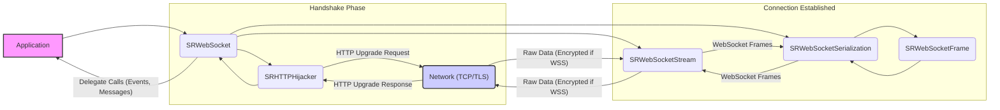
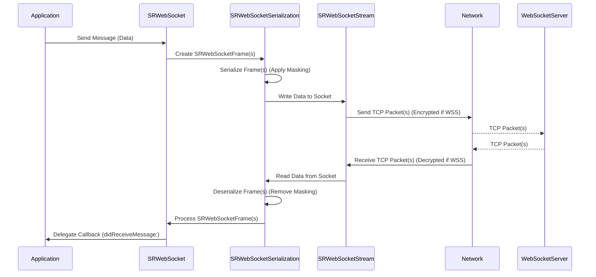

# Project Design Document: SocketRocket WebSocket Client Library

**Version:** 1.1
**Date:** October 26, 2023
**Author:** AI Software Architect

## 1. Introduction

This document provides an enhanced and more detailed design overview of the SocketRocket WebSocket client library, as found in the [facebookincubator/socketrocket](https://github.com/facebookincubator/socketrocket) repository. Building upon the previous version, this document aims to provide an even clearer and more granular articulation of the library's architecture, components, and data flow. This enhanced detail is crucial for facilitating a more comprehensive and effective threat modeling exercise. It will serve as a refined reference point for understanding the system's boundaries, interactions, and potential vulnerabilities.

## 2. Goals

*   Provide a highly detailed and precise description of the SocketRocket library's architecture and functionality.
*   Identify key components and their specific responsibilities and interactions.
*   Outline the data flow within the library and with external entities, including specific data elements.
*   Elaborate on security-relevant aspects of the design, detailing potential threats and vulnerabilities.
*   Serve as a robust and comprehensive foundation for subsequent threat modeling activities.

## 3. Overview

SocketRocket is a mature and widely-used WebSocket client library specifically designed for Apple platforms (iOS and macOS). It offers a reliable and performant mechanism for applications to establish and maintain full-duplex communication channels with WebSocket servers. The library abstracts away the complexities of the underlying WebSocket protocol, including connection negotiation, data framing, and error handling, allowing developers to concentrate on the application's communication logic.

Key features of SocketRocket include:

*   Full compliance with RFC 6455, the established WebSocket protocol standard.
*   Robust support for secure WebSockets (WSS) leveraging TLS/SSL for encrypted communication.
*   Asynchronous, non-blocking operation achieved through the use of delegates and integration with the operating system's run loop.
*   Comprehensive management of WebSocket connection states, including connecting, open, closing, and closed states, with appropriate event notifications.
*   Implementation of message fragmentation and reassembly to handle large messages efficiently.
*   Built-in Ping/Pong mechanism as defined by the WebSocket protocol for maintaining connection liveness and detecting network issues.
*   Detailed error handling and reporting mechanisms to inform the application about connection problems and protocol violations.
*   Extensive configuration options allowing customization of timeouts, supported sub-protocols, and per-message extensions.

## 4. Architectural Design

The SocketRocket library's architecture is carefully structured into distinct components, each with specific responsibilities. This modular design enhances maintainability and allows for a clearer understanding of the library's internal workings.

### 4.1. Core Components

*   **`SRWebSocket` Class:** The primary and central interface for interacting with the library.
    *   Manages the overall lifecycle of a WebSocket connection.
    *   Provides methods for opening, sending messages, and closing the connection.
    *   Implements the `SRWebSocketDelegate` protocol to notify the application about connection events and received messages.
    *   Orchestrates the interactions between other internal components.
*   **`SRHTTPHijacker` Class:** Specifically responsible for handling the initial HTTP upgrade handshake process.
    *   Constructs and sends the HTTP upgrade request to the WebSocket server.
    *   Parses the server's response, validating the `Sec-WebSocket-Accept` header.
    *   Manages the transition from the HTTP protocol to the WebSocket protocol.
*   **`SRWebSocketStream` Class:** Manages the underlying network socket and data transmission.
    *   Encapsulates the `CFSocket` or similar networking primitives.
    *   Handles establishing and maintaining the TCP connection.
    *   Performs TLS/SSL negotiation for secure WSS connections using the Security framework.
    *   Provides methods for reading and writing raw data to the socket.
*   **`SRWebSocketFrame` Class:** Represents a single WebSocket frame as defined by RFC 6455.
    *   Stores the frame header information (opcode, flags, payload length).
    *   Holds the frame payload data.
    *   Provides methods for accessing and manipulating frame attributes.
*   **`SRWebSocketSerialization` Class:** Handles the process of serializing and deserializing WebSocket frames.
    *   Takes message data and constructs `SRWebSocketFrame` objects.
    *   Implements the masking and unmasking of frame payloads as required by the protocol.
    *   Parses raw data received from the socket into `SRWebSocketFrame` objects.
*   **Run Loop Integration:** Leverages the operating system's run loop mechanism for asynchronous event handling.
    *   Allows the library to operate efficiently without blocking the main application thread.
    *   Registers socket events with the run loop for non-blocking I/O.
*   **Delegate Protocol (`SRWebSocketDelegate`):** Defines the communication interface between the library and the application.
    *   Provides methods for notifying the application about connection status changes (e.g., `webSocketDidOpen:`, `webSocket:didFailWithError:`, `webSocketDidClose:`.
    *   Includes methods for delivering received messages (`webSocket:didReceiveMessage:`).

### 4.2. Component Interactions

The following diagram provides a more detailed illustration of the interactions between the core components during a typical WebSocket connection lifecycle, highlighting the flow of control and data.

**Detailed Description of Interactions:**

*   The **Application** initiates a WebSocket connection by instantiating `SRWebSocket` with the target WebSocket URL.
*   `SRWebSocket` delegates the initial handshake process to **`SRHTTPHijacker`**.
*   **`SRHTTPHijacker`** constructs and sends an "HTTP Upgrade" request over the **Network (TCP/TLS)** to the **WebSocket Server**.
*   The **WebSocket Server** responds with an "HTTP Upgrade Response".
*   **`SRHTTPHijacker`** validates the server's response, particularly the `Sec-WebSocket-Accept` header, and informs `SRWebSocket` of the outcome.
*   Upon successful handshake, `SRWebSocket` utilizes **`SRWebSocketStream`** to manage the persistent connection over the **Network (TCP/TLS)**. For secure connections (WSS), `SRWebSocketStream` handles the TLS/SSL handshake.
*   When the **Application** sends data, `SRWebSocket` utilizes **`SRWebSocketSerialization`** to create one or more **`SRWebSocketFrame`** objects representing the message. These frames are then serialized into raw data and sent via `SRWebSocketStream`.
*   Incoming raw data from the **Network (TCP/TLS)** is received by `SRWebSocketStream` and passed to **`SRWebSocketSerialization`** for deserialization into **`SRWebSocketFrame`** objects.
*   `SRWebSocket` processes the received frames, handling fragmentation and invoking the appropriate delegate methods on the **Application**'s delegate to deliver the complete message or notify about connection events.

## 5. Data Flow

This section provides a more granular breakdown of the data flow for sending and receiving messages, highlighting the transformations and handling at each stage.

### 5.1. Sending a Message

1. The **Application** invokes a send method on the `SRWebSocket` instance, providing the message payload (either a string or `NSData`).
2. `SRWebSocket` determines the appropriate frame opcode based on the message type (text or binary).
3. `SRWebSocket` utilizes **`SRWebSocketSerialization`** to create one or more `SRWebSocketFrame` objects. This involves:
    *   Setting the frame header (opcode, FIN bit, RSV bits).
    *   Potentially fragmenting the message into multiple frames if it exceeds a certain size.
    *   Applying masking to the payload data as required by the WebSocket protocol for client-to-server messages.
4. **`SRWebSocketSerialization`** serializes each `SRWebSocketFrame` into a sequence of bytes. This includes the frame header and the masked payload.
5. **`SRWebSocketStream`** writes the serialized byte stream to the underlying TCP socket. For WSS connections, this data is encrypted by the TLS/SSL layer before transmission.
6. The data is transmitted over the **Network (TCP/TLS)** to the **WebSocket Server**.

### 5.2. Receiving a Message

1. Raw data arrives from the **WebSocket Server** over the **Network (TCP/TLS)** and is read by **`SRWebSocketStream`**. For WSS connections, this data is decrypted by the TLS/SSL layer upon receipt.
2. **`SRWebSocketSerialization`** attempts to deserialize the incoming byte stream into `SRWebSocketFrame` objects. This involves:
    *   Parsing the frame header to determine the opcode, payload length, and masking status.
    *   Unmasking the payload data if the masking bit is set.
3. `SRWebSocket` processes the received `SRWebSocketFrame` objects:
    *   If the frame is a control frame (e.g., Ping, Pong, Close), it handles it accordingly.
    *   If the frame is a continuation frame, it buffers the payload until the complete message is received.
    *   If the frame is a text or binary frame, it delivers the payload to the **Application** via the delegate protocol.
4. `SRWebSocket` invokes the appropriate method on the **Application**'s delegate object (e.g., `webSocket:didReceiveMessage:`), providing the received message data.

## 6. Security Considerations

This section elaborates on the security considerations, providing more context on potential threats and vulnerabilities.

*   **TLS/SSL for Secure Connections (WSS):** Crucial for protecting communication confidentiality and integrity.
    *   **Threats:** Man-in-the-middle attacks, eavesdropping, data tampering.
    *   **Mitigation:** Ensuring the library uses strong TLS protocols (TLS 1.2 or higher) and cipher suites. Implementing proper certificate validation (trust anchors, hostname verification) to prevent connection to rogue servers.
*   **WebSocket Handshake Security:** The initial handshake must be secure to prevent unauthorized connections.
    *   **Threats:** Downgrade attacks, connection hijacking.
    *   **Mitigation:** Verifying the `Sec-WebSocket-Accept` header from the server to confirm the server processed the upgrade request. Avoiding insecure HTTP connections for the initial handshake.
*   **Data Masking:** Mandatory for client-to-server messages to prevent certain proxy-related attacks.
    *   **Threats:**  Exploiting vulnerabilities in older proxy servers that might not handle masked frames correctly.
    *   **Mitigation:**  Strictly adhering to the WebSocket protocol's masking requirements for all client-originated messages.
*   **Input Validation:** Essential for handling potentially malicious data received from the server.
    *   **Threats:** Cross-site scripting (XSS) if the application renders received data without proper sanitization, buffer overflows if frame sizes are not validated, denial-of-service by sending excessively large frames.
    *   **Mitigation:** Validating the structure and content of incoming WebSocket frames. Implementing checks for maximum frame sizes and payload lengths. Sanitizing data before rendering it in a web view or other UI component.
*   **Error Handling:** Poor error handling can expose sensitive information or lead to unexpected behavior.
    *   **Threats:** Information leakage through verbose error messages, denial-of-service by triggering error conditions repeatedly.
    *   **Mitigation:** Avoiding the exposure of sensitive internal details in error messages. Implementing robust error handling to prevent crashes and ensure graceful degradation.
*   **Denial of Service (DoS):** The library should be resilient to attempts to exhaust resources.
    *   **Threats:**  Sending a large number of connection requests, sending excessively large messages, sending malformed frames designed to consume processing power.
    *   **Mitigation:** Implementing appropriate timeouts for connection establishment and data transfer. Limiting resource consumption (e.g., maximum message size, connection limits). Implementing rate limiting or other defensive measures at the application level.
*   **Protocol Compliance:** Deviations from the WebSocket protocol can introduce vulnerabilities.
    *   **Threats:**  Unforeseen interactions with other WebSocket implementations, potential for protocol confusion attacks.
    *   **Mitigation:**  Strictly adhering to RFC 6455 and any relevant extensions. Thoroughly testing the library's compliance.
*   **Dependency Management:** Vulnerabilities in underlying dependencies can impact SocketRocket's security.
    *   **Threats:** Exploitation of known vulnerabilities in `CFNetwork` or the Security framework.
    *   **Mitigation:** Regularly updating to the latest versions of the operating system and development tools to ensure that underlying frameworks are patched.

## 7. Dependencies

SocketRocket relies on the following fundamental system frameworks:

*   **Foundation Framework (macOS, iOS):** Provides essential base classes and services like `NSString`, `NSData`, and collections.
*   **CFNetwork Framework (macOS, iOS):** The core networking framework providing low-level APIs for TCP/IP communication, socket management (`CFSocket`), and HTTP handling.
*   **Security Framework (macOS, iOS):** Provides cryptographic services, including TLS/SSL implementation used for secure WebSocket connections (WSS).

## 8. Deployment

SocketRocket is typically integrated directly into iOS and macOS applications as a library. This can be achieved by:

*   Including the source code files directly in the application's project.
*   Building a static or dynamic framework and linking it to the application.
*   Using dependency management tools like CocoaPods or Carthage to manage the library's integration.

Once integrated, developers use the `SRWebSocket` class to establish and manage WebSocket connections within their applications.

## 9. Future Considerations

While not directly impacting the current design for threat modeling, potential future enhancements could include:

*   Enhanced support for WebSocket extensions, such as per-message compression (e.g., using the `permessage-deflate` extension).
*   Improved logging and debugging capabilities to aid in troubleshooting connection issues.
*   More fine-grained control over connection parameters and advanced features of the WebSocket protocol.
*   Potential abstractions or wrappers for integration with reactive programming frameworks or other architectural patterns.

This enhanced document provides a more detailed and nuanced understanding of the SocketRocket WebSocket client library's design. The increased granularity in describing components, data flow, and security considerations will significantly benefit the threat modeling process, enabling a more thorough identification and analysis of potential vulnerabilities.