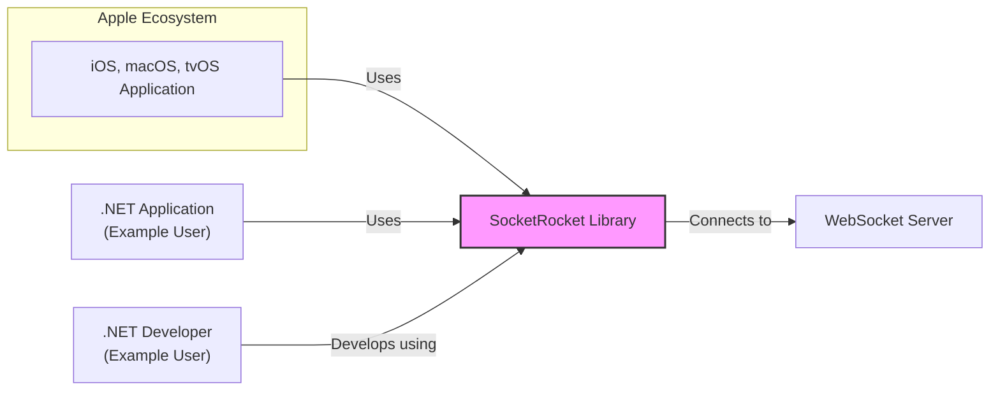
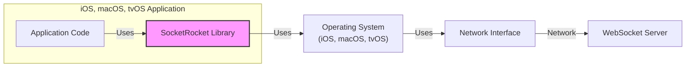
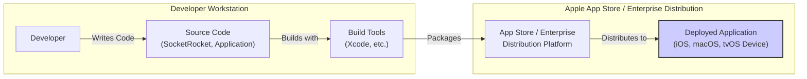

# BUSINESS POSTURE

This project, SocketRocket, provides a WebSocket client library for iOS, macOS, and tvOS. It aims to simplify the integration of WebSocket communication into applications on Apple platforms.

Business Priorities and Goals:
- Enable real-time communication features in applications on Apple platforms.
- Provide a robust, performant, and reliable WebSocket client implementation.
- Offer an easy-to-use API for developers to integrate WebSocket functionality.
- Maintain compatibility with relevant WebSocket standards and protocols.
- Support a wide range of Apple platforms (iOS, macOS, tvOS).

Business Risks:
- Security vulnerabilities in the library could compromise applications using it, leading to data breaches or service disruptions.
- Performance issues or instability in the library could negatively impact application performance and user experience.
- Lack of maintenance or updates could lead to compatibility issues with newer platforms or protocols, and unaddressed security vulnerabilities.
- Adoption risk if the library is not considered easy to use or reliable by developers.
- Dependency risk for applications relying on this library if it becomes unavailable or unmaintained.

# SECURITY POSTURE

Existing Security Controls:
- security control: Code review process is likely in place as part of the open-source contribution model, although the extent and rigor are not explicitly documented. (Location: Github repository - pull request reviews)
- security control: Static analysis tools might be used as part of the development process, although not explicitly mentioned in the repository. (Assumption based on common software development practices)
- security control: Unit and integration tests are present, which can indirectly contribute to security by ensuring code correctness and preventing regressions. (Location: Github repository - test directory and CI configurations if available)

Accepted Risks:
- accepted risk: Reliance on community contributions for security vulnerability identification and patching.
- accepted risk: Limited formal security audits or penetration testing explicitly mentioned for this open-source project.
- accepted risk: No explicit security development lifecycle (SDL) documentation provided in the repository.

Recommended Security Controls:
- security control: Implement automated static application security testing (SAST) in the CI/CD pipeline to detect potential vulnerabilities early in the development process.
- security control: Introduce dependency scanning to identify and manage known vulnerabilities in third-party libraries used by SocketRocket.
- security control: Establish a clear process for reporting and handling security vulnerabilities, including a security policy and contact information.
- security control: Consider performing periodic security audits or penetration testing by external security experts.
- security control: Document and follow a secure software development lifecycle (SDL) that includes security considerations at each stage of development.

Security Requirements:
- Authentication:
    - security requirement: The library should support standard WebSocket authentication mechanisms, such as HTTP authentication during the handshake, and token-based authentication within the WebSocket protocol.
    - security requirement:  Ensure proper handling of credentials and secrets, avoiding hardcoding or insecure storage within the library itself.
- Authorization:
    - security requirement: The library itself does not handle authorization, but it should provide mechanisms for applications to implement authorization logic based on the WebSocket connection and messages.
    - security requirement:  Applications using the library should be responsible for implementing appropriate authorization checks based on their specific requirements.
- Input Validation:
    - security requirement: The library must perform robust input validation on all data received from the WebSocket server to prevent injection attacks and other vulnerabilities.
    - security requirement:  Validate WebSocket frames, headers, and message payloads to ensure they conform to expected formats and do not contain malicious content.
- Cryptography:
    - security requirement: The library must support secure WebSocket communication using TLS (wss:// protocol).
    - security requirement:  Ensure proper implementation of TLS, including certificate validation and secure cipher suite negotiation.
    - security requirement:  If the library implements any custom cryptographic operations, they must be implemented using secure and well-vetted cryptographic libraries and algorithms.

# DESIGN

## C4 CONTEXT

Context Diagram Elements:

- Element:
    - Name: iOS, macOS, tvOS Application
    - Type: Software System
    - Description: Applications running on Apple platforms (iOS, macOS, tvOS) that require real-time communication capabilities.
    - Responsibilities: Utilizing the SocketRocket library to establish and manage WebSocket connections, sending and receiving data over WebSockets, implementing application-specific logic for real-time features.
    - Security controls: Application-level security controls, such as authentication and authorization for application users, input validation of data processed by the application, secure data storage within the application.

- Element:
    - Name: WebSocket Server
    - Type: Software System
    - Description: Backend server that implements the WebSocket protocol and provides real-time data and services to connected clients.
    - Responsibilities: Handling WebSocket connections, managing real-time data streams, implementing server-side application logic, enforcing server-side security policies, authenticating and authorizing WebSocket clients.
    - Security controls: Server-side security controls, such as TLS encryption for WebSocket connections (wss://), authentication and authorization of clients, input validation of messages received from clients, protection against denial-of-service attacks.

- Element:
    - Name: .NET Application (Example User)
    - Type: Software System
    - Description: Example of a system that might use SocketRocket indirectly, perhaps through a cross-platform framework that wraps native libraries.
    - Responsibilities: Utilizing a framework that internally uses SocketRocket to enable WebSocket communication, interacting with WebSocket servers for real-time data exchange.
    - Security controls: Security controls implemented by the .NET application and the cross-platform framework it uses, which would indirectly rely on the security of SocketRocket.

- Element:
    - Name: .NET Developer (Example User)
    - Type: Person
    - Description: Example of a developer who might use SocketRocket indirectly through a cross-platform development environment.
    - Responsibilities: Developing applications using frameworks that may depend on SocketRocket for WebSocket functionality, ensuring secure usage of the framework and underlying libraries.
    - Security controls: Secure coding practices followed by the developer, proper configuration and usage of development tools and frameworks.

- Element:
    - Name: SocketRocket Library
    - Type: Software System
    - Description:  A native Objective-C WebSocket client library for iOS, macOS, and tvOS. Provides APIs for establishing, managing, and communicating over WebSocket connections.
    - Responsibilities: Implementing the WebSocket protocol, handling WebSocket handshake, managing connection state, sending and receiving WebSocket frames, providing a developer-friendly API for WebSocket communication.
    - Security controls: Input validation of received data, secure implementation of WebSocket protocol and TLS, protection against common WebSocket vulnerabilities, adherence to secure coding practices during development.

## C4 CONTAINER

Container Diagram Elements:

- Element:
    - Name: Application Code
    - Type: Software Container
    - Description: The application-specific code written by developers that utilizes the SocketRocket library to implement WebSocket functionality.
    - Responsibilities: Implementing application-specific real-time features, handling application logic related to WebSocket communication, managing application state, interacting with the SocketRocket library API.
    - Security controls: Application-level security controls, input validation of application data, authorization logic, secure data handling within the application, secure configuration of the SocketRocket library.

- Element:
    - Name: SocketRocket Library
    - Type: Software Container
    - Description: The compiled SocketRocket library, integrated into the application. Provides the core WebSocket client functionality.
    - Responsibilities: Implementing the WebSocket protocol, managing WebSocket connections, handling WebSocket frames, providing API for application code to send and receive messages, managing TLS encryption for secure connections.
    - Security controls: Input validation of WebSocket messages, secure implementation of WebSocket protocol and TLS, memory safety, protection against buffer overflows and other common vulnerabilities, adherence to secure coding practices.

- Element:
    - Name: Operating System (iOS, macOS, tvOS)
    - Type: Infrastructure Container
    - Description: The underlying operating system on Apple devices, providing networking capabilities and system resources.
    - Responsibilities: Providing network stack, managing network connections, providing system resources to applications and libraries, enforcing operating system-level security policies.
    - Security controls: Operating system-level security controls, network security features, sandboxing of applications, memory protection, access control mechanisms.

- Element:
    - Name: Network Interface
    - Type: Infrastructure Container
    - Description: The physical or virtual network interface used by the device to connect to the network.
    - Responsibilities: Physical network connectivity, transmitting and receiving network packets.
    - Security controls: Network security controls at the device and network level, firewalls, network intrusion detection systems, Wi-Fi security protocols (WPA2/3).

- Element:
    - Name: WebSocket Server
    - Type: External Container
    - Description: The remote server that the application connects to via WebSockets.
    - Responsibilities: Hosting the WebSocket server application, handling WebSocket connections from clients, providing real-time data and services.
    - Security controls: Server-side security controls, TLS encryption, authentication and authorization, input validation, server hardening, DDoS protection.

## DEPLOYMENT

Deployment Architecture: Native Application Deployment

Deployment Diagram Elements:

- Element:
    - Name: Developer Workstation
    - Type: Environment
    - Description: The development environment used by developers to write code, build, and test applications.
    - Responsibilities: Code development, building and testing applications, managing source code, local testing of applications.
    - Security controls: Developer workstation security controls, access control to development tools and source code, secure coding practices, code review processes.

- Element:
    - Name: Source Code (SocketRocket, Application)
    - Type: Artifact
    - Description: The source code for both the SocketRocket library (if being developed/modified) and the application using it.
    - Responsibilities: Representing the codebase of the project, version control, code integrity.
    - Security controls: Source code repository access controls, branch protection, code review processes, static code analysis.

- Element:
    - Name: Build Tools (Xcode, etc.)
    - Type: Tool
    - Description: Software tools used to compile, link, and package the application and the SocketRocket library for deployment on Apple platforms (e.g., Xcode).
    - Responsibilities: Compiling source code, linking libraries, creating application packages, signing applications for distribution.
    - Security controls: Secure build environment, integrity of build tools, code signing certificates management, access control to build systems.

- Element:
    - Name: App Store / Enterprise Distribution Platform
    - Type: Platform
    - Description: Apple App Store for public distribution or enterprise distribution platforms for internal deployments.
    - Responsibilities: Hosting application packages, distributing applications to end-users, managing application updates, enforcing platform security policies.
    - Security controls: App Store security review process, code signing enforcement, platform-level security controls, malware scanning.

- Element:
    - Name: Deployed Application (iOS, macOS, tvOS Device)
    - Type: Environment
    - Description: The target environment where the application, including the SocketRocket library, is deployed and run by end-users on Apple devices.
    - Responsibilities: Running the application, providing user interface, executing application logic, communicating with WebSocket servers.
    - Security controls: Device-level security controls, operating system security features, application sandboxing, user permissions, data protection mechanisms on the device.

## BUILD

Build Process: Automated Build with CI

```mermaid
graph LR
    A["Developer\n(Code Commit)"] --> B["Version Control\n(GitHub)"];
    B --> C["CI System\n(GitHub Actions)"];
    C --> D["Build Environment\n(macOS VM)"];
    D --> E["Build & Test\n(Xcodebuild, Tests)"];
    E --> F["Static Analysis\n(SAST Tools)"];
    F --> G["Dependency Scan\n(Dependency Check)"];
    G --> H["Code Signing"];
    H --> I["Build Artifacts\n(Library, Example App)"];

    style I fill:#cdf,stroke:#333,stroke-width:2px
```

Build Diagram Elements:

- Element:
    - Name: Developer (Code Commit)
    - Type: Actor
    - Description: A software developer committing code changes to the source code repository.
    - Responsibilities: Writing code, committing changes, initiating the build process through code commits.
    - Security controls: Developer workstation security, code review before commit, secure coding practices.

- Element:
    - Name: Version Control (GitHub)
    - Type: System
    - Description:  GitHub repository hosting the SocketRocket source code, used for version control and collaboration.
    - Responsibilities: Storing source code, managing versions, tracking changes, providing access control to the codebase.
    - Security controls: Access control to the repository, branch protection rules, audit logging, two-factor authentication for developers.

- Element:
    - Name: CI System (GitHub Actions)
    - Type: System
    - Description:  Continuous Integration system (e.g., GitHub Actions) that automates the build, test, and security checks process.
    - Responsibilities: Automating build process, running tests, performing security scans, generating build artifacts, reporting build status.
    - Security controls: Secure CI/CD pipeline configuration, access control to CI system, secrets management for build credentials, audit logging of build activities.

- Element:
    - Name: Build Environment (macOS VM)
    - Type: Environment
    - Description:  A virtual machine or container running macOS, used as the build environment for compiling iOS, macOS, and tvOS libraries.
    - Responsibilities: Providing a consistent and isolated environment for building the software, executing build commands, providing necessary build tools and dependencies.
    - Security controls: Hardened build environment, regular patching and updates, access control to build environment, secure configuration of build tools.

- Element:
    - Name: Build & Test (Xcodebuild, Tests)
    - Type: Process
    - Description:  The process of compiling the source code using Xcodebuild and running automated unit and integration tests.
    - Responsibilities: Compiling source code into binary artifacts, executing automated tests to verify functionality and identify regressions.
    - Security controls: Secure build scripts, validated build process, comprehensive test suite, test case coverage analysis.

- Element:
    - Name: Static Analysis (SAST Tools)
    - Type: Process
    - Description:  Automated static application security testing tools that analyze the source code for potential security vulnerabilities.
    - Responsibilities: Identifying potential security flaws in the code, reporting vulnerabilities to developers, improving code security posture.
    - Security controls: Regularly updated SAST tools, configured with relevant security rules, integration with CI/CD pipeline for automated scanning.

- Element:
    - Name: Dependency Scan (Dependency Check)
    - Type: Process
    - Description:  Scanning project dependencies for known vulnerabilities using tools like dependency-check.
    - Responsibilities: Identifying vulnerable dependencies, reporting vulnerabilities, ensuring dependencies are up-to-date and secure.
    - Security controls: Regularly updated dependency scanning tools, vulnerability database updates, automated scanning in CI/CD pipeline.

- Element:
    - Name: Code Signing
    - Type: Process
    - Description:  Signing the build artifacts (libraries, applications) with digital certificates to ensure code integrity and authenticity.
    - Responsibilities: Signing build artifacts, verifying code origin and integrity, enabling secure distribution and execution of code.
    - Security controls: Secure management of code signing certificates, protection of private keys, enforcement of code signing policies.

- Element:
    - Name: Build Artifacts (Library, Example App)
    - Type: Artifact
    - Description:  The final output of the build process, including the compiled SocketRocket library and potentially example applications.
    - Responsibilities: Representing the distributable software components, ready for deployment or distribution.
    - Security controls: Integrity of build artifacts, secure storage and distribution of artifacts, versioning and release management.

# RISK ASSESSMENT

Critical Business Processes:
- Enabling real-time features in applications (e.g., chat, live updates, real-time gaming).
- Reliable WebSocket communication for applications relying on SocketRocket.
- Secure communication channel for sensitive data transmitted over WebSockets.

Data Sensitivity:
- Data transmitted over WebSockets can vary in sensitivity depending on the application using SocketRocket.
- Could include:
    - Public data: Low sensitivity (e.g., public chat messages).
    - Private user data: Medium to High sensitivity (e.g., private messages, user activity data).
    - Sensitive application data: High sensitivity (e.g., financial transactions, health data).
- The sensitivity of data handled by SocketRocket is ultimately determined by the applications that use it. The library itself should be designed to securely handle any data passed through it, regardless of sensitivity.

# QUESTIONS & ASSUMPTIONS

Questions:
- What is the process for reporting and handling security vulnerabilities in SocketRocket? Is there a security policy or contact information available?
- Are there any regular security audits or penetration testing performed on SocketRocket?
- What static analysis and dependency scanning tools are currently used in the development and CI/CD pipeline (if any)?
- Is there a documented secure software development lifecycle (SDL) followed for SocketRocket?
- What are the performance requirements and constraints for SocketRocket? Are there specific performance testing or benchmarking processes in place?

Assumptions:
- BUSINESS POSTURE: The primary business goal is to provide a reliable and secure WebSocket client library for Apple platforms to enable real-time application features. Security and reliability are high priorities.
- SECURITY POSTURE: While some basic security practices are likely followed (code review, testing), there is room for improvement in formal security controls like SAST, dependency scanning, and documented SDL. The project relies heavily on community contributions for security.
- DESIGN: The design is relatively straightforward, focusing on providing a WebSocket client library that integrates into Apple applications. The deployment model is primarily native application deployment through the App Store or enterprise distribution. The build process is assumed to be automated using CI/CD principles, although the specifics need further investigation.