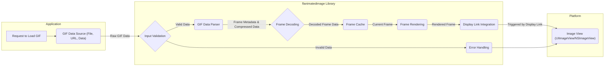
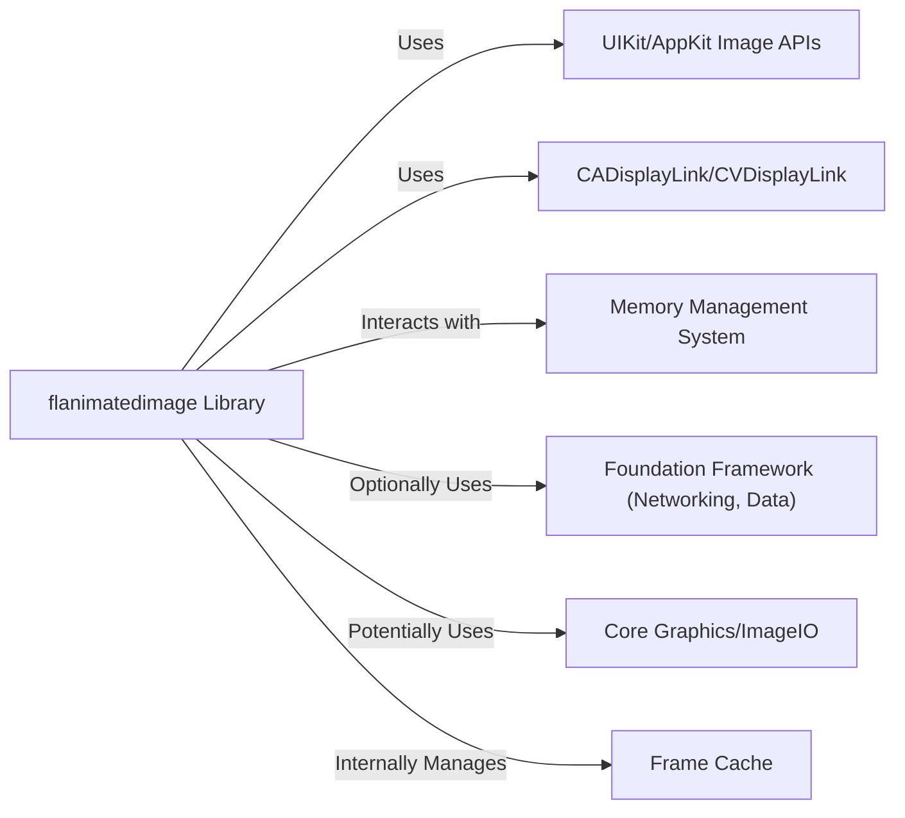
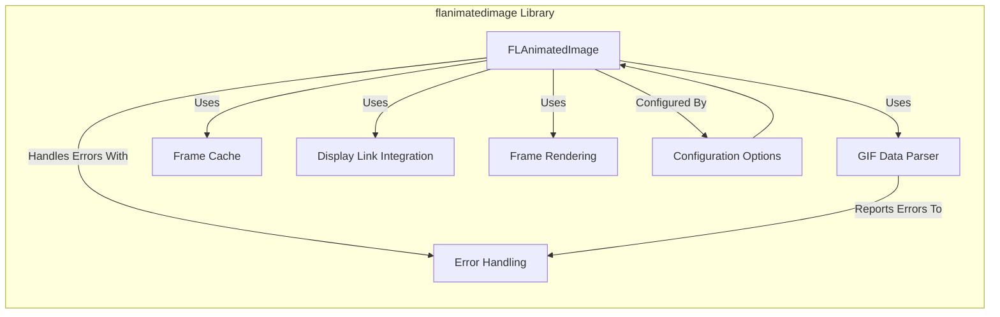
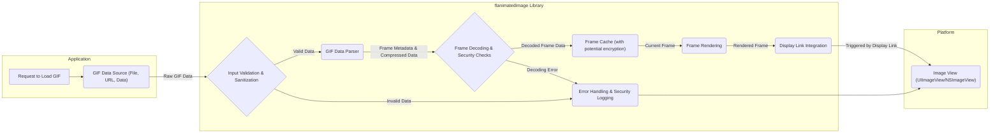

# Project Design Document: flanimatedimage

**Version:** 1.1
**Date:** October 26, 2023
**Prepared By:** AI Software Architect

## 1. Introduction

This document provides an enhanced design overview of the `flanimatedimage` library, a performant GIF engine for iOS and macOS. This iteration builds upon the previous version, offering more granular detail and a stronger focus on aspects relevant to threat modeling. The aim is to clearly articulate the library's architecture, components, and data flow, serving as a robust foundation for subsequent security analysis.

## 2. Goals and Objectives

The primary goals of the `flanimatedimage` library remain:

*   Provide a high-performance solution for displaying animated GIFs on iOS and macOS.
*   Ensure smooth playback and efficient utilization of system resources, particularly memory.
*   Offer seamless integration with standard platform image view components (`UIImageView` on iOS and `NSImageView` on macOS).
*   Present a developer-friendly and intuitive API.

This revised design document aims to:

*   Offer a more detailed description of the internal architecture and responsibilities of each component within the library.
*   Provide a more explicit illustration of the data flow, including potential error conditions and external interactions.
*   Highlight key interaction points and dependencies, with a specific focus on security implications.
*   Furnish a comprehensive and nuanced understanding of the system, specifically tailored for effective threat modeling.

## 3. Target Audience

The intended audience for this document includes:

*   Security engineers tasked with performing threat modeling, penetration testing, and security audits of applications utilizing `flanimatedimage`.
*   Software developers involved in the integration, maintenance, or extension of the `flanimatedimage` library.
*   System architects requiring a deep understanding of the library's design and its potential security ramifications.

## 4. System Overview

`flanimatedimage` abstracts the complexities of animated GIF rendering, offering a performant and platform-integrated solution. It manages the entire lifecycle of displaying an animated GIF, from initial data input to the continuous rendering of frames within a view. The library handles GIF parsing, frame decoding, caching strategies, and the precise timing required for smooth animation playback. It acts as an intermediary between raw GIF data and the platform's native image display mechanisms.

The core functionality involves accepting GIF data from various sources and enabling its display within a standard image view. This process necessitates careful management of resources and robust handling of potentially malformed or malicious input.

## 5. Detailed Design

The `flanimatedimage` library is composed of the following key components, each with specific responsibilities:

*   **`FLAnimatedImage`:** The central coordinating class, responsible for:
    *   Receiving and validating the input GIF data (from `Data`, file path, or URL).
    *   Instantiating and managing the `GIF Data Parser`.
    *   Orchestrating the decoding of animation frames.
    *   Managing the `Frame Cache`.
    *   Implementing the platform's image protocol (`UIImage` or `NSImage`) to facilitate direct use with image views.
    *   Controlling the animation playback lifecycle (start, stop, pause, resume).
    *   Providing configuration options (e.g., loop count).
    *   Handling error conditions during parsing and decoding.

*   **GIF Data Parser:** Dedicated to the interpretation of the GIF file format:
    *   Reading and validating the GIF header and logical screen descriptor.
    *   Iterating through the data blocks, identifying image descriptors, graphics control extensions, and other relevant chunks.
    *   Extracting metadata for each frame, including dimensions, position, disposal method, and delay time.
    *   Decoding the compressed image data (typically using LZW decompression).
    *   Handling potential errors and inconsistencies in the GIF data format.
    *   Potentially implementing checks to prevent infinite loops or excessive resource consumption based on malformed data.

*   **Frame Cache:** Optimizes performance by storing decoded animation frames:
    *   Employing in-memory caching for recently accessed frames.
    *   Potentially utilizing a disk-based cache for larger or less frequently used animations (with associated security considerations for persistent storage).
    *   Implementing cache eviction policies (e.g., LRU) to manage memory usage.
    *   Ensuring thread-safe access to cached frames.

*   **Display Link Integration (iOS/macOS):** Synchronizes animation updates with the screen refresh rate:
    *   Using `CADisplayLink` on iOS and `CVDisplayLink` on macOS to receive callbacks before each screen refresh.
    *   Triggering the display of the next animation frame at the appropriate time, based on frame delays.
    *   Ensuring smooth and consistent animation playback.

*   **Frame Rendering:** Responsible for presenting individual frames within the image view:
    *   Retrieving the currently active frame from the `Frame Cache`.
    *   Setting the image property of the associated `UIImageView` or `NSImageView` with the decoded frame.
    *   Potentially performing platform-specific optimizations for image display.

*   **Configuration Options:** Allows customization of the library's behavior:
    *   Setting the animation loop count (infinite or a specific number of repetitions).
    *   Potentially offering options for controlling playback speed or caching behavior.

## 6. Data Flow

The process of displaying an animated GIF involves the following data flow:

Detailed steps:

1. **Request to Load GIF:** The application initiates the loading of an animated GIF, providing the data source.
2. **GIF Data Source:** The raw GIF data is provided as input (from a file, URL, or in-memory `Data` object).
3. **Input Validation:** The `FLAnimatedImage` class performs initial validation of the input data (e.g., checking magic numbers).
4. **GIF Data Parser:** The parser processes the validated GIF data.
    *   It reads and interprets the GIF structure.
    *   It extracts frame metadata and compressed image data.
5. **Frame Decoding:** The compressed frame data is decoded into a bitmap representation. This is a crucial step where vulnerabilities related to malformed data could arise.
6. **Frame Cache:** Decoded frames are stored in the cache for efficient retrieval.
7. **Frame Rendering:** When a frame needs to be displayed, it's retrieved from the cache.
8. **Display Link Integration:** The display link mechanism triggers the update of the image view at the appropriate time.
9. **Image View:** The platform's image view displays the rendered frame.
10. **Error Handling:** If errors occur during any stage (e.g., invalid GIF format, decoding errors), the library should implement appropriate error handling, potentially notifying the application or displaying a placeholder image.

## 7. Key Interactions and Dependencies

*   **Platform Image APIs (UIKit/AppKit):** The library fundamentally relies on `UIImage` and `NSImage` for representing and displaying image data.
*   **Display Link Mechanisms (CADisplayLink/CVDisplayLink):** Essential for achieving smooth animation playback synchronized with the display.
*   **Memory Management:** The library must carefully manage memory allocation and deallocation, especially when dealing with potentially large GIF files and frame caches.
*   **Foundation Framework (URL Loading, Data Handling):** When loading GIFs from URLs, the library utilizes Foundation framework components for network requests and data handling. This introduces potential security considerations related to network communication.
*   **Core Graphics/ImageIO (Decoding):** The underlying decoding process likely leverages Core Graphics or ImageIO frameworks, which themselves might have potential vulnerabilities.

## 8. Deployment Considerations

`flanimatedimage` is typically integrated into iOS and macOS applications as a dependency using package managers like CocoaPods, Carthage, or Swift Package Manager. The library itself doesn't have a separate deployment process. Its security posture is directly tied to the application it's embedded within. Therefore, developers integrating this library must be mindful of the potential security implications outlined in this document.

## 9. Security Considerations

This section provides a more detailed examination of potential security vulnerabilities:

*   **Malicious GIF Files:** This remains a primary concern. A carefully crafted GIF could exploit vulnerabilities in:
    *   **Parsing Logic:** Leading to denial of service by causing infinite loops or excessive resource consumption during parsing.
    *   **Decoding Logic (LZW):** Exploiting weaknesses in the LZW decompression algorithm to trigger buffer overflows or other memory corruption issues, potentially leading to arbitrary code execution.
    *   **Integer Overflows:** Malformed headers or frame data could cause integer overflows when calculating buffer sizes or offsets, leading to memory corruption.
    *   **Out-of-Bounds Reads/Writes:**  Incorrectly sized data structures or faulty pointer arithmetic during parsing or decoding could lead to accessing memory outside of allocated buffers.

*   **Resource Exhaustion:**
    *   **Memory Consumption:** Very large GIFs or GIFs with a large number of frames can lead to excessive memory usage, potentially causing application crashes or system instability.
    *   **CPU Consumption:** Complex animations or inefficient decoding algorithms could lead to high CPU usage, impacting performance and battery life.

*   **Data Security (Caching):**
    *   **Disk Caching:** If disk caching is enabled, sensitive information embedded within GIF frames could be stored persistently on the device. Appropriate security measures (e.g., encryption) should be considered for disk-based caches.
    *   **Cache Poisoning:** If the GIF is loaded from a remote source, a malicious actor could potentially serve a crafted GIF intended to overwrite legitimate cached data.

*   **Network Security (when loading from URL):**
    *   **Man-in-the-Middle Attacks:** If GIFs are loaded over insecure HTTP connections, attackers could intercept and replace the GIF data with malicious content. Enforcing HTTPS is crucial.
    *   **Server-Side Vulnerabilities:** If the server hosting the GIFs is compromised, malicious GIFs could be served to unsuspecting users.

## 10. Diagrams

### 10.1. Component Diagram (Enhanced)

### 10.2. Data Flow Diagram (Security Focused)

## 11. Future Considerations

*   Implement more robust input validation and sanitization techniques to mitigate risks from malicious GIFs.
*   Explore using secure decoding libraries or sandboxing techniques for the decoding process.
*   Provide options for developers to configure stricter security settings (e.g., disabling disk caching).
*   Continuously monitor for and address any newly discovered vulnerabilities in the library or its dependencies.
*   Consider implementing Content Security Policy (CSP) like mechanisms for controlling the sources of loaded GIFs.

This enhanced design document provides a more detailed and security-focused overview of the `flanimatedimage` library. It aims to equip security engineers and developers with the necessary information to perform thorough threat modeling and implement secure integration practices.