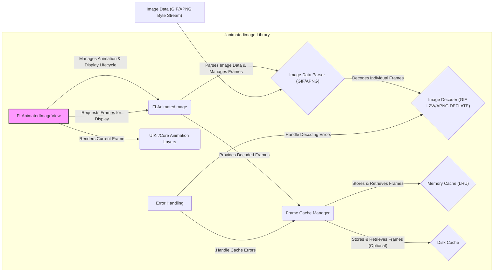
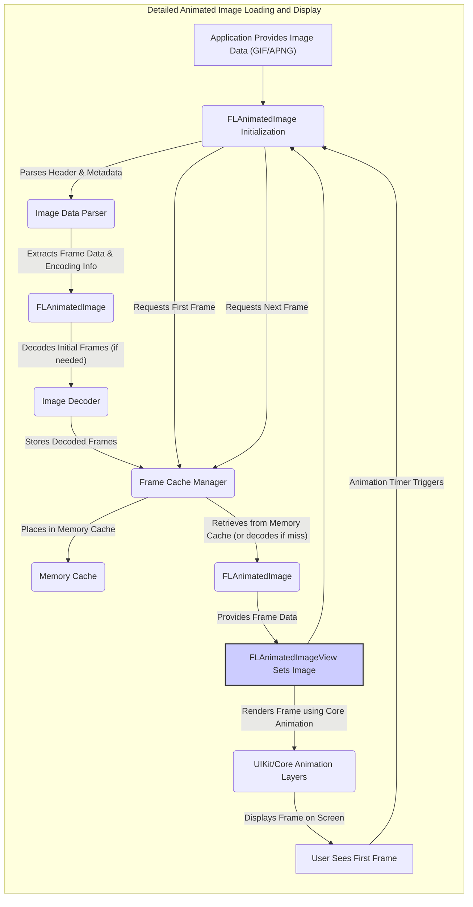

## Project Design Document: flanimatedimage (Improved)

**1. Introduction**

This document provides an enhanced and more detailed design overview of the `flanimatedimage` library, an open-source iOS library engineered for the efficient display of animated GIFs and APNGs. This iteration aims to offer a more granular understanding of the library's architecture, component interactions, and data flow, thereby strengthening the foundation for subsequent threat modeling exercises.

**1.1. Purpose**

The primary objective of this document is to furnish a clear, precise, and comprehensive description of the `flanimatedimage` library's design. This document will serve as a critical reference for security analysts, enabling them to effectively identify potential threats, vulnerabilities, and attack surfaces within the library's implementation.

**1.2. Scope**

This document encompasses the core functionalities of the `flanimatedimage` library, with a specific focus on the following aspects:

*   Detailed responsibilities and interactions of core classes.
*   The intricate process of loading, decoding, and rendering animated images, including format-specific considerations.
*   The nuanced caching mechanisms employed by the library, detailing both memory and disk strategies.
*   The library's interaction with fundamental iOS frameworks and system libraries.
*   Error handling and potential failure scenarios within the library.

This document explicitly excludes:

*   In-depth algorithmic specifics of image decoding for various formats (GIF LZW, APNG DEFLATE, etc.).
*   Network-level operations involved in fetching image data from remote sources (assuming local availability of image data).
*   The design and implementation of user interface elements within applications that integrate this library.
*   Performance benchmarking data or optimization strategies.

**1.3. Goals**

The overarching goals of this enhanced design document are to:

*   Present an exceptionally clear and easily understandable overview of the `flanimatedimage` library's architecture, suitable for both technical and non-technical audiences.
*   Precisely identify the key components, their individual responsibilities, and the nature of their interactions.
*   Thoroughly describe the complete data flow within the library, from image data input to rendered output.
*   Proactively highlight potential areas of security concern and attack vectors to facilitate robust threat modeling.
*   Provide sufficient detail to enable security engineers to understand the library's internal workings without needing to examine the source code directly.

**2. Overview**

`flanimatedimage` is a specialized iOS library designed to provide a high-performance solution for displaying animated GIFs and APNGs. It was developed to overcome the performance and memory management limitations inherent in using standard web views (`UIWebView`, `WKWebView`) for rendering animated images. The library achieves its efficiency by directly decoding image frames and meticulously managing their display lifecycle. This approach results in smoother animations and reduced memory footprint compared to web-based solutions.

**3. Architecture**

The `flanimatedimage` library is structured around several interconnected components, each responsible for a specific aspect of the animated image processing pipeline. The following diagram illustrates the detailed architecture and interactions between these components:

**3.1. Key Components:**

*   **`FLAnimatedImageView`:** This `UIView` subclass serves as the primary interface for integrating animated images into iOS applications. Its responsibilities include:
    *   Managing the animation timing and playback loop.
    *   Requesting specific frames from the associated `FLAnimatedImage` object.
    *   Displaying the current frame using Core Animation layers for efficient rendering.
    *   Handling view lifecycle events (e.g., becoming visible/invisible) to control animation.
*   **`FLAnimatedImage`:** This core class encapsulates the animated image data and manages the decoding and caching processes. Its key responsibilities are:
    *   Receiving and storing the raw image data (GIF or APNG).
    *   Utilizing the appropriate `Image Data Parser` to interpret the image structure and metadata.
    *   Orchestrating the decoding of individual frames using the `Image Decoder`.
    *   Managing the `Frame Cache Manager` to store and retrieve decoded frames.
    *   Providing decoded frame data to the `FLAnimatedImageView` on demand.
    *   Holding metadata about the animation (frame count, duration, loop count).
*   **Image Data Parser (GIF/APNG):** This component is responsible for understanding the structure of the GIF or APNG file format. It parses the header, logical screen descriptor, global color table (if present), frame control information, and image data blocks.
*   **Image Decoder (GIF LZW/APNG DEFLATE):** This component performs the actual decompression and decoding of the encoded image data for each frame.
    *   For GIFs, this involves implementing the Lempel-Ziv-Welch (LZW) decoding algorithm.
    *   For APNGs, this involves using the DEFLATE algorithm (similar to zlib).
*   **Frame Cache Manager:** This component acts as an intermediary between `FLAnimatedImage` and the actual frame caches. It implements the logic for:
    *   Storing decoded frames in the `Memory Cache` and optionally the `Disk Cache`.
    *   Retrieving frames from the cache, prioritizing the `Memory Cache`.
    *   Managing the eviction policy for the `Memory Cache` (typically Least Recently Used - LRU).
    *   Handling cache misses and triggering frame decoding.
*   **Memory Cache (LRU):** This in-memory cache stores recently accessed decoded frames for fast retrieval. It typically uses an LRU eviction policy to manage memory usage.
*   **Disk Cache:** This optional persistent cache stores decoded frames on disk. It can be used to improve performance on subsequent application launches by avoiding repeated decoding.
*   **UIKit/Core Animation Layers:** The underlying iOS frameworks used for efficiently rendering the decoded image frames onto the screen. `FLAnimatedImageView` likely uses `CALayer` or its subclasses for this purpose.
*   **Error Handling:** This component encompasses the mechanisms for handling errors that may occur during image parsing, decoding, or caching. This includes reporting errors and potentially attempting recovery.

**4. Data Flow**

The process of loading and displaying an animated image using `flanimatedimage` involves a series of steps, as illustrated below:

**Detailed Steps:**

1. **Image Data Provision:** The application provides the raw byte stream of the animated image (GIF or APNG) to the `FLAnimatedImage` initializer.
2. **Initialization and Parsing:** The `FLAnimatedImage` object is instantiated and the `Image Data Parser` is used to analyze the image header, metadata (frame count, duration, etc.), and identify individual frames.
3. **Frame Data Extraction:** The parser extracts the encoded image data and encoding information for each frame.
4. **Initial Frame Decoding (Conditional):** Depending on the implementation and caching strategy, the initial frames might be decoded immediately or deferred until requested.
5. **Frame Caching:** Decoded frames are passed to the `Frame Cache Manager`, which stores them in the `Memory Cache` and potentially the `Disk Cache`.
6. **`FLAnimatedImageView` Association:** An instance of `FLAnimatedImageView` is created and associated with the `FLAnimatedImage` object.
7. **First Frame Request:** The `FLAnimatedImageView` requests the first frame to be displayed.
8. **Cache Retrieval or Decoding:** The `Frame Cache Manager` attempts to retrieve the requested frame from the `Memory Cache`. If the frame is not found (cache miss), it triggers the `Image Decoder` to decode the frame.
9. **Frame Provision:** The `FLAnimatedImage` provides the decoded frame data to the `FLAnimatedImageView`.
10. **Rendering:** The `FLAnimatedImageView` utilizes Core Animation layers to efficiently render the frame on the screen.
11. **Animation Loop:** An internal timer within `FLAnimatedImageView` triggers the request for the next frame based on the frame duration specified in the image metadata. This process repeats, fetching subsequent frames from the cache or decoding them as needed, creating the animation effect.

**5. Security Considerations (For Threat Modeling)**

Building upon the architecture and data flow, the following areas present potential security concerns that warrant thorough investigation during threat modeling:

*   **Malicious Image Data Exploitation:**
    *   **Buffer Overflows in Decoders:** Crafted malicious image files with malformed headers or frame data could exploit vulnerabilities in the `Image Decoder` (GIF LZW or APNG DEFLATE implementations), leading to buffer overflows and potential arbitrary code execution.
    *   **Integer Overflows in Metadata Handling:**  Manipulated image metadata (e.g., excessively large dimensions, frame counts, or loop counts) could cause integer overflows during parsing or memory allocation, leading to crashes or unexpected behavior.
    *   **Denial of Service (DoS) through Resource Exhaustion:**  Specially crafted images with a large number of frames, high resolutions, or inefficient compression could consume excessive CPU and memory resources during decoding and caching, leading to application slowdowns or crashes.
    *   **Decompression Bombs (Zip Bombs for APNG):**  Malicious APNG files could employ highly nested or repetitive DEFLATE streams, leading to exponential memory consumption during decompression and causing a denial of service.
*   **Cache Poisoning and Data Integrity:**
    *   **Disk Cache Manipulation:** If a disk cache is implemented, a malicious actor with access to the device's file system could potentially replace cached image data with malicious content. Subsequent retrieval of this poisoned data could lead to unexpected behavior or security breaches.
    *   **Memory Corruption:** Vulnerabilities in the caching logic or frame management could lead to memory corruption, potentially affecting other parts of the application.
*   **Third-Party Library Vulnerabilities:** If the image decoding process relies on external libraries (even system libraries), vulnerabilities within those libraries could be indirectly exploitable through `flanimatedimage`.
*   **Error Handling Weaknesses:** Insufficient or insecure error handling during parsing, decoding, or caching could expose sensitive information or create opportunities for exploitation. For example, verbose error messages might reveal internal implementation details.
*   **Side-Channel Attacks:** While less likely, potential vulnerabilities related to timing differences during decoding or caching could theoretically be exploited in side-channel attacks.

**6. Dependencies**

The `flanimatedimage` library relies on several core iOS frameworks and potentially system libraries for its functionality:

*   **UIKit:** Essential for view management (`FLAnimatedImageView`) and user interface interactions.
*   **Core Graphics:** Used for low-level graphics operations, potentially including some aspects of image manipulation and rendering.
*   **Core Animation:** Provides the underlying infrastructure for efficient animation rendering. `CALayer` and related classes are likely used by `FLAnimatedImageView`.
*   **Foundation:** Offers fundamental data structures (e.g., `NSData`, `NSURL`), file system operations (for disk caching), and other utility classes.
*   **libz (zlib):**  Crucial for handling the DEFLATE compression used in APNG files.
*   **ImageIO.framework:**  While `flanimatedimage` aims to provide its own efficient decoding, it might leverage parts of ImageIO for basic image handling or format detection.
*   **libsystem (system libraries):**  Underlying system libraries provide essential functions for memory management, threading, and other low-level operations.

**7. Deployment**

The `flanimatedimage` library is typically integrated into iOS applications using standard dependency management tools:

*   **CocoaPods:** A popular dependency manager for Swift and Objective-C projects.
*   **Carthage:** A decentralized dependency manager that builds your dependencies and provides you with binary frameworks.
*   **Swift Package Manager (SPM):** Apple's native dependency manager, increasingly used for iOS projects.
*   **Manual Integration:** Developers can also manually integrate the library by copying the source files into their project.

**8. Future Considerations**

Potential future developments or modifications that could introduce new security considerations include:

*   **Support for New Animated Image Formats:** Adding support for formats like WebP Animated would necessitate integrating new decoding libraries and handling their specific security characteristics.
*   **Direct Network Image Loading:** If the library were extended to handle fetching images directly from URLs, it would introduce vulnerabilities related to network security (e.g., man-in-the-middle attacks, insecure connections) and remote data validation.
*   **Advanced Caching Strategies:** Implementing more sophisticated caching mechanisms (e.g., content delivery network integration, shared caches) could introduce new attack vectors related to cache poisoning and data integrity.
*   **Hardware Acceleration for Decoding:** Utilizing hardware acceleration for decoding could introduce vulnerabilities if the underlying hardware or drivers have security flaws.

This improved design document provides a more detailed and nuanced understanding of the `flanimatedimage` library's architecture and operation. This enhanced level of detail is crucial for conducting thorough and effective threat modeling, enabling security analysts to identify and mitigate potential vulnerabilities proactively.