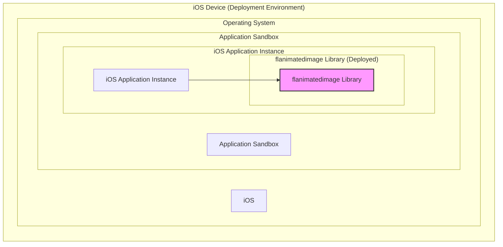

# BUSINESS POSTURE

This project, `flanimatedimage`, is an iOS library designed to efficiently display animated GIF and WebP images within iOS applications.

- Business Priorities and Goals:
  - Enhance user experience in iOS applications by enabling smooth and performant display of animated images.
  - Improve application visual appeal and engagement through rich media content.
  - Optimize resource utilization (memory, CPU) when handling animated images, contributing to better application performance and battery life.
  - Provide a robust and reliable solution for developers to integrate animated image support into their iOS projects.

- Business Risks:
  - Library defects or bugs could lead to application crashes, unexpected behavior, or visual glitches, negatively impacting user experience and application reputation.
  - Performance issues within the library, such as memory leaks or CPU intensive operations, could degrade application performance and user satisfaction.
  - Security vulnerabilities in the library, although less likely for a client-side image rendering library, could potentially be exploited if the library processes untrusted image data.
  - Lack of ongoing maintenance and updates could lead to compatibility issues with newer iOS versions or image formats, requiring application developers to find alternative solutions.

# SECURITY POSTURE

- Security Controls:
  - security control: Source code is publicly available on GitHub, allowing for community review and scrutiny. Implemented: GitHub repository.
  - security control: Dependency management is likely handled through CocoaPods or similar, which provides a degree of dependency version control. Implemented: Project build configuration (e.g., Podfile).
  - security control: Standard iOS security features are in place for applications using this library, such as sandboxing and code signing. Implemented: iOS operating system and application development environment.

- Accepted Risks:
  - accepted risk: Reliance on open-source library implies a degree of trust in the library developers and community for security and maintenance.
  - accepted risk: Potential for undiscovered vulnerabilities within the library code, requiring timely updates and patches.
  - accepted risk: Risk of denial-of-service or resource exhaustion if the library is used to process extremely large or malformed animated images.

- Recommended Security Controls:
  - security control: Implement automated dependency scanning to identify known vulnerabilities in third-party libraries used by `flanimatedimage` during development and updates.
  - security control: Integrate static analysis security testing (SAST) tools into the development pipeline to automatically scan the Objective-C code for potential security flaws.
  - security control: Conduct regular code reviews, including security-focused reviews, to identify and address potential security vulnerabilities or coding best practice violations.

- Security Requirements:
  - Authentication: Not applicable. This is a client-side library and does not handle user authentication.
  - Authorization: Not applicable. This library does not enforce authorization. Authorization is the responsibility of the application using the library.
  - Input Validation:
    - security requirement: The library should perform robust input validation on image data (GIF and WebP) to prevent processing of malformed or malicious image files that could lead to crashes or vulnerabilities. Validation should include format checks, size limits, and sanity checks on image metadata.
  - Cryptography: Not applicable. This library is primarily focused on image rendering and does not require cryptographic operations. If image loading involves HTTPS, that is handled by the iOS networking stack, not this library directly.

# DESIGN

## C4 CONTEXT

```mermaid
graph LR
    subgraph "iOS User"
        U[User]
    end
    subgraph "iOS Application"
        A[iOS Application]
        subgraph "flanimatedimage Library"
            F[flanimatedimage]
        end
        A --> F
    end
    subgraph "Image Source"
        IS[Image Source (Web Server, Local Storage)]
    end
    A --> IS
    U --> A
    style F fill:#f9f,stroke:#333,stroke-width:2px
```

### C4 Context Elements

- Context Element:
  - Name: User
  - Type: Person
  - Description: End-user of the iOS application that utilizes the `flanimatedimage` library.
  - Responsibilities: Interacts with the iOS application, viewing animated images rendered by the library.
  - Security Controls: User device security controls (device passcode, biometrics, OS updates).

- Context Element:
  - Name: iOS Application
  - Type: Software System
  - Description: The iOS application that integrates the `flanimatedimage` library to display animated GIFs and WebP images.
  - Responsibilities: Loads and displays animated images, utilizes `flanimatedimage` for efficient rendering, manages user interaction.
  - Security Controls: iOS application security controls (code signing, sandboxing, secure coding practices), application-level authentication and authorization (if applicable), secure data storage (if applicable).

- Context Element:
  - Name: flanimatedimage
  - Type: Software System
  - Description: The `flanimatedimage` iOS library, responsible for decoding, caching, and rendering animated GIF and WebP images efficiently.
  - Responsibilities: Image decoding, frame caching, animation rendering, memory management, performance optimization for animated images.
  - Security Controls: Input validation on image data, secure coding practices within the library.

- Context Element:
  - Name: Image Source (Web Server, Local Storage)
  - Type: External System
  - Description: The source from which the iOS application retrieves image data. This could be web servers accessed over the internet or local storage on the device.
  - Responsibilities: Hosting and serving image files, providing image data to the iOS application.
  - Security Controls: Web server security controls (HTTPS, access controls, vulnerability management), local storage security controls (iOS file system permissions, data protection).

## C4 CONTAINER

```mermaid
graph LR
    subgraph "iOS Application Container"
        A[iOS Application Process]
        subgraph "flanimatedimage Library Container"
            F[flanimatedimage Library]
            subgraph "Image Decoder"
                ID[Image Decoder (GIF, WebP)]
            end
            subgraph "Frame Cache"
                FC[Frame Cache]
            end
            subgraph "Animation Renderer"
                AR[Animation Renderer]
            end
            F --> ID
            F --> FC
            F --> AR
            A --> F
        end
        subgraph "iOS Frameworks"
            IF[iOS Frameworks (UIKit, CoreGraphics, etc.)]
        end
        A --> IF
        F --> IF
    end
    style F fill:#f9f,stroke:#333,stroke-width:2px
```

### C4 Container Elements

- Container Element:
  - Name: iOS Application Process
  - Type: Process
  - Description: The running process of the iOS application on a user's device.
  - Responsibilities: Execution of application code, managing application resources, interacting with the operating system and user.
  - Security Controls: iOS operating system security controls (sandboxing, process isolation, memory protection).

- Container Element:
  - Name: flanimatedimage Library
  - Type: Library
  - Description: The `flanimatedimage` library, packaged as a dynamic library or framework, integrated into the iOS application.
  - Responsibilities: Encapsulates image decoding, caching, and rendering logic. Provides API for iOS application to display animated images.
  - Security Controls: Input validation within the library, secure coding practices, dependency management.

- Container Element:
  - Name: Image Decoder (GIF, WebP)
  - Type: Component
  - Description: Components within the `flanimatedimage` library responsible for decoding GIF and WebP image formats into individual frames.
  - Responsibilities: Parsing image file formats, decoding image data, extracting image frames.
  - Security Controls: Input validation during decoding, handling of potentially malformed image data.

- Container Element:
  - Name: Frame Cache
  - Type: Component
  - Description: Component within `flanimatedimage` that caches decoded image frames in memory to improve animation performance and reduce decoding overhead.
  - Responsibilities: Storing decoded frames, managing cache size and eviction policies.
  - Security Controls: Memory management to prevent leaks or excessive memory usage.

- Container Element:
  - Name: Animation Renderer
  - Type: Component
  - Description: Component within `flanimatedimage` responsible for rendering the cached image frames in sequence to create the animation effect on the screen.
  - Responsibilities: Frame sequencing, display timing, integration with iOS graphics frameworks.
  - Security Controls: Efficient rendering to avoid performance issues, proper integration with iOS graphics frameworks.

- Container Element:
  - Name: iOS Frameworks (UIKit, CoreGraphics, etc.)
  - Type: External System
  - Description: Standard iOS frameworks used by the `flanimatedimage` library for UI rendering, graphics operations, and system interactions.
  - Responsibilities: Providing UI elements, graphics rendering capabilities, system services.
  - Security Controls: iOS framework security controls, maintained by Apple.

## DEPLOYMENT



### Deployment Elements

- Deployment Element:
  - Name: iOS Device (Deployment Environment)
  - Type: Infrastructure
  - Description: User's iOS device (iPhone, iPad) where the iOS application is installed and executed.
  - Responsibilities: Providing the runtime environment for the iOS application, executing application code, displaying the user interface.
  - Security Controls: Device-level security controls (device passcode, biometrics, device encryption, OS updates), hardware security features.

- Deployment Element:
  - Name: iOS
  - Type: Operating System
  - Description: The iOS operating system running on the user's device.
  - Responsibilities: Managing system resources, providing security features, enforcing application sandboxing, providing APIs for applications.
  - Security Controls: Operating system security controls (kernel security, process isolation, memory protection, permission model, regular security updates).

- Deployment Element:
  - Name: Application Sandbox
  - Type: Environment
  - Description: The sandboxed environment provided by iOS for each application, isolating it from other applications and the system.
  - Responsibilities: Enforcing application isolation, restricting access to system resources and user data, limiting application capabilities.
  - Security Controls: iOS sandbox security policies, process isolation, file system permissions.

- Deployment Element:
  - Name: iOS Application Instance
  - Type: Software Instance
  - Description: A specific instance of the iOS application running within the application sandbox on the iOS device.
  - Responsibilities: Executing application logic, utilizing the `flanimatedimage` library, displaying animated images to the user.
  - Security Controls: Application-level security controls, leveraging iOS security features, secure coding practices.

- Deployment Element:
  - Name: flanimatedimage Library (Deployed)
  - Type: Software Instance
  - Description: The deployed instance of the `flanimatedimage` library, included within the iOS application bundle and running within the application process.
  - Responsibilities: Providing animated image rendering functionality within the deployed application.
  - Security Controls: Security controls inherited from the library development and build process, runtime security provided by the iOS environment.

## BUILD

```mermaid
graph LR
    subgraph "Developer Workstation"
        DEV[Developer]
        SRC[Source Code (GitHub)]
    end
    subgraph "Build System (e.g., CI/CD)"
        BCM[Build Configuration Management (e.g., Fastlane, Make)]
        DEP[Dependency Management (CocoaPods)]
        CMP[Compiler (Xcode)]
        TST[Automated Tests]
        PKG[Package (Framework/Library)]
        SAST[SAST Scanner (Optional)]
    end
    DEV --> SRC
    SRC --> BCM
    BCM --> DEP
    DEP --> CMP
    CMP --> TST
    TST --> SAST
    SAST --> PKG
    PKG --> ARTIFACT[Build Artifact (Framework Binary)]
    style PKG fill:#f9f,stroke:#333,stroke-width:2px
```

### Build Elements

- Build Element:
  - Name: Developer
  - Type: Person
  - Description: Software developer contributing to the `flanimatedimage` project.
  - Responsibilities: Writing code, committing changes to source control, running local builds and tests.
  - Security Controls: Developer workstation security (OS security, endpoint protection), secure coding practices, code review.

- Build Element:
  - Name: Source Code (GitHub)
  - Type: Data Store
  - Description: The GitHub repository hosting the source code of the `flanimatedimage` project.
  - Responsibilities: Version control, source code management, collaboration platform.
  - Security Controls: GitHub security controls (access controls, authentication, audit logs), branch protection, vulnerability scanning (GitHub Dependabot).

- Build Element:
  - Name: Build Configuration Management (e.g., Fastlane, Make)
  - Type: Tool
  - Description: Tools and scripts used to automate the build process, including build steps, dependency management, testing, and packaging.
  - Responsibilities: Automating build process, defining build steps, managing build configurations.
  - Security Controls: Secure configuration of build tools, access control to build configurations, audit logging of build activities.

- Build Element:
  - Name: Dependency Management (CocoaPods)
  - Type: Tool
  - Description: CocoaPods or similar dependency management tool used to manage external libraries and dependencies for the project.
  - Responsibilities: Resolving and downloading dependencies, managing dependency versions.
  - Security Controls: Dependency vulnerability scanning (e.g., using `pod audit`), verifying dependency integrity (checksums).

- Build Element:
  - Name: Compiler (Xcode)
  - Type: Tool
  - Description: Xcode compiler used to compile the Objective-C source code into binary code for iOS.
  - Responsibilities: Compiling source code, generating object files and executables.
  - Security Controls: Compiler security features (e.g., stack protection, address space layout randomization - ASLR), secure compiler settings.

- Build Element:
  - Name: Automated Tests
  - Type: Tool
  - Description: Automated unit tests and integration tests used to verify the functionality and correctness of the code.
  - Responsibilities: Running tests, verifying code quality, detecting regressions.
  - Security Controls: Secure test environment, test data management, test code review.

- Build Element:
  - Name: SAST Scanner (Optional)
  - Type: Tool
  - Description: Static Application Security Testing (SAST) tool used to scan the source code for potential security vulnerabilities.
  - Responsibilities: Static code analysis, vulnerability detection, reporting security findings.
  - Security Controls: SAST tool configuration, vulnerability database updates, secure handling of scan results.

- Build Element:
  - Name: Package (Framework/Library)
  - Type: Tool
  - Description: Packaging process to create the final framework or library artifact that can be distributed and integrated into iOS applications.
  - Responsibilities: Creating library package, including headers, binaries, and resources.
  - Security Controls: Secure packaging process, verifying package integrity (signing, checksums).

- Build Element:
  - Name: Build Artifact (Framework Binary)
  - Type: Data Store
  - Description: The final compiled framework binary of the `flanimatedimage` library, ready for distribution and integration into iOS applications.
  - Responsibilities: Distribution of the library, integration into iOS projects.
  - Security Controls: Code signing of the framework, secure distribution channels (e.g., CocoaPods, GitHub Releases).

# RISK ASSESSMENT

- Critical Business Processes:
  - Displaying animated images within iOS applications to enhance user experience and visual appeal.
  - Maintaining application performance and stability when handling animated images.

- Data to Protect:
  - Image data (GIF, WebP): Sensitivity is generally low as these are typically public images. However, integrity and availability are important to ensure proper application functionality and user experience.
  - Source code of the `flanimatedimage` library: Sensitivity is moderate. Confidentiality is less critical as it is open-source, but integrity and availability are important for maintaining the project and preventing malicious modifications.

# QUESTIONS & ASSUMPTIONS

- Questions:
  - Are there any specific use cases where `flanimatedimage` is used to display sensitive or user-generated animated images? (Assumption: Primarily used for displaying general-purpose, non-sensitive animated images).
  - What is the process for reporting and patching vulnerabilities in `flanimatedimage`? (Assumption: Standard open-source vulnerability reporting and patching process through GitHub).
  - Are there any specific performance requirements or constraints for applications using `flanimatedimage`? (Assumption: Performance is a key consideration, and the library is designed for efficient animation rendering).
  - Is there a formal security testing process in place for `flanimatedimage` beyond community review? (Assumption: Security testing relies primarily on community review and standard development practices, with potential for optional SAST integration).

- Assumptions:
  - BUSINESS POSTURE: The primary business goal is to enhance user experience in iOS applications through efficient animated image display. Performance and reliability are key business priorities.
  - SECURITY POSTURE: Security risks are relatively low for a client-side image rendering library. Focus is on input validation to prevent crashes and basic secure development practices. The library does not handle sensitive data or authentication/authorization.
  - DESIGN: The library is designed as a self-contained component within iOS applications. Deployment is standard iOS application deployment through the App Store or enterprise distribution. Build process follows typical iOS development workflows, potentially incorporating CI/CD and dependency management.