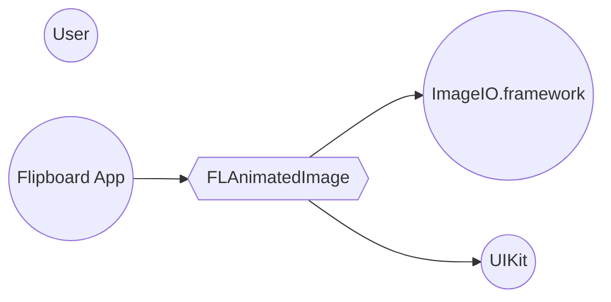
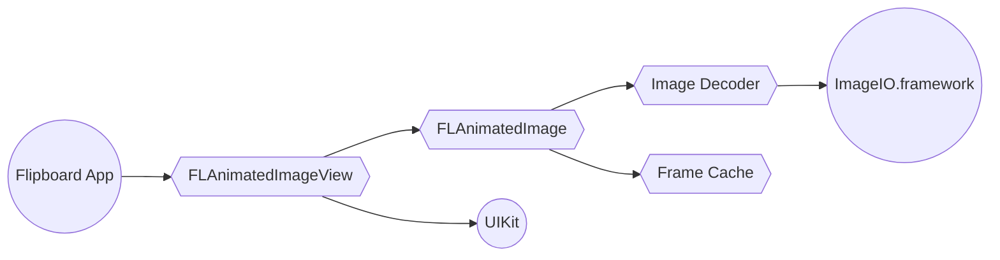
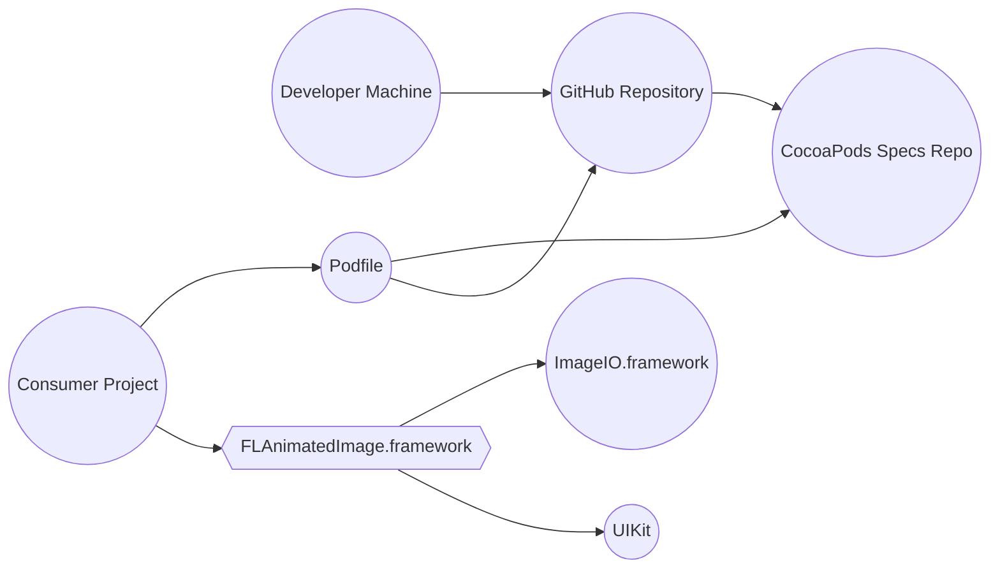
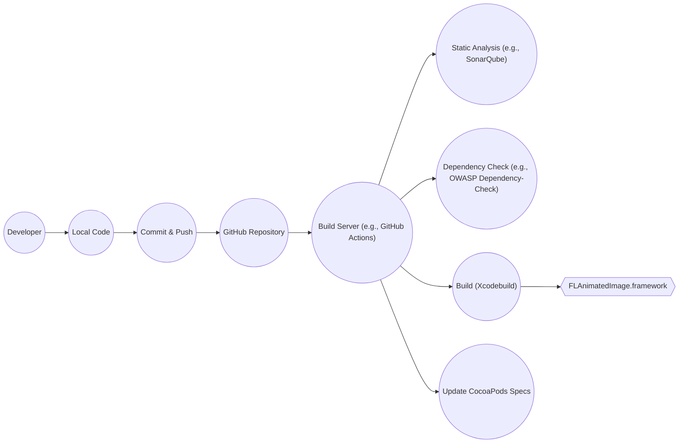

Okay, let's create a design document for the `flanimatedimage` project.

# BUSINESS POSTURE

Business Priorities and Goals:

*   Provide a performant and reliable way to display animated images (specifically GIFs) on iOS.
*   Improve upon the limitations of existing solutions (like `UIImageView`) in terms of memory usage and CPU consumption when handling animated images.
*   Offer an easy-to-use API for developers to integrate animated image display into their iOS applications.
*   Maintain an open-source library that is well-documented and community-supported.
*   Reduce application crashes and performance issues related to animated image rendering.

Most Important Business Risks:

*   Performance issues (high CPU/memory usage) leading to poor user experience or application crashes.
*   Security vulnerabilities (e.g., image parsing vulnerabilities) that could be exploited.
*   Compatibility issues with different iOS versions or device configurations.
*   Lack of adoption due to complexity or poor documentation.
*   Maintenance overhead and inability to keep up with evolving iOS platform changes.

# SECURITY POSTURE

Existing Security Controls:

*   security control: The project is open-source, allowing for community review and contributions, which can help identify and address security issues.
*   security control: The project uses Objective-C, which, when used correctly, can offer some memory safety features compared to lower-level languages.
*   security control: The project likely relies on Apple's underlying image decoding frameworks (ImageIO.framework), which are regularly updated and patched for security vulnerabilities by Apple. Described in project's README.md.

Accepted Risks:

*   accepted risk: Potential for image parsing vulnerabilities, especially if custom parsing logic is used. This is a common risk with any image processing library.
*   accepted risk: Reliance on third-party dependencies (if any) introduces the risk of vulnerabilities in those dependencies.
*   accepted risk: The library might not be fully hardened against all possible denial-of-service (DoS) attacks, such as those involving maliciously crafted animated images designed to consume excessive resources.

Recommended Security Controls:

*   security control: Implement fuzz testing to identify potential vulnerabilities in the image parsing and processing logic.
*   security control: Conduct regular static analysis of the codebase to identify potential security flaws.
*   security control: Establish a security vulnerability disclosure policy to encourage responsible reporting of security issues.
*   security control: Consider integrating a Software Composition Analysis (SCA) tool to track and manage dependencies and their associated vulnerabilities.

Security Requirements:

*   Authentication: Not directly applicable, as this is a client-side library for image display.
*   Authorization: Not directly applicable.
*   Input Validation:
    *   The library should validate the input image data to ensure it conforms to the expected format (GIF).
    *   The library should handle potentially malformed or malicious image data gracefully, without crashing or causing security vulnerabilities.
    *   Size limits should be enforced on input images to prevent excessive memory consumption.
*   Cryptography: Not directly applicable, unless the library is used to handle encrypted images, in which case standard cryptographic best practices should be followed.

# DESIGN

## C4 CONTEXT

Element Descriptions:

*   Element:
    *   Name: User
    *   Type: Person
    *   Description: A user interacting with an iOS application that uses FLAnimatedImage.
    *   Responsibilities: Views animated images within the application.
    *   Security controls: N/A (handled by the application).

*   Element:
    *   Name: Flipboard App
    *   Type: Software System
    *   Description: An example iOS application that utilizes the FLAnimatedImage library.
    *   Responsibilities: Integrates and uses FLAnimatedImage to display animated images.
    *   Security controls: Application-level security controls, including secure coding practices and vulnerability management.

*   Element:
    *   Name: FLAnimatedImage
    *   Type: Software System
    *   Description: The core library for displaying animated images.
    *   Responsibilities: Parses GIF image data, manages frames, and renders animated images efficiently.
    *   Security controls: Input validation, fuzz testing, static analysis, dependency management.

*   Element:
    *   Name: ImageIO.framework
    *   Type: External Framework
    *   Description: Apple's framework for reading and writing image data.
    *   Responsibilities: Provides low-level image decoding and encoding functionality.
    *   Security controls: Managed and updated by Apple.

*   Element:
    *   Name: UIKit
    *   Type: External Framework
    *   Description: Apple's framework for building user interfaces on iOS.
    *   Responsibilities: Provides UI components and rendering capabilities.
    *   Security controls: Managed and updated by Apple.

## C4 CONTAINER

Element Descriptions:

*   Element:
    *   Name: Flipboard App
    *   Type: Software System
    *   Description: An example iOS application.
    *   Responsibilities: Integrates and uses FLAnimatedImageView to display animated images.
    *   Security controls: Application-level security controls.

*   Element:
    *   Name: FLAnimatedImageView
    *   Type: Container (UI Component)
    *   Description: A `UIView` subclass for displaying animated images.
    *   Responsibilities: Manages the display of animated images, interacts with `FLAnimatedImage` for frame data.
    *   Security controls: Relies on the security controls of `FLAnimatedImage` and UIKit.

*   Element:
    *   Name: FLAnimatedImage
    *   Type: Container (Class/Library)
    *   Description: The core logic for handling animated images.
    *   Responsibilities: Manages frame data, decoding, and caching.
    *   Security controls: Input validation, fuzz testing, static analysis.

*   Element:
    *   Name: Image Decoder
    *   Type: Container (Component)
    *   Description: Responsible for decoding image data.
    *   Responsibilities: Uses ImageIO.framework to decode GIF data into individual frames.
    *   Security controls: Relies on the security of ImageIO.framework, input validation.

*   Element:
    *   Name: Frame Cache
    *   Type: Container (Component)
    *   Description: Caches decoded image frames.
    *   Responsibilities: Stores and retrieves decoded image frames to improve performance.
    *   Security controls: Memory management best practices.

*   Element:
    *   Name: ImageIO.framework
    *   Type: External Framework
    *   Description: Apple's framework for image I/O.
    *   Responsibilities: Provides low-level image decoding.
    *   Security controls: Managed by Apple.

*   Element:
    *   Name: UIKit
    *   Type: External Framework
    *   Description: Apple's framework for building user interfaces.
    *   Responsibilities: Provides UI components and rendering.
    *   Security controls: Managed by Apple.

## DEPLOYMENT

Possible Deployment Solutions:

1.  CocoaPods: A dependency manager for Cocoa projects.
2.  Carthage: A decentralized dependency manager for Cocoa.
3.  Swift Package Manager: The official package manager for Swift.
4.  Manual Integration: Directly adding the source files to the project.

Chosen Solution: CocoaPods (most common and well-documented approach)

Element Descriptions:

*   Element:
    *   Name: Developer Machine
    *   Type: Infrastructure
    *   Description: The developer's workstation.
    *   Responsibilities: Hosts the source code and development tools.
    *   Security controls: Standard developer machine security practices.

*   Element:
    *   Name: GitHub Repository
    *   Type: Infrastructure
    *   Description: The Git repository hosting the FLAnimatedImage source code.
    *   Responsibilities: Stores the source code and version history.
    *   Security controls: GitHub's security features, access controls.

*   Element:
    *   Name: CocoaPods Specs Repo
    *   Type: Infrastructure
    *   Description: The repository containing specifications for CocoaPods packages.
    *   Responsibilities: Provides metadata about available CocoaPods packages.
    *   Security controls: Managed by the CocoaPods community.

*   Element:
    *   Name: Consumer Project
    *   Type: Software System
    *   Description: An iOS application that uses FLAnimatedImage.
    *   Responsibilities: Integrates FLAnimatedImage via CocoaPods.
    *   Security controls: Application-level security controls.

*   Element:
    *   Name: Podfile
    *   Type: Configuration File
    *   Description: Specifies the dependencies for the consumer project.
    *   Responsibilities: Defines which CocoaPods packages to install.
    *   Security controls: Version pinning to avoid unexpected updates.

*   Element:
    *   Name: FLAnimatedImage.framework
    *   Type: Framework
    *   Description: The compiled FLAnimatedImage library.
    *   Responsibilities: Provides the functionality for displaying animated images.
    *   Security controls: Code signing, build process security.

*   Element:
    *   Name: ImageIO.framework
    *   Type: External Framework
    *   Description: Apple's framework for image I/O.
    *   Responsibilities: Provides low-level image decoding.
    *   Security controls: Managed by Apple.

*   Element:
    *   Name: UIKit
    *   Type: External Framework
    *   Description: Apple's framework for building user interfaces.
    *   Responsibilities: Provides UI components and rendering.
    *   Security controls: Managed by Apple.

## BUILD

Build Process Description:

1.  Developers write and modify code locally.
2.  Changes are committed and pushed to the GitHub repository.
3.  A build server (e.g., GitHub Actions, Travis CI, CircleCI) is triggered by the push.
4.  The build server performs the following steps:
    *   Static Analysis: The code is analyzed for potential security vulnerabilities and code quality issues using a tool like SonarQube or a similar static analyzer.
    *   Dependency Check: Dependencies are scanned for known vulnerabilities using a tool like OWASP Dependency-Check or a similar SCA tool.
    *   Build: The project is built using `xcodebuild` (or a similar build tool) to create the `FLAnimatedImage.framework`.
    *   CocoaPods Specs Update: If the build is successful and a new version is being released, the CocoaPods specs repository is updated.
5.  The resulting `FLAnimatedImage.framework` is the build artifact.

Security Controls:

*   security control: Static analysis helps identify potential vulnerabilities in the code.
*   security control: Dependency checking helps identify and mitigate vulnerabilities in third-party libraries.
*   security control: Automated build process ensures consistency and reduces the risk of manual errors.
*   security control: Code signing (part of the Xcodebuild process) ensures the integrity and authenticity of the built framework.
*   security control: Using a dedicated build server provides a controlled and isolated environment for building the library.

# RISK ASSESSMENT

Critical Business Processes:

*   Displaying animated images within iOS applications without performance degradation or crashes.
*   Providing a reliable and easy-to-use library for developers.

Data Protection:

*   Data Sensitivity: The library primarily handles image data (GIFs). The sensitivity of this data depends on the content of the images themselves, which is determined by the application using the library. The library itself does not handle inherently sensitive data like PII or financial information.
*   Data to Protect: The primary concern is to prevent the library from being a vector for attacks that could compromise the application or the user's device. This includes protecting against:
    *   Maliciously crafted image files that could exploit vulnerabilities in the image parsing logic.
    *   Denial-of-service attacks that could cause the application to crash or become unresponsive.

# QUESTIONS & ASSUMPTIONS

Questions:

*   Are there any specific performance benchmarks or targets that the library should meet?
*   Are there any specific iOS versions or device configurations that need to be prioritized for compatibility?
*   Are there any plans to support other animated image formats besides GIF in the future?
*   What is the current process for handling bug reports and security vulnerabilities?
*   What are the specific third-party dependencies used by the library (if any)?

Assumptions:

*   BUSINESS POSTURE: The primary goal is to provide a performant and reliable solution for displaying animated GIFs on iOS.
*   BUSINESS POSTURE: The library is intended for use in a wide range of iOS applications.
*   SECURITY POSTURE: The library relies on Apple's ImageIO framework for image decoding.
*   SECURITY POSTURE: Developers using the library are responsible for the security of their own applications.
*   DESIGN: The library is primarily used via CocoaPods for dependency management.
*   DESIGN: The build process is automated using a CI/CD system (e.g., GitHub Actions).
*   DESIGN: The library is written in Objective-C.