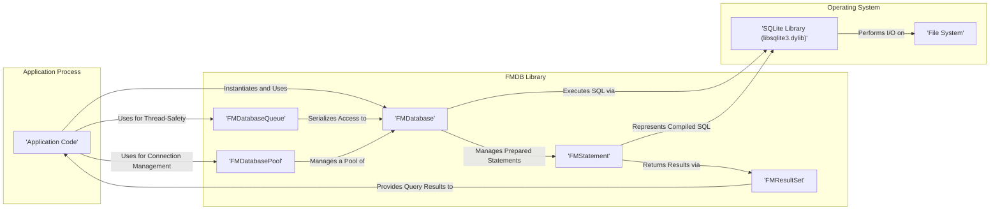

# Project Design Document: FMDB SQLite Wrapper

**Version:** 1.1
**Date:** October 26, 2023
**Author:** AI Software Architect

## 1. Introduction

This document provides an enhanced design overview of the FMDB library, an Objective-C wrapper around SQLite. The primary purpose of this document is to facilitate thorough threat modeling by clearly outlining the architecture, components, and data flow within FMDB. A deep understanding of FMDB's internal workings and interactions is essential for identifying potential security vulnerabilities and designing effective mitigation strategies. This version builds upon the initial design by providing more specific details and expanding on security considerations.

## 2. Project Overview

FMDB is a widely adopted open-source Objective-C library that offers a streamlined and developer-friendly interface for interacting with SQLite databases on Apple platforms (macOS, iOS, watchOS, and tvOS). It significantly reduces the complexity associated with using the raw SQLite C API, making common database operations more accessible to application developers for managing local data persistence.

## 3. Architectural Design

FMDB acts as an intermediary layer, abstracting the complexities of the underlying SQLite C API and providing an object-oriented interface for Objective-C developers.

### 3.1. Component Diagram

### 3.2. Component Descriptions

*   **Application Code:** This represents the portion of the application that directly interacts with FMDB to perform database operations. It initiates connections, executes queries, updates data, and processes the results. The security of the application's interaction with FMDB is paramount.
*   **FMDatabase:** The central class in FMDB, representing a single connection to a SQLite database. It provides methods for executing SQL statements (both raw and parameterized), managing transactions (begin, commit, rollback), and handling database-related errors. It's crucial for managing the lifecycle of a database connection.
*   **FMDatabaseQueue:** Designed to provide thread-safe access to the database. It uses a serial dispatch queue to ensure that only one database operation is executed at a time, preventing race conditions and data corruption in multithreaded environments. Proper use of this class is vital for application stability and data integrity.
*   **FMResultSet:**  An object that encapsulates the results returned from a query executed via `FMDatabase`. It allows developers to iterate through the rows of the result set and access individual column values by name or index. Care must be taken when handling potentially sensitive data retrieved through this class.
*   **FMStatement:** Represents a prepared SQL statement. While often used internally by FMDB, understanding its role is important. Prepared statements offer performance benefits and are a key mechanism for preventing SQL injection vulnerabilities when used with parameter binding.
*   **FMDatabasePool:**  A class for managing a pool of `FMDatabase` connections. This can improve performance in scenarios where frequent database access is required by reducing the overhead of repeatedly opening and closing connections. Proper management of the connection pool is important to avoid resource exhaustion.
*   **SQLite Library (libsqlite3.dylib):** The fundamental C library that provides the core SQLite database engine functionality. FMDB acts as a thin layer on top of this library, delegating the actual database operations to it. The security of SQLite itself is a foundational element.
*   **File System:** The operating system component responsible for managing files and directories, including the SQLite database file where the application's data is persistently stored. File system permissions are critical for controlling access to the database.

## 4. Data Flow

The typical flow of data when an application interacts with the SQLite database through FMDB involves these steps:

1. The **Application Code** initiates a database operation, such as querying data, inserting new records, or updating existing information.
2. The **Application Code** obtains an instance of `FMDatabase` (either directly or through `FMDatabaseQueue` or `FMDatabasePool`).
3. If using `FMDatabaseQueue`, the operation is placed on the serial dispatch queue, ensuring synchronized access.
4. The **Application Code** calls a method on the `FMDatabase` instance to execute an SQL statement. This can be a raw SQL string or a parameterized query.
5. For parameterized queries, FMDB uses `FMStatement` to prepare the SQL statement and bind the provided parameters. This is a crucial step in preventing SQL injection attacks.
6. `FMDatabase` then calls the corresponding functions in the underlying **SQLite Library** to execute the prepared statement or raw SQL.
7. The **SQLite Library** interacts with the **File System** to read data from or write data to the SQLite database file.
8. If the operation is a query, the **SQLite Library** returns the results to `FMDatabase` in a raw format.
9. `FMDatabase` creates an `FMResultSet` object to encapsulate the query results, making them easier for the **Application Code** to process.
10. The **Application Code** iterates through the `FMResultSet` to retrieve the data.
11. For data modification operations (INSERT, UPDATE, DELETE), the **SQLite Library** modifies the database file on the **File System**.
12. `FMDatabase` returns a success or failure indication to the **Application Code**, along with any potential error information.

## 5. Security Considerations

Interacting with local databases through wrappers like FMDB introduces several security considerations that developers must address:

*   **SQL Injection Vulnerabilities:**  A primary concern. If user-provided input is directly incorporated into SQL queries without proper sanitization or the use of parameterized queries (with parameter binding), attackers can inject malicious SQL code. FMDB's support for parameterized queries is a key defense, but developers must use it correctly.
    *   **Example Attack Vector:** A malicious user providing input like `username' OR '1'='1'; --` in a login form could bypass authentication if the query is not properly parameterized.
*   **Data at Rest Security:** The SQLite database file resides on the device's file system. Without additional encryption measures, this data is vulnerable if an attacker gains physical access to the device or can access the application's sandbox. FMDB itself does not provide built-in encryption.
    *   **Mitigation:** Applications should consider using SQLite encryption extensions (like SQLCipher) or operating system-level encryption features.
*   **Database File Access Control and Permissions:**  The permissions set on the SQLite database file are crucial. Incorrect permissions could allow other applications or unauthorized users to read or modify the database.
    *   **Best Practice:** Ensure the database file is stored in the application's private data directory with appropriate permissions.
*   **Information Disclosure through Error Handling:**  Overly verbose error messages from FMDB or SQLite could inadvertently reveal sensitive information about the database structure or data.
    *   **Recommendation:** Implement robust error handling that logs detailed errors internally but provides generic error messages to the user.
*   **Concurrency Control and Race Conditions:** While `FMDatabaseQueue` helps manage concurrent access, improper usage or assumptions about thread safety outside of the queue can still lead to data corruption or inconsistent state.
    *   **Guidance:**  Strictly adhere to the pattern of using `FMDatabaseQueue` for all database interactions in multithreaded environments.
*   **Side-Channel Attacks:** Depending on the sensitivity of the data, consider potential side-channel attacks. For example, timing attacks might reveal information based on the execution time of certain queries.
    *   **Note:** Mitigating side-channel attacks can be complex and often requires careful consideration of the specific threat model.
*   **Database Integrity and Corruption:** While not strictly a security vulnerability in the traditional sense, data corruption can have security implications. Sudden application termination or improper handling of database transactions can lead to corruption.
    *   **Prevention:** Use transactions appropriately to ensure atomicity and durability of database operations.
*   **Supply Chain Security:**  Ensure the integrity of the FMDB library itself. Using compromised or tampered versions of the library could introduce vulnerabilities.
    *   **Recommendation:** Obtain FMDB from trusted sources and verify its integrity (e.g., using checksums).

## 6. Deployment Considerations

FMDB is typically deployed as a statically or dynamically linked library within the application's bundle. The SQLite database file is usually located within the application's designated data container on the device's file system.

*   **Target Platforms:** iOS, macOS, watchOS, tvOS applications.
*   **Distribution Method:** Integrated directly into the application binary during the build process.
*   **Typical Storage Location:** Within the application's sandbox, often in the `Documents` or `Library` directories. The specific location can influence data backup and sharing behavior.

## 7. Dependencies

FMDB relies directly on the system-provided SQLite library and the Objective-C runtime environment.

*   **Primary Dependency:** SQLite (typically `libsqlite3.dylib` on Apple platforms).
*   **Language Dependency:** Objective-C runtime environment.

## 8. Future Considerations

This enhanced design document provides a more detailed foundation for subsequent security activities. Future steps should include:

*   Conducting detailed threat modeling sessions, potentially using frameworks like STRIDE, to systematically identify potential threats and vulnerabilities based on the components and data flow outlined here.
*   Performing static and dynamic code analysis of applications using FMDB to identify potential security flaws in their database interactions.
*   Developing and implementing specific security controls and mitigations based on the identified threats.
*   Regularly reviewing and updating this design document to reflect changes in the application, FMDB, or the threat landscape.
*   Investigating the use of secure coding practices and security testing methodologies specific to database interactions.

This improved design document offers a more comprehensive understanding of the FMDB library, providing a solid basis for effective threat modeling and the development of secure applications that utilize local SQLite databases.
