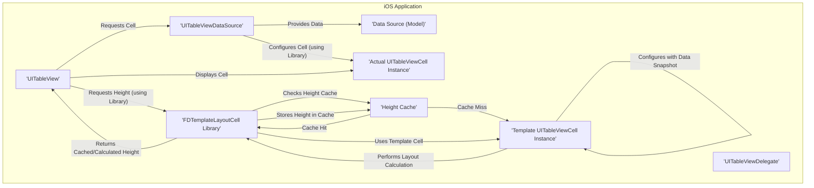
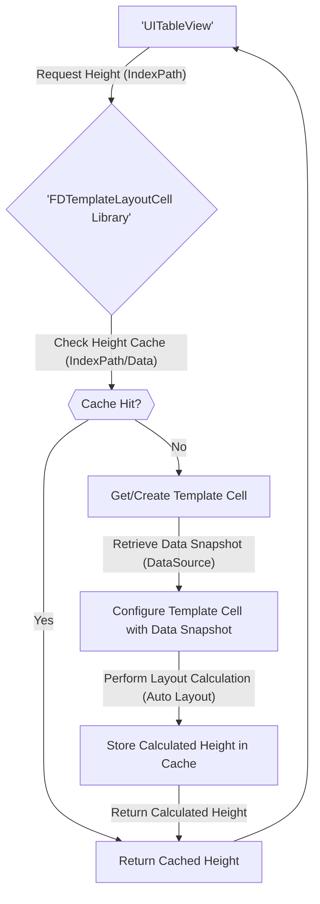

# Project Design Document: `uitableview-fdtemplatelayoutcell`

**Version:** 1.1
**Date:** October 26, 2023
**Author:** Gemini (AI Language Model)

## 1. Introduction

This document provides an in-depth design overview of the open-source iOS library, `uitableview-fdtemplatelayoutcell`, hosted on GitHub at [https://github.com/forkingdog/uitableview-fdtemplatelayoutcell](https://github.com/forkingdog/uitableview-fdtemplatelayoutcell). This library is engineered to boost the performance of `UITableView` by optimizing the process of calculating cell heights, particularly for cells featuring dynamic content and intricate layouts. The primary purpose of this document is to serve as a comprehensive resource for subsequent threat modeling activities, enabling a thorough assessment of potential security implications.

## 2. Goals and Objectives

The core objectives of the `uitableview-fdtemplatelayoutcell` library are centered around enhancing the efficiency and developer experience when working with `UITableView`:

*   **Significant Performance Gains:**  Minimize the computational overhead associated with determining cell heights within `UITableView`, leading to smoother scrolling and a more responsive user interface.
*   **Simplified and Efficient Height Determination:** Offer a more streamlined and declarative approach to defining cell heights, especially beneficial for cells leveraging Auto Layout.
*   **Reduction of Boilerplate Code:** Decrease the amount of repetitive code developers need to implement for managing dynamic cell heights, promoting cleaner and more maintainable codebases.
*   **Seamless Integration:** Ensure effortless compatibility with existing `UITableView` implementations without requiring significant architectural changes.

## 3. System Architecture

The library functions as an extension, augmenting the capabilities of standard `UITableView` and `UITableViewCell` classes. Its central mechanism involves employing "template" cells for the pre-calculation of cell dimensions.

**Components:**

*   **`UITableView`:** The standard iOS component responsible for displaying scrollable lists of data.
*   **`UITableViewDataSource`:**  The protocol responsible for providing the data to be displayed within the `UITableView`. The library interacts with the data source indirectly during template cell configuration.
*   **`UITableViewDelegate`:** The protocol that handles user interactions and provides customization options for the `UITableView`. The library extends the delegate methods specifically related to cell height calculations.
*   **`FDTemplateLayoutCell Library`:** The core component of the solution. It intercepts requests for cell heights and orchestrates the template cell-based calculation process. This includes managing the height cache.
*   **Template `UITableViewCell` Instance:** A lightweight, non-visible instance of a `UITableViewCell` subclass. This instance is created and configured solely for the purpose of calculating its height based on a given data snapshot.
*   **Actual `UITableViewCell` Instance:** The concrete instance of the `UITableViewCell` subclass that is dequeued and displayed to the user, populated with the actual data from the data source.
*   **Data Source (Model):** The underlying data structures that hold the information to be displayed in the table view cells.
*   **Height Cache:** An internal storage mechanism within the library to store previously calculated cell heights, keyed by the data or index path, to avoid redundant calculations.

**Key Interactions:**

*   When the `UITableView` needs to determine the height of a cell for a specific index path, it invokes the `tableView:heightForRowAtIndexPath:` delegate method.
*   The `FDTemplateLayoutCell` library intercepts this call.
*   The library first checks its internal **Height Cache**.
    *   If a cached height exists for the given index path (or a representation of the cell's data), this cached value is returned immediately.
    *   If no cached height is found, the process proceeds with template cell calculation.
*   A **Template `UITableViewCell` Instance** of the appropriate class is either retrieved from a pool or created.
*   The library configures this template cell with a snapshot of the data that corresponds to the cell at the requested index path. This configuration aims to mirror how the actual cell would be configured.
*   Auto Layout is then triggered on the template cell. The system calculates the intrinsic content size of the template cell, which determines its height.
*   The calculated height is stored in the **Height Cache**, associated with the corresponding index path or data representation.
*   The calculated height is then returned to the `UITableView`.
*   Subsequently, when the actual cell for that index path is dequeued and configured for display, its height is readily available (either from the cache or a recent calculation), leading to smoother scrolling performance.

## 4. Data Flow

The primary data flow relevant to this library centers around the efficient calculation and retrieval of cell heights:

1. **`UITableView` initiates a request for the height of a cell at a specific index path.** This triggers a call to the `tableView:heightForRowAtIndexPath:` method of its delegate.
2. **The `FDTemplateLayoutCell Library` intercepts this height request.**
3. **The library queries its internal Height Cache.** The cache is typically keyed by the index path or a hash of the data associated with the cell.
4. **Cache Hit:** If a valid cached height is found:
    *   The cached height is immediately returned to the `UITableView`.
5. **Cache Miss:** If no valid cached height is found:
    *   The library obtains or instantiates a template cell of the appropriate type for the given index path.
    *   A snapshot of the data intended for the cell at that index path is retrieved from the `UITableViewDataSource`.
    *   The template cell is configured using this data snapshot, mimicking the configuration of the actual cell.
    *   The layout engine (Auto Layout) is invoked on the template cell to calculate its intrinsic content size, including its height.
    *   The calculated height is stored in the Height Cache, associated with the index path or data representation.
    *   The calculated height is returned to the `UITableView`.
6. **The `UITableView` uses the provided height to layout the cell.**
7. **When the actual cell is dequeued and configured, the height information is readily available (either cached or recently calculated), optimizing the rendering process.**

## 5. Security Considerations

While the primary focus of `uitableview-fdtemplatelayoutcell` is performance optimization, several security considerations are relevant when integrating it into an application:

*   **Data Injection Vulnerabilities during Template Cell Configuration:**
    *   **Threat:** If the data used to configure the template cell originates from an untrusted source and is not properly sanitized, it could potentially lead to unexpected behavior during layout calculations. This might manifest as UI glitches or, in more severe cases, could be exploited to trigger vulnerabilities in the underlying layout engine (though this is less likely).
    *   **Mitigation:** Implement robust input validation and sanitization of data at the data source level *before* it is used to configure the template cell. Treat all external data as potentially malicious.

*   **Denial of Service (DoS) through Resource Exhaustion:**
    *   **Threat:**  A malicious or poorly designed data source could provide data that leads to an excessive number of unique layout calculations, potentially exhausting device resources (CPU, memory). This could result in a temporary denial of service for the application's UI. For instance, rapidly changing data that invalidates the cache frequently.
    *   **Mitigation:** Implement strategies to limit the frequency of cache invalidation. Monitor application performance and resource usage. Consider implementing rate limiting or data throttling at the data source level.

*   **Information Disclosure via Caching Side-Channels (Low Risk):**
    *   **Threat:** While highly improbable, if an attacker could gain access to the library's internal height cache (e.g., through memory analysis of a compromised device), they might be able to infer information about the data being displayed based on the presence or absence of cached heights for specific data items.
    *   **Mitigation:** The library's internal cache is typically not directly accessible to external entities. Rely on standard iOS security measures to protect application memory. This is a low-severity risk.

*   **Dependency Chain Vulnerabilities:**
    *   **Threat:** Although `uitableview-fdtemplatelayoutcell` has minimal external dependencies (primarily the iOS SDK), vulnerabilities in the underlying frameworks (Foundation, UIKit) could indirectly impact applications using this library.
    *   **Mitigation:** Keep the application's deployment target and development environment updated with the latest security patches for the iOS SDK. Regularly review security advisories related to Apple platforms.

*   **Logic Bugs Leading to Unexpected Behavior:**
    *   **Threat:** Bugs within the library's code itself, particularly in the caching logic or template cell configuration, could lead to incorrect height calculations or unexpected UI behavior. While not directly a security vulnerability, such bugs could potentially be exploited in certain scenarios.
    *   **Mitigation:** Rely on the library's community and maintainers to identify and fix bugs. Stay updated with the latest versions of the library. Thoroughly test the application's UI with various data sets and edge cases.

*   **Memory Management Issues:**
    *   **Threat:**  Improper memory management within the library, such as memory leaks related to template cell creation or caching, could potentially lead to application crashes or instability over time. While not a direct security vulnerability, it can impact application reliability.
    *   **Mitigation:**  Code reviews and static analysis of the library's codebase can help identify potential memory management issues. Rely on the library's maintainers to address such issues.

## 6. Dependencies

The `uitableview-fdtemplatelayoutcell` library primarily relies on the standard iOS SDK:

*   **Foundation Framework (iOS SDK):** Provides fundamental data types, collections, and operating system services.
*   **UIKit Framework (iOS SDK):**  Essential for building graphical, event-driven applications on iOS, including the `UITableView` and `UITableViewCell` classes.

The library does not introduce significant external binary dependencies beyond the standard iOS SDK frameworks.

## 7. Deployment

The recommended method for integrating `uitableview-fdtemplatelayoutcell` into an iOS project is through dependency management tools:

*   **CocoaPods:** A popular dependency manager for Swift and Objective-C projects. To integrate, add `pod 'FDTemplateLayoutCell'` to your `Podfile` and run `pod install`.
*   **Carthage:** A decentralized dependency manager. Add `github "forkingdog/uitableview-fdtemplatelayoutcell"` to your `Cartfile` and follow Carthage's build instructions.
*   **Swift Package Manager (SPM):** Apple's built-in dependency manager. You can add the library as a package dependency within Xcode.

After integration, import the library's headers or modules into your Swift or Objective-C code where you intend to use it.

## 8. Future Considerations

Potential areas for future development and enhancement of the `uitableview-fdtemplatelayoutcell` library include:

*   **More Sophisticated Caching Strategies:** Implementing more advanced caching mechanisms, such as time-to-live (TTL) for cached heights or size-limited caches, to provide finer-grained control over memory usage and cache invalidation.
*   **Improved Integration with Diffable Data Sources:**  Optimizing the library's behavior and caching strategies when used in conjunction with `UITableViewDiffableDataSource` for more seamless and efficient updates.
*   **Asynchronous Template Cell Configuration:** Exploring the possibility of asynchronous data loading and configuration for template cells, potentially improving performance in scenarios where data retrieval is time-consuming.
*   **Enhanced Performance Monitoring and Debugging Tools:** Providing developers with tools or hooks to better understand the library's performance characteristics within their applications, aiding in identifying potential bottlenecks or issues.
*   **Support for Collection Views:**  Considering extending the library's functionality to support `UICollectionView`, addressing similar performance challenges in collection view layout calculations.

This refined design document offers a more detailed and comprehensive understanding of the `uitableview-fdtemplatelayoutcell` library's architecture, data flow, and security considerations. This enhanced information will be crucial for conducting a thorough and effective threat model.
