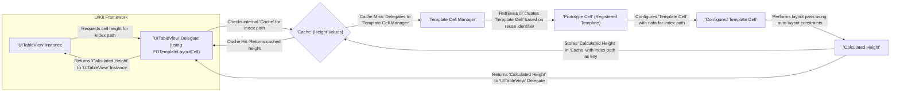

# Project Design Document: UITableView-FDTemplateLayoutCell

**Version:** 1.1
**Date:** October 26, 2023
**Author:** AI Software Architect

## 1. Introduction

This document provides an enhanced and detailed design overview of the `UITableView-FDTemplateLayoutCell` project. This library is engineered to optimize the calculation of `UITableViewCell` heights, a common performance bottleneck in iOS development, particularly for cells with dynamically sized content or intricate layouts. This document is specifically crafted to serve as a robust foundation for subsequent threat modeling exercises.

The core innovation of this library lies in its template cell approach. Instead of calculating the height of each individual cell instance repeatedly, it leverages a representative "template" cell to perform these calculations efficiently.

## 2. Goals

* **Highly Efficient Cell Height Calculation:** To provide a significantly faster method for determining `UITableViewCell` heights compared to standard approaches, minimizing UI lag and improving scrolling performance.
* **Robust Support for Dynamic Content:** To accurately calculate heights for cells whose content (text, images, etc.) can change, necessitating recalculation.
* **Simple and Intuitive Integration:** To offer a developer-friendly API that allows for seamless integration into existing `UITableView` implementations with minimal code changes.
* **Precise Height Accuracy:** To guarantee that the calculated heights precisely match the actual rendered height of the cells, preventing visual inconsistencies.
* **Reduced Boilerplate Code:** To abstract away the complexities of manual cell height calculations, reducing the amount of code developers need to write and maintain.

## 3. Non-Goals

* **Data Source Management:** This library focuses exclusively on layout calculations and does not handle the fetching, storage, or manipulation of data displayed in the table view.
* **Custom Cell Rendering Logic:** The library's scope is limited to height calculation; it does not provide mechanisms for custom drawing or the visual styling of cell content beyond its influence on layout.
* **Comprehensive UI Theming:** While it impacts layout, it does not offer broad UI customization features like theming, color schemes, or font management.
* **`UICollectionView` Compatibility:** The library is specifically designed and optimized for use with `UITableView` and does not extend to `UICollectionView`.

## 4. Architectural Overview

The `UITableView-FDTemplateLayoutCell` library functions as a category extension to the standard `UITableView` class. This extension introduces new functionalities for managing template cells and caching layout results. The interaction between the key components is visualized below:

**Components:**

* **`UITableView` Instance:** The standard iOS table view object where the library's functionality is integrated. This is part of the UIKit framework.
* **`UITableView` Delegate (using `FDTemplateLayoutCell`):** The delegate object responsible for providing data to the table view and handling table view events. The library extends the delegate's capabilities to intercept and optimize height requests.
* **Cache (Height Values):** An internal caching mechanism, likely implemented using `NSCache` or a similar approach, to store calculated cell heights. The cache keys are typically based on the index path or a unique identifier derived from the cell's data.
* **Template Cell Manager:** A core component within the library responsible for the lifecycle management of template cells. This includes retrieving, creating, and configuring these cells.
* **Prototype Cell (Registered Template):** A pre-configured cell instance. Developers register these prototype cells (loaded from Storyboards, Nib files, or created programmatically) with the library. These serve as the templates for layout calculations.
* **Configured Template Cell:** The prototype cell instance after it has been populated with the specific data relevant to the current index path. This configuration step is crucial for accurate layout calculations.
* **Calculated Height:** The resulting height value determined after performing a layout pass on the configured template cell.

## 5. Detailed Design

### 5.1. Template Cell Registration and Management

* Developers register template cells with the library, associating a reuse identifier with either a cell class or a pre-instantiated cell object. This registration process informs the library about the types of cells it will need to calculate heights for.
* The library maintains an internal registry of these template cells. When a height calculation is required for a specific cell type (identified by its reuse identifier), the library retrieves the corresponding template cell from this registry.
* Template cells are typically configured only once and then reused for multiple height calculations, improving efficiency.

### 5.2. Height Calculation Workflow

1. When the `UITableView` needs to determine the height of a cell at a particular index path, it calls the `tableView:heightForRowAtIndexPath:` delegate method.
2. The `FDTemplateLayoutCell` category intercepts this call.
3. The library first checks its internal cache for a previously calculated height associated with the given index path. The cache key is often derived from the index path itself or a unique identifier related to the data at that index path.
4. **Cache Hit:** If a valid cached height is found, it is immediately returned to the `UITableView`, bypassing the more expensive layout calculation step.
5. **Cache Miss:** If no cached height exists or the cached value is invalid:
    * The library retrieves the appropriate template cell based on the cell's reuse identifier.
    * The library then configures the template cell with the data corresponding to the requested index path. This typically involves setting the values of labels, image views, and other subviews within the template cell. Developers usually provide a block or delegate method to handle this data configuration.
    * A layout pass is performed on the configured template cell. This involves the cell's auto layout constraints being evaluated to determine the cell's intrinsic content size. Methods like `systemLayoutSizeFittingSize:` are commonly used for this purpose.
    * The calculated height is then stored in the cache, associated with the index path (or a data-derived identifier), for future use.
    * Finally, the calculated height is returned to the `UITableView`.

### 5.3. Caching Strategy

* The library likely employs `NSCache` or a dictionary for its caching mechanism. `NSCache` is often preferred due to its automatic handling of memory pressure.
* The cache key is crucial for efficient retrieval and invalidation. It's typically derived from the index path, but more sophisticated implementations might incorporate a hash of the data content to ensure cache invalidation when the data changes.
* Cache invalidation is essential to maintain accuracy. The library might provide mechanisms for developers to manually invalidate cache entries or implement automatic invalidation based on data updates.

### 5.4. API and Developer Integration

* The library provides methods (likely as part of the `UITableView` category) for registering template cells. This includes methods to register cells from Nib files, Storyboards, or programmatically created classes.
* Developers are required to provide a mechanism (e.g., a block or a delegate method) that the library can use to configure the template cell with the correct data before performing the layout calculation. This ensures that the calculated height accurately reflects the content of the cell.
* The library integrates seamlessly with the standard `UITableView` delegate methods for height management, minimizing the need for significant code refactoring.

## 6. Data Flow

The sequence of actions involved in calculating a cell's height using `UITableView-FDTemplateLayoutCell` is as follows:

1. The `UITableView` needs to display a cell at a specific `IndexPath`.
2. The `UITableView` calls its delegate's `tableView:heightForRowAtIndexPath:` method.
3. The `FDTemplateLayoutCell` category intercepts this method call.
4. The library checks its internal `Cache` for a pre-calculated height associated with the given `IndexPath`.
5. **Cache Hit:** If a cached height exists, it is immediately returned to the `UITableView`.
6. **Cache Miss:** If no cached height is found in the `Cache`:
    * The `Template Cell Manager` retrieves the appropriate `Prototype Cell` based on the cell's reuse identifier.
    * The developer-provided configuration block or delegate method is invoked, passing the `Prototype Cell` and the data corresponding to the current `IndexPath`.
    * The `Prototype Cell` is configured with the data.
    * The library performs a layout pass on the configured `Prototype Cell` to determine its height.
    * The calculated height is stored in the `Cache`, associated with the `IndexPath`.
    * The calculated height is returned to the `UITableView` delegate.
7. The `UITableView` uses the returned height to layout the cell on the screen.

## 7. Security Considerations (For Threat Modeling)

While `UITableView-FDTemplateLayoutCell` primarily focuses on UI performance, several security considerations are relevant for threat modeling:

* **Denial of Service (DoS) through Resource Exhaustion:**
    * **Scenario:** An attacker could potentially provide data that leads to exceptionally complex or computationally expensive layout calculations for a large number of cells. This could tie up the main thread, leading to UI unresponsiveness or even application crashes.
    * **Mitigation:** While the library aims to optimize calculations, developers should still be mindful of the complexity of their cell layouts and the potential impact of extremely large or intricate content. Implementing safeguards like timeouts for layout calculations or limiting the amount of data processed at once could be considered.
* **Cache Poisoning and Integrity Issues:**
    * **Scenario:** If the cache key generation is predictable or vulnerable, an attacker might be able to inject malicious or incorrect height values into the cache. This could lead to UI rendering glitches, incorrect display of information, or potentially be a stepping stone for further exploitation if the displayed information influences user actions.
    * **Mitigation:** Employ robust and unpredictable cache key generation strategies, ideally incorporating a hash of the relevant data content. Consider using secure hashing algorithms. Implement mechanisms to detect and invalidate potentially poisoned cache entries.
* **Information Disclosure via Side Channels:**
    * **Scenario:** Although less likely, subtle differences in the time taken to calculate cell heights based on different data inputs could potentially leak information about the underlying data. This is a form of side-channel attack.
    * **Mitigation:** This is a complex issue to address. If the data being displayed is highly sensitive, consider alternative approaches that don't rely on dynamic height calculations based on content.
* **Vulnerabilities in Dependencies:**
    * **Scenario:** If `UITableView-FDTemplateLayoutCell` relies on any third-party libraries, vulnerabilities in those dependencies could indirectly impact the security of applications using this library.
    * **Mitigation:** Regularly review and update dependencies to their latest secure versions. Be aware of any reported security vulnerabilities in the dependencies.
* **Integer Overflow/Underflow in Height Calculations:**
    * **Scenario:** While less probable with modern architectures, there's a theoretical risk of integer overflow or underflow during height calculations if the library performs arithmetic operations on height values without proper bounds checking. This could lead to unexpected behavior or crashes.
    * **Mitigation:** Ensure that all arithmetic operations related to height calculations are performed with appropriate checks to prevent overflow or underflow. Utilize data types that can accommodate the expected range of height values.
* **Unintended Data Binding or Side Effects during Template Cell Configuration:**
    * **Scenario:** If the developer-provided configuration block for the template cell inadvertently modifies application state or performs actions beyond simply configuring the cell's visual elements, this could introduce unexpected side effects or vulnerabilities.
    * **Mitigation:** Clearly document the expected behavior of the configuration block and emphasize that it should be limited to configuring the cell's visual presentation.

## 8. Dependencies

* **Foundation Framework (iOS SDK):** Provides fundamental data types, collections, and operating system services.
* **UIKit Framework (iOS SDK):** Provides the necessary UI building blocks, including `UITableView`, `UITableViewCell`, and related classes for layout and rendering.

## 9. Deployment

`UITableView-FDTemplateLayoutCell` is typically integrated into iOS projects using dependency management tools such as:

* **CocoaPods:** Add the library as a dependency in the `Podfile`.
* **Swift Package Manager:** Add the library as a dependency in the `Package.swift` file.

Developers then import the library's modules into their Swift or Objective-C code to utilize its functionalities.

## 10. Future Considerations

* **Asynchronous Layout Calculations:** Explore the possibility of performing layout calculations on background threads to further enhance UI responsiveness, especially for very complex cell layouts. This would require careful consideration of thread safety and synchronization.
* **More Granular Cache Invalidation Strategies:** Provide developers with more fine-grained control over cache invalidation, allowing them to specify custom conditions or triggers for invalidating cached heights.
* **Integration with Diffing Algorithms:** Investigate potential integration with diffing algorithms to optimize height recalculations when the underlying data changes, avoiding unnecessary calculations for unchanged cells.

This revised document provides a more in-depth and refined design overview of the `UITableView-FDTemplateLayoutCell` project, with a stronger emphasis on security considerations relevant for threat modeling activities. This enhanced information will be more valuable for identifying potential vulnerabilities and formulating effective mitigation strategies.