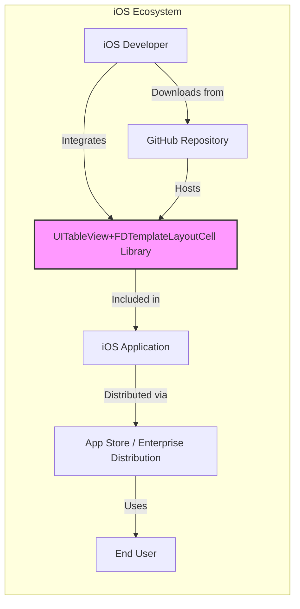
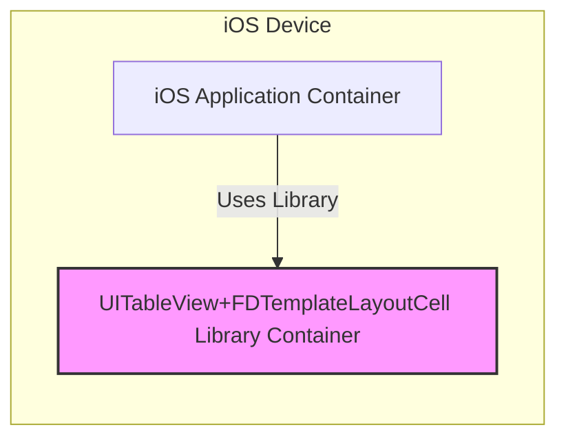
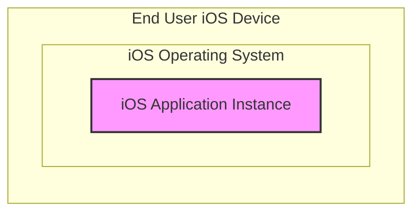
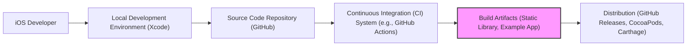

# BUSINESS POSTURE

This project provides an open-source iOS library, `UITableView+FDTemplateLayoutCell`, designed to simplify the process of calculating dynamic heights for `UITableViewCell` instances based on Auto Layout constraints.

- Business Priorities and Goals:
  - To enhance the efficiency of iOS application development by providing a reusable component for dynamic cell layout.
  - To improve the performance and responsiveness of user interfaces in iOS applications that utilize table views with variable cell heights.
  - To reduce development time and complexity associated with implementing dynamic cell sizing in iOS table views.
  - To foster a community-driven approach to solving a common iOS development challenge, encouraging collaboration and improvement of the library.

- Business Risks:
  - Dependency risk: Relying on an external, open-source library introduces a dependency that needs to be managed and maintained.
  - Quality risk: Potential defects or limitations in the library could impact the stability and functionality of applications that depend on it.
  - Security risk: Although less likely for a UI library, vulnerabilities in the library or its dependencies could pose a security risk to applications using it.
  - Maintenance risk: The library's continued maintenance and support depend on the open-source community and the original developers.

# SECURITY POSTURE

- Security Controls:
  - security control: Source code hosted on GitHub, leveraging GitHub's infrastructure security. (Implemented: GitHub platform)
  - security control: Open-source nature allows for community review of the code. (Implemented: Open-source model)

- Accepted Risks:
  - accepted risk: Reliance on community-maintained open-source library for security updates and vulnerability patching.
  - accepted risk: Limited formal security testing and auditing of the library.
  - accepted risk: Potential for supply chain vulnerabilities if dependencies are not properly managed.

- Recommended Security Controls:
  - security control: Implement dependency scanning to automatically identify known vulnerabilities in the library's dependencies.
  - security control: Encourage and facilitate community security audits and vulnerability reporting.
  - security control: Establish a process for reviewing and addressing reported security vulnerabilities in a timely manner.

- Security Requirements:
  - Authentication: Not applicable to this library as it is a client-side UI component and does not handle user authentication.
  - Authorization: Not applicable to this library as it does not manage access control or authorization.
  - Input Validation: The library should be robust in handling various inputs related to cell content and layout constraints to prevent unexpected behavior or crashes. While not directly validating user input, it should handle data provided by the application gracefully.
  - Cryptography: Cryptography is not a direct requirement for this UI layout library. However, applications using this library might handle sensitive data and should implement appropriate encryption measures at the application level, independent of this library.

# DESIGN

## C4 CONTEXT

- Context Diagram Elements:
  - - Name: iOS Developer
    - Type: Person
    - Description: Software developers who build iOS applications.
    - Responsibilities: Integrate the `UITableView+FDTemplateLayoutCell` library into their iOS applications to manage dynamic cell layouts.
    - Security controls: Responsible for secure coding practices in their applications, including proper usage of the library and handling of application-level security concerns.

  - - Name: UITableView+FDTemplateLayoutCell Library
    - Type: Software System
    - Description: An open-source iOS library that simplifies dynamic `UITableViewCell` height calculation using Auto Layout.
    - Responsibilities: Provide a reusable and efficient solution for calculating dynamic cell heights in iOS table views.
    - Security controls: Open-source code, community review, potential dependency scanning (recommended).

  - - Name: iOS Application
    - Type: Software System
    - Description: An iOS application developed by iOS developers that incorporates the `UITableView+FDTemplateLayoutCell` library.
    - Responsibilities: Utilize the library to display dynamic content in table views, provide user functionality, and manage application-level security.
    - Security controls: Application-level security controls, including authentication, authorization, input validation, data protection, and secure communication, implemented by the iOS developer.

  - - Name: GitHub Repository
    - Type: External System
    - Description: A web-based platform for version control and collaboration, hosting the source code of the `UITableView+FDTemplateLayoutCell` library.
    - Responsibilities: Host the library's source code, facilitate version control, and enable community contributions.
    - Security controls: GitHub platform security, including access controls, vulnerability scanning, and infrastructure protection.

  - - Name: App Store / Enterprise Distribution
    - Type: External System
    - Description: Platforms for distributing iOS applications to end users. App Store for public distribution and enterprise distribution for internal applications.
    - Responsibilities: Distribute iOS applications to end users.
    - Security controls: App Store and Enterprise Distribution platform security, including app vetting processes and distribution channel security.

  - - Name: End User
    - Type: Person
    - Description: Individuals who use iOS applications on their iOS devices.
    - Responsibilities: Use the iOS application to interact with its features and data.
    - Security controls: Device-level security controls, user awareness of security best practices.

## C4 CONTAINER

- Container Diagram Elements:
  - - Name: iOS Application Container
    - Type: Application Runtime Environment
    - Description: The runtime environment of the iOS application on an iOS device. This container hosts the application code and all integrated libraries.
    - Responsibilities: Execute the iOS application code, manage application resources, and interact with the iOS operating system.
    - Security controls: iOS operating system security features, application sandbox, application-level security controls implemented by the developer.

  - - Name: UITableView+FDTemplateLayoutCell Library Container
    - Type: Library
    - Description: The library is packaged as part of the iOS application. It's a static library linked into the application executable.
    - Responsibilities: Provide the functionality for dynamic `UITableViewCell` height calculation within the iOS application.
    - Security controls: Code review (community and potentially internal), dependency scanning (recommended), inherits application sandbox restrictions.

## DEPLOYMENT

- Deployment Diagram:
  - Deployment Environment: End User iOS Device (iPhone, iPad)
  - Deployment Model: Application is installed on the end-user's iOS device via the App Store or enterprise distribution. The library is embedded within the application package.

- Deployment Diagram Elements:
  - - Name: iOS Application Instance
    - Type: Application Process
    - Description: A running instance of the iOS application on an end-user's iOS device. This instance includes the `UITableView+FDTemplateLayoutCell` library code.
    - Responsibilities: Execute the application logic, display user interface elements (including table views with dynamic cell heights managed by the library), and interact with user input.
    - Security controls: iOS application sandbox, operating system security features, application-level security controls.

## BUILD

- Build Process:
  - 1. iOS Developer develops the library using Xcode in their local development environment.
  - 2. Source code is committed and pushed to the GitHub repository.
  - 3. A Continuous Integration (CI) system, such as GitHub Actions, can be configured to automatically build the library upon code changes.
  - 4. Build artifacts, including the static library and potentially an example application, are generated.
  - 5. The library can be distributed through various channels like GitHub Releases, CocoaPods, or Carthage for integration into other iOS projects.

- Build Security Controls:
  - security control: Code review during development and pull requests to GitHub. (Implemented: Developer workflow, GitHub)
  - security control: Use of version control (Git/GitHub) to track changes and maintain code integrity. (Implemented: GitHub)
  - security control: Potential integration of static analysis security testing (SAST) tools in the CI pipeline to scan for code vulnerabilities. (Recommended: CI Pipeline)
  - security control: Dependency management using tools like CocoaPods or Carthage, which can help manage and update library dependencies. (Implemented: Project setup, potentially CocoaPods/Carthage)
  - security control: Signing of build artifacts (relevant for distributing example app, less so for static library itself). (Implemented: Xcode build process)

# RISK ASSESSMENT

- Critical Business Processes:
  - For the library itself, the critical process is maintaining the quality and availability of the library for the iOS developer community.
  - For applications using the library, the critical processes are those that rely on the correct and efficient display of information in table views, which could be core functionalities of the application.

- Data Sensitivity:
  - The library itself does not directly handle sensitive data.
  - However, applications using this library might display sensitive data in table views. The library's correct functioning is important to ensure data is displayed as intended and to prevent UI-related issues that could indirectly expose data or create security vulnerabilities (e.g., information disclosure through layout errors). The sensitivity of data depends entirely on the applications that integrate this library.

# QUESTIONS & ASSUMPTIONS

- Questions:
  - What are the intended use cases and types of applications that will utilize this library? (e.g., e-commerce, social media, enterprise apps)
  - Are there any specific security requirements or compliance standards that applications using this library must adhere to?
  - What is the process for reporting and addressing security vulnerabilities in the library?
  - Is there a dedicated team or individual responsible for maintaining and updating the library, including security patches?

- Assumptions:
  - The library is intended for general-purpose iOS application development and is not specifically targeted for highly sensitive or regulated industries.
  - Security responsibility for applications using this library primarily lies with the application developers.
  - The open-source community will contribute to the ongoing maintenance and improvement of the library, including addressing potential security concerns.
  - The primary distribution method for the library is through open-source package managers and GitHub, rather than a formal commercial distribution channel.