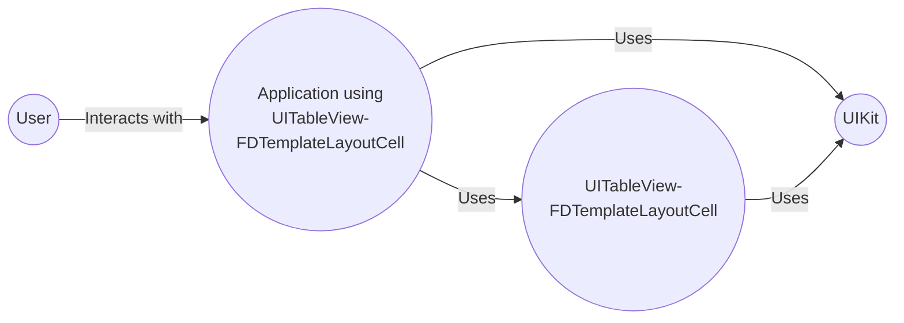
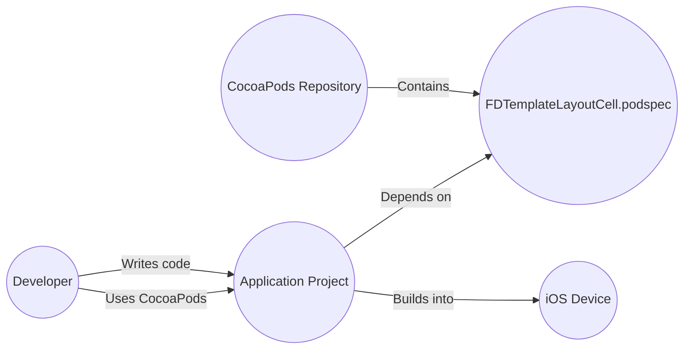
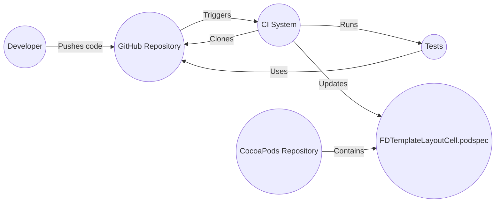

Okay, let's create a design document for the `UITableView-FDTemplateLayoutCell` project.

# BUSINESS POSTURE

Business Priorities and Goals:

*   Provide a simple, efficient, and auto-layout-friendly way to calculate the height of `UITableView` cells.
*   Reduce development time and complexity when dealing with dynamic cell content.
*   Improve the performance of table views with complex layouts.
*   Offer a solution that is compatible with both Objective-C and Swift (implied by the project's nature).
*   Maintain backward compatibility with older iOS versions (at least as far back as the project supports).
*   Provide a well-maintained and reliable open-source library.

Business Risks:

*   Performance degradation: If the library introduces performance overhead, it could negatively impact the user experience, especially on older devices or with very large tables.
*   Compatibility issues: Changes to the library might break existing implementations or introduce conflicts with other libraries.
*   Lack of adoption: If the library is not widely adopted, its maintenance and long-term viability could be at risk.
*   Security vulnerabilities: While unlikely in this specific type of library, any code can potentially introduce vulnerabilities. In this case, it would most likely be a denial-of-service (DoS) if a specially crafted layout could cause excessive CPU usage or memory allocation.
*   Maintenance burden: The maintainer(s) must keep the library up-to-date with new iOS releases and address bug reports and feature requests.

# SECURITY POSTURE

Existing Security Controls:

*   security control: Open-source code: The project is open-source, allowing for community review and scrutiny. (Described in the GitHub repository).
*   security control: Code reviews: While not explicitly stated, it's assumed that pull requests are reviewed before being merged. (Implied by standard open-source practices).
*   security control: Simple functionality: The library's scope is relatively narrow, reducing the potential attack surface.

Accepted Risks:

*   accepted risk: Limited formal security testing: There's no mention of specific security testing procedures (e.g., fuzzing, static analysis).
*   accepted risk: Reliance on UIKit: The library depends on the security of Apple's UIKit framework.
*   accepted risk: Potential for misuse: Developers could misuse the library in ways that create performance or stability issues, although this is not a direct security vulnerability of the library itself.

Recommended Security Controls:

*   security control: Integrate static analysis: Add a static analysis tool (e.g., SonarCloud, Infer) to the build process to identify potential code quality and security issues.
*   security control: Consider fuzz testing: Although the attack surface is small, fuzz testing could help identify unexpected edge cases that might lead to crashes or excessive resource consumption.

Security Requirements:

*   Authentication: Not applicable. This library does not handle authentication.
*   Authorization: Not applicable. This library does not handle authorization.
*   Input validation: The library relies on the correct usage of Auto Layout constraints by the developer. It should handle invalid or conflicting constraints gracefully, without crashing or causing unexpected behavior.  It's crucial to ensure that the library doesn't amplify any potential issues arising from malformed constraints (e.g., leading to excessive memory allocation).
*   Cryptography: Not applicable. This library does not handle cryptographic operations.

# DESIGN

This library provides a mechanism for caching `UITableViewCell` heights calculated using Auto Layout. It does this by creating template cells and using them to perform layout calculations.

## C4 CONTEXT

Element Descriptions:

*   Element:
    *   Name: User
    *   Type: Person
    *   Description: The end-user interacting with the application.
    *   Responsibilities: Interacts with the UI, triggering table view scrolling and cell rendering.
    *   Security controls: None (handled by the application).

*   Element:
    *   Name: Application using UITableView-FDTemplateLayoutCell
    *   Type: Software System
    *   Description: The iOS application that utilizes the `UITableView-FDTemplateLayoutCell` library.
    *   Responsibilities: Manages the table view, provides data, and configures cells.
    *   Security controls: Application-specific security controls (e.g., authentication, authorization, data validation).

*   Element:
    *   Name: UITableView-FDTemplateLayoutCell
    *   Type: Library
    *   Description: The library providing the cell height calculation functionality.
    *   Responsibilities: Calculates and caches cell heights based on Auto Layout constraints.
    *   Security controls: Open-source code, code reviews, simple functionality.

*   Element:
    *   Name: UIKit
    *   Type: Framework
    *   Description: Apple's UI framework for iOS.
    *   Responsibilities: Provides the underlying table view and Auto Layout functionality.
    *   Security controls: Provided and maintained by Apple.

## C4 CONTAINER

In this case, the container diagram is essentially the same as the context diagram, as the library itself is a single component.

Element Descriptions:

*   Element:
    *   Name: User
    *   Type: Person
    *   Description: The end-user interacting with the application.
    *   Responsibilities: Interacts with the UI, triggering table view scrolling and cell rendering.
    *   Security controls: None (handled by the application).

*   Element:
    *   Name: Application using UITableView-FDTemplateLayoutCell
    *   Type: Software System
    *   Description: The iOS application that utilizes the `UITableView-FDTemplateLayoutCell` library.
    *   Responsibilities: Manages the table view, provides data, and configures cells. Uses FDTemplateLayoutCell to calculate cell heights.
    *   Security controls: Application-specific security controls (e.g., authentication, authorization, data validation).

*   Element:
    *   Name: UITableView-FDTemplateLayoutCell
    *   Type: Library
    *   Description: The library providing the cell height calculation functionality.
    *   Responsibilities: Calculates and caches cell heights based on Auto Layout constraints.
    *   Security controls: Open-source code, code reviews, simple functionality.

*   Element:
    *   Name: UIKit
    *   Type: Framework
    *   Description: Apple's UI framework for iOS.
    *   Responsibilities: Provides the underlying table view and Auto Layout functionality.
    *   Security controls: Provided and maintained by Apple.

## DEPLOYMENT

Deployment Solutions:

1.  CocoaPods: The library is distributed as a CocoaPod, allowing developers to easily integrate it into their projects.
2.  Carthage: The library supports Carthage, another dependency manager for Cocoa projects.
3.  Swift Package Manager: The library supports Swift Package Manager, another dependency manager for Cocoa projects.
4.  Manual Integration: Developers can manually add the library's source files to their projects.

Chosen Solution (CocoaPods):

Element Descriptions:

*   Element:
    *   Name: Developer
    *   Type: Person
    *   Description: The developer integrating the library into their application.
    *   Responsibilities: Writes application code, manages dependencies.
    *   Security controls: None specific to this diagram.

*   Element:
    *   Name: CocoaPods Repository
    *   Type: Repository
    *   Description: The central repository for CocoaPods.
    *   Responsibilities: Hosts the `FDTemplateLayoutCell.podspec` file.
    *   Security controls: Managed by the CocoaPods maintainers.

*   Element:
    *   Name: Application Project
    *   Type: Project
    *   Description: The developer's Xcode project.
    *   Responsibilities: Contains the application code and dependencies.
    *   Security controls: Application-specific security controls.

*   Element:
    *   Name: iOS Device
    *   Type: Device
    *   Description: The device running the application.
    *   Responsibilities: Executes the application code.
    *   Security controls: iOS security features.

*   Element:
    *   Name: FDTemplateLayoutCell.podspec
    *   Type: File
    *   Description: Pod specification file that describes `UITableView-FDTemplateLayoutCell` library.
    *   Responsibilities: Describes library, including source files, dependencies, and build settings.
    *   Security controls: None.

## BUILD

The build process typically involves the following steps:

1.  Developer writes code and pushes changes to the GitHub repository.
2.  Continuous Integration (CI) system (e.g., Travis CI, GitHub Actions - not explicitly mentioned, but common practice) is triggered.
3.  CI system clones the repository.
4.  CI system runs tests (unit tests are present in the repository).
5.  If tests pass, the library can be built and packaged (e.g., for CocoaPods).
6.  The packaged library is then available for distribution.

Security Controls in Build Process:

*   security control: Code reviews (implied).
*   security control: Unit tests: The project includes unit tests, which help ensure the correctness of the code.
*   security control: CI system: Using a CI system helps automate the build and testing process, reducing the risk of manual errors.

# RISK ASSESSMENT

Critical Business Processes:

*   Efficiently displaying dynamic content in table views.
*   Providing a smooth and responsive user experience.

Data:

*   The library itself does not handle any sensitive data directly. It operates on layout information provided by the application. The sensitivity of the data displayed in the table view is the responsibility of the application using the library.

# QUESTIONS & ASSUMPTIONS

Questions:

*   Are there any specific performance benchmarks or targets that the library should meet?
*   Are there plans to add support for other UI frameworks (e.g., SwiftUI)?
*   What is the long-term maintenance plan for the library?

Assumptions:

*   Business Posture: The primary goal is to provide a convenient and performant solution for developers.
*   Security Posture: Security is a consideration, but not the primary focus. The library relies on the security of the underlying iOS framework.
*   Design: The library is designed to be simple and easy to use, with minimal impact on the application's architecture. The provided design diagrams are accurate representations of the library's structure and deployment.