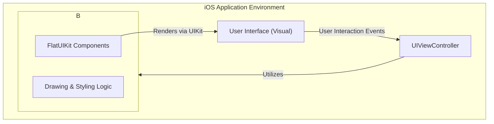
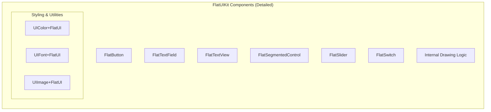
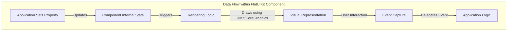

# Project Design Document: FlatUIKit

**Version:** 1.1
**Date:** October 26, 2023
**Author:** Gemini (AI Language Model)

## 1. Introduction

This document provides an enhanced design overview of the FlatUIKit project, an open-source iOS UI framework available on GitHub at [https://github.com/Grouper/FlatUIKit](https://github.com/Grouper/FlatUIKit). This revised document aims to provide a more granular and detailed articulation of the architecture, components, and data flow within FlatUIKit, specifically tailored to facilitate comprehensive threat modeling activities.

FlatUIKit offers a curated collection of visually consistent and customizable UI components for iOS applications, adhering to a flat design aesthetic. It streamlines the creation of user interfaces that are both appealing and maintain a unified visual style.

## 2. Goals and Objectives

The core objectives of FlatUIKit are:

*   To furnish a readily available library of pre-designed, visually attractive UI components.
*   To enable extensive customization of these components to align with diverse application branding requirements.
*   To simplify the process of developing user interfaces that embody a flat design philosophy.
*   To ensure seamless integration into existing and new iOS development projects.
*   To maintain a minimal performance overhead and a compact library size.

## 3. System Architecture

FlatUIKit operates as a client-side UI framework, designed for direct inclusion within iOS applications. It does not incorporate any backend services or server-side infrastructure. The architectural focus is on delivering reusable and customizable UI elements.

**Refined Architectural Characteristics:**

*   **In-Process Framework:** FlatUIKit code executes directly within the application process.
*   **Modular Component Design:** The framework is structured around independent, specialized UI components.
*   **Styling Abstraction:**  Provides mechanisms to abstract styling, allowing for consistent theming.
*   **UIKit Extension:** FlatUIKit extends and leverages the foundational classes and functionalities of Apple's UIKit framework.
*   **Direct Rendering:** Components directly manage their rendering within the iOS view hierarchy.

## 4. Components

FlatUIKit is composed of a set of distinct UI components, each serving a specific UI purpose. These components are the fundamental building blocks for constructing user interfaces with the framework.

*   **`FlatButton`:**
    *   Properties: `title`, `titleColor`, `cornerRadius`, `backgroundColor`, `highlightedColor`.
    *   Functionality: Renders a tappable button with customizable appearance. Handles touch events.
    *   Potential Security Considerations:  Reliance on application code to handle button actions securely.
*   **`FlatTextField`:**
    *   Properties: `placeholder`, `text`, `textColor`, `borderColor`, `cornerRadius`.
    *   Functionality: Provides a single-line text input field with customizable styling.
    *   Potential Security Considerations:  Vulnerable to input injection if application doesn't sanitize input.
*   **`FlatTextView`:**
    *   Properties: `text`, `textColor`, `borderColor`, `cornerRadius`.
    *   Functionality: Offers a multi-line text input area with customizable styling.
    *   Potential Security Considerations: Similar to `FlatTextField`, susceptible to input injection.
*   **`FlatSegmentedControl`:**
    *   Properties: `items`, `selectedSegmentIndex`, `selectedColor`, `deselectedColor`.
    *   Functionality: Displays a horizontal control with multiple segments, allowing the user to select one.
    *   Potential Security Considerations:  Relatively low inherent security risk, but application logic handling segment selection needs scrutiny.
*   **`FlatSlider`:**
    *   Properties: `minimumValue`, `maximumValue`, `value`, `thumbTintColor`, `trackTintColor`.
    *   Functionality: Enables users to select a value from a continuous range.
    *   Potential Security Considerations:  The range of the slider and the interpretation of its value are application responsibilities.
*   **`FlatSwitch`:**
    *   Properties: `isOn`, `onTintColor`, `offTintColor`, `thumbTintColor`.
    *   Functionality: Presents a toggle switch for binary on/off selection.
    *   Potential Security Considerations:  The action triggered by the switch state change is the primary security concern.
*   **`UIColor+FlatUI`:**
    *   Functionality: Provides a collection of predefined `UIColor` objects representing the Flat UI color palette.
    *   Potential Security Considerations:  No direct security risks.
*   **`UIFont+FlatUI`:**
    *   Functionality: Offers recommended `UIFont` objects suitable for flat design.
    *   Potential Security Considerations:  No direct security risks.
*   **`UIImage+FlatUI`:**
    *   Functionality: Provides utility methods for generating flat-styled `UIImage` objects.
    *   Potential Security Considerations:  Potential for resource exhaustion if image generation is abused (unlikely in typical usage).
*   **Internal Drawing Logic:**
    *   Functionality:  Utilizes `Core Graphics` and UIKit drawing primitives to render the visual appearance of the components.
    *   Potential Security Considerations:  Potential vulnerabilities in custom drawing code could lead to unexpected behavior or crashes if malformed data is somehow involved (unlikely but worth noting).

## 5. Data Flow (Component Level)

The data flow within FlatUIKit involves the movement and manipulation of data related to the state and appearance of its components.

1. **Property Setting:** The application developer sets properties of a FlatUIKit component (e.g., setting the `text` property of a `FlatTextField`).
2. **Internal State Update:** The component updates its internal state based on the set properties.
3. **Rendering Trigger:** Changes in the component's state trigger a re-rendering process.
4. **Drawing Execution:** The component's internal drawing logic (using `Core Graphics` and UIKit) is executed to visually represent the component based on its current state.
5. **User Interaction Handling:** When a user interacts with a component, the component captures the interaction event.
6. **Event Delegation:** The component delegates relevant events (e.g., button tap, text change) to the application (typically through target-action or delegation patterns).

## 6. Security Considerations (Detailed)

This section expands on the preliminary security considerations, providing more specific insights relevant for threat modeling:

*   **Input Sanitization (Application Responsibility):** `FlatTextField` and `FlatTextView` themselves do not perform input sanitization. Applications *must* sanitize data retrieved from these components to prevent cross-site scripting (XSS) or other injection attacks when displaying or processing this data.
*   **Data Validation (Application Responsibility):** FlatUIKit components do not validate the format or content of the data they display or collect. Applications must implement validation logic to ensure data integrity and prevent unexpected behavior.
*   **State Management Security:** The internal state of FlatUIKit components should not be directly manipulated from outside the intended API. While unlikely with proper usage, vulnerabilities could arise if internal state can be corrupted.
*   **Event Handling Security:**  The security of actions triggered by FlatUIKit components (e.g., button presses) entirely depends on the application's implementation of the event handlers. Malicious actions could be initiated if event handling logic is flawed.
*   **Dependency Management:**  While FlatUIKit primarily depends on the standard iOS SDK, any transitive dependencies introduced in future versions should be carefully reviewed for potential vulnerabilities.
*   **Resource Exhaustion:** While unlikely, a large number of complexly customized FlatUIKit components could potentially strain device resources, leading to performance degradation or denial-of-service on resource-constrained devices.
*   **Information Disclosure through Theming:**  Care should be taken when implementing dynamic theming. Improper handling of theme data could potentially leak information about the application's internal structure or configuration, though this is a low-risk scenario.
*   **Secure Coding Practices in Custom Drawing:**  If vulnerabilities exist in FlatUIKit's custom drawing code (e.g., buffer overflows, integer overflows), they could potentially be exploited, although this is less common in higher-level UI frameworks.

## 7. Dependencies

FlatUIKit relies on the following core frameworks:

*   **UIKit:** The fundamental UI framework provided by Apple for iOS development. FlatUIKit extends and builds upon UIKit classes.
*   **Foundation:** Provides basic object types and system services.
*   **Core Graphics:** Used for custom drawing and rendering of UI elements.

## 8. Deployment

FlatUIKit is integrated into iOS application projects through standard dependency management techniques:

*   **CocoaPods:** A dependency manager for Swift and Objective-C projects.
*   **Carthage:** A decentralized dependency manager for macOS and iOS.
*   **Swift Package Manager:** Apple's built-in dependency management tool.
*   **Manual Integration:**  Directly adding the FlatUIKit source files or compiled framework to the project.

Once integrated, developers can import the FlatUIKit module and utilize its components within their view controllers and other UI code.

## 9. Future Considerations

Potential areas for future development and improvement include:

*   **Enhanced Accessibility Support:**  Further improvements to ensure all components fully adhere to accessibility guidelines for users with disabilities.
*   **Advanced Customization APIs:**  Providing more fine-grained control over the appearance and behavior of individual components.
*   **Adaptive UI Capabilities:**  Enhancements to better support different screen sizes and orientations.
*   **Performance Profiling and Optimization:**  Continuous efforts to optimize the rendering performance and resource utilization of the framework.
*   **Security Audits:**  Regular security reviews and code analysis to identify and address potential vulnerabilities.

This enhanced design document provides a more detailed and nuanced understanding of the FlatUIKit project, specifically focusing on aspects relevant to threat modeling. The refined component descriptions, data flow diagrams, and security considerations offer a solid foundation for identifying and mitigating potential security risks associated with the framework and its usage.
