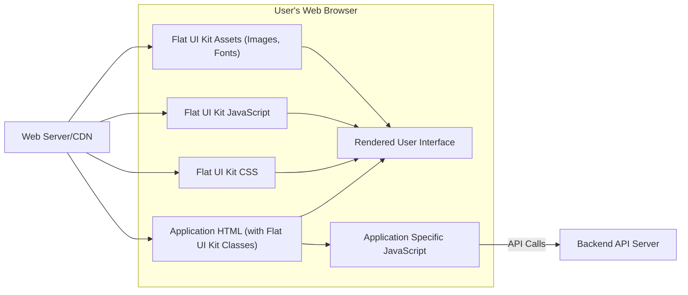
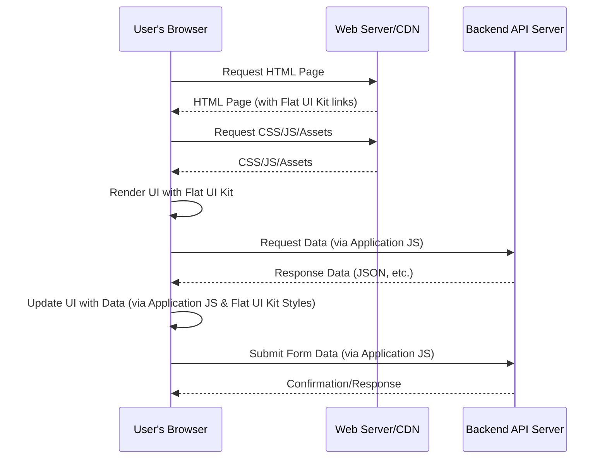

## Project Design Document: Flat UI Kit for Threat Modeling (Improved)

**1. Introduction**

This document provides an enhanced design overview of the Flat UI Kit project (available at [https://github.com/grouper/flatuikit](https://github.com/grouper/flatuikit)). Its primary purpose is to serve as a comprehensive foundation for subsequent threat modeling activities. This document details the key components, architectural considerations, data flow within systems utilizing the kit, and relevant technologies. The intended audience includes security architects, developers, security engineers, and anyone involved in the security assessment of web applications incorporating the Flat UI Kit.

**2. Project Overview**

The Flat UI Kit is a front-end framework comprising a collection of HTML, CSS, and JavaScript files. It is designed to facilitate the creation of consistent and visually appealing user interfaces for web applications. The kit offers a library of pre-designed and styled UI components, such as buttons, forms, navigation bars, modals, and typography elements. The core objective is to streamline front-end development by providing reusable and aesthetically cohesive UI building blocks. It's crucial to understand that the Flat UI Kit operates primarily on the client-side, within the user's web browser. It dictates the presentation and interaction patterns but doesn't inherently manage backend data or application logic.

**3. System Architecture (Detailed)**

The architecture of the Flat UI Kit is best understood within the context of a web application that leverages it. The kit provides the visual and interactive layer, while the underlying application handles data and business logic.

*   **Core Component Breakdown:**
    *   **HTML Templates/Snippets:** These provide the structural markup for UI elements, utilizing specific CSS classes and potentially data attributes defined by the Flat UI Kit. Developers integrate these snippets into their application's HTML.
    *   **Cascading Style Sheets (CSS):**  The CSS files (`flat-ui.css` or similar) are the heart of the visual styling. They define the appearance of all the UI components, handling aspects like color palettes, typography, spacing, and responsiveness across different screen sizes. These styles are applied based on the HTML classes used.
    *   **JavaScript Modules:** JavaScript files provide dynamic behavior and interactivity for certain components. This might include handling dropdown menus, modal dialogs, form validation, or other client-side interactions. These scripts typically manipulate the DOM based on user actions or application state.
    *   **Asset Files:** This category includes static assets like image files (icons, decorative elements), and potentially font files that contribute to the visual design. These are referenced by the CSS and HTML.

*   **Integration and Interaction within a Web Application:**
    *   **Inclusion of Assets:** Developers integrate the Flat UI Kit by including the CSS file(s) in the `<head>` section of their HTML pages and linking the JavaScript file(s) before the closing `</body>` tag. Assets like images and fonts are typically placed in accessible directories.
    *   **Class-Based Styling:** The primary mechanism for applying Flat UI Kit styles is through CSS classes added to HTML elements. Developers use the predefined class names provided by the kit.
    *   **JavaScript Event Handling:**  JavaScript components within the kit (or application-specific scripts) attach event listeners to HTML elements styled with Flat UI Kit classes to handle user interactions.
    *   **Interaction with Backend Services:** The Flat UI Kit itself doesn't directly communicate with backend services. Instead, the web application using the kit will typically use JavaScript (potentially leveraging other libraries or frameworks) to make API calls to the backend, often triggered by user interactions with Flat UI Kit components (e.g., submitting a form).

*   **Deployment Context:**
    *   The Flat UI Kit files are static assets. They are typically served directly by a web server or through a Content Delivery Network (CDN). The browser downloads these files when a user accesses the web application.

**4. Data Flow (Detailed)**

The data flow involving the Flat UI Kit is primarily focused on the presentation and user interaction aspects of the web application. It's crucial to distinguish between data *managed by* the UI kit (which is minimal, mostly related to UI state) and data *handled through* the UI kit by the underlying application.

*   **Initial Asset Loading:**
    *   When a user navigates to a web page, the browser requests the HTML document from the web server or CDN.
    *   The HTML document contains links to the Flat UI Kit's CSS and JavaScript files.
    *   The browser subsequently requests and receives these static assets.
    *   The browser also requests any necessary image and font assets.

*   **Rendering and Initial State:**
    *   The browser parses the HTML, applies the CSS styles from the Flat UI Kit, and executes the JavaScript code.
    *   The Flat UI Kit's JavaScript might initialize certain UI components or set up event listeners.
    *   The initial data displayed is typically embedded within the HTML or fetched by application-specific JavaScript after the page loads.

*   **User Interaction and Data Input:**
    *   Users interact with the UI elements styled by the Flat UI Kit (e.g., typing into form fields, clicking buttons).
    *   JavaScript event handlers (either part of the Flat UI Kit or application-specific) capture these interactions.
    *   Data entered by the user is stored in the browser's memory, often within the DOM or JavaScript variables.

*   **Data Submission to Backend (Example):**
    *   When a user submits a form styled with Flat UI Kit, application-specific JavaScript typically gathers the data from the form fields.
    *   This JavaScript then makes an asynchronous request (e.g., using `fetch` or `XMLHttpRequest`) to a backend API endpoint.
    *   The Flat UI Kit itself is primarily responsible for the visual presentation of the form, not the data submission logic.

*   **Data Retrieval and Display from Backend (Example):**
    *   Application-specific JavaScript might make requests to a backend API to retrieve data.
    *   Upon receiving the data, the JavaScript manipulates the DOM to dynamically update the UI elements styled by the Flat UI Kit, displaying the retrieved information.

**5. Security Considerations (Detailed)**

While the Flat UI Kit is a front-end framework, its use introduces several security considerations for the web applications that incorporate it.

*   **Client-Side Vulnerabilities:**
    *   **Cross-Site Scripting (XSS):** If the application using Flat UI Kit renders user-supplied data without proper sanitization within Flat UI Kit components, it becomes vulnerable to XSS attacks. Malicious scripts injected through inputs can be executed in other users' browsers.
        *   **Mitigation:** Implement robust input validation and output encoding on the server-side and client-side. Utilize browser security features like Content Security Policy (CSP).
    *   **DOM-Based XSS:** Vulnerabilities can arise if application-specific JavaScript manipulates the DOM based on user-controlled data in a way that allows for script injection, even if the initial HTML is safe.
        *   **Mitigation:** Carefully review all DOM manipulation logic, especially when dealing with user input. Use secure coding practices for JavaScript.
    *   **Clickjacking:**  While not directly a vulnerability in the UI kit itself, the structure of the UI elements could make the application susceptible to clickjacking if not properly addressed (e.g., using frame-busting techniques or the `X-Frame-Options` header).
        *   **Mitigation:** Implement appropriate HTTP headers like `X-Frame-Options` or `Content-Security-Policy: frame-ancestors`.

*   **Supply Chain Security:**
    *   **Compromised Assets:** If the source of the Flat UI Kit files (e.g., a CDN) is compromised, malicious code could be injected into the CSS or JavaScript files, affecting all applications using those compromised assets.
        *   **Mitigation:** Use reputable CDNs and implement Subresource Integrity (SRI) checks to ensure the integrity of the loaded files. Consider hosting the files locally.
    *   **Dependency Vulnerabilities (Indirect):** While Flat UI Kit might not have direct runtime dependencies in the traditional sense, the development process might involve tools or libraries with known vulnerabilities.
        *   **Mitigation:** Regularly audit development dependencies and use tools to identify and remediate vulnerabilities.

*   **Configuration and Implementation Issues:**
    *   **Content Security Policy (CSP) Misconfiguration:** Incorrectly configured CSP can block the loading of legitimate Flat UI Kit assets, breaking the UI or potentially leading to bypasses that introduce other vulnerabilities.
        *   **Mitigation:** Carefully configure CSP to allow necessary resources while restricting potentially harmful ones.
    *   **Subresource Integrity (SRI) Not Implemented:** Failure to use SRI when loading Flat UI Kit assets from a CDN increases the risk of using compromised files.
        *   **Mitigation:** Implement SRI attributes for all external Flat UI Kit resources.
    *   **Information Disclosure:**  Careless use of Flat UI Kit components could inadvertently expose sensitive information in the UI (e.g., displaying detailed error messages to end-users).
        *   **Mitigation:** Design UI elements to avoid displaying sensitive data unnecessarily. Implement proper error handling and logging.

*   **JavaScript Security:**
    *   **Vulnerabilities in Flat UI Kit JavaScript:**  While less common, vulnerabilities could exist within the JavaScript code provided by the Flat UI Kit itself.
        *   **Mitigation:** Keep the Flat UI Kit updated to the latest version, which includes security patches. Review the source code if necessary.
    *   **Interaction with Application JavaScript:**  Security vulnerabilities can arise from the interaction between the Flat UI Kit's JavaScript and the application's custom JavaScript code.
        *   **Mitigation:** Follow secure coding practices when writing application-specific JavaScript that interacts with Flat UI Kit components.

**6. Deployment Considerations (Security Focused)**

The deployment method for the Flat UI Kit has security implications:

*   **Directly on the Web Server:**
    *   **Pros:** Full control over the assets.
    *   **Cons:** Requires managing updates and security patches manually. Potential for direct compromise if the web server is vulnerable.
    *   **Security Considerations:** Ensure the web server is properly secured and regularly updated. Implement access controls for the directory containing the Flat UI Kit files.

*   **Content Delivery Network (CDN):**
    *   **Pros:** Improved performance due to caching and geographically distributed servers.
    *   **Cons:** Reliance on a third-party provider. Potential for CDN compromise (though rare).
    *   **Security Considerations:** Choose reputable CDNs with strong security practices. Implement Subresource Integrity (SRI) to verify file integrity.

*   **Bundled with Application Assets:**
    *   **Pros:**  Can simplify deployment and versioning.
    *   **Cons:** Increases the size of the application bundle. Requires rebuilding and redeploying the entire application for updates to the UI kit.
    *   **Security Considerations:** Ensure the bundling process doesn't introduce vulnerabilities. Regularly update the bundled Flat UI Kit.

**7. Technologies Used**

*   **HTML5:**  Provides the structural foundation for the UI components.
*   **CSS3:**  Defines the visual styling and layout of the components.
*   **JavaScript:** Enables interactivity and dynamic behavior of UI elements.
*   **Potentially:**
    *   **Image Formats:** (e.g., PNG, SVG, JPG) for icons and visual elements.
    *   **Font Formats:** (e.g., TTF, WOFF, WOFF2) for custom typography.

**8. Future Considerations for Threat Modeling**

When conducting a threat model for an application using the Flat UI Kit, consider the following:

*   **Specific Application Functionality:** The types of data handled and the application's purpose will significantly influence the potential impact of vulnerabilities.
*   **Authentication and Authorization Mechanisms:** How users are authenticated and what permissions they have will affect the attack surface.
*   **Integration with Backend APIs:** The security of the communication between the front-end and backend is crucial.
*   **Third-Party Integrations:** Any other third-party libraries or services used in conjunction with the Flat UI Kit should also be considered.
*   **Customizations and Extensions:** Any modifications or extensions made to the Flat UI Kit should be carefully reviewed for security implications.
*   **Regular Security Assessments:**  Periodic penetration testing and vulnerability scanning are essential to identify and address potential security weaknesses.

This enhanced design document provides a more detailed and security-focused understanding of the Flat UI Kit project. This information is critical for effectively identifying, analyzing, and mitigating potential threats during the threat modeling process.