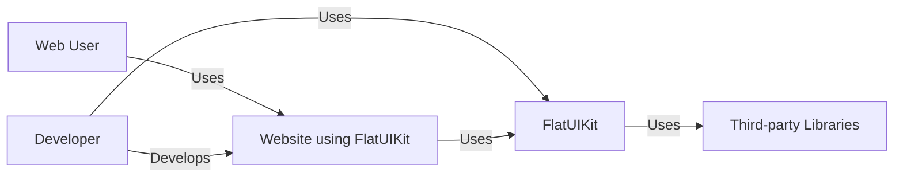
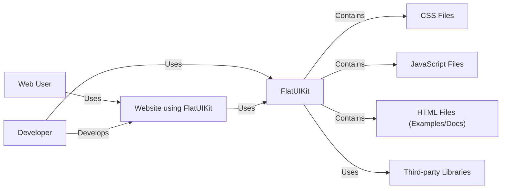
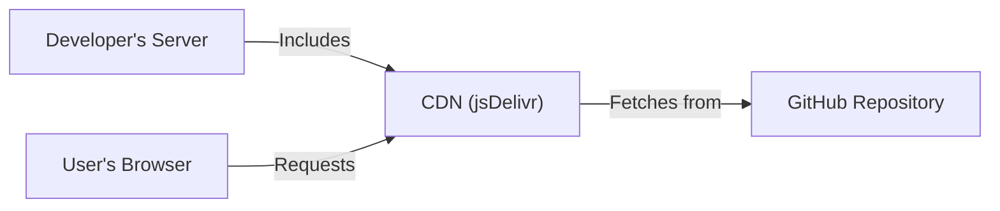
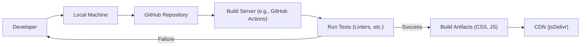

Okay, let's create a design document for the FlatUIKit project, focusing on aspects relevant for threat modeling.

# BUSINESS POSTURE

Business Priorities and Goals:

*   Provide a readily available, customizable, and visually appealing UI kit for web developers.
*   Reduce development time for projects requiring a flat design aesthetic.
*   Offer a free and open-source alternative to commercial UI kits.
*   Build a community around the project to foster contributions and improvements.
*   Ensure ease of use and integration with existing web development workflows.

Most Important Business Risks:

*   Malicious code injection into the library: If compromised, the library could be used to inject malicious code into any website using it, leading to widespread damage and reputational harm.
*   Supply chain attacks: Dependency vulnerabilities could be exploited to compromise the library or applications using it.
*   Lack of maintenance and updates: If the project is abandoned, security vulnerabilities may not be addressed, leaving users exposed.
*   Intellectual property theft: Unauthorized use or distribution of the code, violating the license.
*   Denial of Service: While unlikely to target the library directly, applications using it could be vulnerable if the library introduces performance bottlenecks.

# SECURITY POSTURE

Existing Security Controls:

*   security control: MIT License: The project is released under the MIT license, which is permissive but requires attribution. (Described in the LICENSE file).
*   security control: Open Source: The code is publicly available on GitHub, allowing for community review and scrutiny. (Visible in the GitHub repository).
*   security control: Basic CSS/HTML/JS: The core of the library uses standard web technologies, reducing the attack surface compared to more complex frameworks. (Visible in the code).

Accepted Risks:

*   accepted risk: Limited built-in security features: The library itself is primarily focused on UI elements and does not include specific security features like input validation or sanitization. These are left to the developers using the library.
*   accepted risk: Dependency vulnerabilities: The project may have dependencies (though minimal based on a quick review), which could introduce vulnerabilities.
*   accepted risk: Reliance on user implementation: The security of applications using FlatUIKit heavily relies on how developers implement and use the library.

Recommended Security Controls:

*   security control: Regular dependency audits: Implement automated dependency scanning to identify and address vulnerabilities in third-party libraries.
*   security control: Content Security Policy (CSP) guidance: Provide documentation and examples on how to use FlatUIKit with a strong CSP to mitigate XSS risks.
*   security control: Subresource Integrity (SRI) tags: If distributing via CDN, provide SRI hashes for users to verify the integrity of the files.
*   security control: Security.md file: Create a SECURITY.md file in the repository to outline security considerations and reporting procedures for vulnerabilities.

Security Requirements:

*   Authentication: Not directly applicable to the UI kit itself. Authentication is the responsibility of the application using the kit.
*   Authorization: Not directly applicable to the UI kit itself. Authorization is the responsibility of the application using the kit.
*   Input Validation: The UI kit should not perform input validation itself.  Guidance should be provided to developers on implementing proper input validation in their applications using the kit.
*   Cryptography: Not directly applicable, unless the kit includes components that handle sensitive data (which it currently does not). If such components are added, appropriate cryptographic practices must be followed.
*   Output Encoding: The UI kit should encourage secure coding practices to prevent Cross-Site Scripting (XSS) vulnerabilities. This includes proper escaping of user-provided data when rendering it within the UI.

# DESIGN

## C4 CONTEXT

Element Descriptions:

*   Element:
    *   Name: Web User
    *   Type: Person
    *   Description: A person who interacts with a website that uses FlatUIKit.
    *   Responsibilities: Browses the website, interacts with UI elements.
    *   Security controls: Relies on the security controls implemented by the website.

*   Element:
    *   Name: FlatUIKit
    *   Type: Software System
    *   Description: The FlatUIKit library itself.
    *   Responsibilities: Provides UI components and styling.
    *   Security controls: MIT License, Open Source.

*   Element:
    *   Name: Developer
    *   Type: Person
    *   Description: A web developer who uses FlatUIKit to build websites.
    *   Responsibilities: Integrates FlatUIKit into their projects, implements application logic and security.
    *   Security controls: Responsible for implementing application-level security.

*   Element:
    *   Name: Website using FlatUIKit
    *   Type: Software System
    *   Description: A website that incorporates the FlatUIKit library.
    *   Responsibilities: Provides functionality to the user, utilizes FlatUIKit for its UI.
    *   Security controls: Responsible for its own security, including input validation, authentication, etc.

*   Element:
    *   Name: Third-party Libraries
    *   Type: Software System
    *   Description: External libraries that FlatUIKit might depend on.
    *   Responsibilities: Provide specific functionalities used by FlatUIKit.
    *   Security controls: Security depends on the specific libraries used.

## C4 CONTAINER

In this case, FlatUIKit is a very simple project. The container diagram is essentially the same as the context diagram, with the addition of specifying the types of files within FlatUIKit.

Element Descriptions:

*   Element:
    *   Name: Web User, FlatUIKit, Developer, Website using FlatUIKit, Third-party Libraries
    *   Type: The same as C4 CONTEXT diagram.
    *   Description: The same as C4 CONTEXT diagram.
    *   Responsibilities: The same as C4 CONTEXT diagram.
    *   Security controls: The same as C4 CONTEXT diagram.

*   Element:
    *   Name: CSS Files
    *   Type: File
    *   Description: Stylesheets defining the appearance of FlatUIKit components.
    *   Responsibilities: Provide styling rules.
    *   Security controls: None directly. Should be served with appropriate MIME types.

*   Element:
    *   Name: JavaScript Files
    *   Type: File
    *   Description: JavaScript code for interactive components (if any).
    *   Responsibilities: Provide client-side behavior.
    *   Security controls: Should be reviewed for potential vulnerabilities (e.g., DOM-based XSS).

*   Element:
    *   Name: HTML Files (Examples/Docs)
    *   Type: File
    *   Description: HTML files demonstrating how to use FlatUIKit.
    *   Responsibilities: Provide usage examples.
    *   Security controls: Should be reviewed for potential vulnerabilities (e.g., XSS in examples).

## DEPLOYMENT

Possible Deployment Solutions:

1.  Direct Download: Users download the files from GitHub and include them in their project.
2.  CDN: The library is hosted on a Content Delivery Network (CDN) like jsDelivr or unpkg.
3.  Package Manager: The library is published to package managers like npm or Bower.

Chosen Solution (CDN - jsDelivr):

Element Descriptions:

*   Element:
    *   Name: Developer's Server
    *   Type: Server
    *   Description: The server hosting the website that uses FlatUIKit.
    *   Responsibilities: Serves the website's HTML, which includes links to FlatUIKit files on the CDN.
    *   Security controls: Standard web server security controls (e.g., HTTPS, firewalls).

*   Element:
    *   Name: CDN (jsDelivr)
    *   Type: Infrastructure
    *   Description: A Content Delivery Network that hosts FlatUIKit files.
    *   Responsibilities: Delivers FlatUIKit files to users' browsers quickly and reliably.
    *   Security controls: CDN provider's security controls (e.g., DDoS protection, HTTPS).  SRI tags should be used when linking to files on the CDN.

*   Element:
    *   Name: User's Browser
    *   Type: Client
    *   Description: The user's web browser.
    *   Responsibilities: Downloads and renders the website, including FlatUIKit files.
    *   Security controls: Browser security features (e.g., same-origin policy, CSP).

*   Element:
    *   Name: GitHub Repository
    *   Type: Server
    *   Description: Source code of FlatUIKit project.
    *   Responsibilities: Store project files.
    *   Security controls: GitHub security features.

## BUILD

FlatUIKit, in its current form, has a very simple build process. There isn't a complex automated build system. However, we can outline a recommended build process that incorporates security best practices.

Build Process Description:

1.  Developer: The developer writes code (CSS, JS, HTML) on their local machine.
2.  Local Machine: The developer's local environment.  Basic linting and code formatting checks can be performed here.
3.  GitHub Repository: The code is pushed to the GitHub repository.
4.  Build Server (GitHub Actions): A GitHub Actions workflow is triggered on push.
5.  Run Tests:
    *   CSS Linting: A CSS linter (e.g., stylelint) checks for code style and potential errors.
    *   JS Linting: A JavaScript linter (e.g., ESLint) checks for code style and potential errors.
    *   HTML Validation: An HTML validator checks for well-formed HTML.
    *   Dependency Check: A tool like `npm audit` or `yarn audit` checks for known vulnerabilities in dependencies.
6.  Build Artifacts: If all tests pass, the build artifacts (minified CSS and JS files) are created.
7.  CDN: The build artifacts are deployed to a CDN (e.g., jsDelivr).  This could be automated as part of the GitHub Actions workflow.

Security Controls in Build Process:

*   security control: Linting: CSS and JS linters help enforce code style and identify potential errors that could lead to vulnerabilities.
*   security control: Dependency Checking: `npm audit` or `yarn audit` helps identify known vulnerabilities in dependencies.
*   security control: Automated Build: Using GitHub Actions ensures a consistent and repeatable build process.
*   security control: Minification: Minifying CSS and JS files reduces file size and can obfuscate code slightly.

# RISK ASSESSMENT

Critical Business Processes:

*   Providing a functional and reliable UI kit.
*   Maintaining the reputation and trust of the project.
*   Ensuring the availability of the library to users.

Data to Protect:

*   Source Code: The primary data is the source code of the library itself.  Sensitivity: Medium (publicly available, but integrity is important).
*   User Data: The library itself does not handle user data. However, websites using the library will handle user data, and the security of those websites is indirectly affected by the security of the library. Sensitivity: Depends on the website using the library.
*   Contributor Information: Information about contributors (e.g., email addresses) is stored in the Git history. Sensitivity: Low.

# QUESTIONS & ASSUMPTIONS

Questions:

*   Are there any specific security standards or compliance requirements that the project needs to adhere to (e.g., specific industry regulations)?
*   What is the expected level of traffic and usage of the library? This can impact the importance of performance and denial-of-service considerations.
*   What is the process for handling security vulnerability reports?
*   Are there plans to add more complex components or features to the library in the future?

Assumptions:

*   BUSINESS POSTURE: The primary goal is to provide a free and open-source UI kit, with a focus on ease of use and community contribution.
*   SECURITY POSTURE: The project has a relatively low security risk profile due to its nature as a static UI kit. However, security best practices should still be followed.
*   DESIGN: The library will remain relatively simple and focused on providing basic UI components. The deployment will primarily be via CDN and direct download. The build process will be simple but should incorporate automated checks.