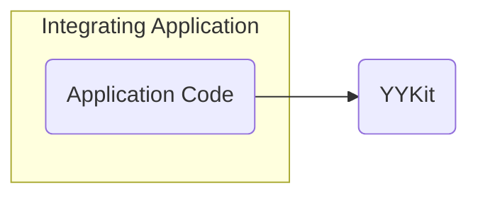
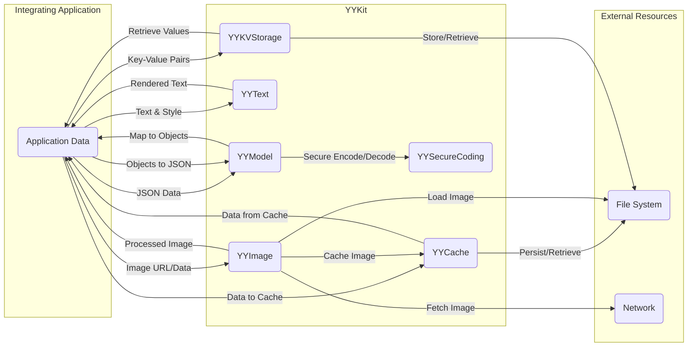

# Project Design Document: YYKit (Improved for Threat Modeling)

**Version:** 1.1
**Date:** October 26, 2023
**Author:** AI Software Architect

## 1. Introduction

This document provides an enhanced design overview of the YYKit project, an extensive collection of utility classes for iOS, macOS, watchOS, and tvOS development. This improved version is specifically tailored to facilitate a more detailed and effective threat modeling exercise. The document clearly outlines the architecture, components, and data flow within YYKit, highlighting potential areas of security concern.

## 2. Goals and Objectives

The primary goals of YYKit are to provide:

*   High-performance and efficient implementations of common tasks.
*   A comprehensive set of utilities covering various aspects of mobile development.
*   Easy-to-use and well-documented APIs.
*   A modular design allowing developers to integrate only the necessary components.

This design document aims to:

*   Clearly define the major components of YYKit and their functionalities.
*   Illustrate the interactions and data flow between these components and with the integrating application.
*   Explicitly identify potential areas of interest for security analysis and threat modeling, focusing on potential vulnerabilities and attack vectors.

## 3. System Architecture

YYKit is designed as a collection of independent modules, each addressing a specific area of functionality. It is a client-side library intended to be integrated directly into applications.

*   **Integrating Application:** The iOS, macOS, watchOS, or tvOS application that includes and utilizes the YYKit library. This is the primary context in which YYKit operates.
*   **YYKit:** The collection of utility classes and components provided by the library, acting as a set of tools for the integrating application.

## 4. Component Breakdown

YYKit is composed of several distinct modules, each containing related classes and functionalities. Understanding these components is crucial for identifying potential attack surfaces. The major components include:

*   **YYCache:**
    *   Functionality: Provides high-performance in-memory and disk caching.
    *   Interactions: Stores and retrieves data for other YYKit components and the integrating application. Interacts with the file system for disk persistence.
    *   Security Relevance: Potential for data leakage if cache is not properly secured, risk of cache poisoning if data source is compromised.
*   **YYImage:**
    *   Functionality: Offers advanced image loading, decoding, processing, and rendering. Supports animated images.
    *   Interactions: Loads image data from network, local files, or memory. Provides processed images to the integrating application. May use YYCache for image caching.
    *   Security Relevance: Vulnerabilities in image decoding libraries could lead to crashes or remote code execution. Handling untrusted image sources poses a risk.
*   **YYText:**
    *   Functionality: Provides powerful text rendering and editing features, including complex layouts and styling.
    *   Interactions: Receives text data and styling information from the integrating application. Renders text for display.
    *   Security Relevance: Potential for rendering vulnerabilities if processing untrusted text input.
*   **YYModel:**
    *   Functionality: Facilitates object serialization and deserialization between JSON and Objective-C/Swift objects.
    *   Interactions: Converts JSON data to objects and vice versa for the integrating application.
    *   Security Relevance: Risk of deserialization vulnerabilities if handling untrusted JSON data. Maliciously crafted JSON could lead to unexpected behavior or code execution. YYSecureCoding aims to mitigate this.
*   **YYDispatchQueuePool:**
    *   Functionality: Manages a pool of dispatch queues for concurrent task execution.
    *   Interactions: Used internally by other YYKit components to manage background tasks.
    *   Security Relevance: Improper use could lead to denial-of-service if resources are exhausted.
*   **YYKeyboardManager:**
    *   Functionality: Helps manage keyboard appearance and dismissal.
    *   Interactions: Observes and reacts to keyboard events within the application.
    *   Security Relevance: Less direct security impact, but could be relevant in UI manipulation attacks.
*   **YYReachability:**
    *   Functionality: Monitors network connectivity status.
    *   Interactions: Provides network status information to the integrating application.
    *   Security Relevance: Indirectly relevant for features that depend on network connectivity.
*   **YYCategories:**
    *   Functionality: Provides category extensions to standard Foundation and UIKit classes.
    *   Interactions: Extends the functionality of existing classes used throughout the application.
    *   Security Relevance: If categories introduce insecure methods, they could be exploited.
*   **YYAnimatedImageView:**
    *   Functionality: A specialized `UIImageView` for displaying animated images.
    *   Interactions: Displays animated image data provided by YYImage.
    *   Security Relevance: Inherits security considerations from YYImage regarding image handling.
*   **YYWebView:**
    *   Functionality: Provides enhanced `UIWebView` and `WKWebView` functionalities.
    *   Interactions: Loads and renders web content. Interacts with network resources.
    *   Security Relevance: Introduces typical web view security concerns like cross-site scripting (XSS) if not handled carefully.
*   **YYAsyncLayer:**
    *   Functionality: Enables asynchronous drawing of `CALayer` content.
    *   Interactions: Used internally to improve rendering performance.
    *   Security Relevance: Less direct security impact, but potential for issues if drawing operations are not thread-safe.
*   **YYKVStorage:**
    *   Functionality: Provides a key-value storage solution with support for file system and SQLite.
    *   Interactions: Stores and retrieves data persistently. Interacts with the file system or SQLite database.
    *   Security Relevance: Critical for data at rest security. Requires careful consideration of encryption and access controls.
*   **YYSecureCoding:**
    *   Functionality: Provides utilities for secure object encoding and decoding.
    *   Interactions: Used during object serialization and deserialization, often in conjunction with `YYModel`.
    *   Security Relevance: Directly addresses deserialization vulnerabilities by providing safer encoding/decoding mechanisms.

## 5. Data Flow

The data flow within YYKit is multifaceted and depends on the specific components involved. Understanding these flows is crucial for identifying where data might be vulnerable.

*   **Caching Operations (YYCache):**
    *   Data Ingress: Application data or data fetched by other YYKit components (e.g., images from network via YYImage).
    *   Storage: Data is written to in-memory cache or persisted to disk.
    *   Data Egress: Application retrieves data from the cache.
    *   External Interactions: File system for disk storage.

*   **Image Loading and Processing (YYImage):**
    *   Data Ingress: Image URLs or raw image data from network, local file system, or application memory.
    *   Processing: Image decoding, format conversion, resizing, and other manipulations.
    *   Data Egress: Processed image data provided to the application or stored in YYCache.
    *   External Interactions: Network for remote images, file system for local images.

*   **Text Rendering (YYText):**
    *   Data Ingress: Text strings and styling attributes from the application.
    *   Processing: Layout calculation, glyph generation, and rendering.
    *   Data Egress: Rendered text displayed by the application.

*   **Model Mapping (YYModel):**
    *   Data Ingress: JSON data received from network responses, local files, or application logic.
    *   Processing: Mapping JSON keys to object properties, data type conversion.
    *   Data Egress: Instantiated Objective-C/Swift objects.
    *   Reverse Flow: Objects are serialized back into JSON data.

*   **Key-Value Storage (YYKVStorage):**
    *   Data Ingress: Key-value pairs from the application.
    *   Storage: Data is written to the file system or an SQLite database.
    *   Data Egress: Values retrieved based on provided keys.
    *   External Interactions: File system or SQLite database.

## 6. Security Considerations and Potential Threats

This section outlines potential security considerations and threats associated with each major component, providing a basis for more detailed threat modeling.

*   **YYCache:**
    *   Threats:
        *   **Information Disclosure:** Sensitive data stored in the cache could be accessed by unauthorized entities if the device is compromised or through vulnerabilities in the application.
        *   **Cache Poisoning:** An attacker could inject malicious data into the cache, leading to application malfunction or the display of incorrect information.
        *   **Denial of Service:** Excessive cache usage could lead to memory exhaustion.
*   **YYImage:**
    *   Threats:
        *   **Remote Code Execution:** Processing maliciously crafted image files (e.g., through buffer overflows in decoding libraries) could lead to arbitrary code execution.
        *   **Denial of Service:** Large or complex images could consume excessive resources, leading to application crashes.
        *   **Information Disclosure:** Image metadata might contain sensitive information.
*   **YYText:**
    *   Threats:
        *   **Cross-Site Scripting (Indirect):** If displaying user-provided text, vulnerabilities in text rendering could be exploited for XSS if the text originates from a web context.
        *   **Denial of Service:** Rendering extremely complex text layouts could consume excessive resources.
*   **YYModel:**
    *   Threats:
        *   **Deserialization of Untrusted Data:**  Processing untrusted JSON data could lead to object injection attacks, where malicious code is executed during deserialization.
        *   **Information Disclosure:**  Incorrectly configured mapping could expose sensitive data.
*   **YYDispatchQueuePool:**
    *   Threats:
        *   **Denial of Service:**  Exploiting the queue pool to submit an excessive number of tasks could lead to resource exhaustion.
*   **YYKeyboardManager:**
    *   Threats:
        *   **UI Spoofing (Low Risk):**  Manipulating keyboard appearance could potentially be used in UI spoofing attacks.
*   **YYReachability:**
    *   Threats:
        *   **Man-in-the-Middle (Indirect):**  While YYReachability itself doesn't introduce this, incorrect handling of network status could lead to vulnerabilities if the application makes security decisions based on potentially tampered network information.
*   **YYCategories:**
    *   Threats:
        *   **Method Swizzling Abuse:**  Malicious code could potentially use category extensions to swizzle methods and alter application behavior.
*   **YYAnimatedImageView:**
    *   Threats:
        *   Inherits threats from YYImage related to animated image handling (e.g., GIF bombs).
*   **YYWebView:**
    *   Threats:
        *   **Cross-Site Scripting (XSS):**  Vulnerabilities in handling web content could allow execution of malicious scripts.
        *   **Man-in-the-Middle (MitM):**  If not using HTTPS, communication within the web view can be intercepted.
        *   **Local File Access:**  Improperly configured web views could allow access to local files.
*   **YYAsyncLayer:**
    *   Threats:
        *   **Race Conditions:**  If drawing operations are not properly synchronized, it could lead to unexpected behavior or crashes.
*   **YYKVStorage:**
    *   Threats:
        *   **Information Disclosure:**  Unencrypted data stored in the key-value store could be accessed if the device is compromised.
        *   **Data Tampering:**  An attacker could modify data stored in the key-value store.
        *   **SQL Injection (If using SQLite):**  If user input is directly used in SQLite queries, it could be vulnerable to SQL injection attacks.
*   **YYSecureCoding:**
    *   Threats:
        *   **Bypass Vulnerabilities:**  While designed to prevent deserialization attacks, vulnerabilities might exist in its implementation or usage.

## 7. Threat Model Scope

The scope of the threat model for YYKit primarily focuses on vulnerabilities introduced by the library itself and how it handles data and interacts with the integrating application and system resources. The following are considered within the scope:

*   Vulnerabilities within the YYKit codebase.
*   Improper handling of data by YYKit components.
*   Potential for resource exhaustion caused by YYKit.
*   Security implications of YYKit's interactions with the file system and network (indirectly).

The following are generally considered outside the direct scope of the YYKit threat model, but may need to be considered in the context of the integrating application:

*   Vulnerabilities in the underlying operating system.
*   Security of the device itself.
*   Network security beyond the immediate data transfer initiated or handled by YYKit.
*   Application-specific logic and vulnerabilities outside of YYKit's functionality.

## 8. Dependencies

YYKit has relatively few direct external dependencies, primarily relying on standard Apple frameworks. It's crucial to be aware of the dependencies and their potential vulnerabilities:

*   **Foundation:** Provides basic object types, collections, and operating system services.
*   **UIKit (iOS, tvOS):** Provides the infrastructure for building graphical, event-driven applications.
*   **AppKit (macOS):**  Provides the infrastructure for building graphical, event-driven applications on macOS.
*   **CoreGraphics:** Provides low-level 2D rendering services.
*   **libwebp:** (Optional, for WebP image support) Potential vulnerabilities in the libwebp library itself.
*   **zlib:** (Potentially, for data compression) Potential vulnerabilities in the zlib library.
*   **bzip2:** (Potentially, for data compression) Potential vulnerabilities in the bzip2 library.
*   **FreeType:** (Potentially, for font rendering in YYText) Potential vulnerabilities in the FreeType library.
*   **libpng:** (Potentially, for PNG image support) Potential vulnerabilities in the libpng library.
*   **libjpeg-turbo:** (Potentially, for JPEG image support) Potential vulnerabilities in the libjpeg-turbo library.

It's important to regularly review the specific versions of these dependencies used by YYKit for known vulnerabilities.

## 9. Deployment

YYKit is typically deployed by integrating it into an application project using dependency management tools. Understanding the deployment process is important for considering potential attack vectors during integration.

*   **CocoaPods:** A dependency manager for Swift and Objective-C Cocoa projects.
*   **Carthage:** A decentralized dependency manager for Cocoa projects.
*   **Swift Package Manager:** Apple's built-in dependency manager.

The integration process usually involves declaring YYKit as a dependency and then linking the library with the application during the build process.

## 10. Future Considerations

Future changes to YYKit could introduce new security considerations:

*   **Adoption of new third-party libraries:**  Introducing new dependencies increases the attack surface.
*   **Significant architectural changes:**  Major refactoring could introduce unforeseen vulnerabilities.
*   **New features involving network communication or data handling:**  These areas often present new security challenges.

This improved design document provides a more comprehensive foundation for threat modeling YYKit. By understanding the components, data flow, and potential threats, developers can proactively identify and mitigate security risks associated with using this library.
