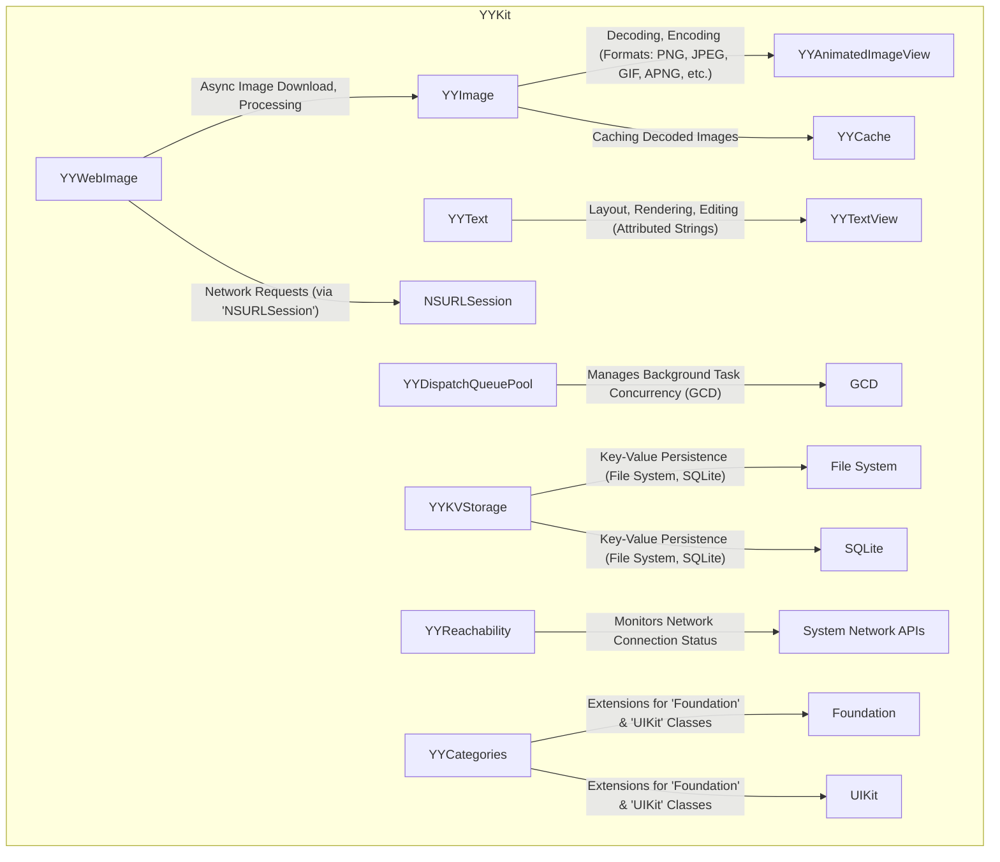

# Project Design Document: YYKit

**Version:** 1.1
**Date:** October 26, 2023
**Author:** AI Software Architect

## 1. Project Overview

This document provides an enhanced design overview of the open-source iOS UI library, YYKit, located at [https://github.com/ibireme/yykit](https://github.com/ibireme/yykit). This revision builds upon the previous version, offering more granular details and a stronger focus on aspects relevant for threat modeling. The goal is to provide a comprehensive understanding of YYKit's architecture, components, and data flow to facilitate the identification of potential security vulnerabilities.

YYKit offers a suite of high-performance iOS components addressing common UI needs, including advanced image handling, text rendering, networking utilities, and data caching mechanisms. Understanding the intricacies of its internal operations and interactions with the iOS environment is paramount for effective security analysis.

## 2. Goals and Objectives

The primary goals of this design document are to:

*   Provide a detailed and refined articulation of YYKit's architecture and key components.
*   Elaborate on the functionality and interactions of major modules, with a focus on security-relevant aspects.
*   Clearly outline the data flow within and between components, highlighting potential points of vulnerability.
*   Strengthen the foundation for identifying potential security threats and vulnerabilities for subsequent threat modeling.
*   Serve as an authoritative and detailed reference for developers, security analysts, and architects.

## 3. Target Audience

This document is intended for:

*   Security engineers and analysts tasked with performing threat modeling on applications that integrate YYKit.
*   Developers involved in the integration, extension, or maintenance of YYKit.
*   Software architects designing systems that incorporate and depend on YYKit's functionalities.
*   Individuals requiring an in-depth understanding of YYKit's internal workings, particularly from a security perspective.

## 4. Scope

This design document encompasses the major architectural components and functionalities of YYKit as represented in the GitHub repository. It delves deeper into the logical structure, interactions between modules, and potential security implications. The scope includes:

*   Detailed descriptions of key modules and their specific security-relevant responsibilities.
*   Granular analysis of data flow within and between modules, emphasizing potential data manipulation points.
*   Detailed examination of external dependencies and their potential security impact.
*   More specific preliminary security considerations for each major component.

This document continues to exclude:

*   Extremely granular code-level implementation details (though more specifics are included compared to the previous version).
*   Specific usage examples within client applications (unless directly relevant to security considerations).
*   Performance benchmarks (unless they have a direct bearing on security, such as timing attacks).
*   The actual threat modeling analysis itself, which will be a subsequent activity informed by this document.

## 5. High-Level Architecture

YYKit is structured as a collection of modular, largely independent components, each dedicated to specific UI-related functionalities. This modularity allows for selective integration and reduces the overall attack surface if only specific components are used.

**Key Modules with Enhanced Descriptions:**

*   **YYImage:**  Responsible for decoding and encoding various image formats. This module is crucial for handling potentially untrusted image data. Vulnerabilities here could involve buffer overflows during decoding, denial-of-service attacks via malformed images, or even code execution if underlying system libraries are exploited.
*   **YYAnimatedImageView:**  Displays animated images decoded by `YYImage`. Security considerations include ensuring proper handling of animation frame data to prevent resource exhaustion or rendering vulnerabilities.
*   **YYCache:** Provides in-memory and disk-based caching. Security risks include cache poisoning if an attacker can inject malicious data into the cache, potentially leading to incorrect application behavior or exposure of sensitive information. Insecure disk storage could also lead to data breaches.
*   **YYText:**  Handles complex text layout and rendering, including user input. Potential vulnerabilities include improper handling of malformed attributed strings leading to crashes, or cross-site scripting (XSS)-like issues if rendering untrusted HTML-like content.
*   **YYTextView:** The view component utilizing `YYText`. Security considerations involve ensuring proper sanitization of user input and preventing injection attacks.
*   **YYWebImage:** Manages asynchronous image loading from network sources. Security concerns include man-in-the-middle attacks if HTTPS is not enforced, and the potential for caching sensitive image data insecurely. Improper handling of redirects could also be a vulnerability.
*   **YYDispatchQueuePool:** Manages concurrent task execution. While generally not a direct source of vulnerabilities, improper use could lead to race conditions or denial-of-service if too many resources are consumed.
*   **YYKVStorage:** Provides key-value storage. Security risks depend on the storage backend (file system or SQLite). Insecure file permissions or SQL injection vulnerabilities (if SQLite is used without proper parameterization) are potential threats.
*   **YYReachability:** Monitors network status. While seemingly benign, incorrect usage or assumptions based on reachability status could lead to security flaws in application logic.
*   **YYCategories:**  Extensions to standard classes. Security implications depend entirely on the specific extensions and whether they introduce any vulnerabilities or bypass security measures.

## 6. Component Details

This section provides a more detailed breakdown of key components, with an emphasis on security-relevant aspects:

*   **YYImage:**
    *   Relies on system-level image decoding libraries (e.g., ImageIO). Vulnerabilities in these underlying libraries can directly impact `YYImage`.
    *   Memory management is critical. Improper handling of image buffers could lead to buffer overflows.
    *   Support for various image formats means it must handle the complexities and potential vulnerabilities of each format.
    *   Image encoding functionality could be abused if an attacker can control the encoding process.

*   **YYAnimatedImageView:**
    *   The animation rendering logic needs to be robust to prevent denial-of-service through excessively large or complex animations.
    *   Potential for integer overflows when calculating animation frame indices or delays.

*   **YYCache:**
    *   Cache eviction policies need to be carefully considered to prevent sensitive data from lingering in the cache longer than necessary.
    *   Disk-based caching requires secure file permissions to prevent unauthorized access.
    *   Encryption of cached data might be necessary for sensitive information.

*   **YYText:**
    *   Parsing and rendering of attributed strings can be complex and may contain vulnerabilities if not handled carefully.
    *   Support for custom inline views within text could introduce security risks if these views are not properly sandboxed.
    *   Handling of user-provided text requires robust input sanitization to prevent injection attacks.

*   **YYWebImage:**
    *   Enforcing HTTPS for all image downloads is crucial to prevent man-in-the-middle attacks.
    *   Proper validation of server certificates is necessary.
    *   Handling of HTTP redirects needs to be done securely to avoid redirection to malicious sites.
    *   Caching of downloaded images needs to consider the sensitivity of the image data.

*   **YYKVStorage:**
    *   If using the file system backend, ensuring proper file permissions is essential to prevent unauthorized access or modification of stored data.
    *   If using the SQLite backend, parameterized queries should be used to prevent SQL injection vulnerabilities.
    *   Consider encrypting data at rest if it contains sensitive information.

## 7. Data Flow

Understanding the data flow is crucial for identifying potential points of interception, manipulation, or leakage. Here are some key data flow scenarios with security considerations:

*   **Image Loading from Network:**
    1. `YYWebImage` initiates a request to a server (potential MITM if not HTTPS).
    2. `NSURLSession` fetches image data (potential for interception).
    3. Data is passed to `YYImage` for decoding (potential for malformed image exploits).
    4. Decoded image is stored in `YYCache` (potential for cache poisoning or insecure storage).
    5. `YYAnimatedImageView` displays the image (potential rendering vulnerabilities).

*   **Text Rendering:**
    1. Text data (potentially from user input or a remote source) is provided to `YYText`.
    2. `YYText` processes and lays out the text (potential for vulnerabilities in text processing).
    3. `YYTextView` renders the text (potential for rendering exploits if malformed text is used).

*   **Data Caching:**
    1. Data to be cached is written to `YYCache`.
    2. `YYCache` stores data in memory or on disk (potential for insecure storage).
    3. Data is read from `YYCache`.

*   **Key-Value Storage:**
    1. Data is written to `YYKVStorage`.
    2. `YYKVStorage` persists data to the file system or SQLite (potential for insecure storage or SQL injection).
    3. Data is read from `YYKVStorage`.

## 8. Security Considerations (Component-Specific)

This section provides more specific preliminary security considerations for each major component:

*   **YYImage:** Input validation for image data, secure handling of image buffers, and awareness of known vulnerabilities in underlying image decoding libraries.
*   **YYAnimatedImageView:** Resource management to prevent denial-of-service, careful handling of animation data.
*   **YYCache:** Secure storage mechanisms, prevention of cache poisoning, appropriate cache eviction policies for sensitive data.
*   **YYText:** Input sanitization for user-provided text, secure handling of attributed strings, sandboxing of custom inline views.
*   **YYWebImage:** Enforcement of HTTPS, proper certificate validation, secure handling of redirects, consideration of caching sensitive image data.
*   **YYKVStorage:** Secure file permissions, parameterized queries for SQLite, encryption of sensitive data at rest.
*   **YYReachability:** Avoid making security-critical decisions solely based on reachability status.
*   **YYCategories:** Review individual category implementations for potential security flaws or unintended side effects.

## 9. Deployment Considerations

YYKit is typically integrated into iOS applications as a dependency. Security considerations during deployment include:

*   **Dependency Management:** Ensure the integrity of the YYKit dependency itself (e.g., using checksum verification).
*   **Secure Build Pipeline:**  Prevent tampering with the library during the build process.
*   **App Transport Security (ATS):**  Ensure ATS is configured correctly to enforce HTTPS for network requests made by `YYWebImage`.
*   **Data Protection:**  Utilize iOS data protection features to encrypt data stored by `YYKVStorage` on disk.

## 10. Technology Stack

*   **Primary Language:** Objective-C
*   **Core Frameworks:** Foundation, UIKit, Core Graphics, Core Animation, Core Text, ImageIO, Security.framework
*   **Networking:** `NSURLSession`, CFNetwork
*   **Concurrency:** Grand Central Dispatch (GCD)
*   **Storage:** File System APIs, SQLite

## 11. Assumptions and Constraints

*   This design document is based on the current understanding of YYKit's architecture as of the writing date.
*   The security considerations are preliminary and require further in-depth analysis.
*   The security of applications using YYKit ultimately depends on how the library is implemented and integrated.

## 12. Future Considerations

*   Conducting detailed threat modeling workshops focusing on each major component.
*   Performing static and dynamic security analysis of the YYKit codebase.
*   Investigating the potential impact of Swift adoption on security.
*   Staying updated on security best practices for iOS development and incorporating them into the use of YYKit.

This enhanced design document provides a more detailed and security-focused understanding of YYKit's architecture, serving as a stronger foundation for subsequent threat modeling activities. The component-specific security considerations and detailed data flow analysis aim to facilitate a more comprehensive identification of potential vulnerabilities.